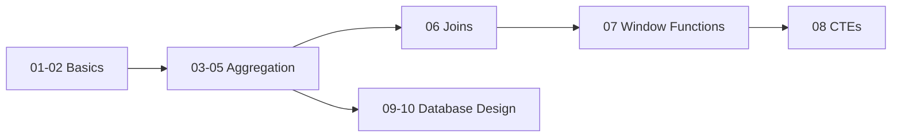

# 🐘 SQL Complete Cheat Sheet

> A comprehensive, well-structured SQL cheat sheet covering basics to advanced concepts with practical examples.


---

## 📖 Table of Contents

- About This Project
- Folder Structure
- Topics Covered
- Datasets Used
- How to Use
- Prerequisites

## 📌 About This Project

This SQL cheat sheet is designed for:

- 🎓 **Beginners** learning SQL fundamentals
- 📊 **Data Analysts** needing quick syntax reference
- 🔧 **Data Engineers** preparing for interviews
- 👨‍💻 **Developers** working with databases

**Why this cheat sheet?**

- ✅ Practical examples with real-world scenarios
- ✅ Progressive learning from basics to advanced
- ✅ PostgreSQL focused with cross-database notes
- ✅ Well-organized for quick lookup

---

## 📂 Folder Structure

```

1_sql/                        # Additional SQL resources
    ├── 01_basics/
    ├── 02_joins/
    ├── 03_window_function/
    ├── datasets/
    └── sql-notes/
                │
                ├── 01-sql-basics.md              # SELECT, FROM, WHERE, LIKE, wildcards
                ├── 02-numerical-queries.md       # Comparisons, AND, OR, BETWEEN, IN
                ├── 03-aggregation-groupby.md     # MAX, MIN, AVG, COUNT, GROUP BY
                ├── 04-query-execution-having.md  # Execution order, HAVING vs WHERE
                ├── 05-derived-columns-case.md    # Derived columns, IF, CASE
                ├── 06-joins.md                   # INNER, LEFT, RIGHT, FULL joins
                ├── 07-window-functions.md        # ROW_NUMBER, RANK, LAG, LEAD, NTILE
                ├── 08-cte-functions-procedures.md # CTEs, UDFs, Stored Procedures
                ├── 09-database-design-keys.md    # Keys, relationships, ERD
                └── 10-data-types-crud.md         # Data types, INSERT, UPDATE, DELETE

```

---

## 🗂️ Topics Covered

### 🔹 Level 1: Fundamentals

| Topic | File |
|-------|------|
| Basic SQL Clauses | [01-sql-basics.md](./sql-notes/01-sql-basics.md) |
| Numerical Queries | [02-numerical-queries.md](./sql-notes/02-numerical-queries.md) |
| Aggregation & GROUP BY | [03-aggregation-groupby.md](./sql-notes/03-aggregation-groupby.md) |

### 🔹 Level 2: Intermediate

| Topic | File |
|-------|------|
| Query Execution & HAVING | [04-query-execution-having.md](./sql-notes/04-query-execution-having.md) |
| Derived Columns & CASE | [05-derived-columns-case.md](./sql-notes/05-derived-columns-case.md) |
| Joins | [06-joins.md](./sql-notes/06-joins.md) |

### 🔹 Level 3: Advanced

| Topic | File |
|-------|------|
| Window Functions | [07-window-functions.md](./sql-notes/07-window-functions.md) |
| CTEs & Procedures | [08-cte-functions-procedures.md](./sql-notes/08-cte-functions-procedures.md) |

### 🔹 Level 4: Database Design

| Topic | File |
|-------|------|
| Database Design & Keys | [09-database-design-keys.md](./sql-notes/09-database-design-keys.md) |
| Data Types & CRUD | [10-data-types-insert-update-delete.md](./sql-notes/10-data-types-insert-update-delete.md) |

---

## 📊 Datasets Used

The examples in this cheat sheet use a **movie database** with tables like:

| Table          | Description                                   |
| -------------- | --------------------------------------------- |
| `movies`     | Movie titles, ratings, industry, release year |
| `financials` | Budget, revenue, currency, unit               |
| `actors`     | Actor names, birth years                      |
| `studio`     | Production studios                            |

### Sample Data Preview

```sql
-- movies table
SELECT * FROM movies LIMIT 5;

-- financials table  
SELECT * FROM financials LIMIT 5;
```

---

## 💡 How to Use

### For Learning

1. Start with `01-sql-basics.md`
2. Practice each concept using the examples
3. Move to next file sequentially

### For Reference

- Use the **Table of Contents** above
- Search for specific keywords
- Bookmark frequently used files

### For Interview Prep

Focus on:

- Joins (`06-joins.md`)
- Window Functions (`07-window-functions.md`)
- Query Execution Order (`04-query-execution-having.md`)

---

## 🛠️ Prerequisites

| Requirement | Recommendation                          |
| ----------- | --------------------------------------- |
| Database    | PostgreSQL (or MySQL for some examples) |
| GUI Tool    | pgAdmin, DBeaver, DataGrip              |
| Terminal    | Any command line interface              |

### Sample Database Setup

```sql
-- Create a practice database
CREATE DATABASE sql_practice;

-- Connect to it
\c sql_practice;

-- Now you're ready to run the examples!
```

---

## 📈 Learning Path Recommendation



**Estimated Time:** 2-3 weeks (1-2 hours daily)

## 📚 Recommended Resources

| Resource                                                    | Description            |
| ----------------------------------------------------------- | ---------------------- |
| [PostgreSQL Docs](https://www.postgresql.org/docs/)            | Official documentation |
| [Mode SQL Tutorial](https://mode.com/sql-tutorial/)            | Interactive learning   |
| [LeetCode Database](https://leetcode.com/problemset/database/) | Practice problems      |
| [HackerRank SQL](https://www.hackerrank.com/domains/sql)       | Coding challenges      |

---

## ⭐ Quick Syntax Lookup

```sql
-- Most Common Commands
SELECT * FROM table WHERE condition;
INSERT INTO table (col1) VALUES (val1);
UPDATE table SET col1 = val1 WHERE condition;
DELETE FROM table WHERE condition;
```

```sql
-- Most Common Clauses
SELECT → FROM → WHERE → GROUP BY → HAVING → ORDER BY → LIMIT
```

---

## 📊 Cheat Sheet Stats

| Category            | Number of Topics |
| ------------------- | ---------------- |
| Basic Clauses       | 7                |
| Numerical Operators | 6                |
| Aggregate Functions | 4                |
| Join Types          | 5                |
| Window Functions    | 12               |
| Data Types          | 15+              |

---
