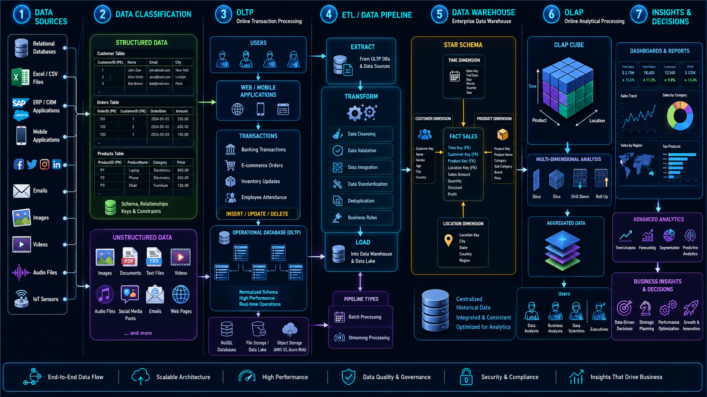
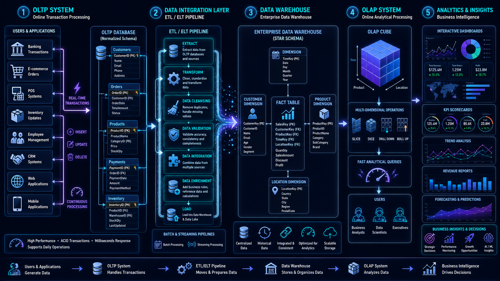

# 📦 Data Storage Fundamentals & OLTP vs OLAP

> A comprehensive guide to understanding Structured Data, Semi-Structured Data, Unstructured Data, OLTP, and OLAP.

---

## 📚 Table of Contents

- Data Storage Overview
- Structured Data
- Semi-Structured Data
- Unstructured Data
- Structured vs Semi-Structured vs Unstructured
- OLTP
- OLAP
- OLTP vs OLAP
- Modern Data Architecture
- Interview Questions
- Key Takeaways

---

# 🗄️ Data Storage Overview

Organizations generate massive amounts of data every day from applications, APIs, files, and business operations.



Based on how data is organized, it can be classified into:

- Structured Data
- Semi-Structured Data
- Unstructured Data

---

# 📊 Structured Data

## 📖 What is Structured Data?

Structured data is information organized in rows and columns using a predefined schema.

### 🎯 Why is it Used?

- Easy querying using SQL
- High consistency
- Strong data integrity

### 🔑 Characteristics

- Fixed schema
- Stored in tables
- ACID compliance
- Easy querying

### 🛠️ Technologies

- MySQL
- PostgreSQL
- Oracle
- SQL Server

### 💼 Examples

- Employee Records
- Banking Transactions
- Customer Data

---

# 📄 Semi-Structured Data

## 📖 What is Semi-Structured Data?

Semi-structured data contains metadata and tags that provide structure but does not follow a strict relational schema.

### 🔑 Characteristics

- Flexible schema
- Self-describing
- Nested structures

### 🛠️ Formats

- JSON
- XML
- YAML
- Avro
- Parquet

### 📌 Example

```json
{
  "id": 101,
  "name": "John",
  "skills": ["Python", "SQL"]
}
```

---

# 🎥 Unstructured Data

## 📖 What is Unstructured Data?

Unstructured data has no predefined schema and cannot be stored directly in traditional tables.

### 💼 Examples

- Images
- Videos
- Audio
- PDFs
- Emails
- Social Media Posts

### 🛠️ Storage Technologies

- Amazon S3
- Azure Blob Storage
- Hadoop HDFS

---

# ⚖️ Structured vs Semi-Structured vs Unstructured

| Feature | Structured | Semi-Structured | Unstructured |
|----------|------------|----------------|--------------|
| Schema | Fixed | Flexible | None |
| Querying | Easy | Moderate | Difficult |
| Storage | RDBMS | JSON/Parquet | Data Lake |
| Example | Customer Table | API Response | Video File |

---

# ⚡ OLTP (Online Transaction Processing)

## 📖 What is OLTP?

OLTP systems are designed for handling day-to-day business transactions in real time.

### 🎯 Why is it Used?

- Fast transactions
- High concurrency
- Reliable processing

### 💼 Examples

- Banking Systems
- ATM Withdrawals
- E-Commerce Orders
- Airline Reservations

### 🔑 Characteristics

- ACID compliance
- Normalized schema
- High transaction volume

---

# 📈 OLAP (Online Analytical Processing)

## 📖 What is OLAP?

OLAP systems are optimized for reporting, analytics, and business intelligence.

### 🎯 Why is it Used?

- Business reporting
- Analytics
- Dashboards
- Decision making

### 💼 Examples

- Revenue Reports
- Sales Dashboards
- Customer Analytics

### 🔑 Characteristics

- Historical data
- Complex queries
- Aggregations

---

# ⚔️ OLTP vs OLAP

| Feature | OLTP | OLAP |
|----------|------|------|
| Purpose | Transactions | Analytics |
| Data | Current | Historical |
| Queries | Simple | Complex |
| Users | Applications | Analysts |
| Schema | Normalized | Denormalized |

---

# 🚀 Modern Data Architecture

The following architecture shows how data flows from operational systems (OLTP) to analytical systems (OLAP).



## Flow Explanation

1. Applications generate transactional data.
2. Data is stored in OLTP databases.
3. ETL/ELT pipelines extract and transform data.
4. Data is loaded into analytical storage.
5. OLAP systems perform analytical processing.
6. BI tools create dashboards and reports.

---

# 🎯 Interview Questions

1. What is Structured Data?
2. What is Semi-Structured Data?
3. What is Unstructured Data?
4. What is OLTP?
5. What is OLAP?
6. Difference between OLTP and OLAP?

---

# 🏁 Key Takeaways

- Structured data follows a fixed schema.
- Semi-structured data contains metadata.
- Unstructured data has no predefined format.
- OLTP handles transactions.
- OLAP handles analytics.

---

## 📚 Next Topic

➡️ [Data Lake, Data Warehouse & Data Lakehouse](02_Data_Lake_Warehouse_Lakehouse.md)