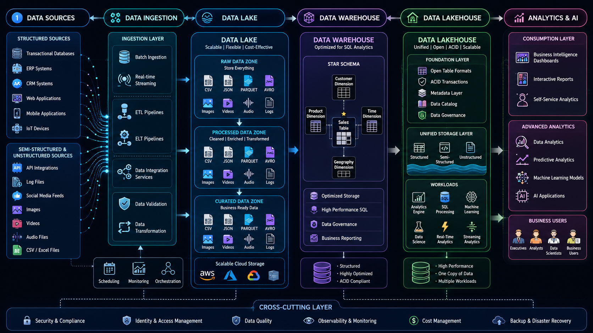

# 🌊 Data Lake, 🏢 Data Warehouse & 🏗️ Data Lakehouse

⬅️ [Back to Data Storage Fundamentals](01_OLAP_&_OLTP.md)

---

## 📚 Table of Contents

- Data Lake
- Data Warehouse
- Data Lakehouse
- Comparison
- Real-World Example
- Interview Questions
- Key Takeaways

---

# 🌊 Data Lake

## 📖 What is a Data Lake?

A Data Lake is a centralized repository that stores large volumes of raw data in its original format.

### 🎯 Why is it Used?

- Store structured data
- Store semi-structured data
- Store unstructured data
- Support AI and Machine Learning

### 🔑 Characteristics

- Schema-on-Read
- Highly scalable
- Low-cost storage
- Raw data storage

### 🛠️ Technologies

- Amazon S3
- Azure Data Lake Storage
- Google Cloud Storage
- Hadoop HDFS

---

# 🏢 Data Warehouse

## 📖 What is a Data Warehouse?

A Data Warehouse is a centralized repository optimized for analytics and reporting.

### 🎯 Why is it Used?

- Business reporting
- Historical analysis
- Fast analytical queries

### 🔑 Characteristics

- Schema-on-Write
- Structured data
- Strong governance
- High performance

### 🛠️ Technologies

- Snowflake
- Amazon Redshift
- Google BigQuery
- Azure Synapse Analytics

---

# 🏗️ Data Lakehouse

## 📖 What is a Data Lakehouse?

A Data Lakehouse combines the flexibility of a Data Lake with the performance of a Data Warehouse.

### 🎯 Why is it Used?

- Unified architecture
- Analytics and reporting
- Machine learning support
- Reduced storage complexity

### 🔑 Characteristics

- Open table formats
- ACID transactions
- BI support
- ML support

### 🛠️ Technologies

- Delta Lake
- Apache Iceberg
- Apache Hudi
- Databricks Lakehouse

---

# ⚔️ Data Lake vs Data Warehouse vs Data Lakehouse

| Feature              | Data Lake | Data Warehouse | Data Lakehouse |
| -------------------- | --------- | -------------- | -------------- |
| Structured Data      | ✅        | ✅             | ✅             |
| Semi-Structured Data | ✅        | ⚠️           | ✅             |
| Unstructured Data    | ✅        | ❌             | ✅             |
| Analytics            | Moderate  | Excellent      | Excellent      |
| Machine Learning     | Excellent | Limited        | Excellent      |
| Cost                 | Low       | High           | Medium         |
| Governance           | Basic     | Strong         | Strong         |

---

# 🚀 Modern Data Platform Architecture (🌊 Data Lake, 🏢 Data Warehouse & 🏗️ Data Lakehouse)

## Flow Explanation

1. Data is collected from databases, applications, APIs, and files.
2. Raw data is stored in the Data Lake.
3. ETL/ELT pipelines transform the data.
4. The Data Warehouse serves reporting and analytics.
5. The Data Lakehouse supports BI, Analytics, and Machine Learning.

---

# 🌍 Real-World Example: Netflix

## Data Lake

Stores:

- User activity logs
- Viewing history
- Device events
- Video metadata

## Data Warehouse

Used for:

- Revenue Reports
- Subscriber Trends
- Content Analytics

## Data Lakehouse

Used for:

- Recommendation Systems
- Machine Learning Models
- Business Analytics

---

# 🎯 Interview Questions

1. What is a Data Lake?
2. What is a Data Warehouse?
3. What is a Data Lakehouse?
4. What is Schema-on-Read?
5. What is Schema-on-Write?
6. Why are Lakehouses becoming popular?

---

# 🏁 Key Takeaways

- Data Lakes store raw data.
- Data Warehouses store transformed data.
- Data Lakehouses combine both approaches.
- Modern organizations increasingly adopt Lakehouse architectures.
