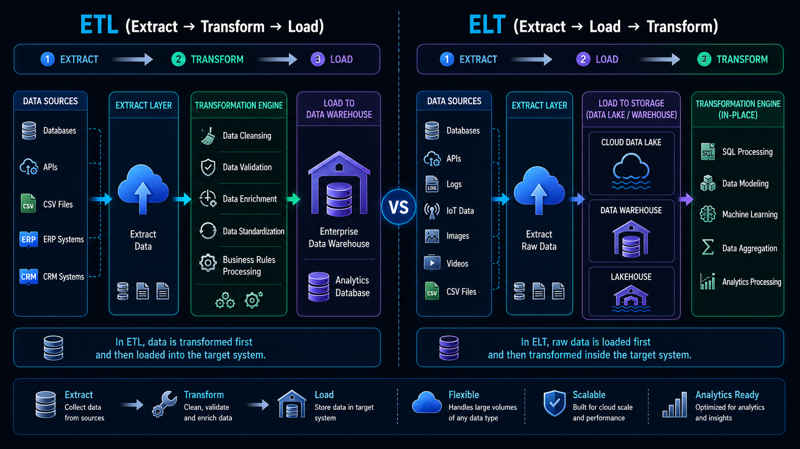

# 🔄 ETL & ELT Fundamentals

⬅️ [Back to Data Storage](../01_Data_Storage/02_Data_Lake_Warehouse_Lakehouse.md)

---

## 📚 Table of Contents

* Introduction
* What is ETL?
* ETL Process
* ETL Architecture
* What is ELT?
* ELT Process
* ELT Architecture
* ETL vs ELT
* Popular Tools
* Real-World Example
* Interview Questions
* Key Takeaways

---

# 📖 Introduction

Modern organizations generate data from multiple sources such as applications, databases, APIs, logs, and IoT devices.

Before this data can be used for reporting, analytics, and machine learning, it must be collected, cleaned, transformed, and loaded into a storage platform.

This process is performed using **ETL (Extract, Transform, Load)** or **ELT (Extract, Load, Transform)** pipelines.



---


# 🔄 ETL (Extract, Transform, Load)

## 📖 What is ETL?

ETL stands for **Extract, Transform, Load**.

It is a data integration process where data is first extracted from source systems, transformed into a suitable format, and then loaded into a target system such as a Data Warehouse.

---

## 🎯 Why is ETL Used?

ETL helps organizations:

* Clean and validate data
* Remove duplicates
* Standardize formats
* Apply business rules
* Improve data quality
* Prepare data for reporting

---

## 🔑 ETL Process

### 1️⃣ Extract

Data is collected from multiple source systems:

* Databases
* Applications
* APIs
* ERP Systems
* CSV Files

### 2️⃣ Transform

The extracted data is processed and transformed.

Common transformations include:

* Data Cleaning
* Data Validation
* Deduplication
* Filtering
* Aggregation
* Business Rule Application

### 3️⃣ Load

The transformed data is loaded into:

* Data Warehouse
* Data Mart
* Reporting Systems

---

## 🏗️ ETL Architecture

```text
Source Systems
      │
      ▼
   Extract
      │
      ▼
  Transform
      │
      ▼
 Data Warehouse
      │
      ▼
 Reporting & Analytics
```

---

## 💼 ETL Example

An e-commerce company extracts:

* Orders Data
* Customer Data
* Product Data

The data is cleaned and transformed before loading into a Data Warehouse for business reporting.

---

# ⚡ ELT (Extract, Load, Transform)

## 📖 What is ELT?

ELT stands for **Extract, Load, Transform**.

Unlike ETL, data is loaded directly into the target platform first and transformed later using the platform's compute resources.

ELT is widely used in modern cloud-based data platforms.

---

## 🎯 Why is ELT Used?

ELT is preferred when:

* Working with cloud platforms
* Handling large datasets
* Storing raw data
* Building Data Lakes and Lakehouses
* Supporting machine learning workloads

---

## 🔑 ELT Process

### 1️⃣ Extract

Collect data from source systems.

### 2️⃣ Load

Load raw data directly into:

* Data Lake
* Data Warehouse
* Data Lakehouse

### 3️⃣ Transform

Transform data inside the destination platform using:

* SQL
* dbt
* Spark
* Cloud Processing Engines

---

## 🏗️ ELT Architecture

```text
Source Systems
      │
      ▼
    Extract
      │
      ▼
 Data Lake /
Data Warehouse
      │
      ▼
  Transform
      │
      ▼
 Analytics & BI
```

---

## 💼 ELT Example

A company loads raw customer and transaction data directly into Snowflake.

dbt transformations are then executed inside Snowflake to create analytics-ready tables.

---

# ⚔️ ETL vs ELT

| Feature             | ETL                      | ELT                      |
| ------------------- | ------------------------ | ------------------------ |
| Full Form           | Extract, Transform, Load | Extract, Load, Transform |
| Transformation      | Before Loading           | After Loading            |
| Raw Data Storage    | No                       | Yes                      |
| Processing Location | ETL Server               | Target Platform          |
| Scalability         | Moderate                 | High                     |
| Cloud Friendly      | Moderate                 | Excellent                |
| Speed               | Slower                   | Faster                   |
| Modern Usage        | Less Common              | Widely Used              |

---

# 🛠️ Popular Tools

## ETL Tools

* Informatica
* Talend
* SSIS
* Apache NiFi
* AWS Glue

## ELT Tools

* dbt
* Fivetran
* Airbyte
* Snowflake
* BigQuery

---

# 🚀 Modern ELT Workflow

```text
Applications
Databases
APIs
Files
      │
      ▼
 Data Ingestion
      │
      ▼
 Data Lake / Warehouse
      │
      ▼
 dbt / SQL Transformations
      │
      ▼
 Analytics & Dashboards
```

---

# 🌍 Real-World Example

## Netflix

### ETL Use Cases

* Historical batch processing
* Data migration
* Legacy reporting systems

### ELT Use Cases

* Large-scale analytics
* Recommendation systems
* Machine learning pipelines
* Data Lakehouse architectures

---

# 🎤 Interview Questions

### What is ETL?

ETL is a process that extracts data from source systems, transforms it, and loads it into a destination system.

### What is ELT?

ELT loads raw data into the destination system first and performs transformations afterward.

### What is the difference between ETL and ELT?

ETL transforms data before loading, while ELT transforms data after loading.

### Why is ELT popular in cloud platforms?

Cloud platforms provide scalable storage and compute resources, making post-load transformations more efficient.

### Which modern tools support ELT?

dbt, Snowflake, BigQuery, Fivetran, and Airbyte.

---

# 🏁 Key Takeaways

* ETL = Extract → Transform → Load
* ELT = Extract → Load → Transform
* ETL is commonly used in traditional Data Warehouses.
* ELT is widely used in modern cloud platforms.
* Data Lakes and Lakehouses primarily use ELT.
* dbt is one of the most popular ELT transformation tools today.
* ELT enables scalable analytics and machine learning workloads.
