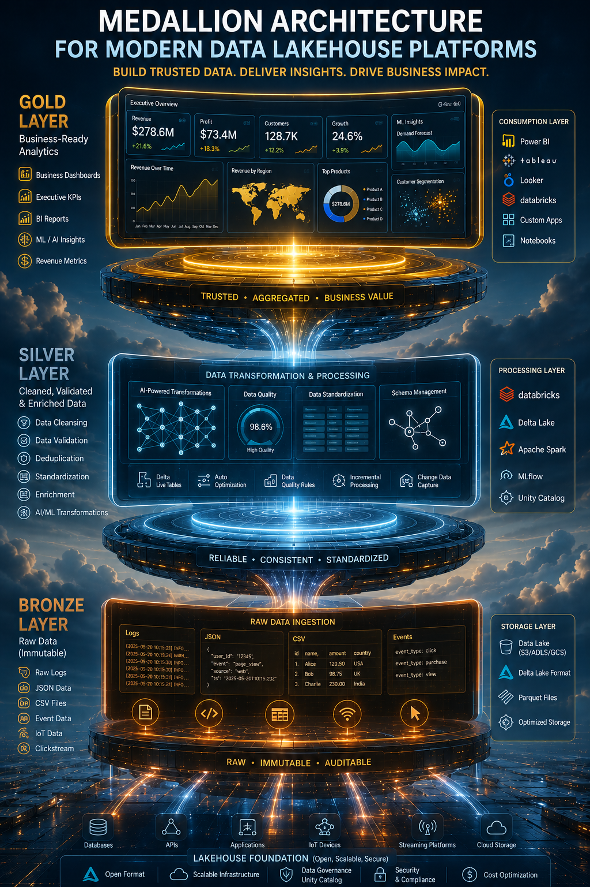

# 🏅 Medallion Architecture

⬅️ [Back to Data ETL and ELT](./01_ETL_&_ELT.md)

---

## 📚 Table of Contents

* Introduction
* What is Medallion Architecture?
* Why Use Medallion Architecture?
* Bronze Layer
* Silver Layer
* Gold Layer
* Data Flow
* Benefits
* Real-World Example
* Interview Questions
* Key Takeaways

---

# 📖 Introduction

Modern Data Engineering platforms process massive amounts of data from multiple sources.

To improve data quality, governance, scalability, and analytics performance, organizations use a layered architecture known as the  **Medallion Architecture** .

This architecture is widely used in:

* Databricks
* Delta Lake
* Data Lakehouse Platforms
* Modern Cloud Data Platforms

---

# 🏅 What is Medallion Architecture?

Medallion Architecture is a data design pattern that organizes data into multiple layers based on quality and business value.

The architecture consists of three layers:

1. 🥉 Bronze Layer
2. 🥈 Silver Layer
3. 🥇 Gold Layer

Each layer progressively improves data quality and prepares data for analytics and business consumption.

---

# 🎯 Why Use Medallion Architecture?

Organizations use Medallion Architecture to:

* Improve data quality
* Enable scalable data processing
* Maintain historical data
* Support analytics and machine learning
* Reduce data duplication
* Implement better governance

---

# 🏗️ Architecture Overview

---

# 🥉 Bronze Layer

## 📖 What is Bronze Layer?

The Bronze layer stores raw data exactly as received from source systems.

This is the first landing zone for data.

---

## 🎯 Purpose

* Preserve raw data
* Maintain historical records
* Support reprocessing
* Enable auditing

---

## 🔑 Characteristics

* Raw data
* Minimal transformations
* High data volume
* Schema evolution support

---

## 💼 Examples

* Application Logs
* Database Dumps
* API Responses
* IoT Sensor Data

---

# 🥈 Silver Layer

## 📖 What is Silver Layer?

The Silver layer contains cleaned, validated, and standardized data.

Raw data from Bronze is transformed into a trusted dataset.

---

## 🎯 Purpose

* Improve data quality
* Remove duplicates
* Standardize formats
* Apply business rules

---

## 🔑 Characteristics

* Cleaned data
* Deduplicated records
* Standardized schemas
* Business-ready datasets

---

## 💼 Examples

* Valid Customer Records
* Clean Transaction Data
* Standardized Product Information

---

# 🥇 Gold Layer

## 📖 What is Gold Layer?

The Gold layer contains highly curated and aggregated data optimized for business reporting and analytics.

This is the layer consumed directly by business users.

---

## 🎯 Purpose

* Reporting
* Dashboards
* Business Intelligence
* Machine Learning

---

## 🔑 Characteristics

* Aggregated data
* High-quality datasets
* Business KPIs
* Analytics-ready

---

## 💼 Examples

* Monthly Revenue Reports
* Sales Dashboards
* Customer Lifetime Value Metrics
* Executive KPIs

---

# 🔄 Data Flow

## Step 1: Ingestion

Data is collected from:

* Databases
* APIs
* Applications
* Streaming Systems

---

## Step 2: Bronze Layer

Store raw data without modification.

---

## Step 3: Silver Layer

Perform:

* Data Cleaning
* Deduplication
* Validation
* Standardization

---

## Step 4: Gold Layer

Create:

* Aggregations
* KPIs
* Reporting Tables
* Business Metrics

---

## Step 5: Consumption

Data is consumed by:

* Power BI
* Tableau
* Machine Learning Models
* Analytics Teams

---

# ⚔️ Bronze vs Silver vs Gold

| Feature           | Bronze 🥉      | Silver 🥈   | Gold 🥇        |
| ----------------- | -------------- | ----------- | -------------- |
| Data Quality      | Raw            | Cleaned     | Curated        |
| Transformations   | Minimal        | Moderate    | Advanced       |
| Purpose           | Storage        | Preparation | Analytics      |
| Users             | Data Engineers | Analysts    | Business Users |
| Data Volume       | Highest        | Medium      | Lowest         |
| Query Performance | Low            | Medium      | High           |

---

# 🚀 Benefits of Medallion Architecture

✅ Improved Data Quality

✅ Better Governance

✅ Scalable Processing

✅ Historical Data Retention

✅ Simplified Data Pipelines

✅ Supports Analytics and Machine Learning

---

# 🌍 Real-World Example

## E-Commerce Platform

### Bronze Layer

Stores:

* Raw Orders
* Customer Events
* Website Clickstreams

### Silver Layer

Stores:

* Clean Orders
* Valid Customers
* Standardized Products

### Gold Layer

Stores:

* Daily Sales Metrics
* Revenue KPIs
* Customer Analytics

Business dashboards and machine learning models consume Gold datasets.

---

# 🛠️ Technologies

* Databricks
* Delta Lake
* Apache Spark
* Azure Data Lake Storage
* Amazon S3
* Apache Iceberg
* Apache Hudi

---

# 🎤 Interview Questions

### What is Medallion Architecture?

A layered data architecture consisting of Bronze, Silver, and Gold layers.

### What is the Bronze Layer?

The raw data layer that stores data as received from source systems.

### What is the Silver Layer?

The cleaned and standardized data layer.

### What is the Gold Layer?

The business-ready analytics layer containing curated datasets and KPIs.

### Why is Medallion Architecture popular?

Because it improves data quality, governance, and scalability while supporting analytics and machine learning.

---

# 🏁 Key Takeaways

* Medallion Architecture is a layered data design pattern.
* Bronze stores raw data.
* Silver stores cleaned and validated data.
* Gold stores analytics-ready data.
* Widely used in Data Lakehouse architectures.
* Popular on Databricks and Delta Lake platforms.
* Supports BI, Analytics, and Machine Learning workloads.

---

## 📚 Next Topic

➡️ [File Format Fundamentals](./03_File_Formats_Fundamentals.md)
