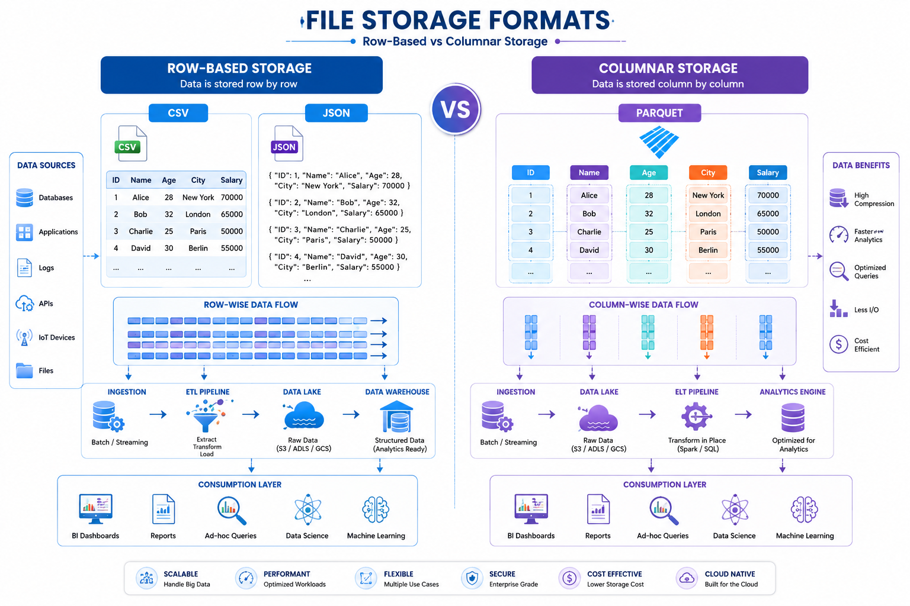

# 📂 File Formats Fundamentals

⬅️ [Back to Medallion Architecture](./02_Medallion_Arch.md)

---

## 📚 Table of Contents

* Introduction
* What are File Formats?
* Row-Based File Formats
* CSV
* JSON
* Columnar File Formats
* Parquet
* Row-Based vs Columnar Storage
* Real-World Example
* Interview Questions
* Key Takeaways

---

# 📖 Introduction

Data Engineers work with different file formats to store, transfer, process, and analyze data.

Choosing the right file format is important because it directly affects:

* Storage Cost
* Query Performance
* Processing Speed
* Data Compression
* Scalability

File formats are generally categorized into:

1. Row-Based File Formats
2. Columnar File Formats

---

# 🏗️ File Format Categories



```text
File Formats
│
├── Row-Based
│   ├── CSV
│   └── JSON
│
└── Columnar
    └── Parquet
```

---

# 📄 Row-Based File Formats

## 📖 What is Row-Based Storage?

In row-based storage, all values of a row are stored together.

Example:

```text
ID | Name  | Salary
--------------------
1  | John  | 50000
2  | Alice | 60000
```

Stored as:

```text
1,John,50000
2,Alice,60000
```

---

## 🎯 When to Use Row-Based Formats?

Row-based formats are suitable when:

* Reading complete records
* Transactional workloads
* Data exchange between systems
* Small to medium datasets

---

# 📑 CSV (Comma-Separated Values)

## 📖 What is CSV?

CSV is one of the most commonly used file formats for storing tabular data.

Each row represents a record and each column is separated by a delimiter (usually a comma).

---

## 🔑 Characteristics

* Simple and lightweight
* Human-readable
* Easy to create and edit
* Supported by almost every tool

---

## 📌 Example

```csv
id,name,salary
1,John,50000
2,Alice,60000
3,Bob,70000
```

---

## ✅ Advantages

* Easy to understand
* Small file size
* Universal support
* Fast data exchange

---

## ❌ Limitations

* No schema enforcement
* No support for nested data
* No compression
* No data types

---

## 🛠️ Common Use Cases

* Data Export/Import
* Excel Integration
* Data Migration
* Reporting

---

# 📄 JSON (JavaScript Object Notation)

## 📖 What is JSON?

JSON is a semi-structured file format used for exchanging data between systems.

It stores data as key-value pairs.

---

## 📌 Example

```json
{
  "id": 101,
  "name": "John",
  "salary": 50000
}
```

---

## 🔑 Characteristics

* Human-readable
* Supports nested structures
* Flexible schema
* API-friendly

---

## ✅ Advantages

* Supports hierarchical data
* Easy integration with APIs
* Flexible structure
* Widely adopted

---

## ❌ Limitations

* Larger file size
* Slower analytical queries
* Limited compression

---

## 🛠️ Common Use Cases

* API Responses
* Event Streaming
* Configuration Files
* Web Applications

---

# 📊 Columnar File Formats

## 📖 What is Columnar Storage?

In columnar storage, values from the same column are stored together.

Example Table:

```text
ID | Name  | Salary
--------------------
1  | John  | 50000
2  | Alice | 60000
```

Stored as:

```text
ID Column:
1
2

Name Column:
John
Alice

Salary Column:
50000
60000
```

---

## 🎯 Why Use Columnar Storage?

Columnar storage enables:

* Faster analytics
* Better compression
* Reduced I/O
* Efficient querying

---

# 🏛️ Parquet

## 📖 What is Parquet?

Apache Parquet is an open-source columnar storage format optimized for big data analytics.

It is one of the most popular file formats used in Data Lakes and Data Lakehouses.

---

## 🔑 Characteristics

* Columnar storage
* Highly compressed
* Schema support
* Optimized for analytics
* Distributed processing friendly

---

## 📌 Example

A Parquet file stores:

```text
Column: ID
1
2
3

Column: Name
John
Alice
Bob

Column: Salary
50000
60000
70000
```

instead of storing complete rows together.

---

## ✅ Advantages

* High compression ratio
* Faster query performance
* Reduced storage cost
* Supports schema evolution
* Excellent for analytics

---

## ❌ Limitations

* Not human-readable
* More complex than CSV
* Not ideal for transactional workloads

---

## 🛠️ Common Use Cases

* Data Lakes
* Data Warehouses
* Data Lakehouses
* Apache Spark
* Databricks
* Snowflake
* BigQuery

---

# ⚔️ CSV vs JSON vs Parquet

| Feature           | CSV       | JSON      | Parquet   |
| ----------------- | --------- | --------- | --------- |
| Storage Type      | Row-Based | Row-Based | Columnar  |
| Human Readable    | ✅        | ✅        | ❌        |
| Compression       | ❌        | ❌        | ✅        |
| Schema Support    | ❌        | Flexible  | ✅        |
| Nested Data       | ❌        | ✅        | ✅        |
| Query Performance | Low       | Medium    | High      |
| Analytics         | Limited   | Moderate  | Excellent |
| Big Data          | ❌        | ⚠️      | ✅        |

---

# 🚀 Real-World Example

## E-Commerce Pipeline

### Source Systems

* Application Database
* Customer APIs
* Payment Systems

### Raw Layer

Data arrives as:

* CSV Files
* JSON API Responses

### Processing Layer

Apache Spark processes the data and converts it into:

* Parquet Files

### Analytics Layer

Tools such as:

* Databricks
* Snowflake
* BigQuery

query Parquet files for analytics and reporting.

---

# 🎤 Interview Questions

### What is CSV?

A row-based file format used to store tabular data.

### What is JSON?

A semi-structured file format that stores data using key-value pairs.

### What is Parquet?

A columnar file format optimized for analytics and big data processing.

### Why is Parquet preferred in Data Engineering?

Because it provides better compression, faster queries, and reduced storage costs.

### Difference between Row-Based and Columnar Storage?

Row-based storage stores complete rows together, while columnar storage stores values of the same column together.

---

# 🏁 Key Takeaways

* CSV and JSON are row-based file formats.
* JSON supports nested and semi-structured data.
* Parquet is a columnar file format.
* Columnar storage improves analytics performance.
* Parquet is widely used in Data Lakes and Lakehouses.
* Modern Data Engineering platforms prefer Parquet for large-scale analytics.
* Choosing the right file format impacts performance and cost.

---

## 📚 Next Topic

➡️ [Parquet Columnar File Format](./04_Parquet_Columnar_File_Format.md)
