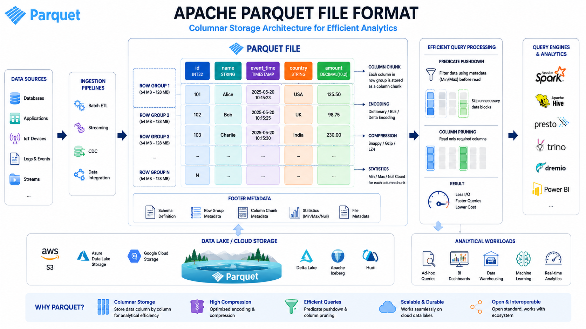

# 📊 Parquet & Columnar File Format

⬅️ [Back to File Formats Fundamentals](./03_File_Formats_Fundamentals.md)

---

## 📚 Table of Contents

* Introduction
* What is Columnar Storage?
* Row-Based vs Columnar Storage
* What is Apache Parquet?
* Why is Parquet Popular?
* Parquet Architecture
* Converting CSV to Parquet
* Converting JSON to Parquet
* PySpark Examples
* Advantages & Limitations
* Interview Questions
* Key Takeaways

---

# 📖 Introduction

As data volumes grow, traditional row-based file formats such as CSV and JSON become inefficient for analytics workloads.

Modern Data Engineering platforms use **columnar file formats** like **Apache Parquet** because they provide:

* Better Compression
* Faster Query Performance
* Reduced Storage Cost
* Efficient Data Processing

---

# 📊 What is Columnar Storage?



In a columnar storage format, values from the same column are stored together.

## Example Table

| ID | Name  | Salary |
| -- | ----- | ------ |
| 1  | John  | 50000  |
| 2  | Alice | 60000  |
| 3  | Bob   | 70000  |

### Row-Based Storage

```text
1,John,50000
2,Alice,60000
3,Bob,70000
```

### Columnar Storage

```text
ID Column
---------
1
2
3

Name Column
-----------
John
Alice
Bob

Salary Column
-------------
50000
60000
70000
```

---

# ⚔️ Row-Based vs Columnar Storage

| Feature          | Row-Based             | Columnar                |
| ---------------- | --------------------- | ----------------------- |
| Storage Style    | Entire Row Together   | Same Column Together    |
| Read Performance | Good for Transactions | Excellent for Analytics |
| Compression      | Lower                 | Higher                  |
| Query Speed      | Slower                | Faster                  |
| OLTP             | Excellent             | Poor                    |
| OLAP             | Moderate              | Excellent               |

---

# 🏛️ What is Apache Parquet?

Apache Parquet is an open-source **columnar storage format** designed for efficient storage and analytics.

It is widely used in:

* Apache Spark
* Databricks
* Snowflake
* AWS Athena
* Amazon EMR
* BigQuery
* Delta Lake

---

# 🎯 Why is Parquet Popular?

Parquet is the preferred file format in modern Data Engineering because it:

✅ Stores data column-wise

✅ Supports compression

✅ Reduces storage costs

✅ Improves query performance

✅ Supports schema evolution

✅ Works efficiently with distributed systems

---

# 🏗️ Parquet Architecture

```text
Table
│
├── Column: ID
│      1
│      2
│      3
│
├── Column: Name
│      John
│      Alice
│      Bob
│
└── Column: Salary
       50000
       60000
       70000
```

---

# 🔄 Converting CSV to Parquet

## Sample CSV

```csv
id,name,salary
1,John,50000
2,Alice,60000
3,Bob,70000
```

## Using Pandas

```python
import pandas as pd

df = pd.read_csv("employees.csv")

df.to_parquet(
    "employees.parquet",
    index=False
)
```

---

## Using PySpark

```python
from pyspark.sql import SparkSession

spark = SparkSession.builder.appName(
    "CSV to Parquet"
).getOrCreate()

df = spark.read.csv(
    "employees.csv",
    header=True,
    inferSchema=True
)

df.write.mode("overwrite").parquet(
    "employees_parquet"
)
```

---

# 🔄 Converting JSON to Parquet

## Sample JSON

```json
[
  {
    "id": 1,
    "name": "John",
    "salary": 50000
  },
  {
    "id": 2,
    "name": "Alice",
    "salary": 60000
  }
]
```

---

## Using Pandas

```python
import pandas as pd

df = pd.read_json("employees.json")

df.to_parquet(
    "employees.parquet",
    index=False
)
```

---

## Using PySpark

```python
from pyspark.sql import SparkSession

spark = SparkSession.builder.appName(
    "JSON to Parquet"
).getOrCreate()

df = spark.read.json(
    "employees.json"
)

df.write.mode("overwrite").parquet(
    "employees_parquet"
)
```

---

# 🚀 Real-World Data Engineering Workflow

```text
CSV Files
JSON Files
Database Exports
API Responses
        │
        ▼
 Apache Spark
        │
        ▼
 Parquet Files
        │
        ▼
 Data Lake
        │
        ▼
 Data Lakehouse
        │
        ▼
 Analytics & BI
```

---

# ✅ Advantages of Parquet

* High Compression Ratio
* Faster Query Execution
* Reduced Storage Cost
* Supports Schema Evolution
* Excellent for Big Data Processing
* Distributed Processing Friendly

---

# ❌ Limitations

* Not Human Readable
* More Complex than CSV
* Not Suitable for Transactional Workloads

---

# 🎤 Interview Questions

### What is Parquet?

Parquet is a columnar storage file format optimized for analytics and big data processing.

### Why is Parquet faster than CSV?

Parquet reads only the required columns instead of scanning the entire file.

### Why is Parquet preferred in Data Lakes?

Because it provides better compression, faster queries, and lower storage costs.

### Difference between CSV and Parquet?

CSV is row-based, while Parquet is columnar and optimized for analytics.

### Which tools commonly use Parquet?

Spark, Databricks, Snowflake, Athena, BigQuery, and Delta Lake.

---

# 🏁 Key Takeaways

* CSV and JSON are commonly used ingestion formats.
* Parquet is a columnar storage format.
* Columnar storage improves analytical performance.
* Parquet reduces storage and compute costs.
* Most modern Data Lakes and Lakehouses store data in Parquet format.
* Apache Spark is commonly used to convert CSV and JSON into Parquet.

---

## 📚 Next Topic

➡️ [Data Normalization and Denormalization](../03_Data_Warehousing/01_Data_Normalization_Denormalization.md)
