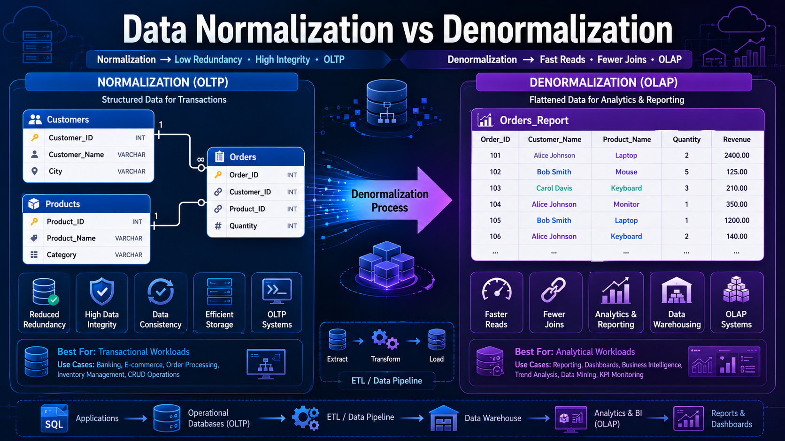

# 🗄️ Data Normalization & Denormalization

⬅️ [Back to Parquet Columnar File Format](../02_Data_Transformation_File_Formats/04_Parquet_Columnar_File_Format.md)

---

# 📚 Table of Contents

* Introduction
* What is Data Normalization?
* Why Use Normalization?
* Normal Forms (1NF, 2NF, 3NF)
* What is Data Denormalization?
* Why Use Denormalization?
* Normalization vs Denormalization
* OLTP vs OLAP Relationship
* Real-World Example
* Interview Questions
* Key Takeaways

---

# 📖 Introduction

Database design plays a critical role in ensuring data quality, consistency, and performance.

Two important concepts used in database design are:

1. **Normalization**
2. **Denormalization**

Normalization is commonly used in  **OLTP systems** , while Denormalization is commonly used in  **OLAP systems and Data Warehouses** .



---

# 🧩 What is Data Normalization?

Normalization is the process of organizing data into multiple related tables to reduce redundancy and improve data integrity.

The goal is to store data efficiently and eliminate duplicate information.

---

# 🎯 Why Use Normalization?

Normalization helps:

* Reduce data redundancy
* Improve data consistency
* Prevent update anomalies
* Improve data integrity
* Optimize storage usage

---

# 🏗️ Example Before Normalization

## Customer Orders Table

| Order_ID | Customer_Name | Customer_City | Product  |
| -------- | ------------- | ------------- | -------- |
| 101      | John          | Bangalore     | Laptop   |
| 102      | John          | Bangalore     | Mouse    |
| 103      | Alice         | Hyderabad     | Keyboard |

Notice that customer information is repeated multiple times.

---

# 🏗️ Example After Normalization

## Customers Table

| Customer_ID | Customer_Name | City      |
| ----------- | ------------- | --------- |
| 1           | John          | Bangalore |
| 2           | Alice         | Hyderabad |

## Orders Table

| Order_ID | Customer_ID | Product  |
| -------- | ----------- | -------- |
| 101      | 1           | Laptop   |
| 102      | 1           | Mouse    |
| 103      | 2           | Keyboard |

Now customer information is stored only once.

---

# 🔢 Normal Forms

Normalization is achieved through Normal Forms.

---

# 1️⃣ First Normal Form (1NF)

## Rule

* Each column contains atomic values.
* No repeating groups.
* Each row is unique.

### ❌ Not in 1NF

| Customer | Products      |
| -------- | ------------- |
| John     | Laptop, Mouse |

### ✅ In 1NF

| Customer | Product |
| -------- | ------- |
| John     | Laptop  |
| John     | Mouse   |

---

# 2️⃣ Second Normal Form (2NF)

## Rule

* Must satisfy 1NF.
* Remove partial dependencies.

Every non-key column must depend on the entire primary key.

### ❌ Example: Not in 2NF

### Student Courses Table

| Student_ID | Course_ID | Student_Name | Course_Name |
| ---------- | --------- | ------------ | ----------- |
| 101        | C01       | John         | SQL         |
| 101        | C02       | John         | Python      |
| 102        | C01       | Alice        | SQL         |

### Composite Primary Key

```text
(Student_ID, Course_ID)
```

### Problem

- `Student_Name` depends only on `Student_ID`
- `Course_Name` depends only on `Course_ID`

They do not depend on the entire primary key `(Student_ID, Course_ID)`.

This is called a **Partial Dependency**.

## ✅ Convert to 2NF

### Students Table

| Student_ID | Student_Name |
| ---------- | ------------ |
| 101        | John         |
| 102        | Alice        |

### Courses Table

| Course_ID | Course_Name |
| --------- | ----------- |
| C01       | SQL         |
| C02       | Python      |

### Student_Courses Table

| Student_ID | Course_ID |
| ---------- | --------- |
| 101        | C01       |
| 101        | C02       |
| 102        | C01       |

---

# 3️⃣ Third Normal Form (3NF)

## Rule

* Must satisfy 2NF.
* Remove transitive dependencies.

Non-key attributes should depend only on the primary key.

### ❌ Not in 3NF

| Employee_ID | Department_ID | Department_Name |
| ----------- | ------------- | --------------- |
| 101         | 1             | IT              |

Department Name depends on Department ID, not Employee_ID.

### ✅ In 3NF

#### Employees Table

| Employee_ID | Department_ID |
| ----------- | ------------- |
| 101         | 1             |

#### Departments Table

| Department_ID | Department_Name |
| ------------- | --------------- |
| 1             | IT              |

---

# 🔄 What is Data Denormalization?

Denormalization is the process of combining multiple normalized tables into fewer tables to improve query performance.

It intentionally introduces redundancy to reduce joins.

---

# 🎯 Why Use Denormalization?

Denormalization helps:

* Improve read performance
* Reduce JOIN operations
* Speed up analytics queries
* Simplify reporting

---

# 🏗️ Example

### Normalized Tables

#### Customers

| Customer_ID | Customer_Name |
| ----------- | ------------- |
| 1           | John          |

#### Orders

| Order_ID | Customer_ID | Product |
| -------- | ----------- | ------- |
| 101      | 1           | Laptop  |

---

### Denormalized Table

| Order_ID | Customer_Name | Product |
| -------- | ------------- | ------- |
| 101      | John          | Laptop  |

Customer information is duplicated but reporting becomes faster.

---

# ⚔️ Normalization vs Denormalization

| Feature           | Normalization | Denormalization |
| ----------------- | ------------- | --------------- |
| Data Redundancy   | Low           | High            |
| Storage Usage     | Efficient     | Higher          |
| Data Integrity    | High          | Moderate        |
| Query Performance | Slower        | Faster          |
| JOIN Operations   | More          | Fewer           |
| Best For          | OLTP          | OLAP            |

---

# 🏛️ Relationship with OLTP and OLAP

## OLTP Systems

Typically use **Normalization**

Examples:

* Banking Systems
* E-Commerce Transactions
* ERP Applications

Reason:

* Frequent Inserts
* Updates
* Deletes
* High Data Integrity

---

## OLAP Systems

Typically use **Denormalization**

Examples:

* Data Warehouses
* Reporting Systems
* Analytics Platforms

Reason:

* Faster Reads
* Fewer Joins
* Better Reporting Performance

---

# 🌍 Real-World Example

## Amazon

### OLTP Database

Normalized tables:

* Customers
* Orders
* Products
* Payments

Used for handling millions of transactions.

---

### Data Warehouse

Denormalized tables:

* Sales Fact Table
* Customer Dimension
* Product Dimension

Used for analytics and reporting.

---

# 🏗️ Star Schema Example

A common denormalized design in Data Warehouses.

```text
                Customer Dimension
                        │
                        │
Product Dimension ─ Fact Sales ─ Time Dimension
                        │
                        │
                Store Dimension
```

---

# 🛠️ Common Technologies

### OLTP (Normalized)

* MySQL
* PostgreSQL
* Oracle
* SQL Server

### OLAP (Denormalized)

* Snowflake
* Amazon Redshift
* Google BigQuery
* Azure Synapse

---

# 🎤 Interview Questions

### What is Normalization?

Normalization is the process of organizing data into multiple related tables to reduce redundancy and improve data integrity.

### What is Denormalization?

Denormalization combines tables to improve query performance.

### Why is Normalization used in OLTP?

Because OLTP systems require consistency, integrity, and efficient transaction processing.

### Why is Denormalization used in OLAP?

Because OLAP systems prioritize fast analytical queries.

### What are the first three Normal Forms?

* 1NF
* 2NF
* 3NF

### Which is faster for reporting?

Denormalization.

---

# 🏁 Key Takeaways

* Normalization reduces redundancy.
* Denormalization improves query performance.
* OLTP systems usually use normalized schemas.
* OLAP systems usually use denormalized schemas.
* 1NF, 2NF, and 3NF are the most common normalization levels.
* Star Schemas are a common denormalized design pattern in Data Warehouses.

---
## 📚 Next Topic

➡️ [Data Modeling](02_Data_Modeling.md)