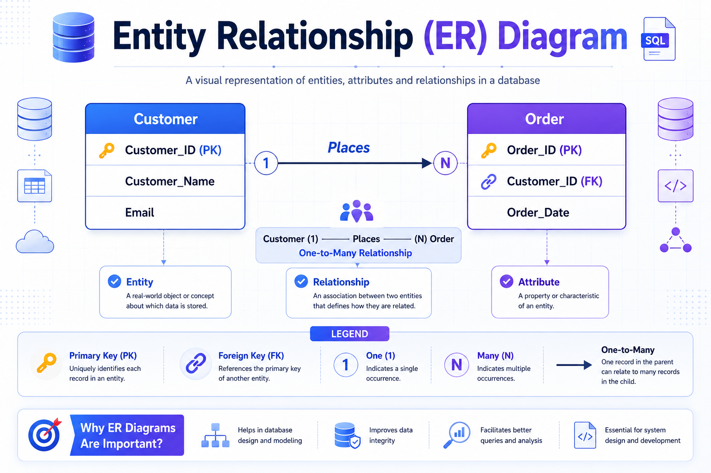
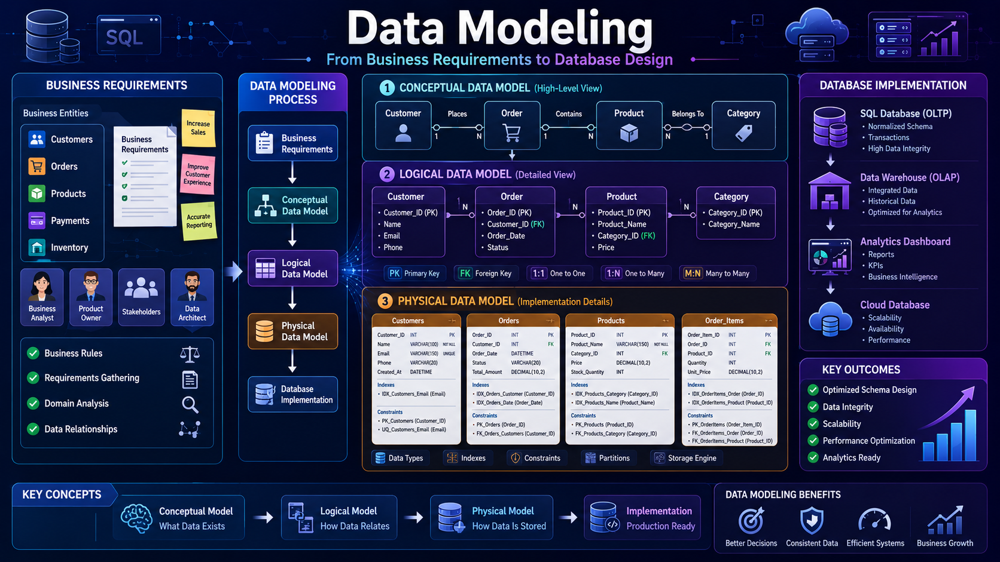

# 🏗️ Data Modeling Fundamentals

⬅️ [Back to Data Normalization &amp; Denormalization](01_Data_Normalization_Denormalization.md)

---

# 📚 Table of Contents

* Introduction
* What is Data Modeling?
* Why Data Modeling is Important?
* Components of Data Modeling
* Entity Relationship (ER) Diagram
* Types of Data Models
* OLTP Data Modeling
* OLAP Data Modeling
* Fact and Dimension Tables
* OLTP vs OLAP Data Modeling
* Real-World Example
* Interview Questions
* Key Takeaways

---

# 📖 Introduction

Data Modeling is the process of designing and organizing data structures before implementation in a database, Data Warehouse, or Data Lakehouse.

It acts as a blueprint that helps organizations understand:

* What data should be stored
* How data is related
* How data should be organized
* How data can be efficiently queried

A well-designed data model improves:

✅ Data Quality

✅ Data Consistency

✅ Performance

✅ Scalability

✅ Business Reporting

---

# 🏗️ What is Data Modeling?

Data Modeling defines how data is structured, related, and stored to support consistency, accuracy, and efficient processing.

It includes creating visual blueprints such as **Entity Relationship (ER) Diagrams** to describe:

* Entities
* Relationships
* Attributes
* Business Rules

Data Modeling serves as the foundation for database design and analytics systems.

---

# 🎯 Why is Data Modeling Important?

Data Modeling helps:

* Reduce data redundancy
* Improve data quality
* Enforce business rules
* Improve query performance
* Simplify analytics
* Support scalable systems

Without proper modeling, databases become difficult to maintain and analyze.

---

# 🧩 Components of Data Modeling

## Entity

An object or concept about which data is stored.

Examples:

* Customer
* Product
* Order
* Employee

---

## Attribute

A property that describes an entity.

Example:

```text
Customer
│
├── Customer_ID
├── Customer_Name
└── Email
```

---

## Relationship

Defines how entities are connected.

Example:

```text
Customer
    │
 Places
    │
    ▼
 Order
```

One customer can place many orders.

---

# 📊 Entity Relationship (ER) Diagram

An ER Diagram is a visual representation of entities, attributes, and relationships.

## Example



---

# 🔄 Types of Data Models

Data Modeling is generally divided into three levels.



---

# 1️⃣ Conceptual Data Model

## Purpose

Provides a high-level business view of data.

Focuses on:

* Business Entities
* Relationships
* Business Rules

### Example

```text
Customer
     │
 Places
     │
     ▼
 Order
```

---

# 2️⃣ Logical Data Model

## Purpose

Defines entities, attributes, and relationships independent of any database technology.

### Example

```text
Customer
---------
Customer_ID
Customer_Name
Email

Order
---------
Order_ID
Customer_ID
Order_Date
```

---

# 3️⃣ Physical Data Model

## Purpose

Represents the actual database implementation.

Includes:

* Tables
* Data Types
* Indexes
* Constraints

### Example

```sql
CREATE TABLE customers (
    customer_id INT PRIMARY KEY,
    customer_name VARCHAR(100),
    email VARCHAR(255)
);
```

---

# 🏦 OLTP Data Modeling

## 📖 What is OLTP Data Modeling?

In OLTP systems, data modeling focuses on **Normalization** to avoid redundancy and ensure transactional integrity.

The goal is to support:

* Fast Inserts
* Fast Updates
* Fast Deletes
* Data Consistency

---

## Characteristics

✅ Normalized Tables

✅ Reduced Redundancy

✅ ACID Compliance

✅ Transaction Optimization

---

## Example

```text
Customers
│
└── Customer_ID

Orders
│
└── Customer_ID (FK)
```

Data is split into multiple related tables.

---

# 📈 OLAP Data Modeling

## 📖 What is OLAP Data Modeling?

In OLAP systems, data modeling is called **Dimensional Modeling**.

Dimensional Modeling organizes data into:

* Fact Tables
* Dimension Tables

to optimize analytical queries and reporting.

---

## Characteristics

✅ Denormalized Structure

✅ Faster Analytics

✅ Fewer Joins

✅ Reporting Optimized

---

# 📊 Fact Tables

Fact Tables store measurable business events.

Examples:

* Sales Amount
* Revenue
* Quantity Sold
* Profit

---

## Example

| Product_ID | Customer_ID | Quantity | Revenue |
| ---------- | ----------- | -------- | ------- |
| 101        | 1           | 2        | 500     |

---

# 📋 Dimension Tables

Dimension Tables provide descriptive information for analysis.

Examples:

* Customer
* Product
* Time
* Store

---

## Example

| Customer_ID | Customer_Name | City      |
| ----------- | ------------- | --------- |
| 1           | John          | Bangalore |

---

# ⚔️ OLTP vs OLAP Data Modeling

| Feature         | OLTP Modeling   | OLAP Modeling           |
| --------------- | --------------- | ----------------------- |
| Design Approach | Normalization   | Dimensional Modeling    |
| Data Structure  | Multiple Tables | Fact & Dimension Tables |
| Redundancy      | Low             | Moderate                |
| Query Type      | Transactions    | Analytics               |
| Performance     | Write Optimized | Read Optimized          |
| Schema          | ER Model        | Star / Snowflake Schema |

---

# 🌍 Real-World Example

## Amazon

### OLTP System

Uses normalized tables:

* Customers
* Orders
* Products
* Payments

for transactional processing.

---

### OLAP System

Uses dimensional models:

* Fact Sales
* Customer Dimension
* Product Dimension
* Time Dimension

for reporting and analytics.

---

# 🎤 Interview Questions

### What is Data Modeling?

Data Modeling defines how data is structured, related, and stored to support consistency, accuracy, and efficient processing.

### What is an ER Diagram?

A visual representation of entities, attributes, and relationships.

### Why is Normalization used in OLTP?

To reduce redundancy and maintain transactional integrity.

### What is Dimensional Modeling?

A modeling technique used in OLAP systems that organizes data into Fact and Dimension tables.

### What is a Fact Table?

A table that stores measurable business events.

### What is a Dimension Table?

A table that stores descriptive attributes used for analysis.

### Difference between Star and Snowflake Schema?

Star Schema is denormalized and faster, while Snowflake Schema is normalized and uses more joins.

---

# 🏁 Key Takeaways

* Data Modeling is the blueprint for database design.
* ER Diagrams visually represent entities and relationships.
* OLTP systems use Normalization.
* OLAP systems use Dimensional Modeling.
* Fact Tables store business metrics.
* Dimension Tables provide analytical context.
* Star Schema is the most common Data Warehouse design.
* Good Data Modeling improves performance, consistency, and scalability.

---

# 📚 Next Topic

➡️ [Star &amp; Snowflake Schema](03_Star_Schema_Snowflake_Schema.md)
