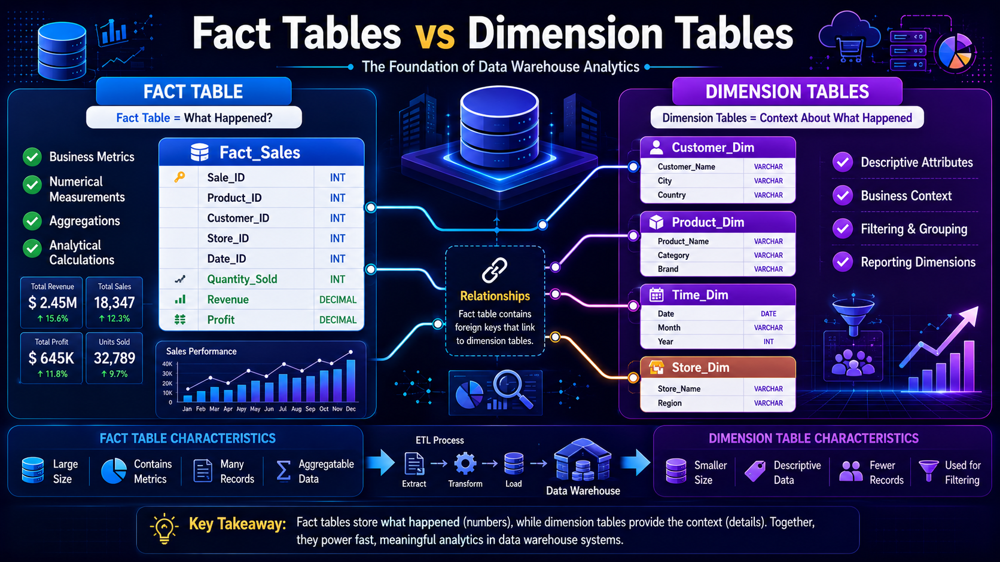
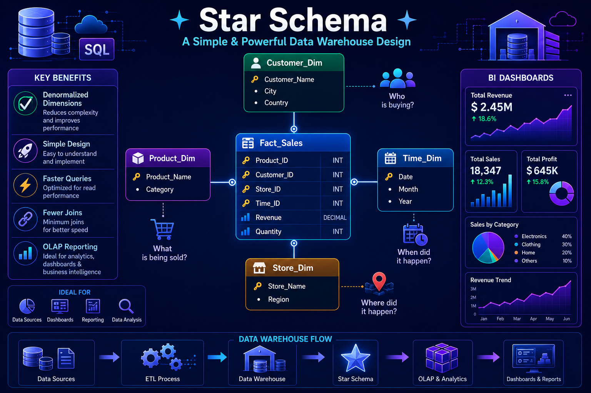
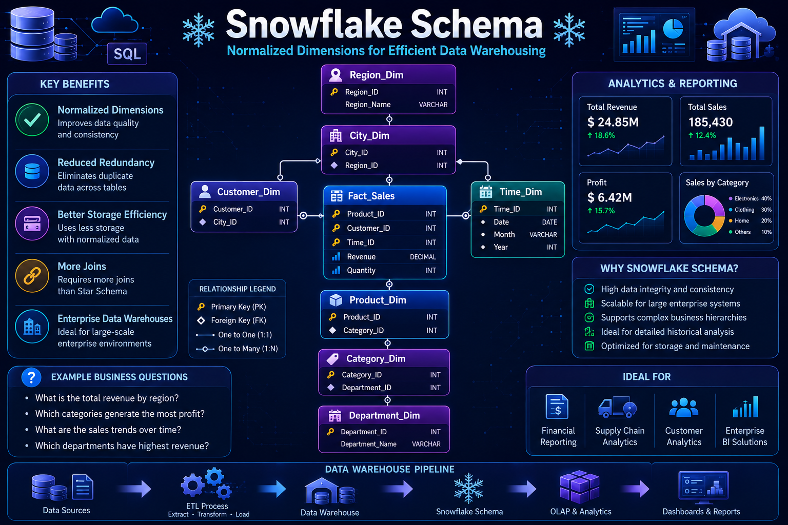

# ⭐ Star Schema, ❄️ Snowflake Schema, Fact & Dimension Tables

⬅️ [Back to Data Modeling](02_Data_Modeling.md)

---

# 📚 Table of Contents

* Introduction
* Fact Tables
* Dimension Tables
* Fact vs Dimension Tables
* What is Star Schema?
* Star Schema Architecture
* What is Snowflake Schema?
* Snowflake Schema Architecture
* Star vs Snowflake Schema
* Real-World Example
* Interview Questions
* Key Takeaways

---

# 📖 Introduction

In Data Warehousing and OLAP systems, data is organized using  **Dimensional Modeling** .

Dimensional Modeling improves reporting and analytical performance by organizing data into:

* Fact Tables
* Dimension Tables

The two most common dimensional modeling techniques are:

1. ⭐ Star Schema
2. ❄️ Snowflake Schema

---

# 📊 Fact Tables

## 📖 What is a Fact Table?

A Fact Table stores measurable business events and numerical metrics.

It contains the data that organizations want to analyze.

---

## 🎯 Characteristics

✅ Contains business metrics

✅ Usually very large

✅ Connected to multiple Dimension Tables

✅ Stores foreign keys

---

## 💼 Examples of Facts

* Sales Amount
* Revenue
* Profit
* Quantity Sold
* Discount Amount

---

## Example: Fact_Sales

| Product_ID | Customer_ID | Store_ID | Time_ID  | Quantity | Revenue |
| ---------- | ----------- | -------- | -------- | -------- | ------- |
| 101        | 1           | 10       | 20240101 | 2        | 500     |
| 102        | 2           | 11       | 20240101 | 1        | 300     |

---

# 📋 Dimension Tables

## 📖 What is a Dimension Table?

Dimension Tables provide descriptive information about business entities.

They help answer questions such as:

* Who purchased?
* What product was sold?
* When was it sold?
* Where was it sold?

---

## 🎯 Characteristics

✅ Contains descriptive attributes

✅ Used for filtering and grouping

✅ Usually smaller than Fact Tables

✅ Connected to Fact Tables

---

## Example: Customer Dimension

| Customer_ID | Customer_Name | City      | State     |
| ----------- | ------------- | --------- | --------- |
| 1           | John          | Bangalore | Karnataka |
| 2           | Alice         | Hyderabad | Telangana |

---

## Example: Product Dimension

| Product_ID | Product_Name | Category    |
| ---------- | ------------ | ----------- |
| 101        | Laptop       | Electronics |
| 102        | Keyboard     | Electronics |

---

## 🏗️ Fact & Dimension Table Relationship

The Fact Table stores measurable business metrics, while Dimension Tables provide descriptive context used for analysis, filtering, and reporting.

---

# ⚔️ Fact Table vs Dimension Table

| Feature | Fact Table    | Dimension Table      |
| ------- | ------------- | -------------------- |
| Stores  | Metrics       | Descriptive Data     |
| Size    | Large         | Small                |
| Records | Transactional | Reference Data       |
| Example | Sales Amount  | Customer Details     |
| Keys    | Foreign Keys  | Primary Keys         |
| Usage   | Calculations  | Filtering & Grouping |

---

# ⭐ Star Schema

## 📖 What is Star Schema?

Star Schema is the most commonly used Data Warehouse design pattern.

A central Fact Table is connected directly to multiple Dimension Tables.

The structure resembles a star.

---

## 🏗️ Star Schema Architecture

---

## Example

### Fact_Sales

| Product_ID | Customer_ID | Store_ID | Revenue |
| ---------- | ----------- | -------- | ------- |
| 101        | 1           | 10       | 500     |

---

### Customer_Dimension

| Customer_ID | Customer_Name |
| ----------- | ------------- |
| 1           | John          |

---

### Product_Dimension

| Product_ID | Product_Name |
| ---------- | ------------ |
| 101        | Laptop       |

---

## ✅ Advantages

* Simple design
* Easy to understand
* Faster query performance
* Fewer joins

---

## ❌ Limitations

* Data redundancy
* Higher storage requirements

---

# ❄️ Snowflake Schema

## 📖 What is Snowflake Schema?

Snowflake Schema is an extension of the Star Schema.

Dimension tables are normalized into multiple related tables.

This reduces redundancy.

---

## 🏗️ Snowflake Schema Architecture

---

## Example

### Customer Dimension

| Customer_ID | Customer_Name | City_ID |
| ----------- | ------------- | ------- |
| 1           | John          | 10      |

---

### City Dimension

| City_ID | City      |
| ------- | --------- |
| 10      | Bangalore |

---

### State Dimension

| State_ID | State     |
| -------- | --------- |
| 1        | Karnataka |

---

## ✅ Advantages

* Reduced redundancy
* Better data integrity
* Lower storage usage

---

## ❌ Limitations

* More joins
* More complex queries
* Slightly slower reporting

---

# ⚔️ Star Schema vs Snowflake Schema

| Feature     | Star Schema  | Snowflake Schema |
| ----------- | ------------ | ---------------- |
| Design      | Denormalized | Normalized       |
| Complexity  | Simple       | Complex          |
| Joins       | Fewer        | More             |
| Query Speed | Faster       | Slower           |
| Storage     | Higher       | Lower            |
| Maintenance | Easier       | Harder           |
| Reporting   | Excellent    | Good             |

---

# 🏛️ Relationship with OLAP

Dimensional Modeling is primarily used in:

* Data Warehouses
* Data Marts
* BI Systems
* Analytics Platforms

Examples:

* Snowflake
* Amazon Redshift
* BigQuery
* Azure Synapse

---

# 🌍 Real-World Example

## E-Commerce Sales Warehouse

### Fact Table

Fact_Sales

Stores:

* Quantity Sold
* Revenue
* Profit
* Discount

---

### Dimension Tables

Customer Dimension

* Customer Name
* City
* State

Product Dimension

* Product Name
* Category

Time Dimension

* Date
* Month
* Quarter
* Year

Store Dimension

* Store Name
* Region

Business users analyze sales performance using these tables.

---

# 🎤 Interview Questions

### What is a Fact Table?

A table that stores measurable business events and metrics.

### What is a Dimension Table?

A table that stores descriptive attributes used for analysis.

### What is Star Schema?

A dimensional model where a Fact Table is connected directly to Dimension Tables.

### What is Snowflake Schema?

A normalized version of the Star Schema where dimensions are split into additional tables.

### Which schema provides faster queries?

Star Schema.

### Which schema reduces redundancy?

Snowflake Schema.

### Why are Fact Tables usually large?

Because they store transactional business events.

---

# 🏁 Key Takeaways

* Fact Tables store measurable business metrics.
* Dimension Tables store descriptive business information.
* Star Schema is denormalized and optimized for reporting.
* Snowflake Schema is normalized and reduces redundancy.
* Star Schema is the most common Data Warehouse design.
* Dimensional Modeling is widely used in OLAP systems.
* Fact and Dimension Tables form the foundation of Data Warehousing.

---

# 📚 Next Topic

➡️ [Star &amp; Snowflake Schema](03_Star_Schema_Snowflake_Schema.md)
