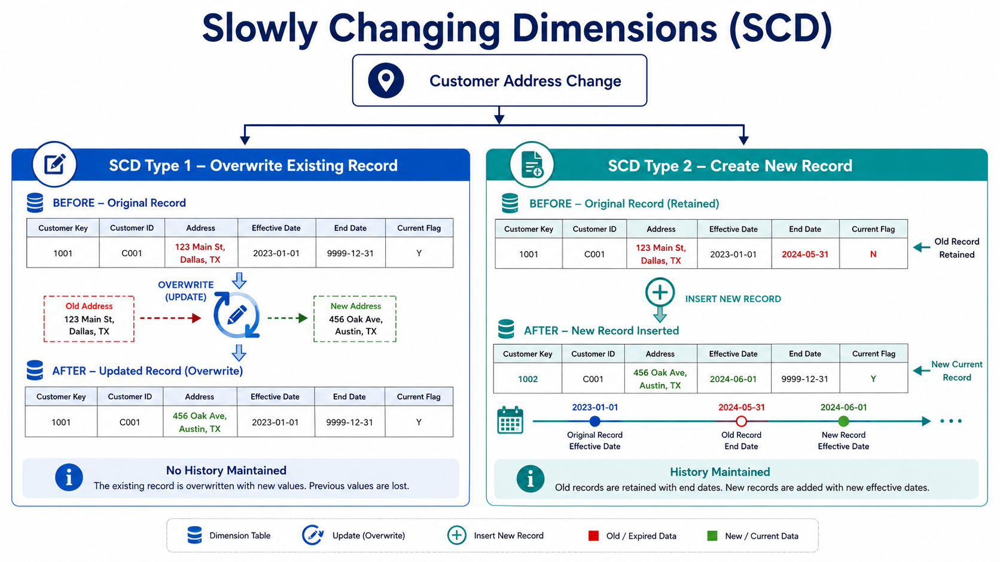

# 🔄 Slowly Changing Dimensions (SCD)

⬅️ [Star &amp; Snowflake Schema](03_Star_Schema_Snowflake_Schema.md)

## 📖 What are Slowly Changing Dimensions?

Slowly Changing Dimensions (SCD) are techniques used in Data Warehouses to manage and track changes in dimension attributes over time.

Dimension data such as customer addresses, phone numbers, product categories, or employee departments may change periodically. SCD techniques help determine how these changes should be stored and maintained.

### 💼 Examples of Changing Dimension Attributes

* Customer Address
* Customer Phone Number
* Employee Department
* Product Category
* Supplier Location

---

# 🎯 Why are Slowly Changing Dimensions Important?

Organizations often need to answer questions such as:

* What is the customer's current address?
* What was the customer's address last year?
* Which department did an employee belong to at a specific point in time?

SCD techniques help maintain data accuracy while supporting business reporting and historical analysis.

---

# 📝 SCD Type 1 – Overwrite

## 📖 What is SCD Type 1?

SCD Type 1 updates the existing record by overwriting old values with new values.

Historical data is not preserved. Only the most recent version of the data is maintained.

### Example

#### Before Update

| Customer_ID | Customer_Name | City      |
| ----------- | ------------- | --------- |
| 101         | John          | Bangalore |

#### After Update

Customer moves to Hyderabad.

| Customer_ID | Customer_Name | City      |
| ----------- | ------------- | --------- |
| 101         | John          | Hyderabad |

The previous value ( **Bangalore** ) is permanently lost.

### ✅ Advantages

* Simple implementation
* Minimal storage requirements
* Easy maintenance

### ❌ Limitations

* No historical tracking
* Cannot perform historical analysis

### Best Use Cases

* Correcting data entry errors
* Maintaining only current information
* Systems that do not require audit history

---

# 📚 SCD Type 2 – Historical Tracking

## 📖 What is SCD Type 2?

SCD Type 2 preserves historical data by creating a new record whenever a dimension attribute changes.

Each version of a record is stored separately, allowing complete historical tracking.

### Example

#### Before Update

| Customer_ID | Customer_Name | City      | Start_Date | End_Date | Current_Flag |
| ----------- | ------------- | --------- | ---------- | -------- | ------------ |
| 101         | John          | Bangalore | 2023-01-01 | NULL     | Y            |

#### After Update

Customer moves to Hyderabad.

| Customer_ID | Customer_Name | City      | Start_Date | End_Date   | Current_Flag |
| ----------- | ------------- | --------- | ---------- | ---------- | ------------ |
| 101         | John          | Bangalore | 2023-01-01 | 2024-06-30 | N            |
| 101         | John          | Hyderabad | 2024-07-01 | NULL       | Y            |

The previous record remains available for historical reporting.

### ✅ Advantages

* Complete history preservation
* Supports auditing and compliance
* Enables historical reporting

### ❌ Limitations

* Increased storage usage
* More complex implementation

### Best Use Cases

* Customer Address Tracking
* Employee Department History
* Product Category Changes
* Regulatory and Compliance Reporting

---

# ⚔️ SCD Type 1 vs SCD Type 2

| Feature         | SCD Type 1        | SCD Type 2                |
| --------------- | ----------------- | ------------------------- |
| Historical Data | ❌ No             | ✅ Yes                    |
| Storage Usage   | Low               | High                      |
| Complexity      | Simple            | Moderate                  |
| Audit Trail     | ❌ No             | ✅ Yes                    |
| Reporting       | Current Data Only | Current + Historical Data |
| Performance     | Faster            | Slightly Slower           |

---

# 🎯 Choosing the Right SCD Type

The choice of SCD type depends on business requirements.

### Use SCD Type 1 When

* Only current data is required
* Historical tracking is not important
* Storage efficiency is a priority

### Use SCD Type 2 When

* Historical analysis is required
* Audit trails must be maintained
* Regulatory compliance requires change tracking

---

# 🏁 Key Takeaways

* Slowly Changing Dimensions (SCD) manage changes in dimension data over time.
* SCD Type 1 overwrites old data and keeps only the current state.
* SCD Type 2 creates a new record for every change and preserves history.
* SCD Type 1 is simpler and uses less storage.
* SCD Type 2 supports historical reporting and auditing.
* The choice between SCD Type 1 and Type 2 depends on business and reporting requirements.
