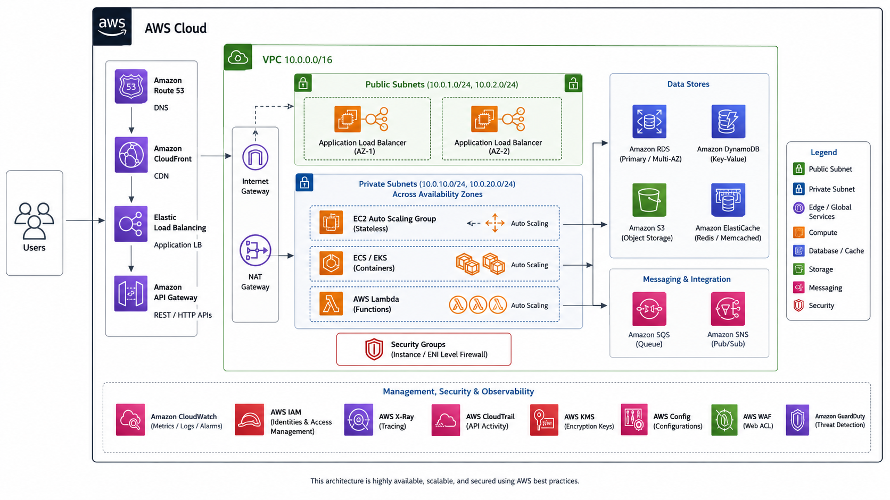
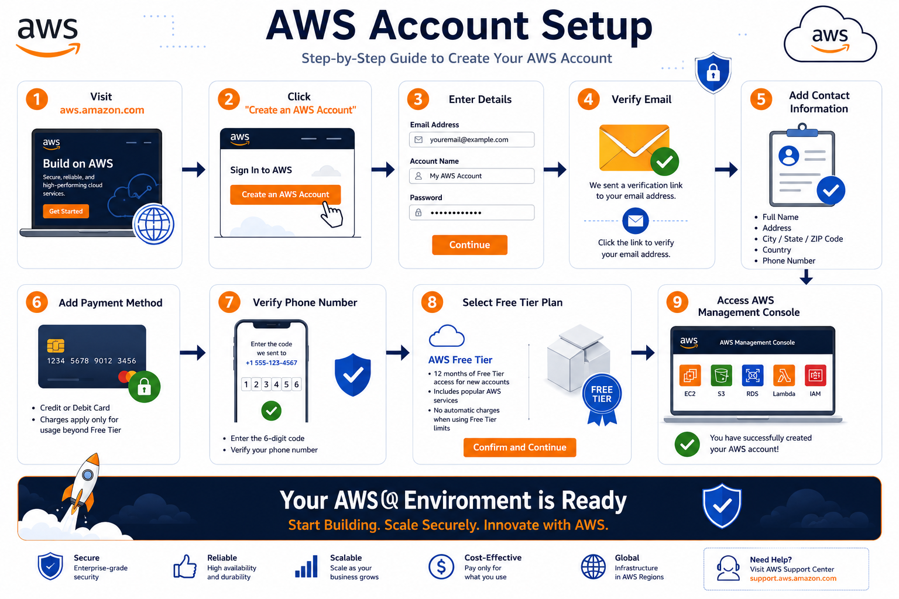
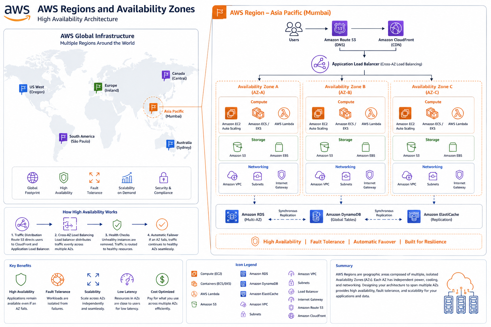
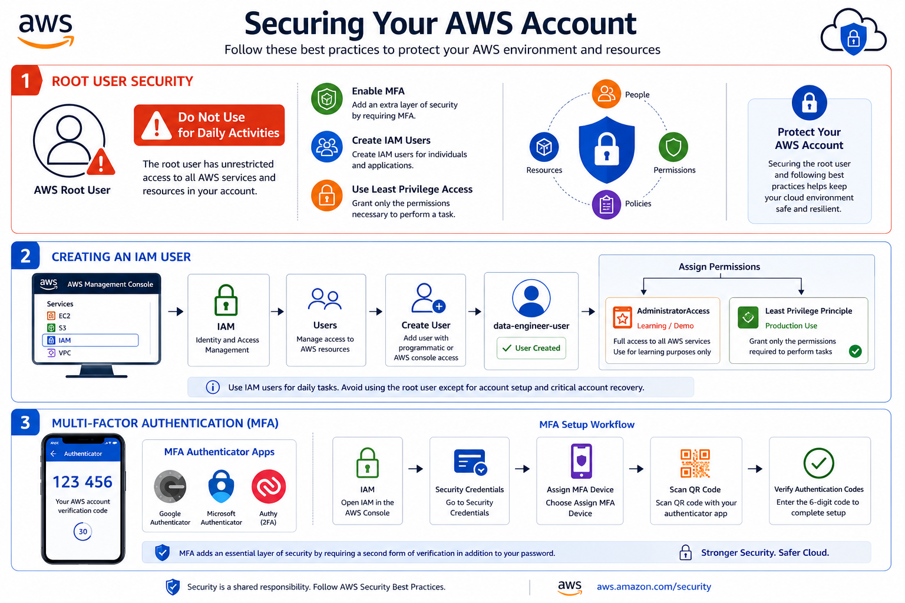

# ☁️ AWS Account Setup for Data Engineering

⬅️ [Slowly Changing Dimensions (SCD) Modeling](../../03_Data_Warehousing/04_SCD_modeling.md)

# 📚 Table of Contents

* Introduction
* What is AWS?
* Why Learn AWS for Data Engineering?
* Creating an AWS Account
* AWS Free Tier
* Understanding AWS Regions and Availability Zones
* Securing Your AWS Account
* Creating an IAM User
* Setting Up MFA
* Installing AWS CLI
* Configuring AWS CLI
* Verifying the Setup
* AWS Cost Management
* Best Practices
* Interview Questions
* Key Takeaways

---

# 📖 Introduction

Amazon Web Services (AWS) is the world's leading cloud computing platform, offering a wide range of services for computing, storage, networking, analytics, machine learning, and data engineering.

As a Data Engineer, AWS provides services such as:

* Amazon S3
* AWS Glue
* Amazon Redshift
* AWS Lambda
* Amazon EMR
* Amazon Athena

Before using these services, you need to create and properly secure an AWS account.

---

# ☁️ What is AWS?

AWS (Amazon Web Services) is a cloud platform that allows organizations to build and run applications without managing physical infrastructure.

Instead of purchasing servers and storage devices, users can provision resources on demand and pay only for what they use.

---

# 🎯 Why Learn AWS for Data Engineering?



AWS is widely used for:

* Data Storage
* ETL Processing
* Data Warehousing
* Data Lakes
* Big Data Analytics
* Machine Learning

### Popular AWS Data Engineering Services

| Service         | Purpose              |
| --------------- | -------------------- |
| Amazon S3       | Object Storage       |
| AWS Glue        | ETL Service          |
| Amazon Redshift | Data Warehouse       |
| AWS Lambda      | Serverless Computing |
| Amazon Athena   | Query Data in S3     |
| Amazon EMR      | Big Data Processing  |

---

# 📝 Creating an AWS Account



## Step 1: Open AWS Website

Visit:

```text
https://aws.amazon.com
```

Click:

```text
Create an AWS Account
```

---

## Step 2: Enter Account Details

Provide:

* Email Address
* Password
* AWS Account Name

Example:

```text
Email: yourname@example.com
Account Name: DataEngineeringLab
```

---

## Step 3: Verify Email

AWS sends a verification code to your registered email.

Verify the code to continue.

---

## Step 4: Enter Contact Information

Provide:

* Full Name
* Phone Number
* Address
* Country

Select:

```text
Personal Account
```

for learning purposes.

---

## Step 5: Add Payment Method

AWS requires:

* Credit Card
* Debit Card

for account verification.

AWS may charge a small temporary verification amount.

---

## Step 6: Verify Phone Number

Enter your phone number and complete the verification process.

---

## Step 7: Choose a Support Plan

For learning purposes, select:

```text
Basic Support (Free)
```

---

# 🎁 AWS Free Tier

AWS provides a Free Tier that allows beginners to learn AWS services at no cost within specified limits.

Examples:

### Amazon S3

* 5 GB Storage

### Amazon EC2

* 750 Hours per Month

### AWS Lambda

* 1 Million Requests per Month

### Amazon RDS

* 750 Hours per Month

---

# 🌎 Understanding Regions and Availability Zones



## Region

A geographic location containing AWS data centers.

Examples:

* us-east-1 (N. Virginia)
* us-west-2 (Oregon)
* ap-south-1 (Mumbai)

---

## Availability Zone (AZ)

An isolated data center within a region.

Example:

```text
ap-south-1
├── ap-south-1a
├── ap-south-1b
└── ap-south-1c
```

---

# 🔒 Securing Your AWS Account



Never use the Root User for daily activities.

The Root User has full access to all AWS services.

Best practice:

* Enable MFA
* Create IAM Users
* Use least privilege access

---

# 👤 Creating an IAM User

IAM (Identity and Access Management) allows you to create users and assign permissions.

## Steps

1. Open AWS Console
2. Navigate to IAM
3. Click Users
4. Click Create User
5. Enter User Name

Example:

```text
data-engineer-user
```

---

## Assign Permissions

For learning purposes:

```text
AdministratorAccess
```

For production:

```text
Least Privilege Principle
```

---

# 🔐 Setting Up Multi-Factor Authentication (MFA)

MFA adds an additional security layer.

Supported options:

* Google Authenticator
* Microsoft Authenticator
* Authy

Steps:

1. IAM
2. Security Credentials
3. Assign MFA Device
4. Scan QR Code
5. Verify Authentication Codes

---

# 💻 Installing AWS CLI

AWS CLI allows you to interact with AWS services from the command line.

## Verify Installation

```bash
aws --version
```

Expected Output:

```bash
aws-cli/2.x.x
```

---

# ⚙️ Configuring AWS CLI

Run:

```bash
aws configure
```

Enter:

```text
AWS Access Key ID
AWS Secret Access Key
Default Region
Output Format
```

Example:

```text
Region: ap-south-1
Output Format: json
```

---

# ✅ Verifying the Setup

Test AWS CLI:

```bash
aws s3 ls
```

If configured correctly, AWS returns the list of S3 buckets.

---

# 💰 AWS Cost Management

To avoid unexpected charges:

## Enable Billing Alerts

Navigate to:

```text
Billing → Budgets
```

Create a budget:

```text
Monthly Budget = $5
```

---

## Enable Cost Explorer

Navigate to:

```text
Billing → Cost Explorer
```

Monitor resource usage regularly.

---

# 🚀 Best Practices

✅ Enable MFA

✅ Create IAM Users

✅ Avoid Using Root User

✅ Enable Billing Alerts

✅ Use AWS Free Tier

✅ Delete Unused Resources

✅ Follow Least Privilege Access

---

# 🎤 Interview Questions

### What is AWS?

AWS is a cloud computing platform provided by Amazon.

### What is AWS Free Tier?

A program that allows users to access selected AWS services within free usage limits.

### What is IAM?

Identity and Access Management service used to manage users and permissions.

### Why should Root User access be avoided?

Because it has unrestricted permissions and poses security risks.

### What is MFA?

Multi-Factor Authentication adds an additional layer of account security.

### What is AWS CLI?

A command-line tool used to interact with AWS services.

### What is the difference between a Region and an Availability Zone?

A Region is a geographic location, while an Availability Zone is an isolated data center within a Region.

---

# 🏁 Key Takeaways

* AWS is the leading cloud platform for Data Engineering.
* Create an AWS account using the Free Tier.
* Secure the account with MFA.
* Create IAM users instead of using the Root User.
* Install and configure AWS CLI.
* Enable billing alerts to avoid unexpected charges.
* Understanding Regions and Availability Zones is essential for AWS architecture.
* AWS services such as S3, Glue, Redshift, and Athena are widely used in Data Engineering.

---

# 📚 Next Topic

➡️ [AWS S3 Setup](../02_AWS_S3_Setup/README.md)
