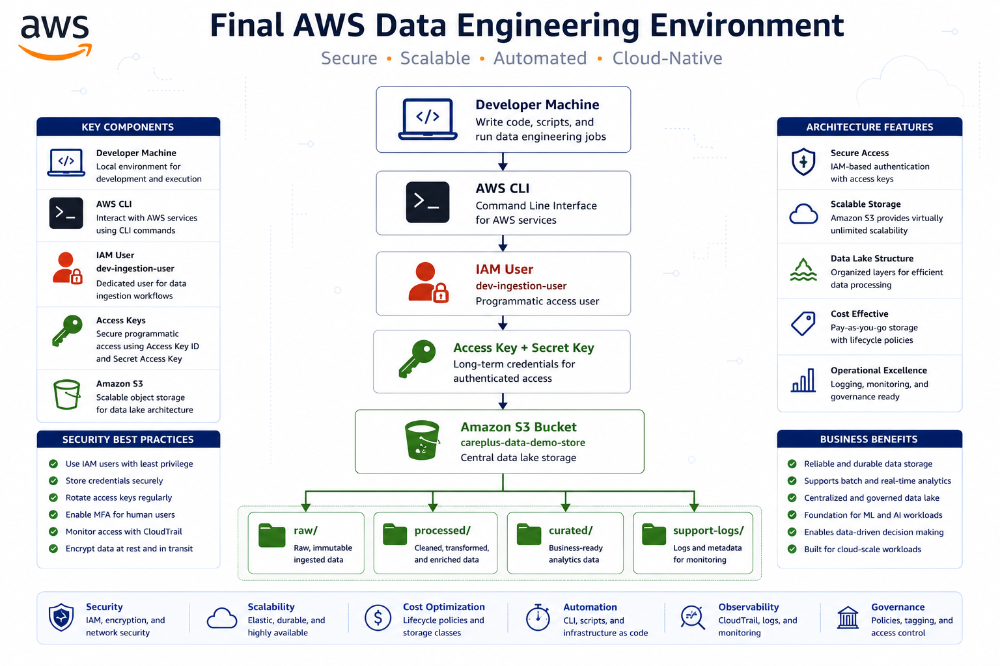
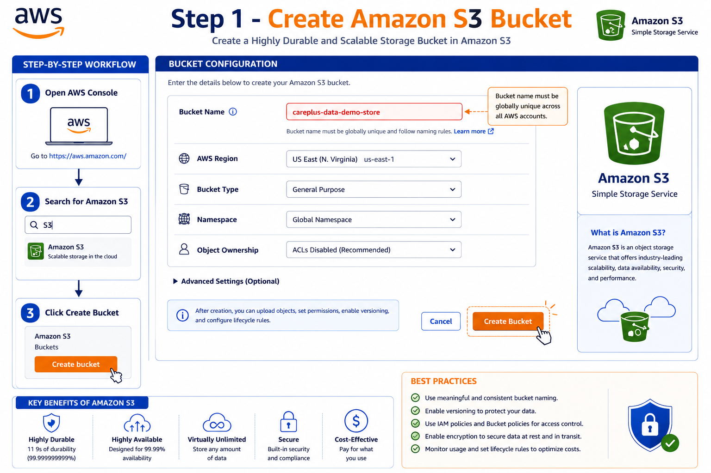
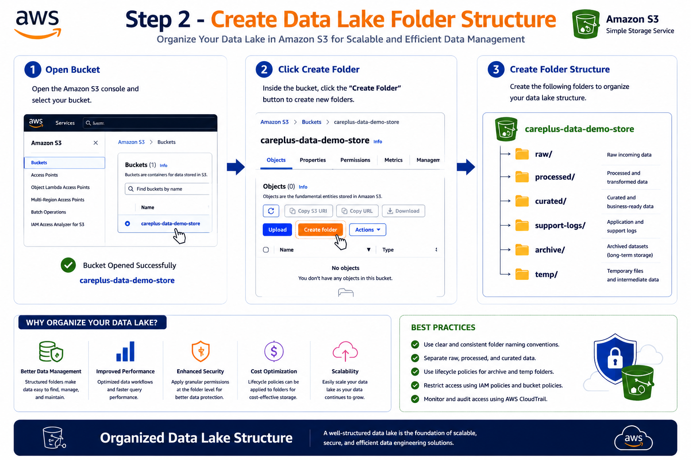
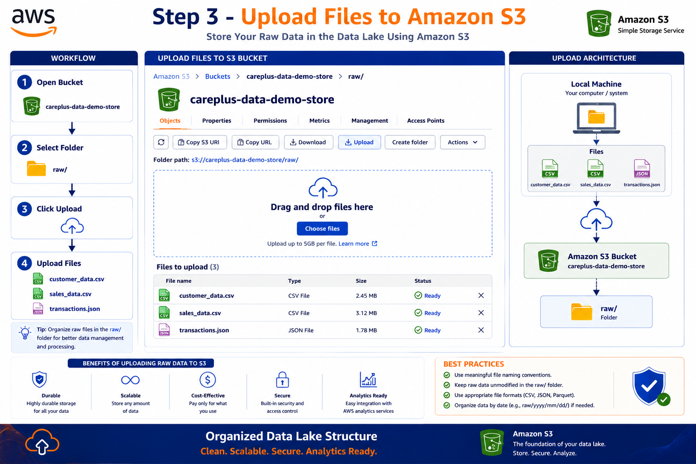
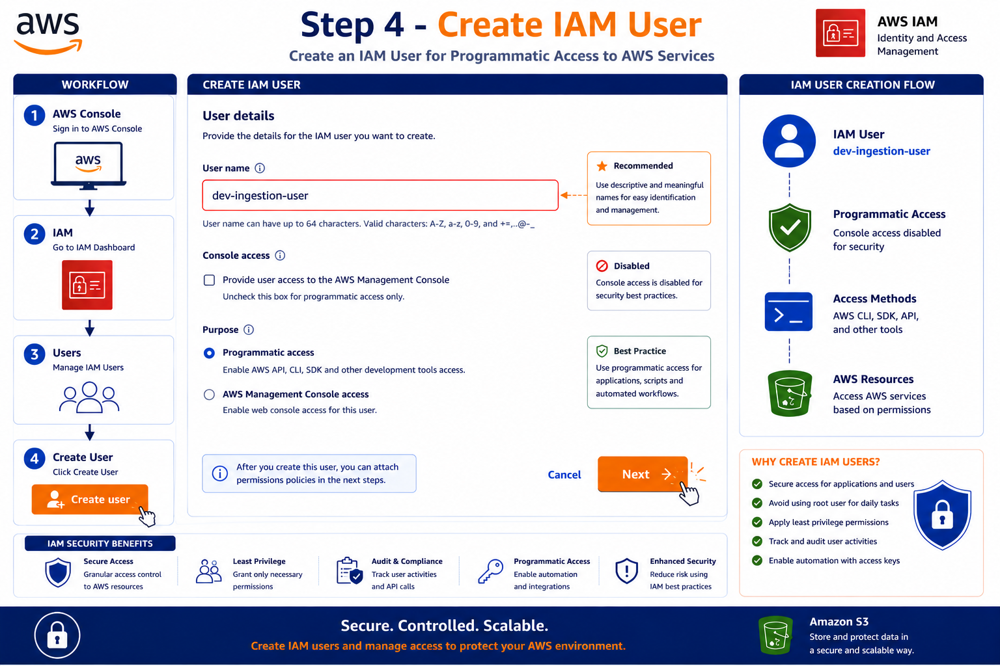
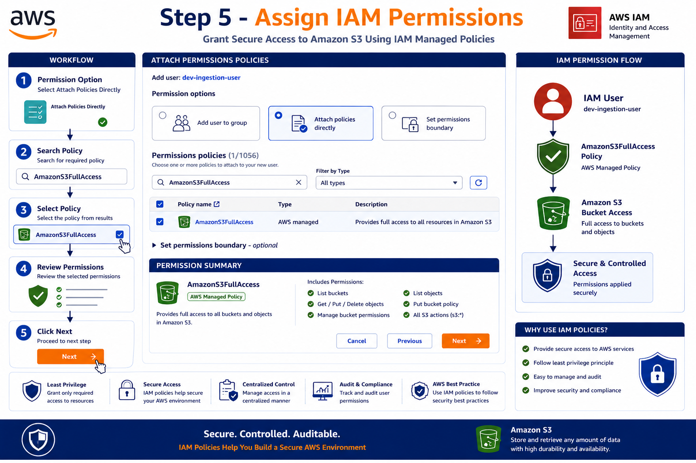
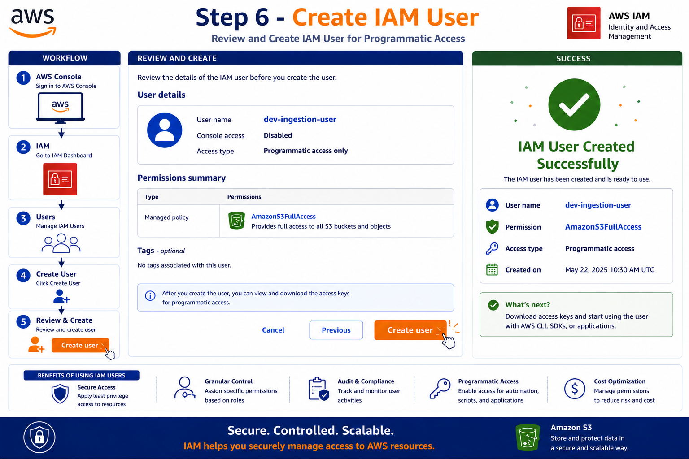
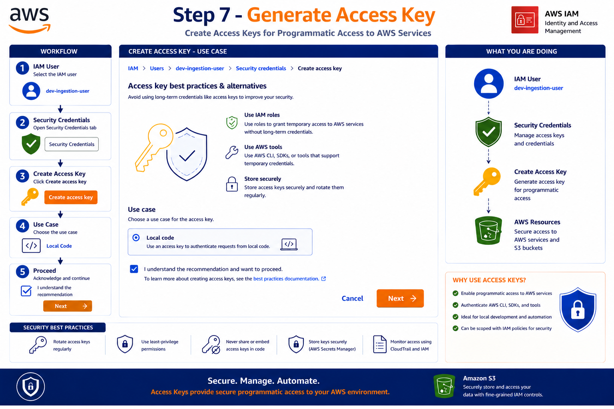
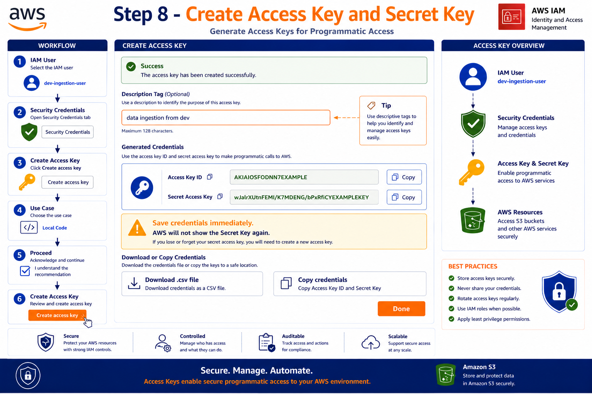

# AWS S3 Data Lake Setup with IAM User Configuration

⬅️ [Back to AWS S3 Fundamentals](./README.md)

---

## 📌 Project Overview

This project demonstrates how to set up a basic AWS Data Engineering environment by:

* Creating an Amazon S3 bucket
* Building a Data Lake folder structure
* Creating an IAM user
* Assigning S3 permissions
* Generating Access Keys
* Configuring secure programmatic access

This setup serves as the foundation for ETL pipelines, data ingestion workflows, and cloud-based data engineering projects.

---

## 🏗️ Architecture



---

# Step 1: Create Amazon S3 Bucket

Navigate to **AWS Console → Amazon S3** and click  **Create Bucket** .

### Bucket Configuration

| Setting     | Value                    |
| ----------- | ------------------------ |
| Bucket Name | careplus-data-demo-store |
| Region      | us-east-1                |
| Bucket Type | General Purpose          |
| Namespace   | Global Namespace         |

### Bucket Creation Screen



---

# Step 2: Create Data Lake Folder Structure

Open the newly created bucket and create folders.

### Folder Structure

```text
careplus-data-demo-store
│
├── raw/
├── processed/
├── curated/
├── support-logs/
├── archive/
└── temp/
```

### Folder Configuration



### File Upload



---

# Step 3: Create IAM User

Navigate to:

```text
AWS Console
   ↓
IAM
   ↓
Users
   ↓
Create User
```

### User Details

| Setting        | Value              |
| -------------- | ------------------ |
| Username       | dev-ingestion-user |
| Console Access | Disabled           |
| Access Type    | Programmatic       |

### User Configuration



---

# Step 4: Assign Permissions

Select:

```text
Attach Policies Directly
```

Search and attach:

```text
AmazonS3FullAccess
```

### Screenshot



---

# Step 5: Create User

Review configuration and create the IAM user.

### Screenshot



---

# Step 6: Generate Access Key

Navigate to:

```text
IAM User
   ↓
Security Credentials
   ↓
Create Access Key
```

### Screenshot



---

# Step 7: Select Access Key Use Case

Choose:

```text
Local Code
```

Enable confirmation checkbox and continue.

### Screenshot


---

# Step 8: Add Description Tag

Example:

```text
data ingestion from dev
```

### Screenshot



---

# Step 9: Retrieve Access Keys

AWS generates:

* Access Key ID
* Secret Access Key

⚠️ Important:

Save the Secret Access Key immediately. AWS will never display it again.

### Screenshot


---


# Security Best Practices

✅ Use IAM users instead of Root Account

✅ Enable Multi-Factor Authentication (MFA)

✅ Rotate Access Keys regularly

✅ Follow Least Privilege Principle

✅ Store secrets securely

✅ Never commit credentials to GitHub

✅ Use AWS Secrets Manager for production workloads

---

# Technologies Used

* Amazon S3
* AWS IAM
* AWS CLI
* Cloud Security
* Data Lake Architecture

---

# Learning Outcomes

After completing this project, you will understand:

* Amazon S3 bucket management
* Data Lake folder organization
* IAM user creation
* Permission management
* Access Key generation
* Secure AWS authentication

---

