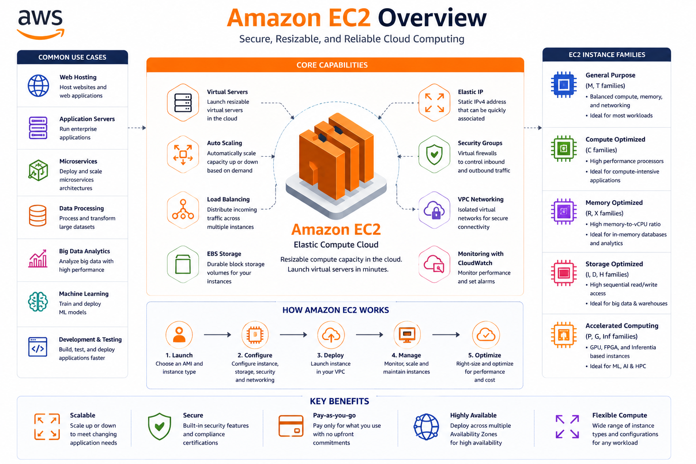
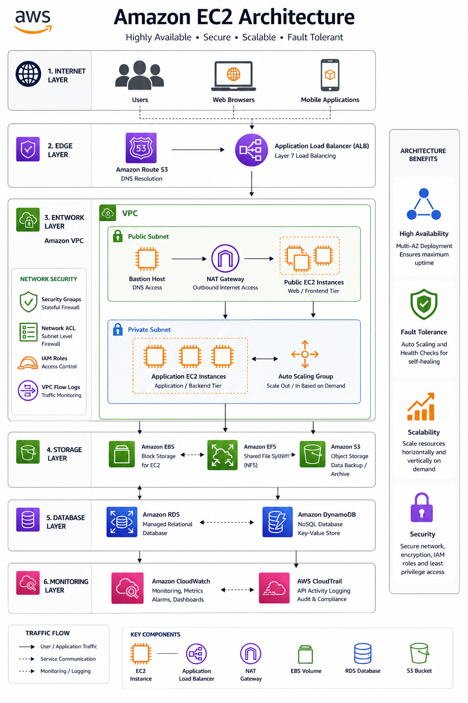
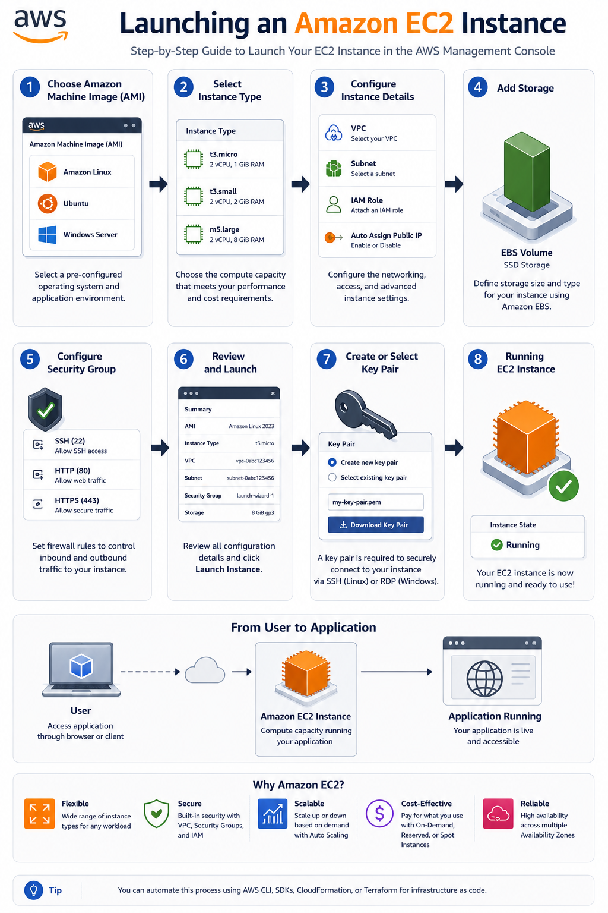
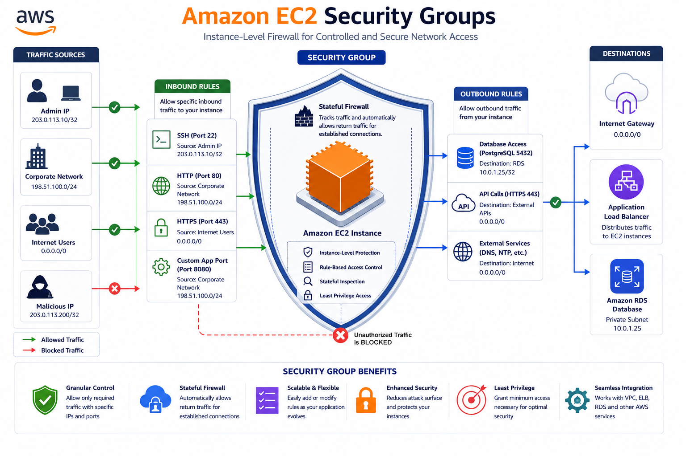
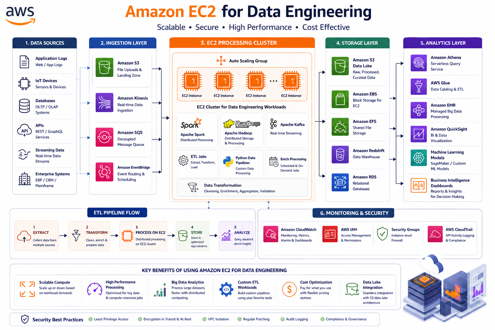

# 🖥️ AWS EC2 Fundamentals

⬅️ [Back to AWS S3 Setup](../02_AWS_S3_Setup/README.md)

---

# 📚 Table of Contents

* Introduction
* What is Amazon EC2?
* Why Use EC2?
* EC2 Architecture
* Key Components of EC2
* EC2 Instance Types
* Launching an EC2 Instance
* Connecting to an EC2 Instance
* Security Groups
* Storage in EC2
* EC2 Pricing Models
* EC2 vs AWS Lambda
* Data Engineering Use Cases
* Best Practices
* Interview Questions
* Key Takeaways

---

# 📖 Introduction

Amazon Elastic Compute Cloud (EC2) is AWS's virtual server service that provides scalable computing capacity in the cloud.

EC2 allows you to launch virtual machines, install software, run applications, and process data without purchasing physical hardware.

It is one of the core AWS services used in cloud computing and Data Engineering.

---

# 🖥️ What is Amazon EC2?



Amazon EC2 (Elastic Compute Cloud) is a web service that provides resizable virtual servers called  **Instances** .

With EC2, you can:

* Run applications
* Host websites
* Process ETL workloads
* Run databases
* Execute batch jobs
* Build scalable cloud solutions

---

# 🎯 Why Use EC2?

Amazon EC2 provides:

✅ On-Demand Compute Resources

✅ Scalability

✅ High Availability

✅ Flexible Pricing

✅ Multiple Operating Systems

✅ Integration with AWS Services

---

# 🏗️ EC2 Architecture



---

# ⚙️ Key Components of EC2

## Instance

A virtual server running in AWS.

Example:

```text
t2.micro
t3.medium
m5.large
```

---

## Amazon Machine Image (AMI)

An AMI is a pre-configured template used to launch EC2 instances.

Examples:

* Amazon Linux
* Ubuntu
* Red Hat Enterprise Linux
* Windows Server

---

## Security Group

Acts as a virtual firewall controlling inbound and outbound traffic.

Example:

```text
Allow SSH → Port 22
Allow HTTP → Port 80
Allow HTTPS → Port 443
```

---

## Key Pair

Used for secure authentication when connecting to Linux instances.

Example:

```text
de-project-key.pem
```

---

## Elastic IP

A static public IP address that can be attached to an EC2 instance.

---

# 📦 EC2 Instance Types

AWS provides different instance families.

| Family   | Use Case          |
| -------- | ----------------- |
| T Series | General Purpose   |
| M Series | Balanced Compute  |
| C Series | Compute Optimized |
| R Series | Memory Optimized  |
| P Series | GPU Workloads     |

---

## Common Learning Instance

```text
t2.micro
```

Eligible under the AWS Free Tier.

---

# 🚀 Launching an EC2 Instance



---

# 🔐 Connecting to an EC2 Instance

## Linux / Mac

```bash
chmod 400 de-project-key.pem

ssh -i de-project-key.pem ec2-user@<public-ip>
```

---

## Ubuntu

```bash
ssh -i de-project-key.pem ubuntu@<public-ip>
```

---

# 🛡️ Security Groups



Security Groups control network access.

Example Rules:

| Type  | Port |
| ----- | ---- |
| SSH   | 22   |
| HTTP  | 80   |
| HTTPS | 443  |

---

## Example

```text
Inbound Rules

SSH      TCP      22
HTTP     TCP      80
HTTPS    TCP      443
```

---

# 💾 Storage in EC2

Amazon EC2 uses:

## EBS (Elastic Block Store)

Persistent storage attached to EC2.

Example:

```text
30 GB SSD
```

---

## Instance Store

Temporary storage attached directly to the host machine.

Data is lost if the instance stops.

---

# 💰 EC2 Pricing Models

## On-Demand

Pay only for what you use.

---

## Reserved Instances

Commit to long-term usage for discounts.

---

## Spot Instances

Use unused AWS capacity at lower cost.

---

## Free Tier

```text
750 Hours / Month
```

for eligible instance types.

---

# ⚔️ EC2 vs AWS Lambda

| Feature           | EC2                       | Lambda                  |
| ----------------- | ------------------------- | ----------------------- |
| Server Management | Required                  | Not Required            |
| Billing           | Per Running Instance      | Per Execution           |
| Scaling           | Manual / Auto Scaling     | Automatic               |
| Max Runtime       | Unlimited                 | 15 Minutes              |
| Best For          | Long Running Applications | Event-Driven Processing |

---

# 🚀 Data Engineering Use Cases



---

# 🛠️ Best Practices

✅ Use IAM Roles Instead of Access Keys

✅ Restrict Security Group Access

✅ Enable Monitoring with CloudWatch

✅ Use EBS Snapshots

✅ Stop Unused Instances

✅ Use Auto Scaling When Needed

✅ Keep Operating Systems Updated

---

# 🎤 Interview Questions

### What is Amazon EC2?

Amazon EC2 is a cloud-based virtual server service provided by AWS.

### What is an EC2 Instance?

A virtual machine running inside AWS.

### What is an AMI?

Amazon Machine Image used as a template to launch EC2 instances.

### What is a Security Group?

A virtual firewall controlling instance network access.

### What is an EBS Volume?

Persistent block storage attached to EC2.

### Difference Between EC2 and Lambda?

EC2 requires server management, while Lambda is serverless.

### Why is EC2 used in Data Engineering?

To run ETL jobs, Airflow, Spark, Python applications, and data processing workloads.

---

# 🏁 Key Takeaways

* Amazon EC2 provides virtual servers in the cloud.
* EC2 instances are created from AMIs.
* Security Groups act as virtual firewalls.
* EBS provides persistent storage.
* EC2 supports multiple pricing models.
* Widely used for ETL, Airflow, Spark, and Data Engineering workloads.
* EC2 offers full control over the operating system and infrastructure.
* Understanding EC2 is essential for AWS and Data Engineering interviews.

---

# 📚 Next Topic

➡️ [AWS Lambda](../04_AWS_Lambda/README.md)
