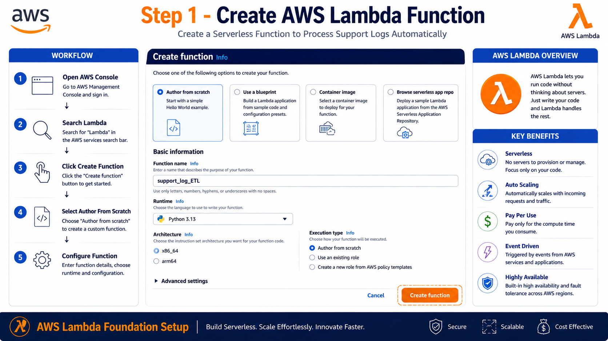
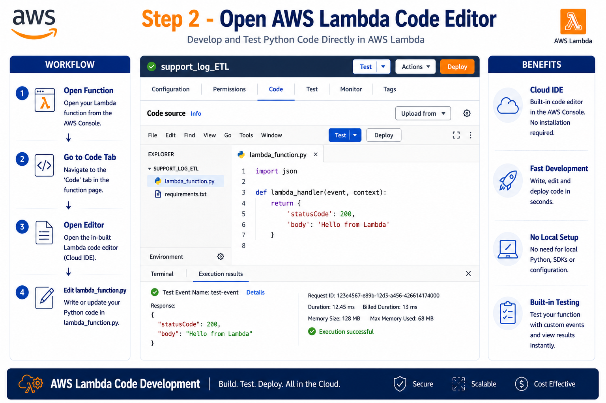
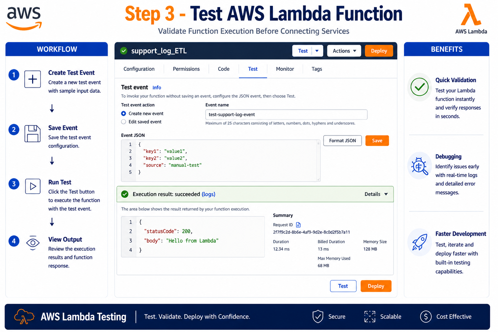
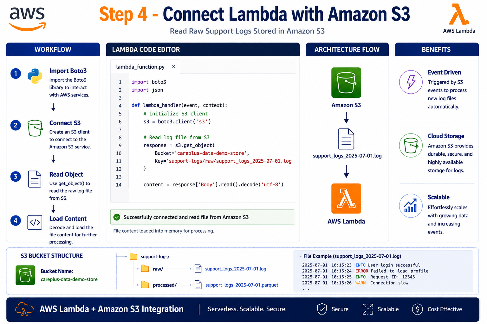
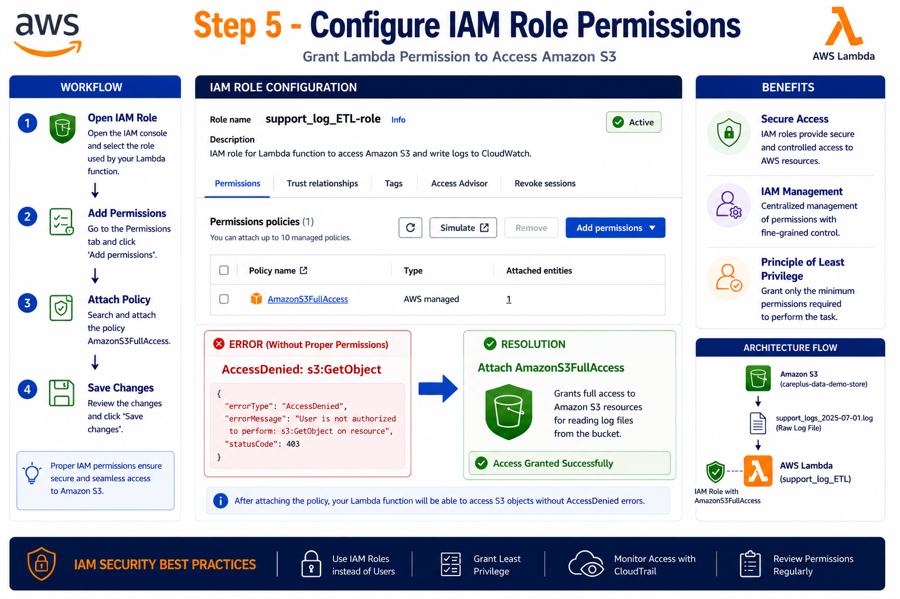
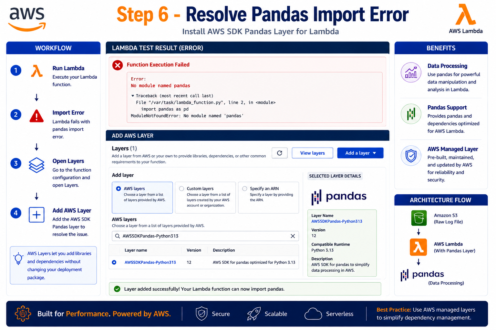
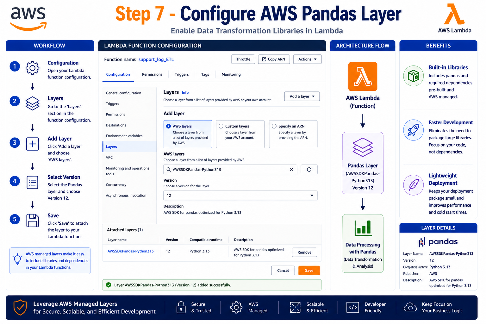
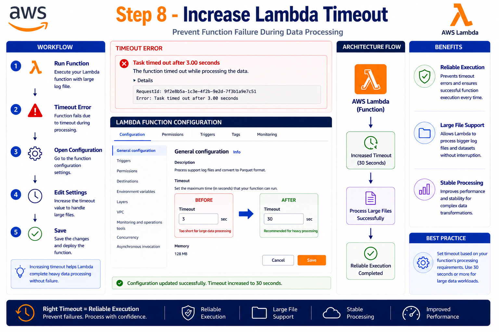
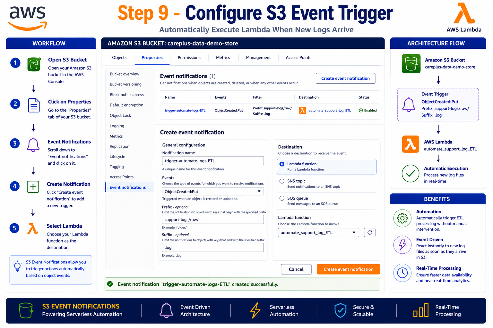
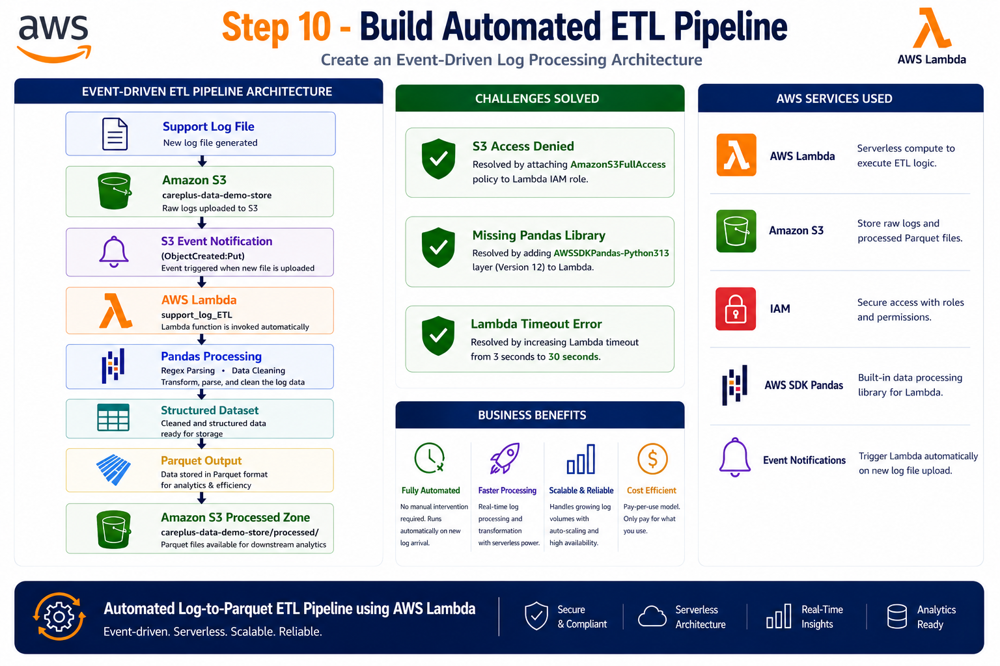

# ⚡ AWS Lambda ETL Pipeline Setup

⬅️ [Back to AWS Lambda Fundamentals](./README.md)

## 🚀 Project Overview

This project demonstrates how to build a fully automated serverless ETL pipeline using AWS Lambda and Amazon S3.

Whenever a support log file is uploaded to Amazon S3, an S3 Event Notification automatically triggers an AWS Lambda function. The Lambda function reads the log file, extracts structured information using Python and Regular Expressions, performs data cleaning and transformation using Pandas, and stores the processed output for analytics.

---

# 🏗️ Solution Architecture

Support Log File
        │
        ▼
📦 Amazon S3
careplus-data-demo-store
        │
        ▼
⚡ S3 Event Notification
(ObjectCreated:Put)
        │
        ▼
🧠 AWS Lambda
support_log_ETL
        │
        ▼
🐼 Pandas Processing
Regex Parsing
Data Cleaning
Transformation
        │
        ▼
📊 Structured Dataset
        │
        ▼
📁 Parquet Output
        │
        ▼
📦 Amazon S3 Processed Zone

---

# 🛠 AWS Services Used

| Service         | Purpose                      |
| --------------- | ---------------------------- |
| 📦 Amazon S3    | Store raw and processed data |
| ⚡ AWS Lambda   | Execute ETL logic            |
| 🔐 AWS IAM      | Access management            |
| 📊 Pandas Layer | Data transformation          |
| 📈 CloudWatch   | Monitoring and logs          |
| 🔔 S3 Events    | Trigger Lambda automatically |

---

# Step 1 – Create AWS Lambda Function

Navigate to:

```text
AWS Console → Lambda
```

Click:

```text
Create Function
```

Select:

```text
Author from Scratch
```

Configure:

```text
Function Name : support_log_ETL
Runtime       : Python 3.13
```

### Screenshot



---

# Step 2 – Develop ETL Logic

Open the Lambda Code Editor.

Update:

```text
lambda_function.py
```

Implement:

* S3 File Reading
* Log Extraction
* Regex Parsing
* Pandas Transformation
* Data Validation

Deploy the changes.

### Screenshot



---

# Step 3 – Test Lambda Execution

Create a sample test event and execute the Lambda function.

### Expected Response

```json
{
  "statusCode": 200,
  "body": "Hello from Lambda"
}
```

### Screenshot



---

# Step 4 – Read Log Files from Amazon S3

Use Boto3 to access log files stored in S3.

### Example

```python
s3 = boto3.client("s3")

response = s3.get_object(
    Bucket="careplus-data-demo-store",
    Key="support-logs/raw/support_logs_2025-07-01.log"
)
```

### Screenshot



---

# Step 5 – Configure IAM Permissions

Initially, Lambda may fail because it lacks permission to access S3.

### Error

```text
AccessDenied:
s3:GetObject
```

### Solution

Attach the following policy to the Lambda execution role:

```text
AmazonS3FullAccess
```

### Screenshot



---

# Step 6 – Add Pandas Support

AWS Lambda does not include Pandas by default.

### Error

```text
Unable to import module:
No module named pandas
```

### Screenshot



---

# Step 7 – Attach AWS SDK for Pandas Layer

Navigate to:

```text
Lambda → Layers
```

Attach:

```text
AWSSDKPandas-Python313
Version 12
```

This provides:

* Pandas
* NumPy
* PyArrow
* AWS Data Wrangler

### Screenshot



---

# Step 8 – Increase Lambda Timeout

The default Lambda timeout is:

```text
3 Seconds
```

Large log files may exceed this limit.

Update:

```text
3 Seconds → 30 Seconds
```

### Screenshot



---

# Step 9 – Configure S3 Event Notification

Automatically trigger Lambda whenever a log file is uploaded.

Configuration:

```text
Event Name : trigger-automate-logs-ETL

Prefix : support-logs/raw/

Suffix : .log

Event Type :
ObjectCreated:Put
```

### Screenshot



---

# Step 10 – Connect S3 and Lambda

Choose Lambda as the destination service.

Lambda Function:

```text
support_log_ETL
```

### Screenshot



---

# 🔄 Automated Workflow

User Uploads Log File
          │
          ▼
📦 Amazon S3
          │
          ▼
🔔 Event Notification
(ObjectCreated:Put)
          │
          ▼
⚡ AWS Lambda
support_log_ETL
          │
          ▼
📄 Read Raw Logs
          │
          ▼
🔍 Regex Extraction
          │
          ▼
🧹 Data Cleaning
          │
          ▼
🐼 Pandas DataFrame
          │
          ▼
📁 Parquet Conversion
          │
          ▼
📦 Processed Data Stored in S3

---

# ⚠ Challenges Encountered

## 1️⃣ S3 Access Denied

### Error

```text
AccessDenied
```

### Resolution

Attached IAM policy:

```text
AmazonS3FullAccess
```

---

## 2️⃣ Pandas Module Not Found

### Error

```text
No module named pandas
```

### Resolution

Added AWS SDK Pandas Layer.

---

## 3️⃣ Lambda Timeout

### Error

```text
Task timed out after 3 seconds
```

### Resolution

Increased timeout to:

```text
30 Seconds
```

---

# 📚 Learning Outcomes

* AWS Lambda Fundamentals
* Event-Driven Architecture
* IAM Role Management
* Amazon S3 Integration
* Pandas in AWS Lambda
* Automated ETL Pipelines
* CloudWatch Monitoring
* Serverless Data Engineering

---

# 🏁 Key Takeaways

* AWS Lambda enables serverless ETL processing.
* S3 Event Notifications automate workflow execution.
* IAM roles control Lambda permissions.
* AWS SDK for Pandas Layer enables data transformations.
* Lambda timeout settings are critical for large datasets.
* Serverless architectures reduce infrastructure management.
* Event-driven ETL pipelines are widely used in modern Data Engineering.
