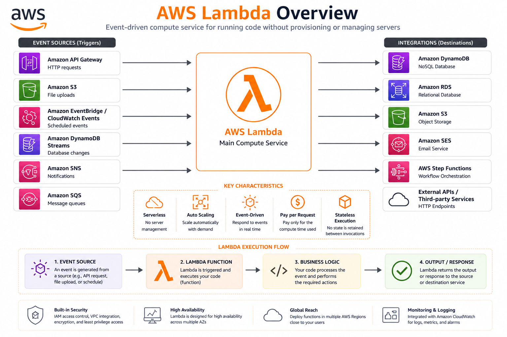
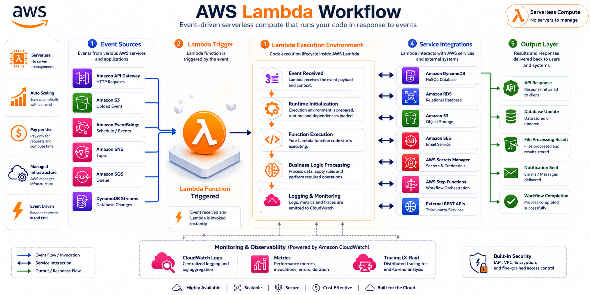
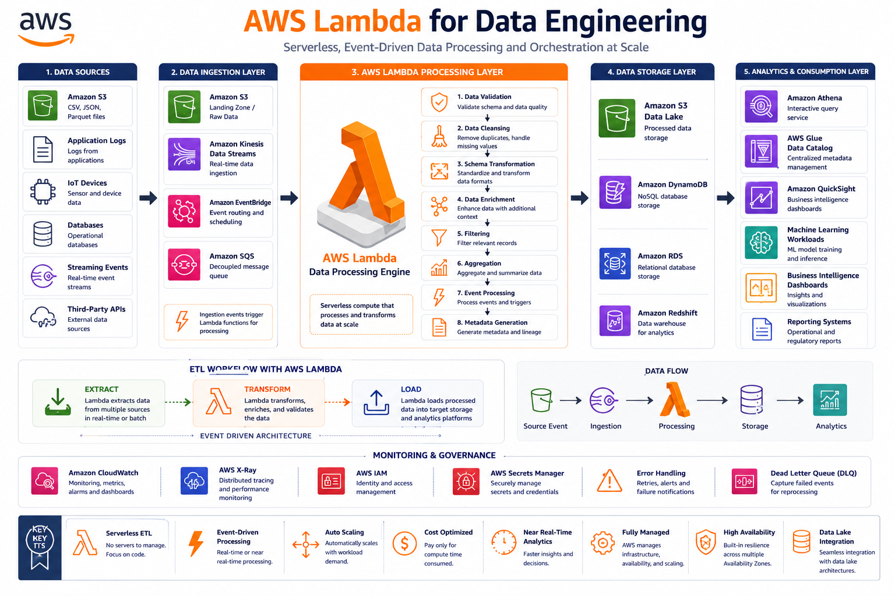

# ⚡ AWS Lambda Fundamentals

⬅️ [Back to AWS EC2](./03_AWS_EC2.md)

---

# 📚 Table of Contents

* Introduction
* What is AWS Lambda?
* Why Use Lambda?
* How Lambda Works
* Lambda Architecture
* Event Sources
* Creating a Lambda Function
* Lambda Pricing
* Lambda vs EC2
* Data Engineering Use Cases
* Best Practices
* Interview Questions
* Key Takeaways

---

# 📖 Introduction

AWS Lambda is a serverless compute service that allows you to run code without provisioning or managing servers.

With Lambda, you simply upload your code and AWS automatically handles:

* Infrastructure
* Scaling
* Availability
* Monitoring

You pay only for the compute time consumed.

---

# ⚡ What is AWS Lambda?



AWS Lambda is an event-driven serverless computing service.

It executes code in response to events such as:

* S3 file uploads
* API requests
* Database changes
* Scheduled jobs
* Queue messages

Developers only focus on writing business logic while AWS manages the infrastructure.

---

# 🎯 Why Use Lambda?

AWS Lambda provides:

✅ No Server Management

✅ Automatic Scaling

✅ Pay-As-You-Go Pricing

✅ High Availability

✅ Easy AWS Integration

---

# 🏗️ How Lambda Works



```text
Event Trigger
      │
      ▼
 AWS Lambda
      │
      ▼
 Execute Code
      │
      ▼
 Return Result
```

Example:

```text
File Uploaded to S3
        │
        ▼
AWS Lambda Triggered
        │
        ▼
Process File
        │
        ▼
Store Output
```

---

# ⚙️ Lambda Architecture

```text
Amazon S3
      │
      ▼
AWS Lambda
      │
      ▼
AWS Glue / DynamoDB / Redshift
```

Lambda acts as an event-driven processing layer.

---

# 🔔 Common Event Sources

### Amazon S3

Trigger when files are uploaded.

### Amazon EventBridge

Run scheduled jobs.

### API Gateway

Trigger Lambda through REST APIs.

### Amazon SQS

Process messages from queues.

### DynamoDB Streams

React to database changes.

---

# 🛠️ Creating a Lambda Function

## Step 1

Navigate to:

```text
AWS Console → Lambda
```

---

## Step 2

Click:

```text
Create Function
```

---

## Step 3

Choose:

```text
Author From Scratch
```

---

## Step 4

Provide:

```text
Function Name: process-customer-data
Runtime: Python 3.x
```

---

## Step 5

Click:

```text
Create Function
```

---

# 🐍 Example Lambda Function

```python
def lambda_handler(event, context):

    print("Hello from AWS Lambda!")

    return {
        "statusCode": 200,
        "body": "Lambda Executed Successfully"
    }
```

---

# 💰 Lambda Pricing

You are charged based on:

* Number of Requests
* Execution Duration
* Memory Allocation

You pay only when the function runs.

No cost when idle.

---

# ⚔️ AWS Lambda vs EC2

| Feature                   | Lambda           | EC2                       |
| ------------------------- | ---------------- | ------------------------- |
| Server Management         | No               | Yes                       |
| Scaling                   | Automatic        | Manual/Auto Scaling       |
| Billing                   | Per Execution    | Per Running Instance      |
| Startup Time              | Seconds          | Minutes                   |
| Best For                  | Event Processing | Long Running Applications |
| Infrastructure Management | AWS              | User                      |

---

# 🚀 Data Engineering Use Cases



### File Processing

```text
CSV Upload
     │
     ▼
S3 Bucket
     │
     ▼
Lambda Trigger
     │
     ▼
Validate Data
```

---

### Data Ingestion

```text
API Request
      │
      ▼
Lambda
      │
      ▼
Store in S3
```

---

### ETL Automation

```text
S3 Upload
      │
      ▼
Lambda
      │
      ▼
Trigger AWS Glue Job
```

---

### Notifications

```text
Data Pipeline Failure
         │
         ▼
       Lambda
         │
         ▼
Send Email Alert
```

---

# 🛠️ Best Practices

✅ Keep Functions Small

✅ Use IAM Roles

✅ Enable CloudWatch Logging

✅ Store Secrets in AWS Secrets Manager

✅ Use Environment Variables

✅ Monitor Execution Time

---

# 🎤 Interview Questions

### What is AWS Lambda?

AWS Lambda is a serverless compute service that executes code in response to events.

### What is Serverless Computing?

A model where developers write code without managing infrastructure.

### What triggers Lambda?

S3, API Gateway, EventBridge, SQS, DynamoDB Streams, and many AWS services.

### Does Lambda automatically scale?

Yes, AWS automatically scales Lambda based on incoming events.

### What is the Lambda execution timeout?

Maximum 15 minutes.

### Why is Lambda useful in Data Engineering?

Because it automates ingestion, validation, ETL orchestration, and event-driven processing.

---

# 🏁 Key Takeaways

* AWS Lambda is a serverless compute service.
* No server provisioning is required.
* Automatically scales based on demand.
* Commonly triggered by S3, APIs, and scheduled events.
* Widely used for ETL automation and data ingestion.
* Pay only when the function executes.
* Ideal for event-driven Data Engineering workflows.

---

# 📚 Next Topic

➡️ [AWS Lambda Setup](./01_lambda_setup.md)

➡️ [AWS Glue Fundamentals](../05_AWS_Glue/README.md)
