# 🚀 AWS Glue Visual ETL Pipeline Project

⬅️ [Back to AWS Glue Fundamentals](./README.md)

## 📋 Overview

This project demonstrates how to build an end-to-end ETL pipeline using AWS Glue Studio Visual ETL.

The pipeline reads raw support ticket data from Amazon S3, performs data cleansing and transformations, and writes optimized Parquet files back to Amazon S3.

### ETL Workflow

```text
Amazon S3 Source
       │
       ▼
Change Schema
       │
       ▼
Drop Null Fields
       │
       ▼
Rename Field
       │
       ▼
Filter Records
       │
       ▼
SQL Query
       │
       ▼
Amazon S3 Target
```

---

# 🏗️ Architecture

```text
+--------------------+
| Amazon S3 (CSV)    |
+---------+----------+
          |
          ▼
+--------------------+
| AWS Glue Visual ETL|
+---------+----------+
          |
          ├── Change Schema
          ├── Drop Null Fields
          ├── Rename Fields
          ├── Filter Records
          └── SQL Transformations
          |
          ▼
+--------------------+
| Amazon S3 (Parquet)|
+--------------------+
```

---

# 🔐 Step 1: Create IAM Role for AWS Glue

AWS Glue requires an IAM Role to access Amazon S3 and execute ETL jobs.

Navigate:

```text
AWS Console
 → IAM
 → Roles
 → Create Role
```

### Screenshot

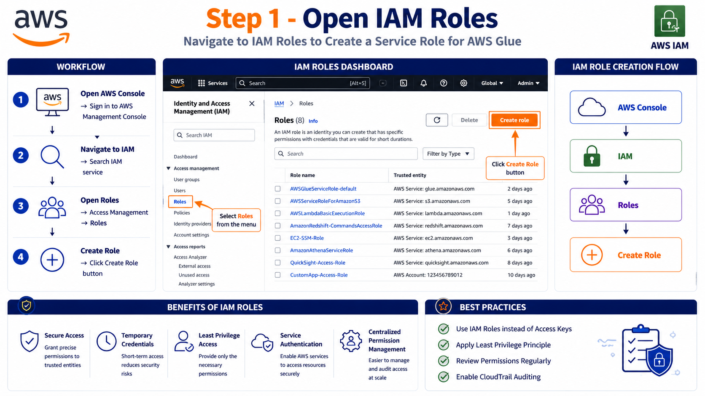

---

# 🔐 Step 2: Configure Trusted Entity

Select:

```text
Trusted Entity Type:
AWS Service
```

Service:

```text
Glue
```

Use Case:

```text
Glue
```

### Screenshot

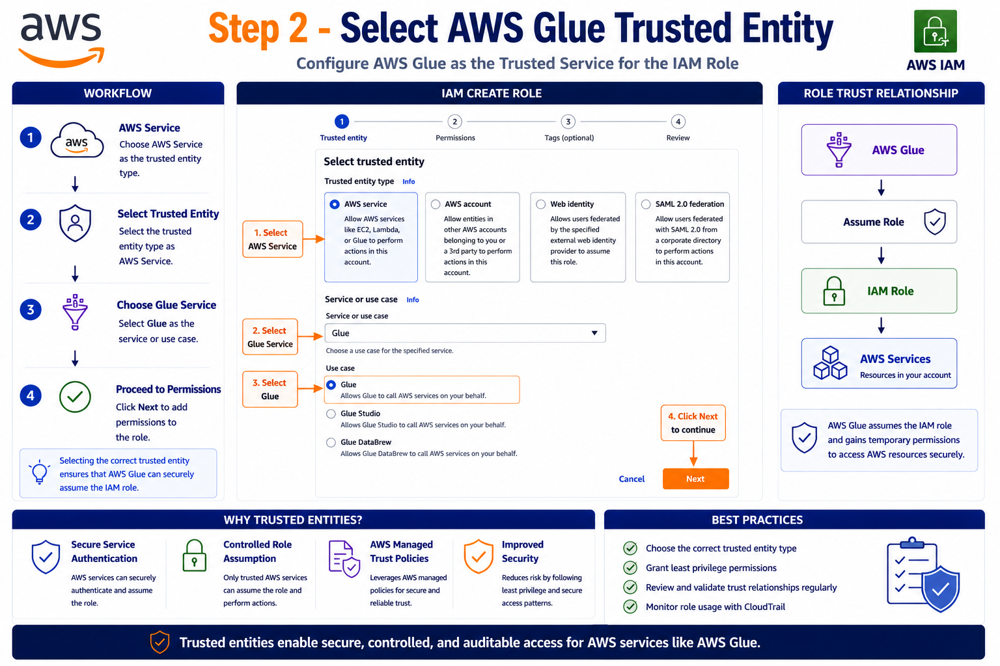

---

# 🔐 Step 3: Attach Required Permissions

Attach the following AWS managed policies:

### Amazon S3 Access

```text
AmazonS3FullAccess
```

Provides:

* Read objects
* Write objects
* List buckets
* Manage bucket access

### AWS Glue Permissions

```text
AWSGlueServiceRole
```

Provides:

* Execute ETL jobs
* Access Glue Catalog
* Create CloudWatch Logs
* Access AWS resources

### Screenshot

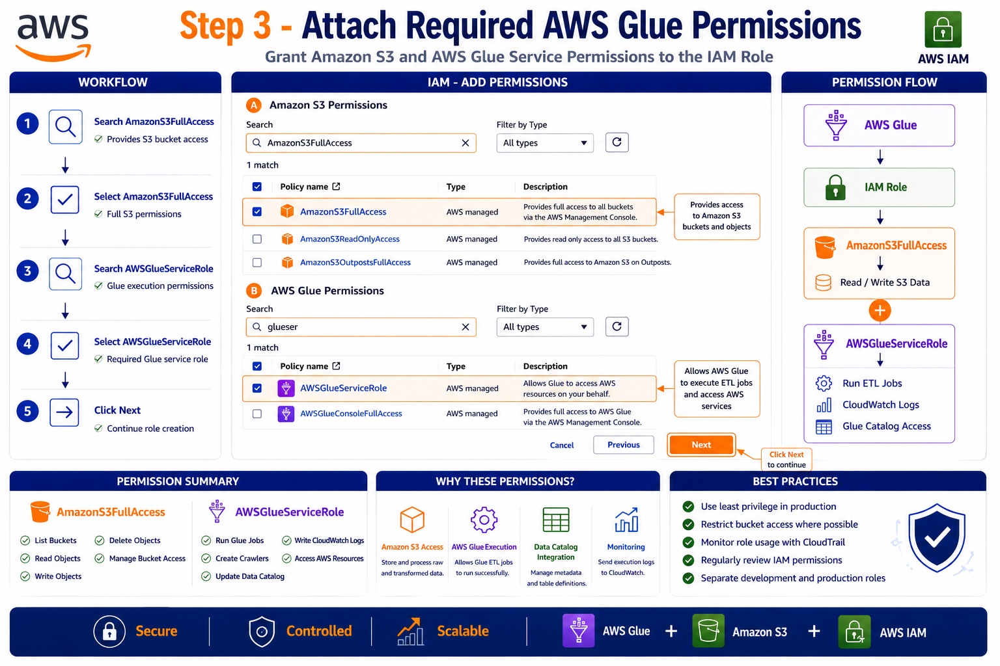

---

# 🔐 Step 4: Create Glue IAM Role

Role Name:

```text
glue_support_tickets
```

Attached Policies:

```text
AmazonS3FullAccess
AWSGlueServiceRole
```

Click:

```text
Create Role
```

### Screenshot

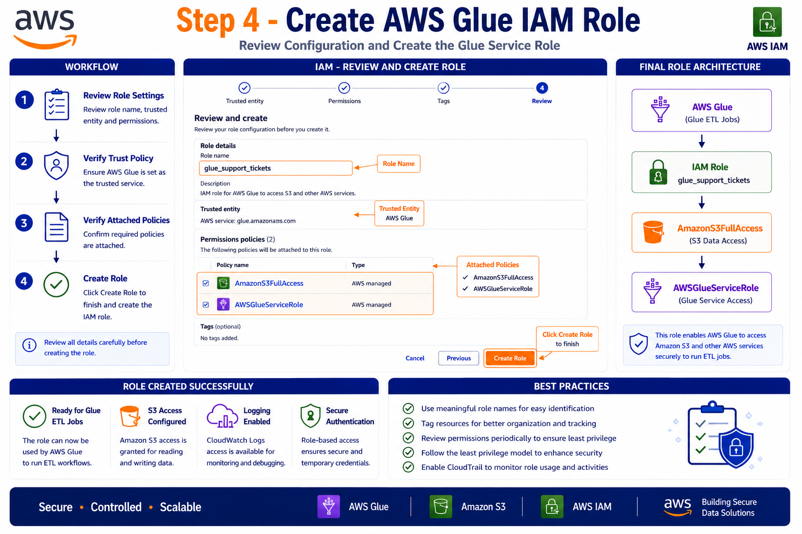

---

# 🛠️ Step 5: Create AWS Glue Visual ETL Job

Navigate:

```text
AWS Glue
→ ETL Jobs
→ Visual ETL
```

Select:

```text
Visual ETL
```

Create Job:

```text
support_tickets_etl
```

### Screenshot

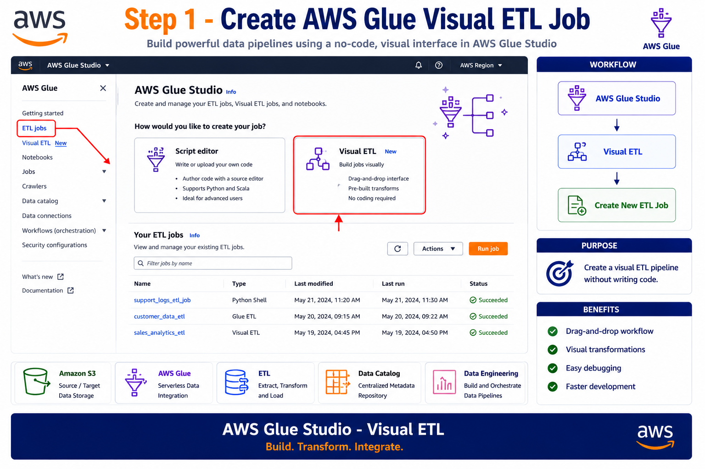

---

# 📥 Step 6: Configure Amazon S3 Source

Add Source:

```text
Amazon S3
```

Configuration:

| Property    | Value                |
| ----------- | -------------------- |
| Source Type | S3                   |
| Format      | CSV                  |
| Recursive   | Enabled              |
| IAM Role    | glue_support_tickets |

S3 Path:

```text
s3://careplus-data-demo-store/support-tickets/
```

### Screenshot

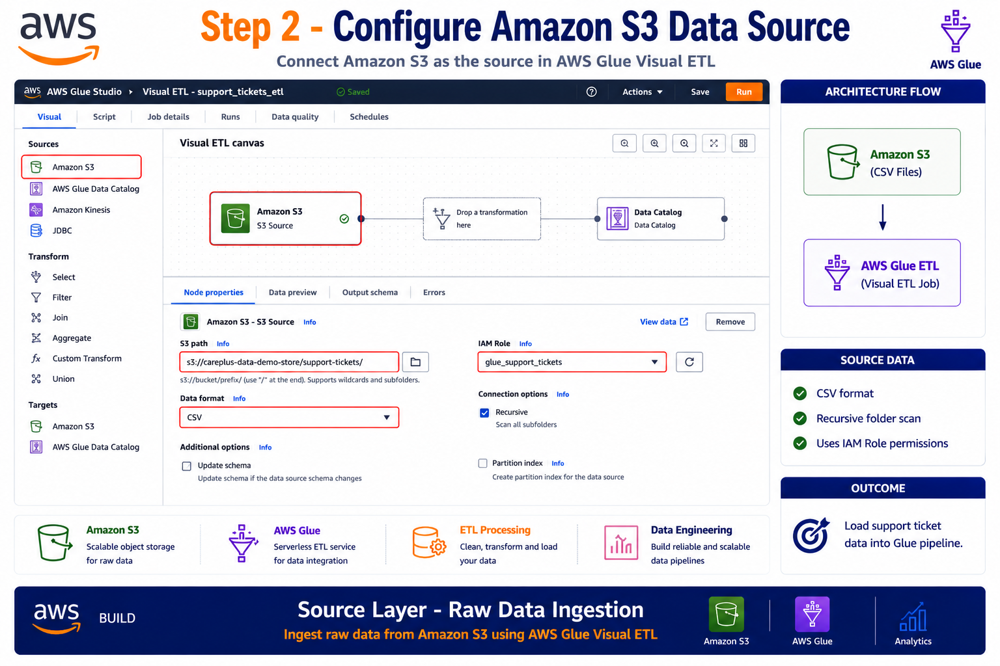

---

# 🔄 Step 7: Change Schema

Convert columns to proper data types.

| Column           | Data Type |
| ---------------- | --------- |
| created_at       | timestamp |
| resolved_at      | timestamp |
| num_interactions | int       |

Benefits:

* Accurate reporting
* Faster analytics
* Consistent schema

### Screenshot

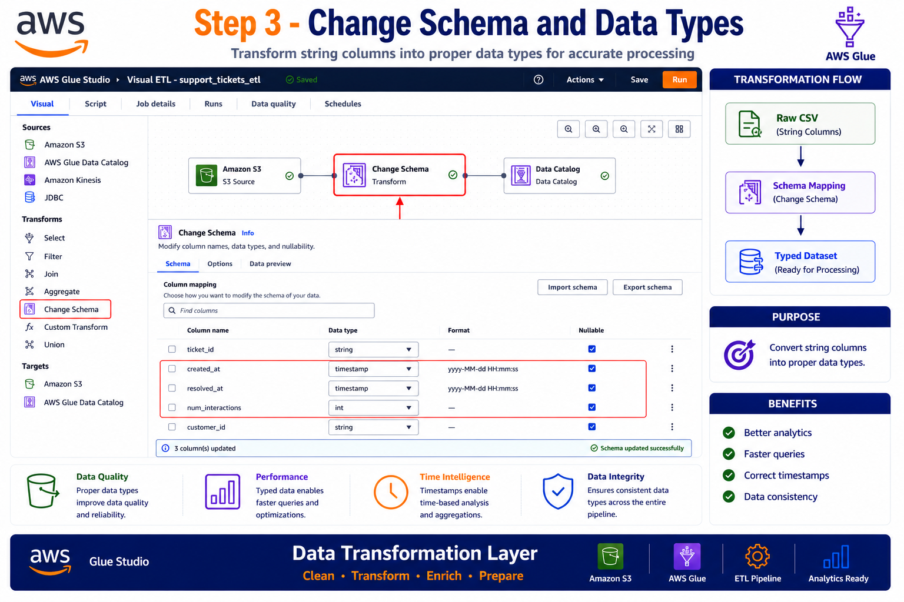

---

# 🧹 Step 8: Remove Null and Empty Records

Add Transformation:

```text
Drop Null Fields
```

Configuration:

```text
✓ Null
✓ Empty String ("")
```

Columns:

```text
subject
description
customer_id
```

### Screenshot

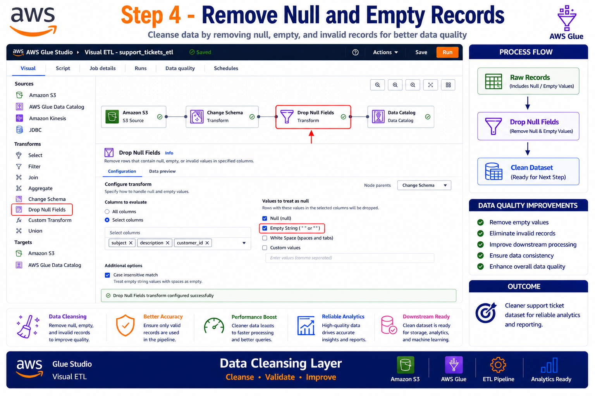

---

# ✏️ Step 9: Standardize Column Names

Add Transformation:

```text
Rename Field
```

Mappings:

| Old Name    | New Name       |
| ----------- | -------------- |
| issuecat    | issue_category |
| custid      | customer_id    |
| sevlevel    | severity_level |
| createtime  | created_at     |
| resdatetime | resolved_at    |

### Screenshot

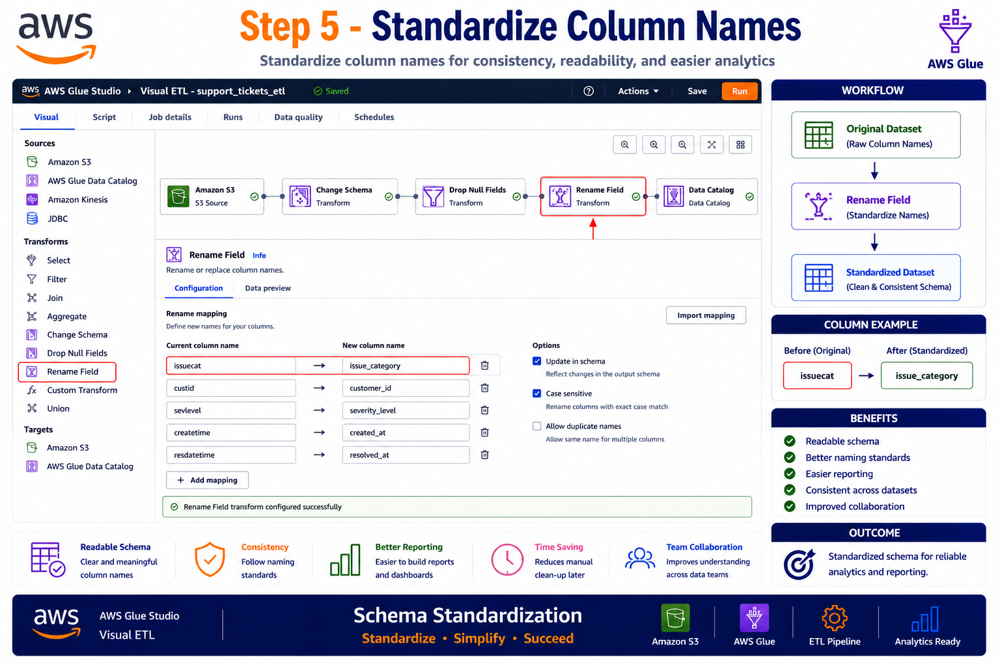

---

# 🔍 Step 10: Filter Records

Business Rule:

```sql
num_interactions >= 0
```

Purpose:

* Remove invalid records
* Improve reporting accuracy
* Maintain data quality

### Screenshot

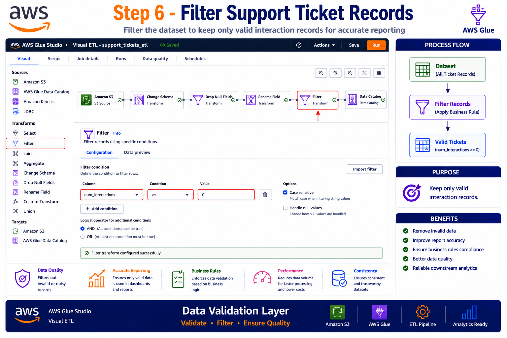

---

# 📤 Step 11: Configure Amazon S3 Target

Target:

```text
Amazon S3
```

Configuration:

| Property     | Value   |
| ------------ | ------- |
| Format       | Parquet |
| Compression  | Snappy  |
| Output Files | 1       |

Target Path:

```text
s3://careplus-data-demo-store/support-tickets/processed/
```

### Screenshot

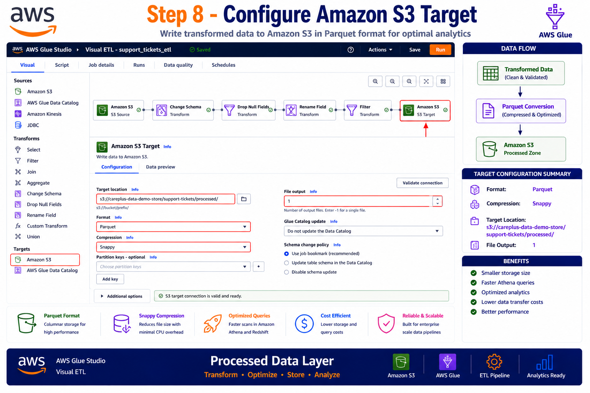

---

# ▶️ Step 12: Execute ETL Job

Click:

```text
Save
```

Then:

```text
Run
```

Monitor execution from:

```text
Runs Tab
```

### Screenshot

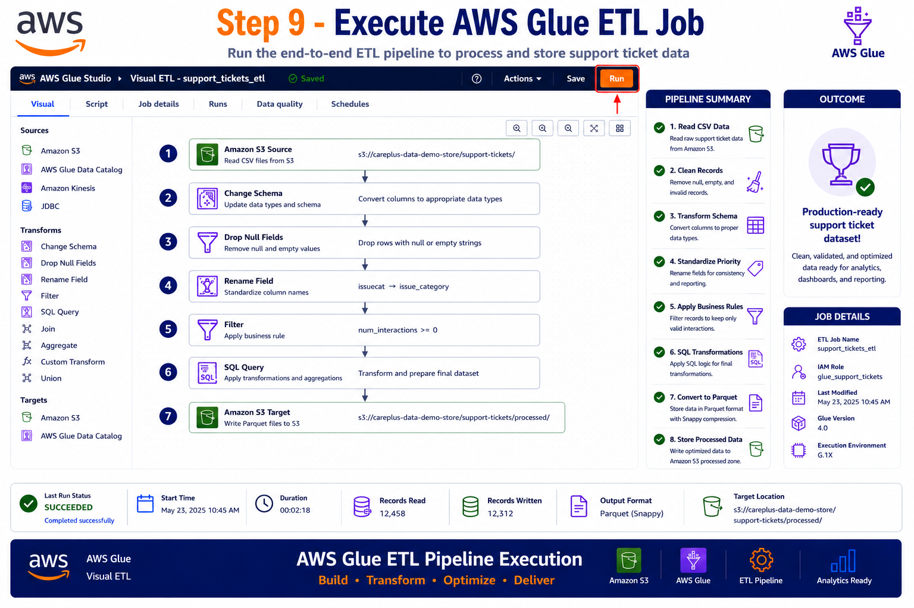

---

# 📊 Final Pipeline

```text
1. Read CSV files from Amazon S3
2. Convert data types
3. Remove null values
4. Standardize column names
5. Apply business filters
6. Execute SQL transformations
7. Convert to Parquet
8. Store output in Amazon S3
```

---

# 🎯 AWS Services Used

* AWS Glue Studio
* AWS Glue ETL
* Amazon S3
* AWS IAM
* AWS CloudWatch

---

# 📈 Output

Output Location:

```text
s3://careplus-data-demo-store/support-tickets/processed/
```

Format:

```text
Parquet
```

Compression:

```text
Snappy
```

Optimized for:

* Amazon Athena
* AWS QuickSight
* Amazon Redshift
* Data Lake Analytics

---

# ✅ Key Learnings

* AWS Glue Visual ETL
* IAM Role Configuration
* AWS Managed Policies
* S3 Data Integration
* Data Cleansing
* Schema Transformation
* Data Quality Validation
* Parquet Optimization
* ETL Pipeline Execution
