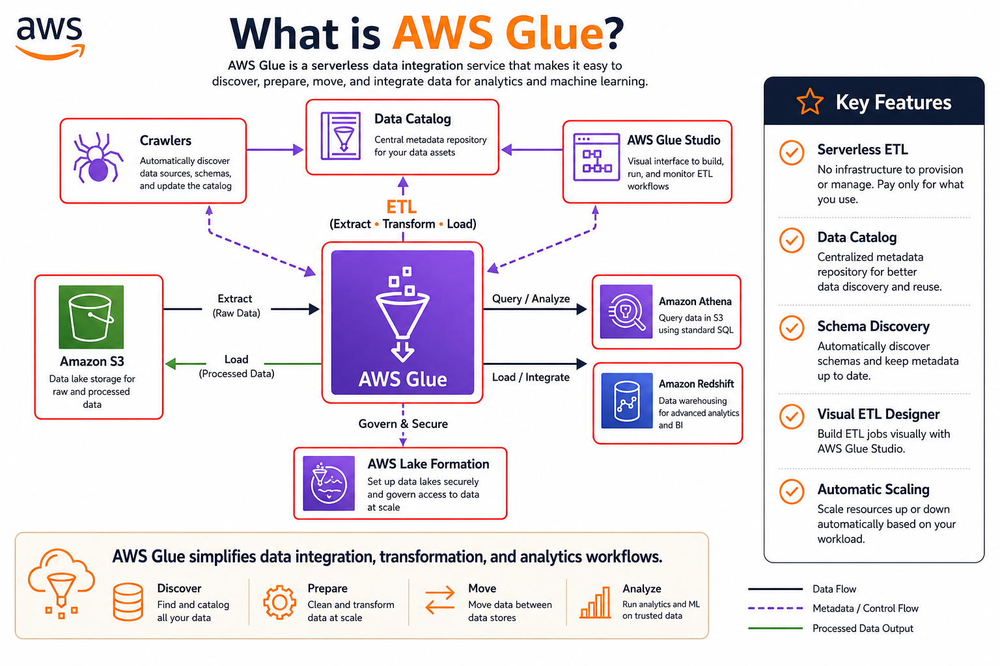
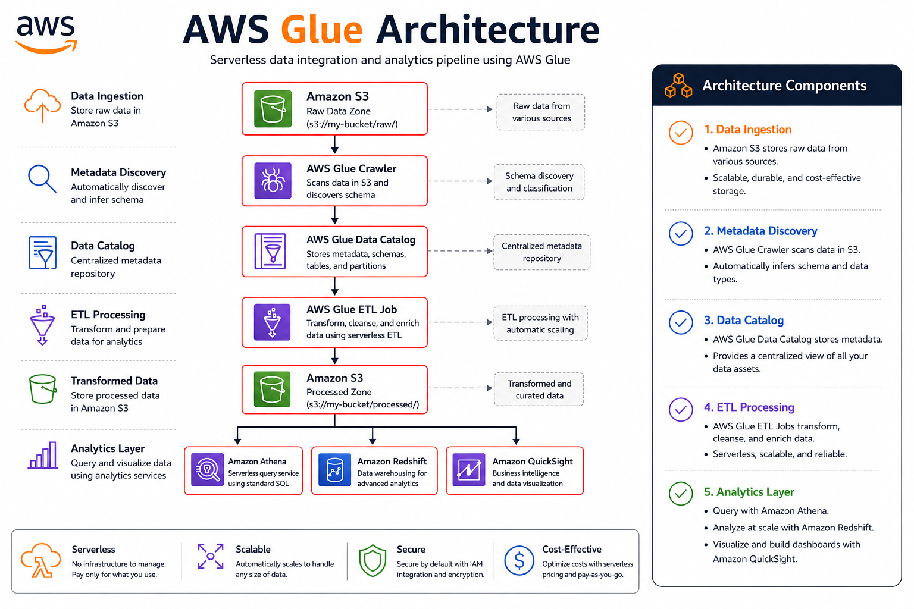
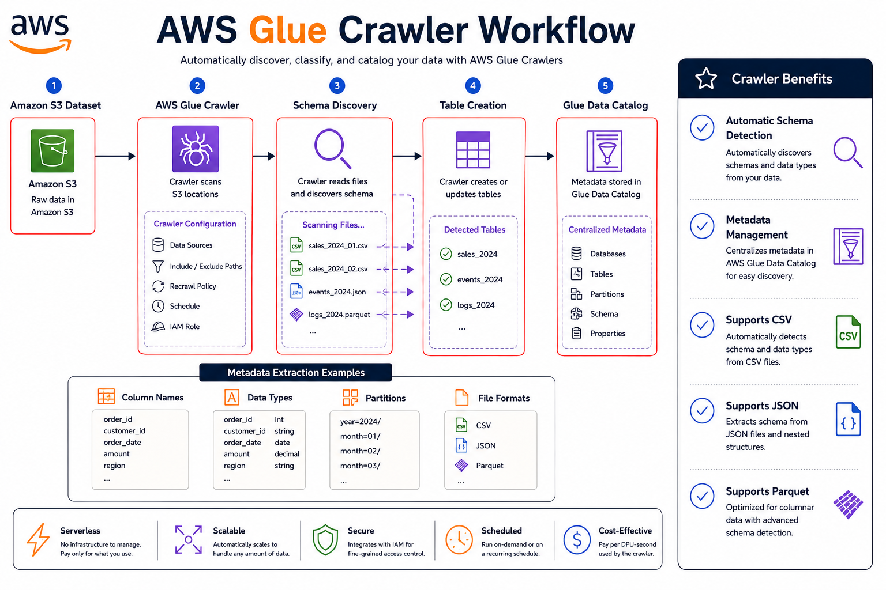
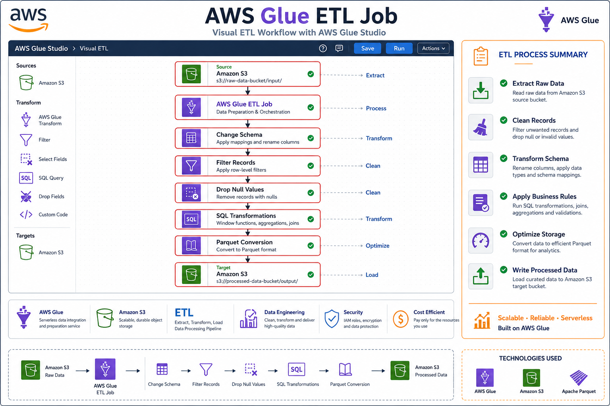
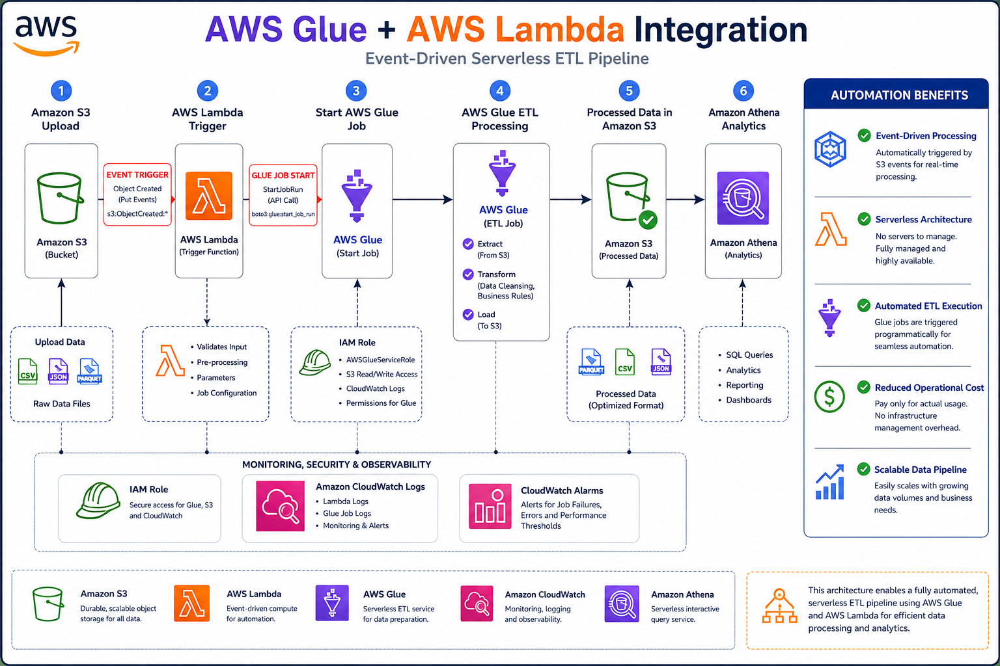

# 🔧 AWS Glue Fundamentals

⬅️ [Back to AWS Lambda](../04_AWS_Lambda/README.md)

---

# 📚 Table of Contents

* Introduction
* What is AWS Glue?
* Why Use AWS Glue?
* AWS Glue Components
* AWS Glue Architecture
* AWS Glue Workflow
* Glue Crawlers
* Glue Data Catalog
* Glue Jobs
* Glue Studio
* ETL vs AWS Glue
* Data Engineering Use Cases
* Best Practices
* Interview Questions
* Key Takeaways

---

# 📖 Introduction

AWS Glue is a fully managed serverless data integration service that makes it easy to discover, prepare, transform, and load data for analytics.

It helps Data Engineers build ETL (Extract, Transform, Load) pipelines without managing servers or infrastructure.

AWS Glue integrates seamlessly with:

* Amazon S3
* Amazon Athena
* Amazon Redshift
* AWS Lambda
* Amazon RDS
* DynamoDB

---

# 🔧 What is AWS Glue?

AWS Glue is a serverless ETL service that automates:

* Data Discovery
* Schema Detection
* Data Transformation
* Data Loading
* Metadata Management

Instead of provisioning servers, AWS Glue automatically scales resources based on workload requirements.



---

# 🎯 Why Use AWS Glue?

AWS Glue provides:

✅ Fully Managed ETL

✅ Serverless Architecture

✅ Automatic Scaling

✅ Built-in Data Catalog

✅ Apache Spark Support

✅ Easy Integration with AWS Services

---

# 🏗️ AWS Glue Architecture



---

# ⚙️ Core Components of AWS Glue

## 1️⃣ Glue Crawler

A crawler automatically scans data sources and identifies:

* Schema
* Data Types
* Partitions
* Tables

### Example

```text
customers.csv
orders.csv
products.csv
```

Crawler automatically creates metadata tables.

---

## 2️⃣ Glue Data Catalog

The Data Catalog acts as a centralized metadata repository.

Stores:

* Table Definitions
* Schema Information
* Partitions
* Data Locations

---

## 3️⃣ Glue Jobs

Glue Jobs perform ETL transformations.

Supports:

* PySpark
* Spark SQL
* Python Shell

---

## 4️⃣ Glue Studio

A visual interface for creating ETL jobs.

Features:

* Drag-and-Drop Design
* Visual Transformations
* Job Monitoring

---

# 🔄 AWS Glue Workflow

## Step 1

Raw files arrive in:

```text
Amazon S3
```

---

## Step 2

Crawler scans data.

Example:

```text
s3://company-data/raw/
```

---

## Step 3

Crawler creates tables in:

```text
Glue Data Catalog
```

---

## Step 4

Glue ETL Job reads data.

---

## Step 5

Transformations are applied.

Examples:

* Remove Null Values
* Filter Records
* Rename Columns
* Convert File Formats

---

## Step 6

Write processed data to:

```text
s3://company-data/processed/
```

---

## Step 7

Query data using:

* Amazon Athena
* Amazon Redshift

---

# 🚀 Creating a Glue Crawler



Navigate to:

```text
AWS Console → AWS Glue
```

---

## Create Crawler

Provide:

```text
Crawler Name:
customer-crawler
```

---

## Select Data Source

Example:

```text
s3://company-data/raw/
```

---

## Select IAM Role

Example:

```text
AWSGlueServiceRole
```

---

## Create Data Catalog Table

Crawler automatically generates metadata.

---

# 🛠️ Creating a Glue ETL Job



Navigate to:

```text
AWS Glue → ETL Jobs
```

Click:

```text
Create Job
```

---

## Configure

```text
Job Name:
customer-etl-job
```

Engine:

```text
Spark
```

Language:

```text
Python
```

---

# 🐍 Sample Glue PySpark Code

```python
from pyspark.sql import SparkSession

spark = SparkSession.builder.appName("ETL").getOrCreate()

df = spark.read.csv(
    "s3://company-data/raw/customers.csv",
    header=True
)

df_clean = df.dropDuplicates()

df_clean.write.mode("overwrite").parquet(
    "s3://company-data/processed/customers/"
)
```

---

# ⚔️ Traditional ETL vs AWS Glue

| Feature             | Traditional ETL | AWS Glue      |
| ------------------- | --------------- | ------------- |
| Infrastructure      | Managed by User | Serverless    |
| Scaling             | Manual          | Automatic     |
| Metadata Management | Separate Tool   | Built-in      |
| Maintenance         | High            | Low           |
| Cost                | Fixed           | Pay-As-You-Go |

---

# 🚀 Real-World Data Engineering Use Cases

## Data Lake Processing

```text
Amazon S3
     │
     ▼
Glue ETL
     │
     ▼
Parquet Files
     │
     ▼
Athena
```

---

## Log Processing

```text
Application Logs
        │
        ▼
Amazon S3
        │
        ▼
AWS Glue
        │
        ▼
Cleaned Data
```

---

## Data Warehouse Loading

```text
Raw Data
    │
    ▼
AWS Glue
    │
    ▼
Amazon Redshift
```

---

# 🔄 Glue + Lambda Integration

```text
File Uploaded
      │
      ▼
Amazon S3
      │
      ▼
AWS Lambda
      │
      ▼
Trigger Glue Job
      │
      ▼
ETL Processing
      │
      ▼
Processed Data
```

This pattern is widely used in Data Engineering projects.



---

# 💰 AWS Glue Pricing

AWS Glue pricing is based on:

* Data Processing Units (DPUs)
* Job Runtime
* Crawlers
* Data Catalog Storage

You only pay for resources consumed.

---

# 🛠️ Best Practices

✅ Use Parquet Format

✅ Partition Large Datasets

✅ Enable Job Bookmarking

✅ Use Glue Data Catalog

✅ Monitor Jobs with CloudWatch

✅ Optimize Spark Transformations

✅ Follow Least Privilege IAM Access

---

# 🎤 Interview Questions

### What is AWS Glue?

AWS Glue is a fully managed serverless ETL service.

### What is a Glue Crawler?

A service that automatically discovers schema and creates metadata tables.

### What is the Glue Data Catalog?

A centralized metadata repository used by AWS analytics services.

### Which processing engine does Glue use?

Apache Spark.

### What programming languages are supported?

* PySpark
* Python Shell
* Spark SQL

### Why is AWS Glue popular in Data Engineering?

Because it automates ETL development and integrates seamlessly with AWS analytics services.

### Difference Between Lambda and Glue?

| Lambda              | Glue                       |
| ------------------- | -------------------------- |
| Event Processing    | ETL Processing             |
| Short Running Tasks | Large Data Transformations |
| Python Runtime      | Spark Runtime              |

---

# 🏁 Key Takeaways

* AWS Glue is a fully managed serverless ETL service.
* Glue Crawlers automatically discover schemas.
* Glue Data Catalog stores metadata.
* Glue Jobs perform data transformations using Apache Spark.
* Glue integrates with S3, Athena, Lambda, and Redshift.
* Glue is widely used for Data Lake and Data Warehouse pipelines.
* Lambda often triggers Glue Jobs in production architectures.
* Understanding Glue is essential for Data Engineering interviews.

---

# 📚 Next Topic

➡️ [AWS Glue Setup](./01_AWS_Glue_Setup.md)