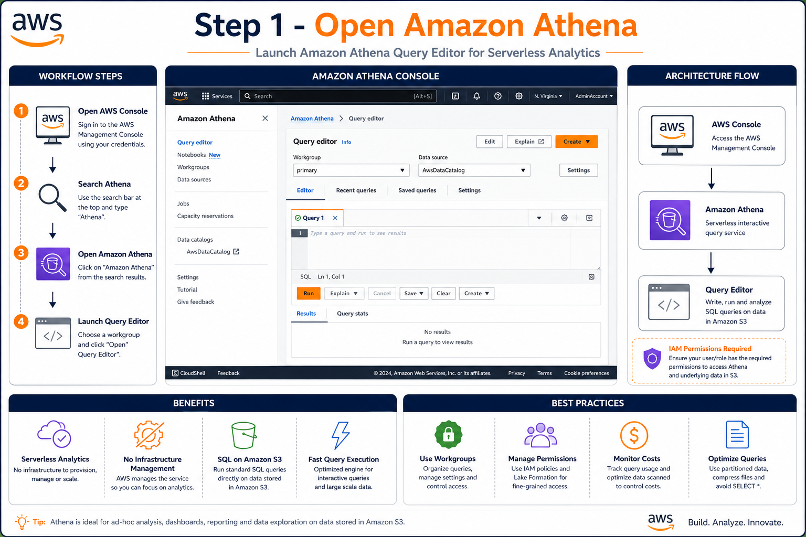
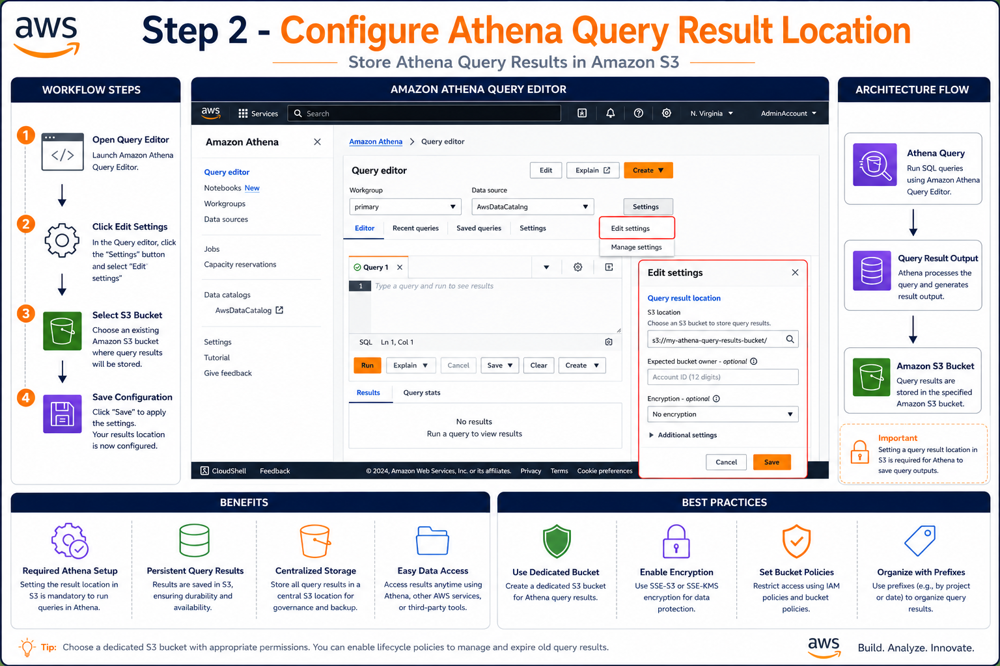
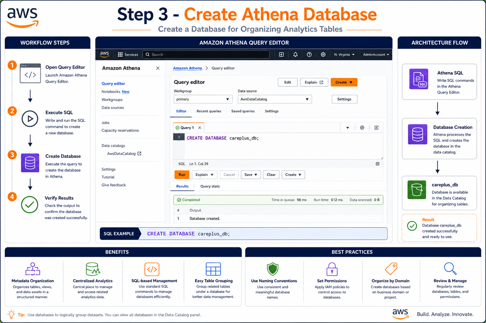
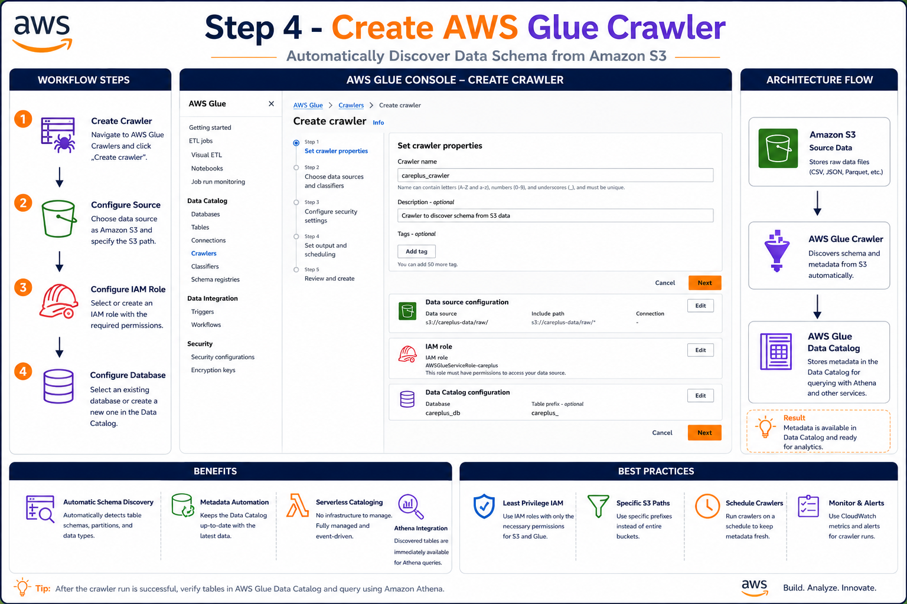
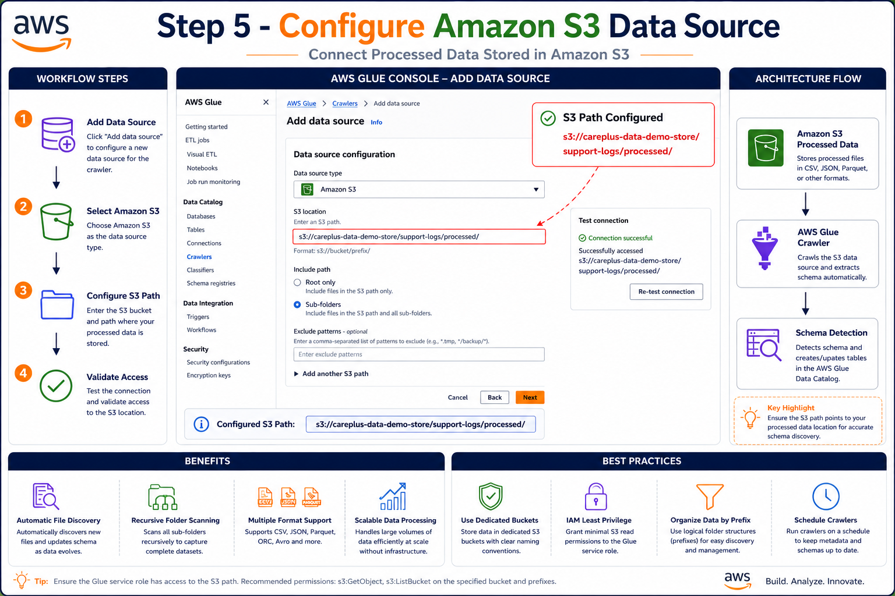
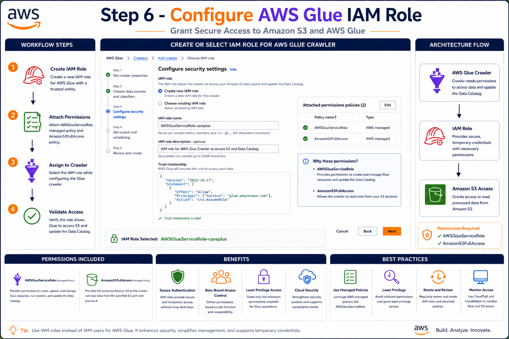
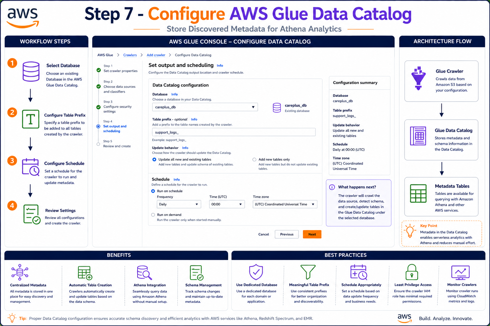
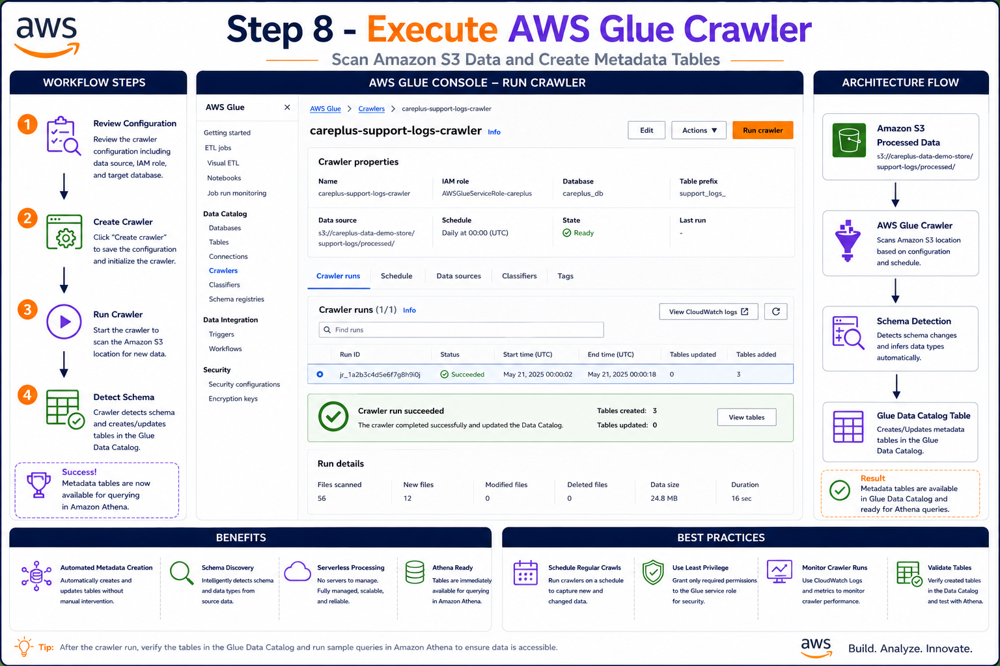
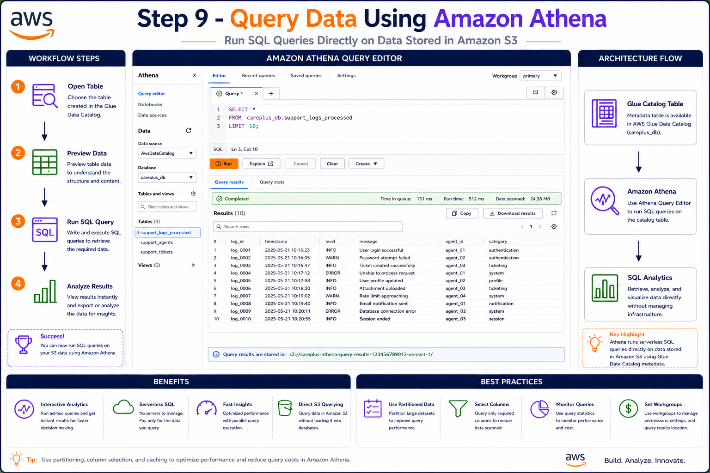

# 🔍 AWS Athena & AWS Glue Crawler Setup

This guide explains how to configure Amazon Athena and AWS Glue Crawlers to automatically discover schemas from processed data stored in Amazon S3 and query it using SQL.

---

## 📋 Overview

After processing support log data using AWS Glue ETL, the transformed Parquet files are stored in Amazon S3. AWS Glue Crawlers scan these files, infer their schema, and create metadata tables in the AWS Glue Data Catalog. Amazon Athena then uses these tables to run SQL queries directly against data stored in S3.

---

# 🏗️ Solution Architecture

```text
Amazon S3 (Processed Data)
            │
            ▼
     AWS Glue Crawler
            │
            ▼
   AWS Glue Data Catalog
            │
            ▼
      Amazon Athena
            │
            ▼
       SQL Analytics
```

---

# 🚀 Step 1: Open Amazon Athena

Navigate to the Amazon Athena service from the AWS Console.

### Workflow

1. Open AWS Console
2. Search Athena
3. Open Amazon Athena
4. Launch Query Editor

### Screenshot



### Outcome

✅ Athena Query Editor is ready for configuration.

---

# 🚀 Step 2: Configure Athena Query Result Location

Athena requires an S3 location where query results will be stored.

### Workflow

1. Open Query Editor
2. Click Edit Settings
3. Configure S3 Output Bucket
4. Save Settings

### Example S3 Path

```text
s3://careplus-athena-results/
```

### Screenshot



### Outcome

✅ Athena query results will be saved automatically to Amazon S3.

---

# 🚀 Step 3: Create Athena Database

Create a logical database for storing Glue Catalog tables.

### SQL Command

```sql
CREATE DATABASE careplus_db;
```

### Screenshot



### Outcome

✅ Database created successfully.

```text
careplus_db
```

---

# 🚀 Step 4: Create AWS Glue Crawler

Create a crawler to automatically discover the schema of processed files.

### Workflow

1. Open AWS Glue
2. Create Crawler
3. Configure Data Source
4. Configure IAM Role

### Screenshot



### Outcome

✅ New Glue Crawler created.

---

# 🚀 Step 5: Configure Amazon S3 Data Source

Specify the S3 location containing processed files.

### Source Path



### Workflow

1. Add Data Source
2. Select Amazon S3
3. Enter S3 Path
4. Validate Configuration

### Screenshot

```text
images/crawler/05-configure-s3-source.png
```

### Outcome

✅ Crawler can access processed data files.

---

# 🚀 Step 6: Configure AWS Glue IAM Role

Assign permissions required to access S3 and Data Catalog resources.

### IAM Role

```text
AWSGlueServiceRole-support-logs
```

### Required Permissions

* Amazon S3 Access
* AWS Glue Access
* CloudWatch Logs Access

### Screenshot



### Outcome

✅ Secure access configured.

---

# 🚀 Step 7: Configure Data Catalog Output

Specify where discovered tables should be stored.

### Configuration

Database:

```text
careplus_db
```

Table Prefix:

```text
support_logs_
```

Schedule:

```text
On Demand
```

### Screenshot



### Outcome

✅ Crawler output configured successfully.

---

# 🚀 Step 8: Run AWS Glue Crawler

Execute the crawler to scan files and generate metadata.

### Workflow

1. Review Configuration
2. Create Crawler
3. Run Crawler
4. Monitor Status

### Screenshot



### What Happens?

The crawler:

* Reads processed Parquet files
* Detects schema automatically
* Creates metadata tables
* Registers tables in Glue Data Catalog

### Outcome

✅ Metadata table created successfully.

Example Table:

```text
support_logs_processed
```

---

# 🚀 Step 9: Query Data Using Athena

After crawler execution, Athena can query the generated table.

### Example Query

```sql
SELECT *
FROM careplus_db.support_logs_processed
LIMIT 10;
```

### Screenshot



### Outcome

✅ Data queried successfully using SQL.

---

# 📊 Sample Athena Queries

## Total Records

```sql
SELECT COUNT(*)
FROM careplus_db.support_logs_processed;
```

---

## Average Response Time

```sql
SELECT
    AVG(response_time) AS avg_response_time
FROM careplus_db.support_logs_processed;
```

---

## Records by Log Level

```sql
SELECT
    log_level,
    COUNT(*) AS total_records
FROM careplus_db.support_logs_processed
GROUP BY log_level
ORDER BY total_records DESC;
```

---

## Top 10 Slowest Requests

```sql
SELECT
    ticket_id,
    response_time
FROM careplus_db.support_logs_processed
ORDER BY response_time DESC
LIMIT 10;
```

---

# 💰 Cost Considerations

### AWS Glue Crawler

Charges apply only when:

* Crawler runs
* Schema discovery is performed

No charges occur while the crawler is idle.

### Amazon Athena

Charges are based on:

* Data scanned per query

Using Parquet format significantly reduces query costs.

### Amazon S3

Charges apply for:

* Storage
* Requests
* Data transfer (if applicable)

---

# ✅ Benefits

### Amazon Athena

* Serverless SQL Analytics
* No Infrastructure Management
* Direct Querying on S3
* Pay-per-Query Model

### AWS Glue Crawler

* Automatic Schema Discovery
* Metadata Management
* Data Catalog Integration
* Athena Compatibility

### Combined Solution

* Fully Serverless
* Cost Effective
* Scalable
* Easy Analytics on Data Lake Architecture

---

# 🎯 Final Outcome

After completing this setup:

✅ Processed data stored in Amazon S3

✅ AWS Glue Crawler automatically discovers schema

✅ Metadata registered in AWS Glue Data Catalog

✅ Athena queries data directly from S3

✅ No database servers required

✅ Fully serverless analytics architecture implemented successfully
