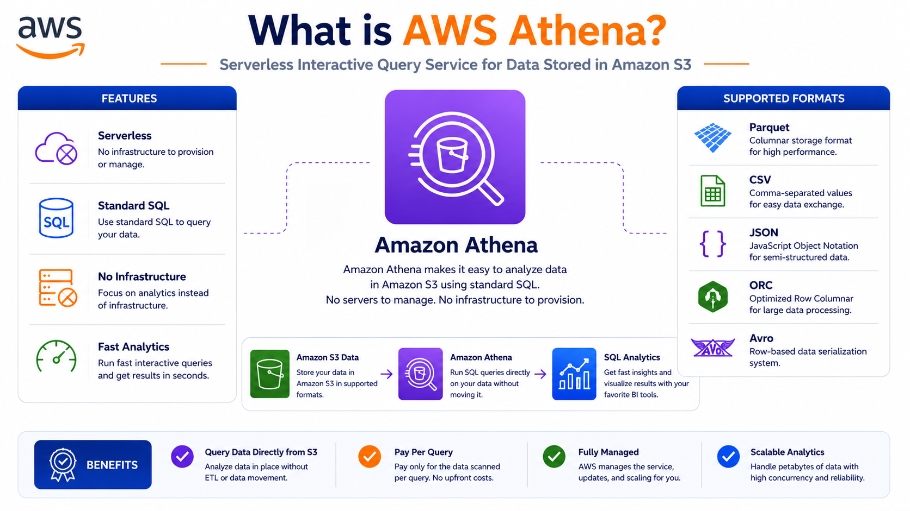
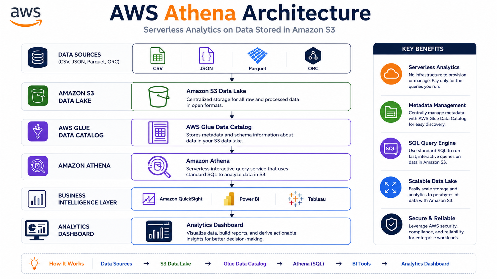
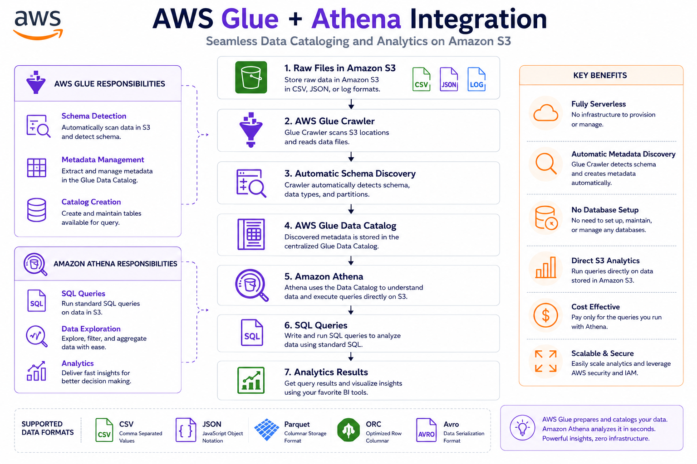
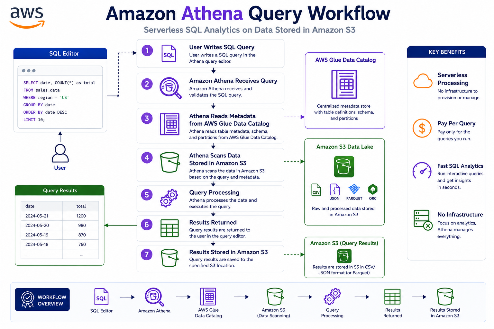

# 🔍 AWS Athena Fundamentals

⬅️ [Back to AWS Glue](../05_AWS_Glue/README.md)

---

# 📚 Table of Contents

* Introduction
* What is AWS Athena?
* Why Use Athena?
* How Athena Works
* Athena Architecture
* Supported File Formats
* Athena Workflow
* Creating Your First Athena Query
* Athena vs Traditional Databases
* When to Use Athena
* Data Engineering Use Cases
* Best Practices
* Interview Questions
* Key Takeaways

---

# 📖 Introduction

Amazon Athena is a serverless interactive query service that allows you to analyze data directly in Amazon S3 using standard SQL.

With Athena, there is no need to provision servers, manage databases, or build complex infrastructure. You simply point Athena to your data stored in Amazon S3 and start querying.

Athena is widely used in Data Engineering, Analytics, and Data Lake architectures.

---

# 🔍 What is AWS Athena?

AWS Athena is a serverless query service that lets you run standard SQL queries directly on data stored in Amazon S3.

Athena works on structured, semi-structured, and columnar file formats without requiring data to be loaded into a database.

### Key Features

✅ Serverless Architecture

✅ Standard SQL Support

✅ Direct Querying on S3

✅ No Infrastructure Management

✅ Pay Per Query

✅ Integration with AWS Glue Data Catalog



---

# 🎯 Why Use Athena?

Athena is useful because:

* No servers to manage
* Query data directly from S3
* Supports large datasets
* Easy integration with Data Lakes
* Fast setup and deployment
* Cost-effective analytics solution

---

# 🏗️ Athena Architecture



---

# ⚙️ How Athena Works



### Step 1

Store files in Amazon S3.

Examples:

```text
customers.csv
orders.json
sales.parquet
```

---

### Step 2

Use AWS Glue Crawler to discover schema.

---

### Step 3

Glue creates metadata tables in the Glue Data Catalog.

---

### Step 4

Athena reads metadata from the Data Catalog.

---

### Step 5

Run SQL queries directly on S3 files.

---

### Step 6

View results in Athena Console or BI tools.

---

# 📂 Supported File Formats

Athena supports multiple file formats.

| Format     | Type            |
| ---------- | --------------- |
| CSV        | Row-Based       |
| JSON       | Semi-Structured |
| Parquet    | Columnar        |
| ORC        | Columnar        |
| Avro       | Row-Based       |
| Text Files | Structured      |

---

# ⭐ Why Parquet is Preferred

Parquet is the most commonly used format with Athena because:

✅ Columnar Storage

✅ Faster Queries

✅ Better Compression

✅ Lower Query Cost

### Example

```text
CSV File Size      : 10 GB
Parquet File Size  : 2 GB

Athena scans less data
Lower Cost
Faster Performance
```

---

# 🔄 Athena Workflow

```text
Application Logs
      │
      ▼
Amazon S3
      │
      ▼
Glue Crawler
      │
      ▼
Glue Data Catalog
      │
      ▼
Athena SQL Query
      │
      ▼
Query Results
```

---

# 🚀 Creating Your First Athena Query



### Step 1

Navigate to:

```text
AWS Console → Athena
```

---

### Step 2

Choose the database created by Glue.

Example:

```text
support_logs_db
```

---

### Step 3

Select the table.

Example:

```text
support_logs
```

---

### Step 4

Run SQL Query

```sql
SELECT *
FROM support_logs
LIMIT 10;
```

---

### Example Query

Count total records:

```sql
SELECT COUNT(*)
FROM support_logs;
```

---

### Filter Records

```sql
SELECT *
FROM support_logs
WHERE priority = 'High';
```

---

# ⚔️ Athena vs Traditional Databases

| Feature        | Athena        | Traditional Database |
| -------------- | ------------- | -------------------- |
| Infrastructure | Serverless    | Managed Servers      |
| Storage        | Amazon S3     | Database Storage     |
| Query Language | SQL           | SQL                  |
| Scaling        | Automatic     | Manual               |
| Cost Model     | Pay Per Query | Pay for Resources    |
| Data Loading   | Not Required  | Required             |

---

# 🎯 When to Use Athena?

Athena is best suited for:

### Ad-Hoc Analysis

Quickly analyze data without creating a database.

Example:

```text
Sales Reports
Customer Analytics
Log Analysis
```

---

### Data Lake Analytics

Run SQL queries directly on Data Lake files stored in S3.

---

### Log Analysis

Analyze:

* Application Logs
* Server Logs
* Audit Logs
* Access Logs

---

### Exploring Large Datasets

Athena is ideal for exploring raw datasets stored in:

```text
Amazon S3
```

without loading them into a warehouse.

---

# 🚀 Data Engineering Use Cases

## Log Analytics

```text
Application Logs
       │
       ▼
Amazon S3
       │
       ▼
AWS Athena
       │
       ▼
SQL Analysis
```

---

## Data Lake Reporting

```text
CSV / JSON / Parquet
          │
          ▼
Amazon S3
          │
          ▼
AWS Athena
          │
          ▼
Power BI / Tableau
```

---

## ETL Validation

```text
AWS Glue
      │
      ▼
Processed Data
      │
      ▼
Athena Validation Queries
```

---

# 💰 Athena Pricing

Athena charges based on:

```text
Amount of Data Scanned
```

Example:

* Query scans 10 GB → Higher Cost
* Query scans 2 GB → Lower Cost

Using Parquet significantly reduces scanned data.

---

# 🛠️ Best Practices

✅ Use Parquet Format

✅ Partition Large Datasets

✅ Use Glue Catalog

✅ Avoid SELECT *

✅ Compress Data

✅ Filter Data Early

✅ Store Data in S3 Efficiently

---

# 🎤 Interview Questions

### What is AWS Athena?

AWS Athena is a serverless query service that allows SQL queries directly on data stored in Amazon S3.

### Does Athena require infrastructure management?

No. Athena is fully serverless.

### Which query language does Athena support?

Standard SQL.

### Which file formats does Athena support?

* CSV
* JSON
* Parquet
* ORC
* Avro

### Why is Parquet preferred in Athena?

Because it is a columnar format that improves performance and reduces query cost.

### How does Athena know the schema of S3 files?

Using the AWS Glue Data Catalog.

### When should Athena be used?

For ad-hoc analysis, log analytics, and querying Data Lake files stored in Amazon S3.

---

# 🏁 Key Takeaways

* AWS Athena queries data directly from Amazon S3.
* Athena is a fully serverless analytics service.
* Supports standard SQL.
* Works with CSV, JSON, Parquet, ORC, and Avro files.
* Integrates with AWS Glue Data Catalog.
* Ideal for Data Lakes and ad-hoc analysis.
* Parquet is the preferred format for performance and cost optimization.
* No infrastructure management is required.
---

# 📚 Next Topic

➡️ [AWS Athena Setup](./01_AWS_Athena_Setup.md)

➡️ [AWS Redshift](../07_AWS_Redshift/README.md)