# 🚀 Amazon Redshift Serverless Setup Guide

⬅️ [Back to AWS Reshift](./README.md)

This repository demonstrates how to configure Amazon Redshift Serverless, create databases and tables, load data from Amazon S3, and perform analytics using SQL queries.

---

# 🏗️ Architecture Overview

```text
Amazon S3
    ↓
IAM Role
    ↓
Amazon Redshift Serverless
    ↓
Database
    ↓
Tables
    ↓
COPY Command
    ↓
SQL Analytics
```

---

# 🚀 Step 1 – Open Amazon Redshift

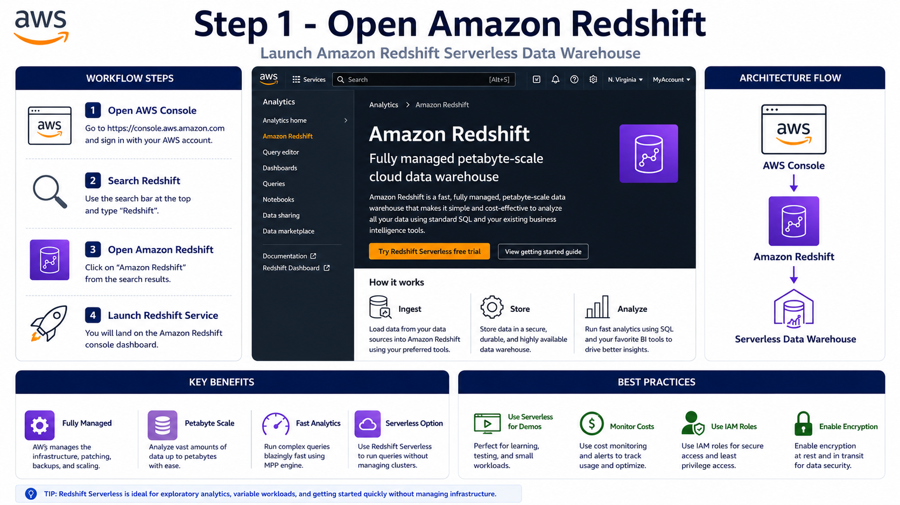

### 📋 Actions

1. Open AWS Console
2. Search Amazon Redshift
3. Open Redshift Service
4. Select Redshift Serverless

---

# 🚀 Step 2 – Configure Redshift Serverless

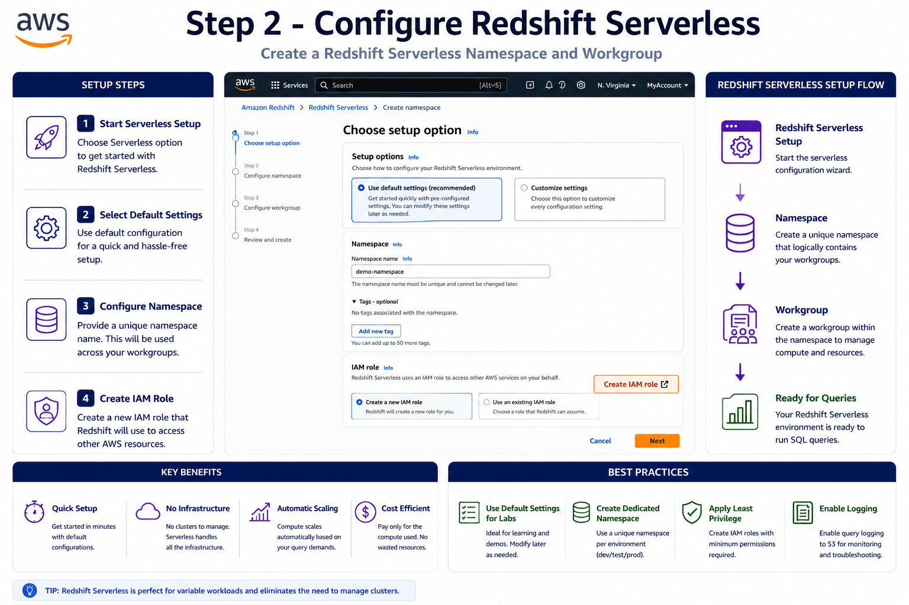

### 📋 Actions

1. Click Try Redshift Serverless
2. Use Default Settings
3. Configure Namespace
4. Continue Setup

---

# 🔐 Step 3 – Create IAM Role

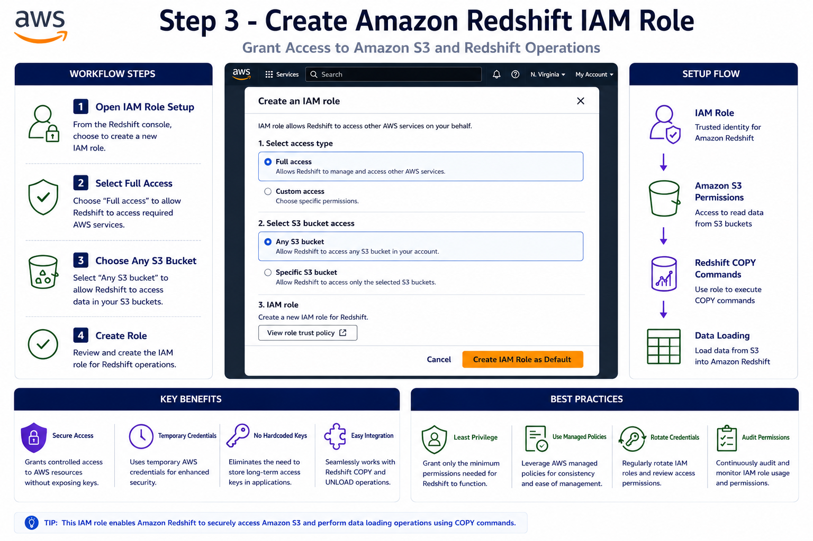

### 📋 Actions

1. Create IAM Role
2. Select Full Access
3. Allow Any S3 Bucket
4. Create Role

### 🎯 Purpose

* 📂 Read files from Amazon S3
* ⚡ Execute COPY commands
* 📊 Load Parquet, CSV, and JSON data

---

# ✅ Step 4 – Complete Redshift Setup

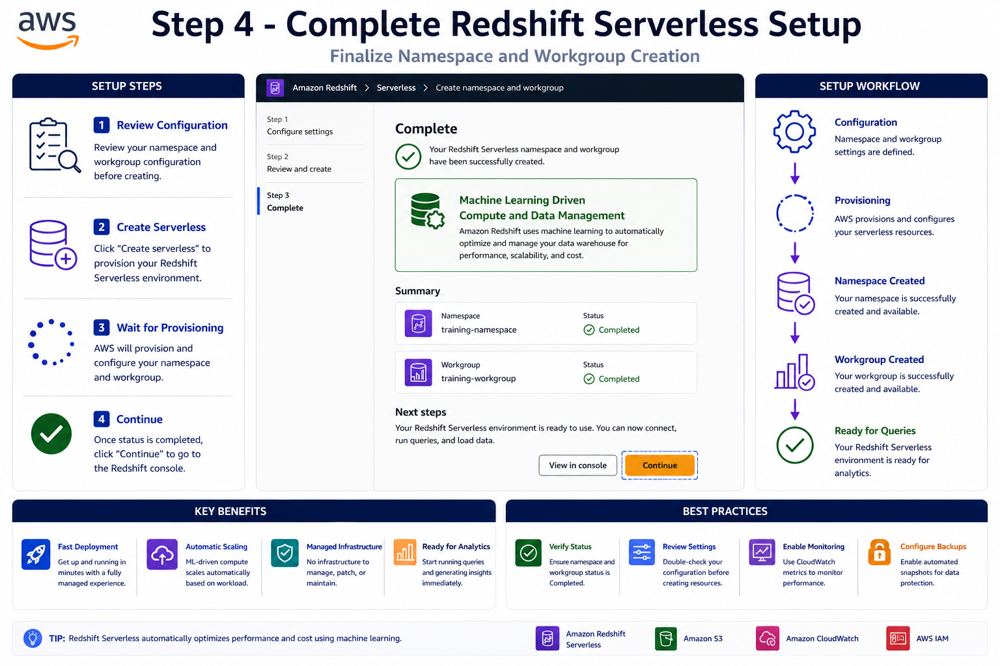

### 📋 Actions

1. Review Configuration
2. Wait for Provisioning
3. Verify Namespace Creation
4. Continue to Dashboard

---

# 📊 Step 5 – Open Namespace Dashboard

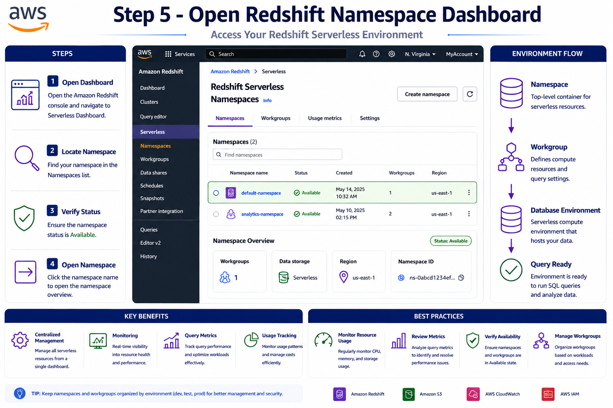

### 📋 Actions

1. Open Dashboard
2. Verify Namespace
3. Verify Workgroup
4. Confirm Status Available

---

# 🖥️ Step 6 – Open Query Editor v2

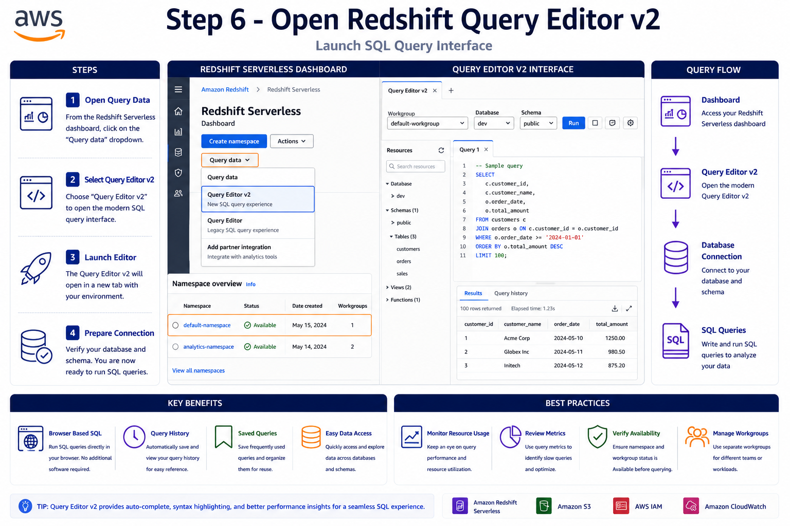

### 📋 Actions

1. Click Query Data
2. Select Query Editor v2
3. Open SQL Workspace

---

# 🔗 Step 7 – Connect Query Editor

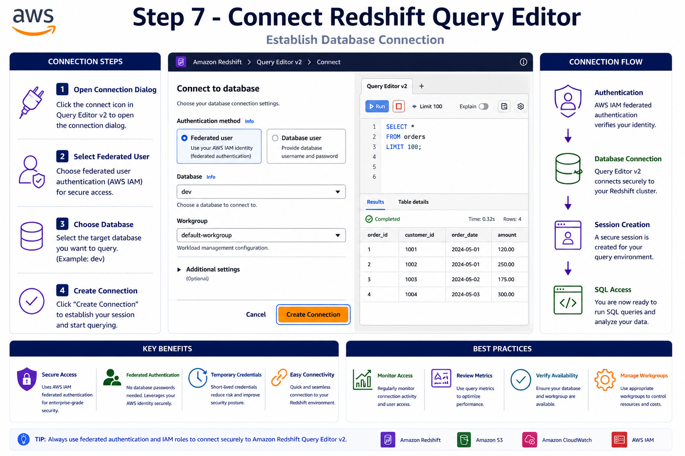

### 📋 Actions

1. Select Federated User
2. Choose Database
3. Create Connection

---

# 🗄️ Step 8 – Create Database

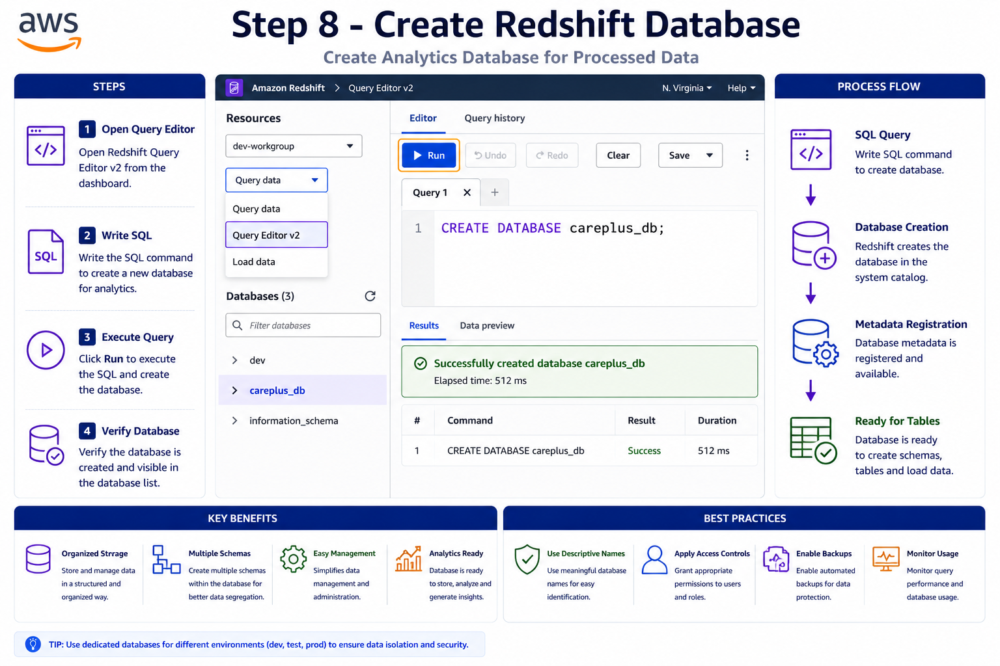

### SQL

```sql
CREATE DATABASE careplus_db;
```

### ✅ Result

Database created successfully.

---

# 📋 Step 9 – Create Table

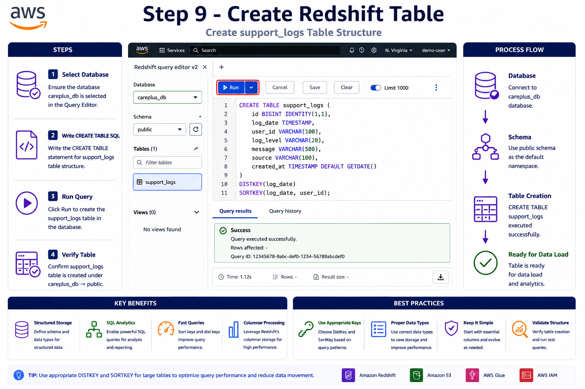

### SQL

```sql
CREATE TABLE public.support_logs (
    timestamp TIMESTAMP,
    log_level VARCHAR(20),
    component VARCHAR(100),
    ticket_id VARCHAR(50),
    session_id VARCHAR(50),
    ip VARCHAR(45),
    response_time BIGINT,
    cpu DOUBLE PRECISION,
    event_type VARCHAR(50),
    error BOOLEAN,
    user_agent VARCHAR(300),
    message VARCHAR(1000),
    debug VARCHAR(1000)
);
```

### ✅ Result

Table created successfully.

---

# 📂 Step 10 – Load Data from Amazon S3

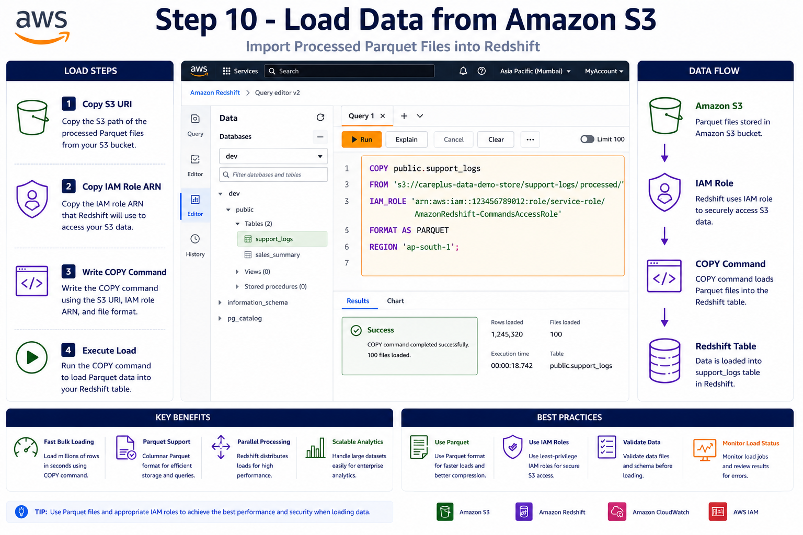

### SQL

```sql
COPY public.support_logs
FROM 's3://careplus-data-demo-store/support-logs/processed/'
IAM_ROLE 'arn:aws:iam::<ACCOUNT_ID>:role/service-role/AmazonRedshift-CommandsAccessRole'
FORMAT AS PARQUET
REGION 'ap-south-1';
```

### ✅ Result

Data loaded successfully.

---

# 🔍 Step 11 – Query Data

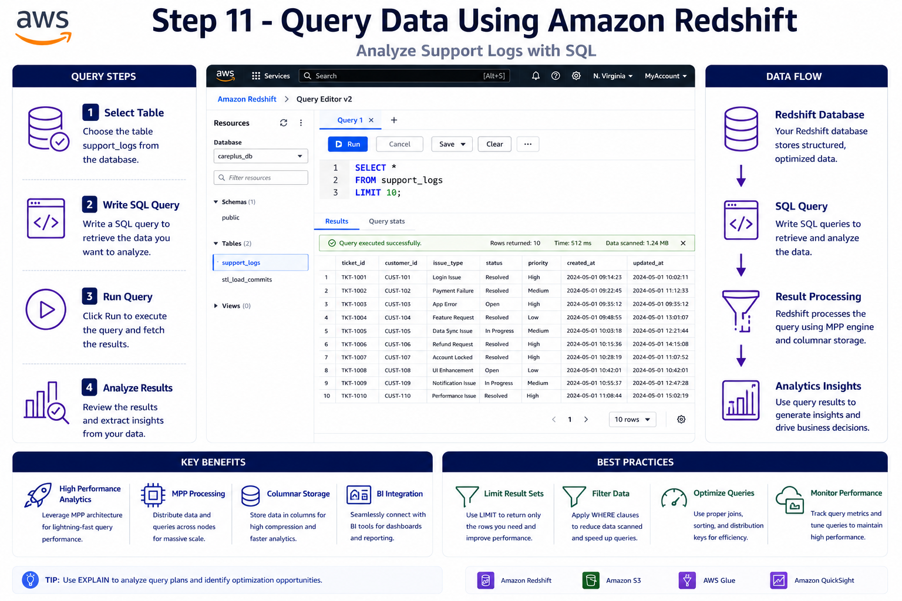

### Sample Query

```sql
SELECT *
FROM support_logs
LIMIT 10;
```

### 📈 Analytics Query

```sql
SELECT
    log_level,
    COUNT(*) AS total_logs
FROM support_logs
GROUP BY log_level
ORDER BY total_logs DESC;
```

---

# ⚡ Performance Optimization Tips

### 📦 Use Columnar Storage

Reduce disk I/O and improve query performance.

### 🗜️ Use Compression

Reduce storage costs.

### 🔄 Use Distribution Keys

Distribute data efficiently.

### 📑 Use Sort Keys

Improve filtering and joins.

### 📊 Use Parquet Format

Optimize storage and query speed.

---

# 🔒 Security Best Practices

* 🔐 Use IAM Roles
* 🔑 Enable Encryption
* 🌐 Enable SSL
* 🛡️ Restrict Security Groups
* 📋 Apply Least Privilege Access

---

# 💰 Cost Optimization

* ⚡ Use Redshift Serverless
* ⏸️ Stop Unused Resources
* 🗜️ Compress Data
* 📂 Store Raw Data in S3
* 📊 Load Curated Data Only

---

# 🧹 Cleanup Resources

1. Delete Workgroup
2. Delete Namespace
3. Remove IAM Role
4. Delete Test Data

---

# 🛠️ Technologies Used

* 🔴 Amazon Redshift Serverless
* 🪣 Amazon S3
* 🔐 AWS IAM
* 📝 SQL
* 📊 Parquet
* 🖥️ Query Editor v2

---

# 🎯 Learning Outcomes

After completing this guide you will be able to:

✅ Create Redshift Serverless

✅ Configure IAM Roles

✅ Create Databases

✅ Create Tables

✅ Load Data from Amazon S3

✅ Execute SQL Analytics

✅ Apply Redshift Best Practices

---
