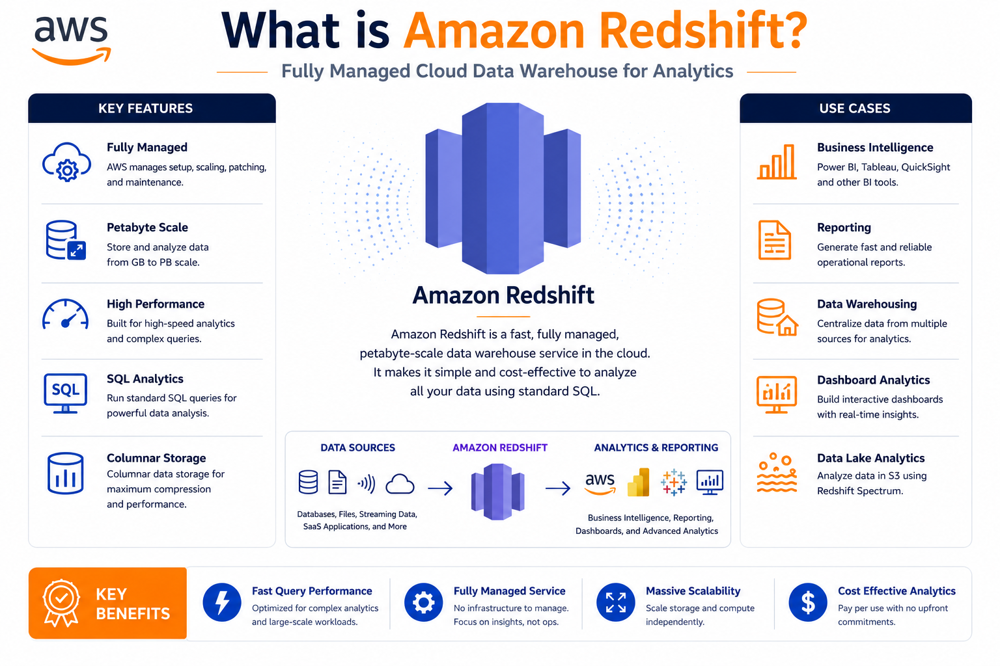
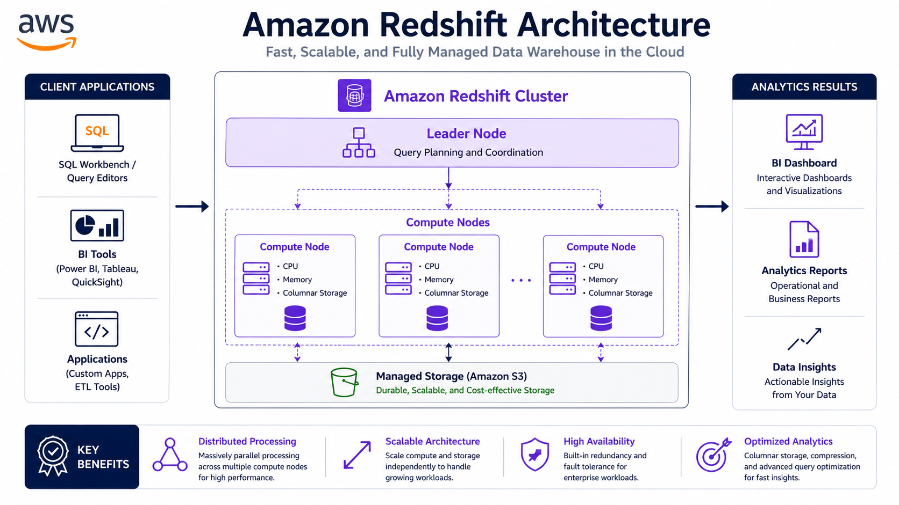
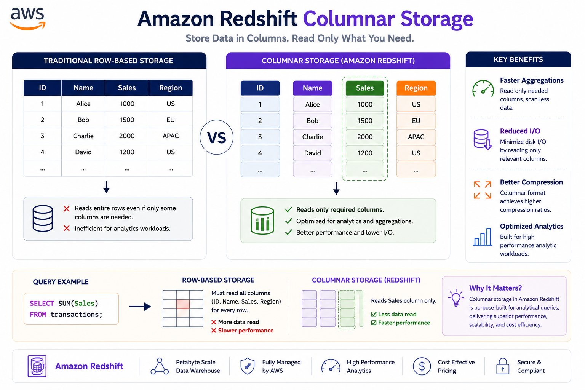
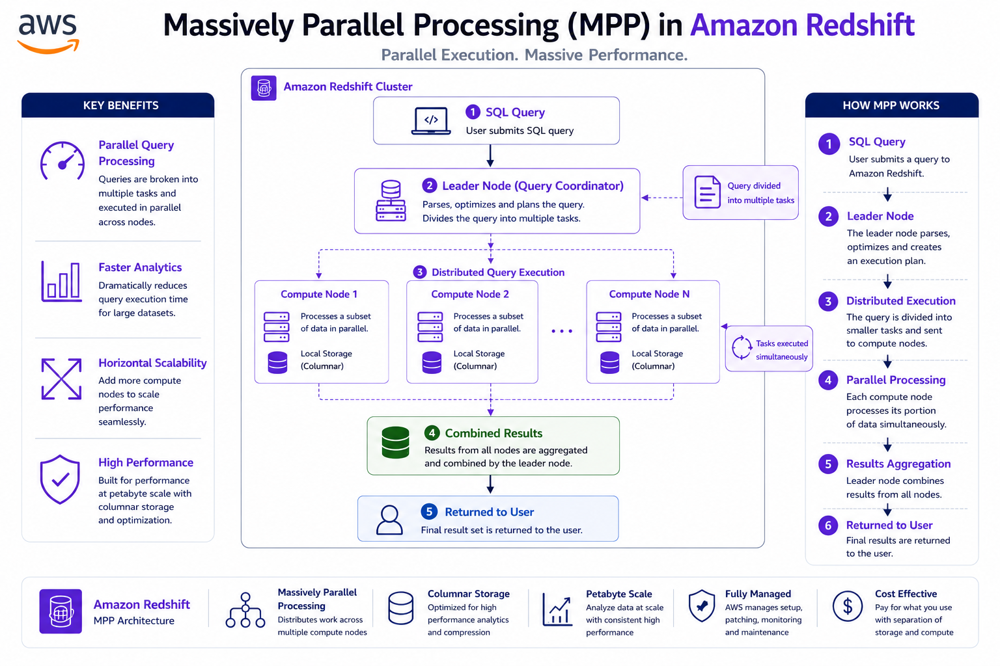
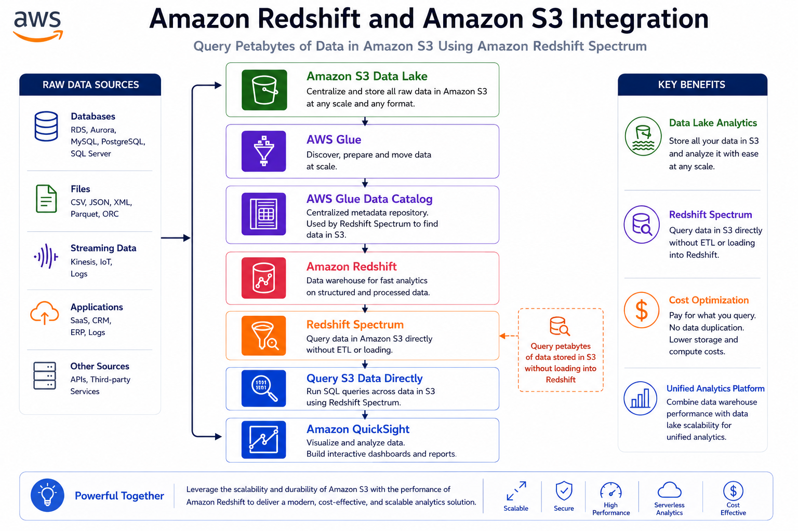
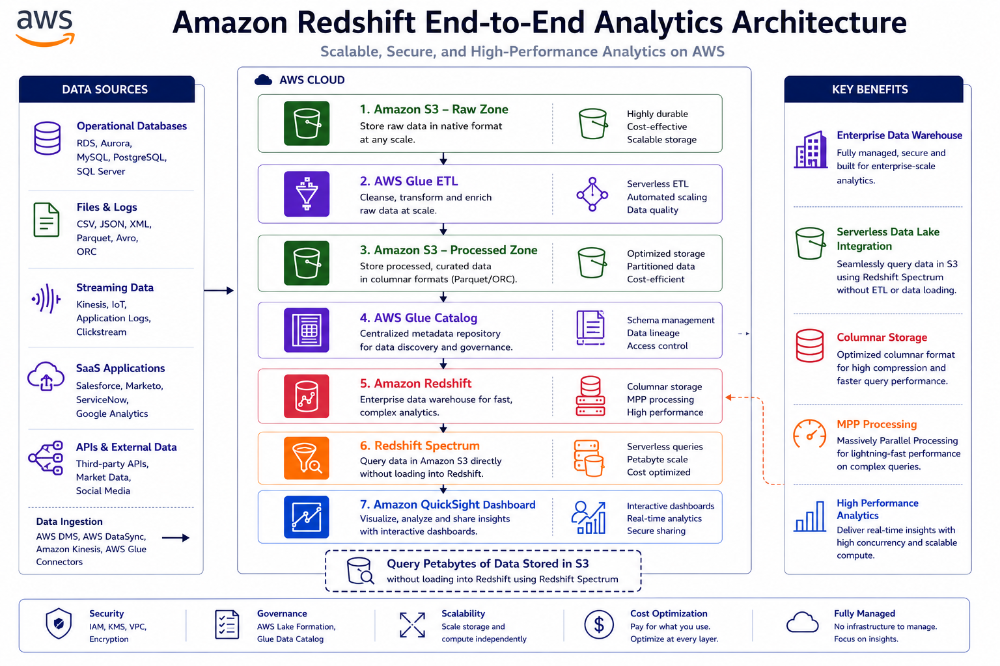

# 🏢 AWS Redshift Fundamentals

⬅️ [Back to AWS Athena](../06_AWS_Athena/README.md)

---

# 📚 Table of Contents

* Introduction
* What is Amazon Redshift?
* Why Use Redshift?
* How Redshift Works
* Redshift Architecture
* Columnar Storage
* Massively Parallel Processing (MPP)
* Redshift Cluster Components
* Redshift and S3 Integration
* Redshift vs Traditional RDBMS
* Data Engineering Use Cases
* Best Practices
* Interview Questions
* Key Takeaways

---

# 📖 Introduction

Amazon Redshift is a fully managed cloud Data Warehouse service provided by AWS.

It is designed for large-scale analytics and business intelligence workloads, enabling organizations to analyze terabytes to petabytes of data efficiently using SQL.

Unlike traditional databases that focus on transaction processing (OLTP), Redshift is optimized for Online Analytical Processing (OLAP).

---

# 🏢 What is Amazon Redshift?

Amazon Redshift is a managed Data Warehouse service that allows users to store and analyze massive amounts of structured and semi-structured data.

Redshift automatically handles:

* Infrastructure Provisioning
* Backups
* Monitoring
* Scaling
* Maintenance

This allows Data Engineers and Analysts to focus on analytics rather than infrastructure management.



---

# 🎯 Why Use Redshift?

Amazon Redshift provides:

✅ Fully Managed Service

✅ High Performance Analytics

✅ Columnar Storage

✅ Massively Parallel Processing (MPP)

✅ Automatic Backups

✅ Easy Scalability

✅ Integration with AWS Ecosystem

---

# ⚙️ Key Features of Redshift

### Managed Service

AWS automatically manages:

* Cluster Provisioning
* Maintenance
* Backups
* Monitoring
* Scaling

No server administration is required.

---

### Columnar Storage

Unlike traditional databases that store data row-by-row, Redshift stores data column-by-column.

Benefits:

* Faster analytical queries
* Better compression
* Reduced storage costs

---

### Massively Parallel Processing (MPP)

Redshift uses MPP architecture.

Large SQL queries are broken into smaller tasks and distributed across multiple nodes.

This enables parallel execution and significantly improves performance.

---

### Scalability

Redshift can scale from:

```text
Gigabytes
     ↓
Terabytes
     ↓
Petabytes
```

Additional nodes can be added as data volume grows.

---

# 🏗️ Redshift Architecture



---

# 📊 Columnar Storage



## Traditional Row-Based Storage

```text
ID | Name | Salary

1 | John  | 50000
2 | Alice | 60000
```

Stored as:

```text
1,John,50000
2,Alice,60000
```

---

## Redshift Columnar Storage

Stored as:

```text
ID Column
---------
1
2

Name Column
-----------
John
Alice

Salary Column
-------------
50000
60000
```

---

## Benefits

✅ Faster Queries

✅ Better Compression

✅ Lower Storage Costs

✅ Optimized Analytics

---

# ⚡ Massively Parallel Processing (MPP)



MPP is one of Redshift's most powerful features.

Instead of processing a query on a single server:

```sql
SELECT SUM(revenue)
FROM sales;
```

Redshift distributes the query across multiple compute nodes.

---

## Traditional Database

```text
Single Server
      │
      ▼
Query Execution
```

---

## Redshift MPP

```text
Query
   │
   ▼
Leader Node
   │
   ▼
 ┌──────┬──────┬──────┐
 ▼      ▼      ▼
Node1  Node2  Node3
 └──────┴──────┴──────┘
        │
        ▼
     Result
```

---

## Benefits

✅ Parallel Processing

✅ Faster Query Performance

✅ Handles Massive Datasets

---

# 🏗️ Redshift Cluster Components

## Leader Node

Responsible for:

* Query Parsing
* Query Planning
* Result Aggregation

---

## Compute Nodes

Responsible for:

* Data Storage
* Query Processing

---

## Architecture

```text
Client
   │
   ▼
Leader Node
   │
   ▼
 ┌──────────────┐
 │ Compute Node │
 │ Compute Node │
 │ Compute Node │
 └──────────────┘
```

---

# 🔄 Redshift and Amazon S3 Integration



---

## Querying Data in S3

Redshift Spectrum allows Redshift to query data directly from S3 without loading it into Redshift tables.

Benefits:

* Reduced Storage Costs
* Faster Access to Data Lake Data
* Hybrid Analytics

---

# 🚀 Typical Data Engineering Workflow

```text
CSV / JSON Files
        │
        ▼
Amazon S3
        │
        ▼
AWS Glue ETL
        │
        ▼
Parquet Files
        │
        ▼
Amazon Redshift
        │
        ▼
Power BI / Tableau
```
---
## 🏗️ Amazon Redshift End-to-End Analytics Architecture



This architecture demonstrates how data flows from source systems through Amazon S3 and AWS Glue into Amazon Redshift, enabling enterprise-scale analytics and dashboarding through Amazon QuickSight.

### Benefits

* ✅ Enterprise Data Warehouse
* ✅ Serverless Data Lake Integration
* ✅ Columnar Storage
* ✅ MPP Processing
* ✅ High Performance Analytics

---

# ⚔️ Redshift vs Traditional RDBMS

| Feature             | Amazon Redshift         | Traditional RDBMS (MySQL, Oracle) |
| ------------------- | ----------------------- | --------------------------------- |
| Purpose             | Analytics (OLAP)        | Transactions (OLTP)               |
| Storage             | Columnar                | Row-Based                         |
| Query Type          | Complex Analytics       | Transactional Queries             |
| Scaling             | Petabyte Scale          | Limited Vertical Scaling          |
| Parallel Processing | MPP                     | Limited                           |
| Data Volume         | TB to PB                | GB to TB                          |
| Performance         | Optimized for Analytics | Optimized for Transactions        |
| S3 Integration      | Native                  | Limited                           |
| Infrastructure      | Managed                 | User Managed                      |

---

# 🎯 When to Use Redshift?

Use Amazon Redshift when:

### Data Warehousing

Store and analyze large datasets.

---

### Business Intelligence

Support:

* Power BI
* Tableau
* QuickSight

---

### Historical Reporting

Analyze years of historical data.

---

### Enterprise Analytics

Run complex SQL queries across massive datasets.

---

### Data Lake Analytics

Integrate with Amazon S3 and query Data Lake data.

---

# 🚀 Data Engineering Use Cases

## Sales Analytics

```text
Sales Data
      │
      ▼
Amazon Redshift
      │
      ▼
Revenue Reports
```

---

## Customer Analytics

```text
Customer Data
       │
       ▼
Redshift
       │
       ▼
Customer Insights
```

---

## Data Warehouse

```text
S3
 │
 ▼
Glue ETL
 │
 ▼
Redshift
 │
 ▼
BI Dashboard
```

---

# 🛠️ Best Practices

✅ Use Parquet Files

✅ Compress Data

✅ Choose Appropriate Distribution Keys

✅ Use Sort Keys

✅ Monitor Query Performance

✅ Use Redshift Spectrum for Data Lake Queries

✅ Avoid Loading Unnecessary Data

---

# 🎤 Interview Questions

### What is Amazon Redshift?

Amazon Redshift is a fully managed cloud Data Warehouse service designed for analytical workloads.

### Why is Redshift faster than traditional databases?

Because it uses:

* Columnar Storage
* Massively Parallel Processing (MPP)

### What is MPP?

Massively Parallel Processing distributes queries across multiple nodes for faster execution.

### What is Redshift Spectrum?

A feature that allows Redshift to query data directly from Amazon S3.

### Is Redshift OLTP or OLAP?

OLAP (Online Analytical Processing).

### What storage model does Redshift use?

Columnar Storage.

### Can Redshift scale to petabytes?

Yes, Redshift can scale to petabytes by adding compute nodes.

---

# 🏁 Key Takeaways

* Amazon Redshift is a fully managed cloud Data Warehouse.
* Uses Columnar Storage for high-performance analytics.
* Uses Massively Parallel Processing (MPP) for fast query execution.
* Automatically handles backups, scaling, and maintenance.
* Integrates with Amazon S3 and AWS Glue.
* Redshift Spectrum enables querying S3 data directly.
* Optimized for OLAP workloads and business intelligence.
* Commonly used for enterprise-scale analytics and reporting.

---

# 📚 Next Topic

➡️ [AWS Redshit Setup](./01_AWS_Redshift_Setup.md)