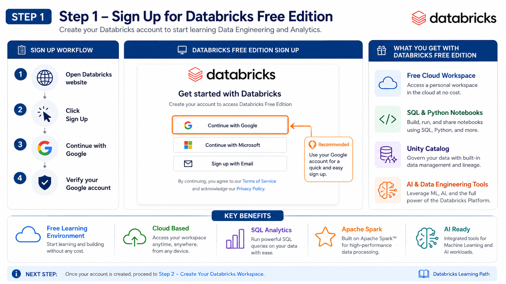
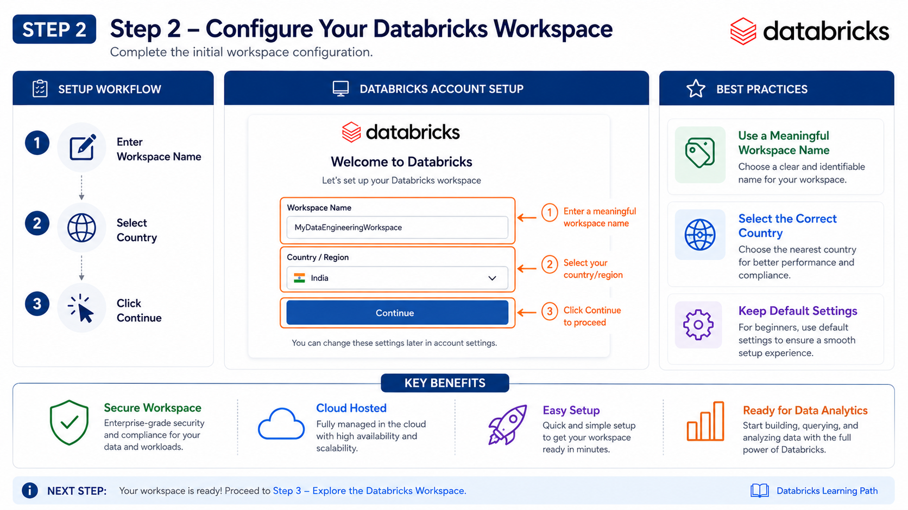
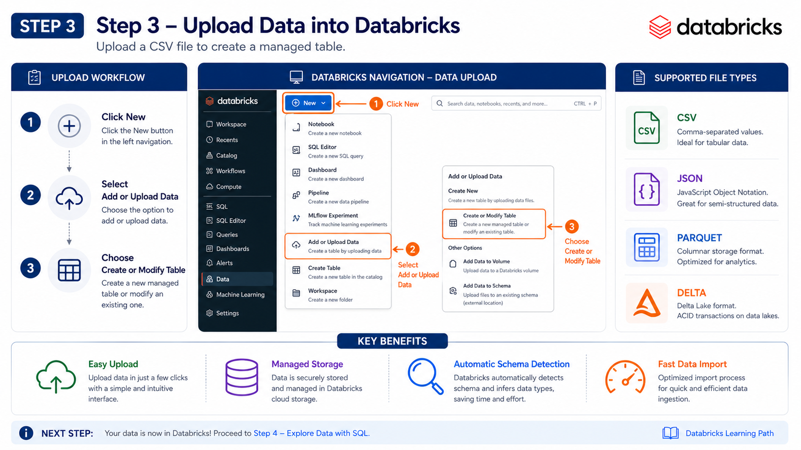
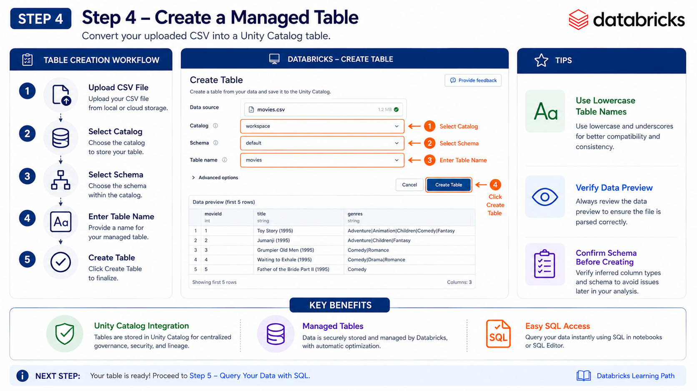
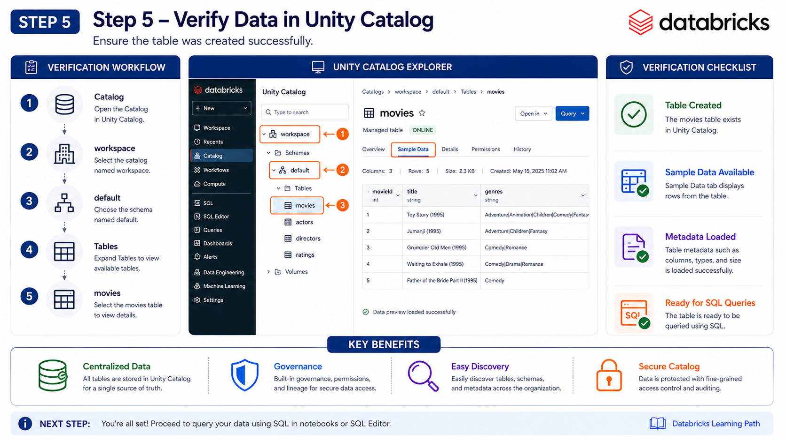
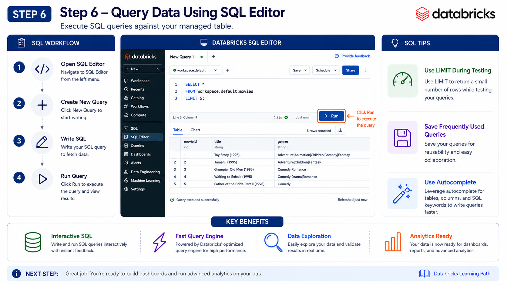
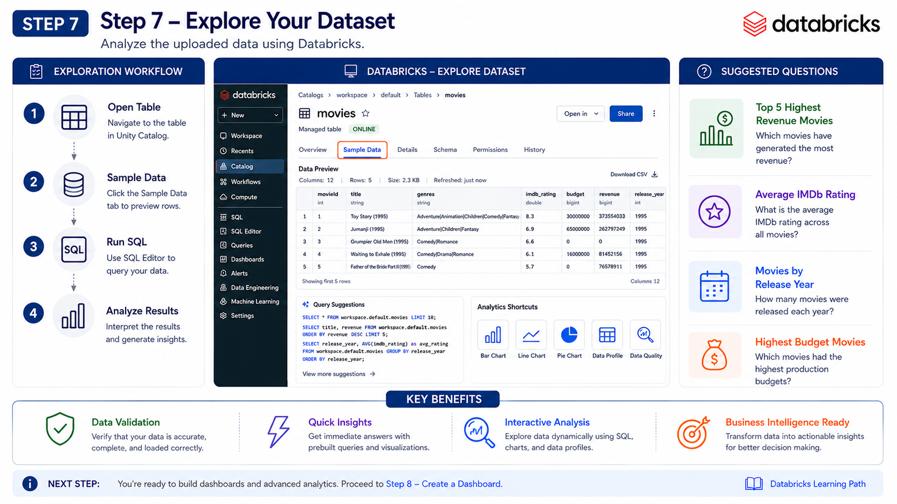
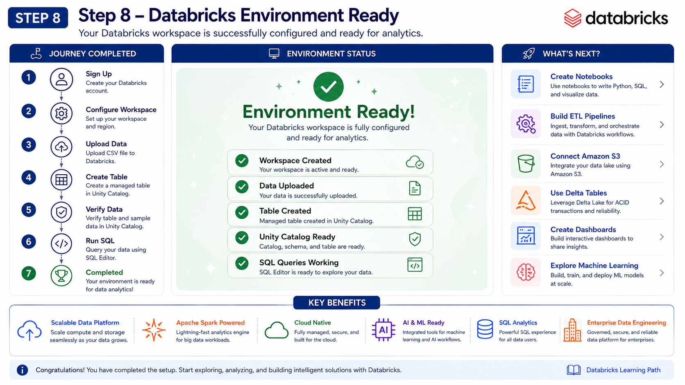

# 🚀 Databricks Free Edition Setup Guide


⬅️ [Back to Databricks](README.md)

A step-by-step guide to setting up **Databricks Free Edition**, uploading a dataset, creating a managed table, and querying data using Databricks SQL.

---

# 📚 Table of Contents

* Overview
* Prerequisites
* Step 1 – Sign Up for Databricks
* Step 2 – Configure Workspace
* Step 3 – Upload Dataset
* Step 4 – Create a Managed Table
* Step 5 – Verify the Table
* Step 6 – Run SQL Queries
* Step 7 – Explore Your Data
* Step 8 – Setup Complete
* Troubleshooting

---

# 📖 Overview

This tutorial helps beginners set up a **Databricks Free Edition** workspace and perform their first data analytics workflow.

After completing this guide, you will be able to:

* ✅ Create a Databricks account
* ✅ Configure your workspace
* ✅ Upload CSV datasets
* ✅ Create Unity Catalog managed tables
* ✅ Browse uploaded data
* ✅ Execute SQL queries
* ✅ Explore datasets

---

# 📋 Prerequisites

Before starting, ensure you have:

* Google or Microsoft account
* Modern web browser
* CSV dataset (Example: `movies.csv`)
* Internet connection

---

# Step 1 – Sign Up for Databricks Free Edition

Create your Databricks account using Google authentication.

### Steps

1. Open the Databricks Free Edition website.
2. Click **Continue with Google**.
3. Sign in using your Google account.
4. Wait for your workspace to be created.

### Screenshot

<p align="center">

</p>

---

# Step 2 – Configure Your Workspace

Configure your Databricks workspace before importing data.

### Steps

1. Enter your workspace name.
2. Select your country or region.
3. Click **Continue**.

### Screenshot

<p align="center">

</p>

---

# Step 3 – Upload Your Dataset

Import your CSV dataset into Databricks.

### Steps

1. Click **New**.
2. Select **Add or Upload Data**.
3. Choose **Create or Modify Table**.
4. Upload your CSV file.

Supported formats include:

* CSV
* JSON
* Parquet
* Delta

### Screenshot

<p align="center">

</p>

---

# Step 4 – Create a Managed Table

Configure the table before importing the dataset.

### Table Configuration

| Property   | Value     |
| ---------- | --------- |
| Catalog    | workspace |
| Schema     | default   |
| Table Name | movies    |

### Steps

1. Verify the uploaded file preview.
2. Select the catalog.
3. Select the schema.
4. Enter the table name.
5. Click **Create Table**.

### Screenshot

<p align="center">

</p>

---

# Step 5 – Verify the Uploaded Table

Confirm that the managed table was created successfully.

Navigate to:

```text
Catalog
└── workspace
    └── default
        └── Tables
            └── movies
```

Open **Sample Data** to preview the imported records.

### Screenshot

<p align="center">

</p>

---

# Step 6 – Run SQL Queries

Open the SQL Editor and execute your first query.

```sql
SELECT *
FROM workspace.default.movies
LIMIT 5;
```

The first five rows of the dataset should be displayed.

### Screenshot

<p align="center">

</p>

---

# Step 7 – Explore Your Dataset

Use Databricks to inspect and analyze the uploaded data.

You can:

* Browse sample records
* Filter data
* Execute additional SQL queries
* Validate imported data
* Explore table metadata

### Screenshot

<p align="center">

</p>

---

# Step 8 – Setup Complete 🎉

Congratulations!

Your Databricks environment is now fully configured.

You have successfully:

* ✅ Created a Databricks account
* ✅ Configured your workspace
* ✅ Uploaded a dataset
* ✅ Created a managed table
* ✅ Verified the imported data
* ✅ Executed SQL queries
* ✅ Explored the dataset

### Screenshot

<p align="center">

</p>

---

# 🛠 Troubleshooting

| Issue             | Solution                                                          |
| ----------------- | ----------------------------------------------------------------- |
| Unable to sign in | Verify your Google/Microsoft account and try again.               |
| Upload failed     | Ensure the file is in CSV format and refresh the page.            |
| Table not visible | Refresh Unity Catalog and confirm the correct catalog and schema. |
| SQL query error   | Verify the table name and ensure the SQL warehouse is running.    |

