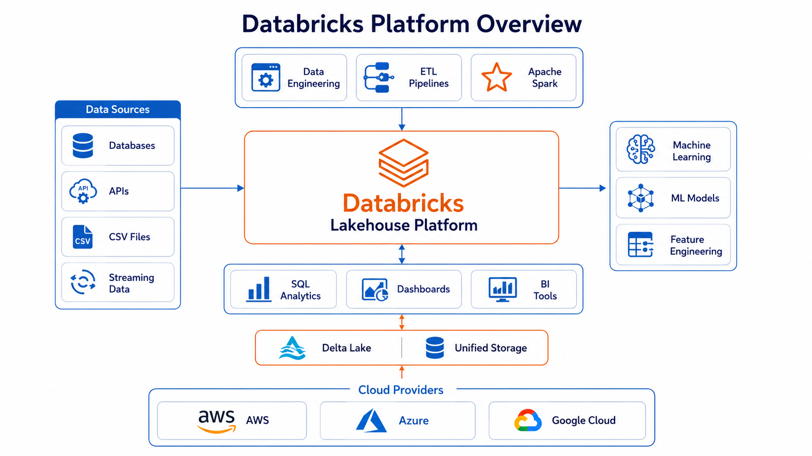
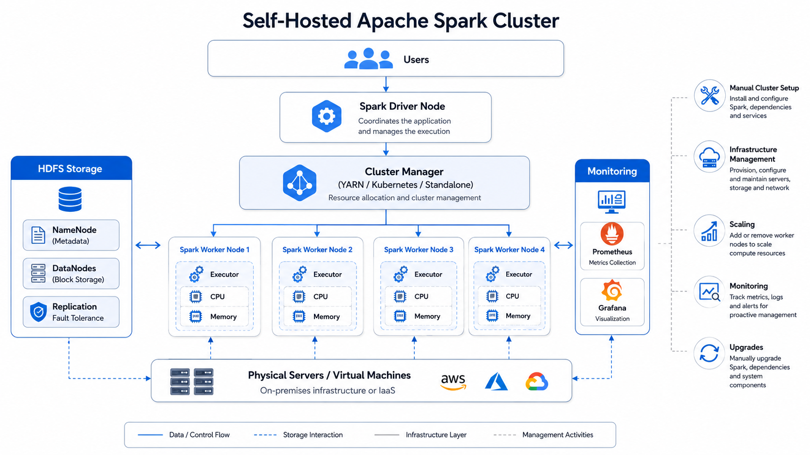
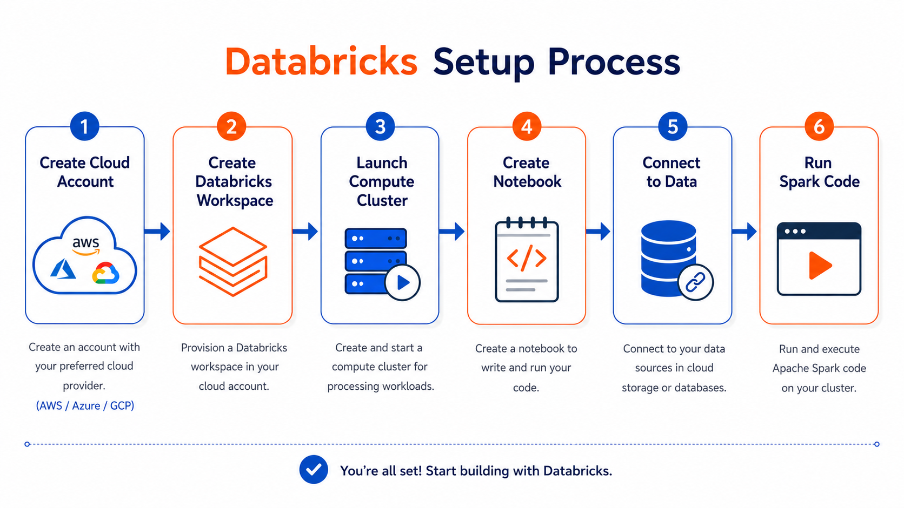
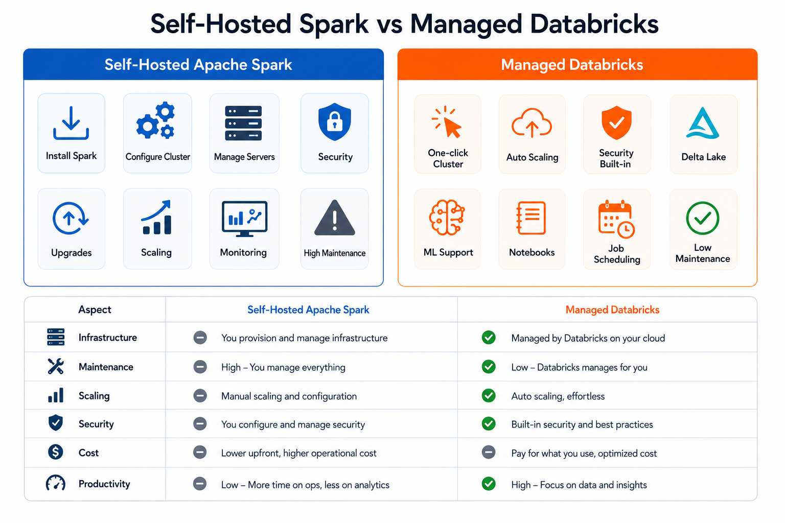
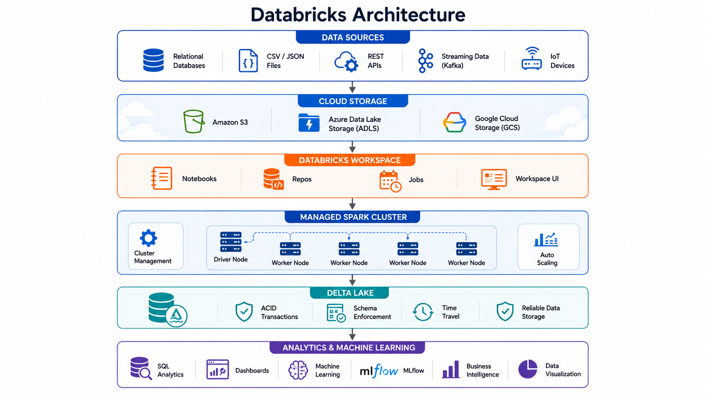
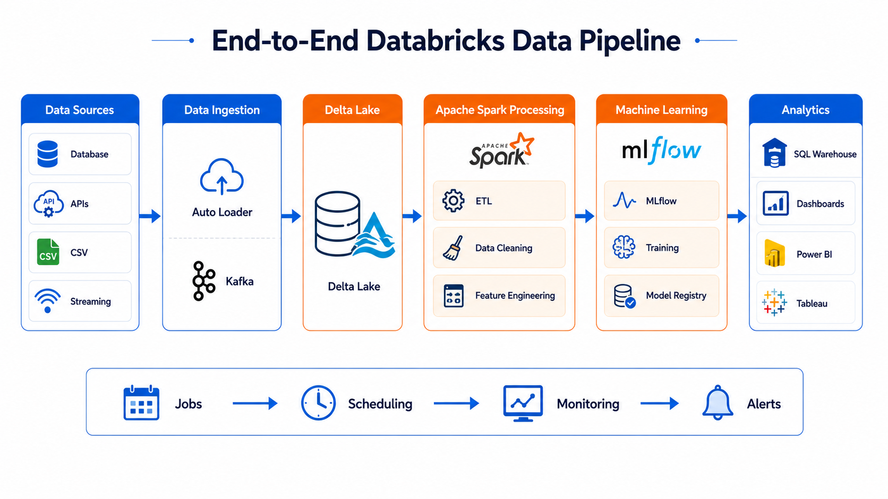

# 🚀 Databricks Fundamentals

⬅️ [Back to Apache Spark & PySpark](../01_Spark&Hadoop_Fundamentals/README.md)

---

# 📚 Table of Contents

* Introduction
* What is Databricks?
* Why Use Databricks?
* Spark Installation & Configuration
* Self-Hosting Apache Spark
* Databricks Setup
* Self-Hosted vs Managed Service
* Why Businesses Choose Databricks
* Databricks Architecture
* Databricks Workflow
* Real-World Use Cases
* Best Practices
* Interview Questions
* Key Takeaways

---

# 📖 Introduction

Databricks is a cloud-based unified analytics platform built on  **Apache Spark** . It simplifies big data processing, machine learning, and data engineering by providing a fully managed environment for developing and running Spark workloads.

Instead of installing and maintaining Apache Spark clusters manually, Databricks automatically provisions, scales, secures, and manages the infrastructure.

---

# 🔷 What is Databricks?

Databricks is a **managed cloud service** built by the creators of Apache Spark.

It provides an easy-to-use workspace where Data Engineers, Data Scientists, and Analysts can collaborate using notebooks, jobs, and workflows.

Databricks supports:

* Apache Spark
* Delta Lake
* SQL Analytics
* Machine Learning
* Data Engineering Pipelines
* Streaming Analytics



---

# 🎯 Why Use Databricks?

Databricks offers several advantages over manually managing Spark clusters.

✅ Fully Managed Spark Clusters

✅ Automatic Scaling

✅ High Availability

✅ Collaborative Notebooks

✅ Built-in Security

✅ Optimized Spark Performance

✅ Native Cloud Integration

---

# ⚙️ Spark Installation & Configuration

Before managed services like Databricks became popular, organizations had to install Apache Spark manually.

Typical installation steps include:

1. Install Java (JDK)
2. Download Apache Spark
3. Configure environment variables
4. Install Python
5. Configure PySpark
6. Start Spark Master
7. Start Worker Nodes

---

# 🏗️ Self-Hosting Apache Spark

A self-hosted Spark cluster requires organizations to manage the complete infrastructure.

Responsibilities include:

* Cluster Setup
* Node Configuration
* Software Installation
* Version Upgrades
* Security
* Monitoring
* Backup
* Scaling

### Self-Hosted Spark Architecture



Although self-hosting provides flexibility, it requires significant operational effort.

---

# ☁️ Databricks Setup

Setting up Databricks is much simpler because infrastructure management is handled automatically.



### Basic Setup Steps

1. Create a Databricks Account
2. Choose a Cloud Provider
3. Create a Workspace
4. Launch a Spark Cluster
5. Import Data
6. Start Writing PySpark Code

Supported cloud providers:

* Microsoft Azure
* Amazon Web Services (AWS)
* Google Cloud Platform (GCP)

---

# ⚖️ Self-Hosted Spark vs Managed Databricks

| Feature                  | Self-Hosted Spark   | Databricks             |
| ------------------------ | ------------------- | ---------------------- |
| Cluster Management       | Manual              | Fully Managed          |
| Installation             | Required            | Not Required           |
| Scaling                  | Manual              | Automatic              |
| Monitoring               | Manual              | Built-in               |
| Security                 | Self Managed        | Enterprise Security    |
| Performance Optimization | Manual              | Automatic              |
| Upgrades                 | Manual              | Automatic              |
| Collaboration            | Limited             | Notebook Collaboration |
| Cost                     | Infrastructure Cost | Pay-as-you-go          |



---

# 🌟 Why Businesses Choose Databricks

Most organizations use  **Azure Databricks** ,  **AWS Databricks** , or **Google Cloud Databricks** instead of self-hosted Spark because of the following benefits:

### Seamless Cloud Integration

Integrates with cloud-native services such as:

* Amazon S3
* Azure Data Lake Storage (ADLS)
* Google Cloud Storage

---

### Enterprise Security

Supports:

* IAM Integration
* Role-Based Access Control (RBAC)
* Encryption
* Audit Logging

---

### Automatic Cluster Management

Databricks automatically:

* Creates Clusters
* Scales Resources
* Replaces Failed Nodes
* Terminates Idle Clusters

---

### High Performance

Databricks includes several Spark optimizations such as:

* Photon Engine
* Delta Lake
* Optimized Query Execution
* Auto Scaling

---

### Collaboration

Multiple users can collaborate using:

* Shared Notebooks
* Version Control
* Job Scheduling
* Dashboards

---

# 🏗️ Databricks Architecture



```text
Data Sources
      │
      ▼
Cloud Storage
(S3 / ADLS / GCS)
      │
      ▼
Databricks Workspace
      │
      ▼
Managed Spark Cluster
      │
      ▼
Delta Lake
      │
      ▼
Analytics & Machine Learning
```

---

# 🔄 Databricks Workflow



---

# 🚀 Real-World Use Cases

### Data Engineering

Build scalable ETL pipelines using PySpark and Delta Lake.

---

### Data Science

Train and deploy Machine Learning models.

---

### Streaming Analytics

Process real-time data from Kafka, Event Hubs, or Kinesis.

---

### Business Intelligence

Prepare clean datasets for:

* Power BI
* Tableau
* Looker

---

### Data Lakehouse

Implement the Medallion Architecture:

* Bronze Layer
* Silver Layer
* Gold Layer

---

# 🛠️ Best Practices

✅ Use Auto Scaling Clusters

✅ Terminate Idle Clusters

✅ Store Data in Delta Format

✅ Use Unity Catalog for Governance

✅ Optimize Tables Regularly

✅ Separate Development and Production Workspaces

---

# 🎤 Interview Questions

### What is Databricks?

Databricks is a managed cloud platform built on Apache Spark for big data processing, analytics, and machine learning.

---

### What is the difference between Apache Spark and Databricks?

Apache Spark is the distributed processing engine.

Databricks is a managed platform that runs Apache Spark and provides additional enterprise features.

---

### Why do companies prefer Databricks?

Because it simplifies cluster management, improves security, integrates with cloud services, and offers optimized Spark performance.

---

### Which cloud providers support Databricks?

* Microsoft Azure
* Amazon Web Services
* Google Cloud Platform

---

### What programming languages are supported?

* Python (PySpark)
* SQL
* Scala
* Java
* R

---

# 🏁 Key Takeaways

* Databricks is a managed Apache Spark platform.
* No manual Spark installation or cluster management is required.
* Supports automatic scaling, security, and performance optimization.
* Integrates with AWS, Azure, and GCP cloud ecosystems.
* Widely used for Data Engineering, Machine Learning, and Analytics.
* Azure Databricks is one of the most popular managed Spark platforms used in enterprises.

---

# 🚀 Next Module

➡️ [Databricks Setup](01_Databricks_Setup.md)

➡️ [PySpark](../03_PySpark/01_DataFrame_Basic/01_Basic_Operations.md)