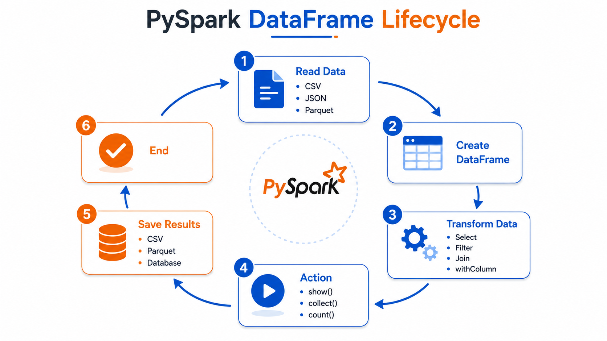

# ⚡ PySpark DataFrame Basic Operations


⬅️ [Back to Databricks](../../02_Databricks/README.md)

---

# 📚 Table of Contents

* Introduction
* What is a DataFrame?
* Why Use DataFrames?
* Spark Session
* Creating a DataFrame
* Loading Data
* Basic DataFrame Operations
* Selecting Columns
* Filtering Data
* Removing Duplicates
* Adding New Columns
* Renaming Columns
* DataFrame Summary
* Commonly Used DataFrame Functions
* Best Practices
* Interview Questions
* Key Takeaways

---

# 📖 Introduction

A **DataFrame** is the primary data structure in PySpark used for processing structured data. It organizes data into rows and columns, making it easy to perform transformations, filtering, aggregations, and analytics on large datasets.

PySpark DataFrames are distributed across multiple machines, allowing Spark to process massive amounts of data efficiently.

---

# 📊 What is a DataFrame?

A **DataFrame** is a distributed collection of data organized into  **rows and columns** .

It is similar to a  **Pandas DataFrame** , but unlike Pandas, PySpark DataFrames are designed to handle **Big Data** across a distributed cluster.

### Characteristics

* 📌 Distributed across multiple nodes
* 📌 Immutable
* 📌 Fault Tolerant
* 📌 Optimized using Spark Catalyst Optimizer
* 📌 Supports SQL Queries

---

# 🚀 Why Use DataFrames?

Using DataFrames provides several advantages:

✅ Distributed Processing

✅ High Performance

✅ SQL Support

✅ Easy Data Transformations

✅ Schema Enforcement

✅ Integration with Spark SQL

---

# 🔥 Spark Session

A **SparkSession** is the entry point for working with Apache Spark.

Before creating or loading a DataFrame, you must have an active Spark Session.

```python
from pyspark.sql import SparkSession

spark = SparkSession.builder \
    .appName("PySpark Basics") \
    .getOrCreate()
```

---

# 📂 Loading a DataFrame

In Databricks, a table can be loaded directly into a DataFrame.

```python
df = spark.table("workspace.default.movies")
```

This creates a DataFrame named `df` containing data from the **movies** table.

---

# 👀 Viewing Data

## Show Rows

Display the first 5 rows.

```python
df.show(5)
```

---

## Display DataFrame (Databricks)

```python
display(df)
```

`display()` provides an interactive table visualization in Databricks notebooks.

---

# 📋 View Column Names

Retrieve all column names.

```python
columns = df.columns

display(columns)
```

Example Output:

```text
title
industry
release_year
budget
revenue
```

---

# 🔢 Count Total Records

Return the total number of rows.

```python
df.count()
```

Example Output:

```text
2500
```

---

# 📈 Data Summary

Generate summary statistics.

```python
display(df.summary())
```

Statistics include:

* Count
* Mean
* Standard Deviation
* Minimum
* Maximum

---

# 🎯 Selecting Columns

Select only specific columns.

```python
df_trim = df.select(
    "title",
    "industry"
)

df_trim.show(3)
```

Example Output:

```text
+-------------+----------+
| title       | industry |
+-------------+----------+
| Avatar      | Hollywood|
| Bahubali    | Tollywood|
| Dangal      | Bollywood|
+-------------+----------+
```

---

# 🔍 Filtering Rows

Filter movies released between **2000** and  **2005** .

```python
df_filtered = df.filter(
    (df.release_year >= 2000) &
    (df.release_year <= 2005)
)

display(df_filtered)
```

---

# 🏷️ Find Unique Values

Retrieve unique industries.

```python
unique_industry = df.select(
    "industry"
).distinct()

display(unique_industry)
```

Example Output:

```text
Hollywood
Bollywood
Tollywood
Kollywood
```

---

# ➕ Add a New Column

Create a new column named  **profit** .

```python
from pyspark.sql.functions import col

df_with_profit = df.withColumn(
    "profit",
    col("revenue") - col("budget")
)

display(df_with_profit)
```

---

# ✏️ Rename a Column

Rename **revenue** to  **total_revenue** .

```python
df = df.withColumnRenamed(
    "revenue",
    "total_revenue"
)
```

---

# 🏗️ View Schema

Display the DataFrame schema.

```python
df.printSchema()
```

Example Output:

```text
root
 |-- title: string
 |-- industry: string
 |-- release_year: integer
 |-- budget: double
 |-- total_revenue: double
```

---

# 📚 Commonly Used DataFrame Functions

| Function                | Description                      |
| ----------------------- | -------------------------------- |
| `show()`              | Display rows                     |
| `display()`           | Interactive display (Databricks) |
| `count()`             | Count total rows                 |
| `columns`             | Get column names                 |
| `printSchema()`       | Display schema                   |
| `summary()`           | Generate summary statistics      |
| `select()`            | Select specific columns          |
| `filter()`            | Filter rows                      |
| `distinct()`          | Remove duplicate values          |
| `withColumn()`        | Add or modify a column           |
| `withColumnRenamed()` | Rename a column                  |

---

# 🛠️ Best Practices

✅ Select only required columns using `select()`

✅ Filter data as early as possible

✅ Avoid unnecessary `collect()` operations

✅ Use built-in Spark functions instead of Python loops

✅ Check schema before performing transformations

✅ Cache DataFrames only when reused multiple times

---

# 🎤 Interview Questions

### What is a PySpark DataFrame?

A distributed collection of structured data organized into rows and columns.

---

### How is a PySpark DataFrame different from a Pandas DataFrame?

| Pandas         | PySpark                |
| -------------- | ---------------------- |
| Single Machine | Distributed Cluster    |
| Small Data     | Big Data               |
| Memory Based   | Distributed Processing |

---

### Why is SparkSession required?

SparkSession is the entry point to create DataFrames, execute SQL queries, and interact with the Spark engine.

---

### How do you select specific columns?

```python
df.select("title", "industry")
```

---

### How do you filter rows?

```python
df.filter(df.release_year > 2020)
```

---

### How do you create a new column?

```python
df.withColumn("profit", col("revenue") - col("budget"))
```

---

### How do you rename a column?

```python
df.withColumnRenamed("revenue", "total_revenue")
```

---



---

# 🏁 Key Takeaways

* A DataFrame is the primary data structure in PySpark.
* It stores structured data in rows and columns.
* SparkSession is required to work with DataFrames.
* DataFrames support powerful transformations such as filtering, selecting, and adding columns.
* Built-in Spark functions provide optimized performance for Big Data processing.
* PySpark DataFrames are immutable and distributed across a cluster, making them suitable for scalable data engineering workloads.

---

# 🚀 Next Module

➡️ [Reading CSV](02_Reading_CSV.md)