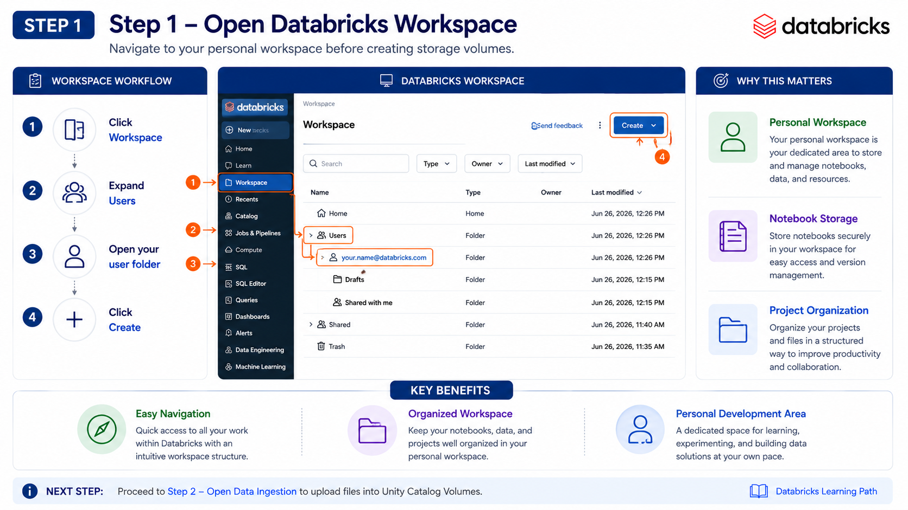
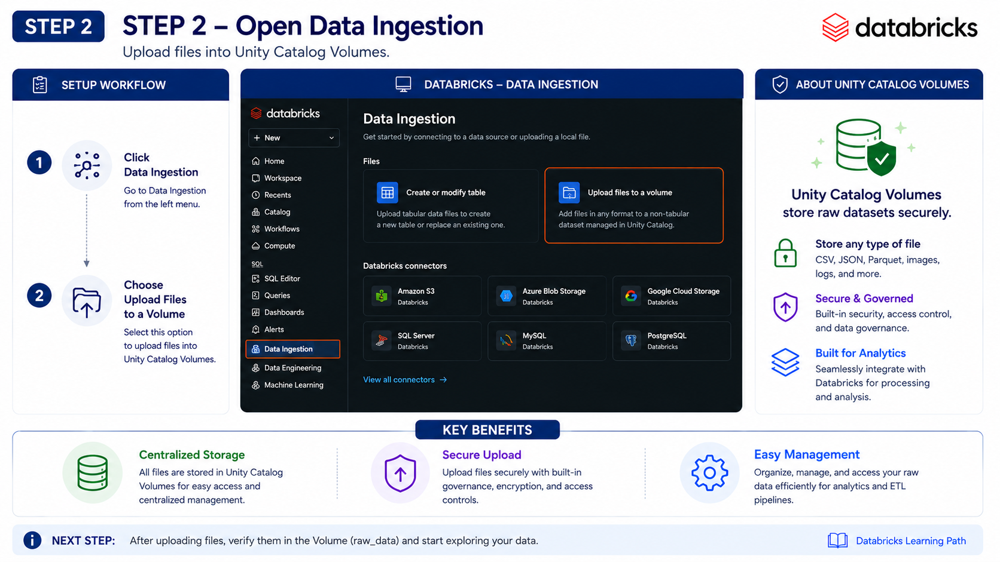
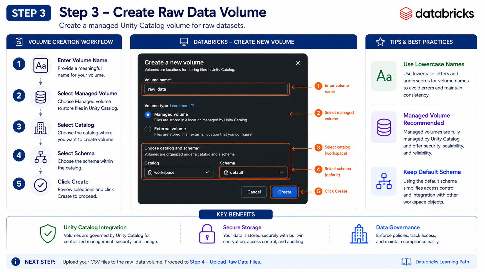
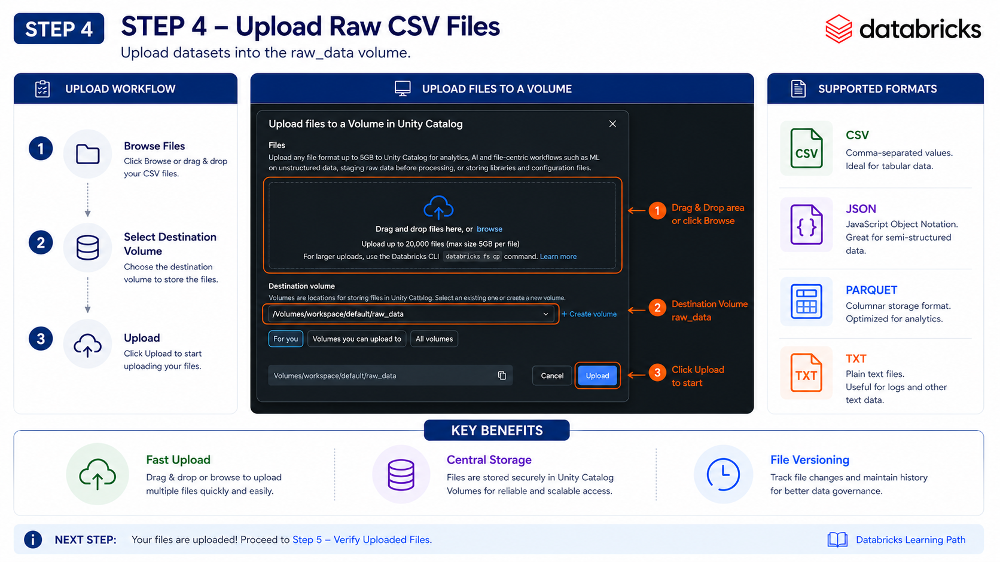
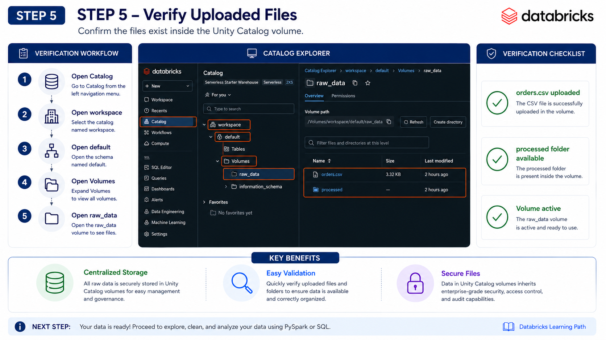
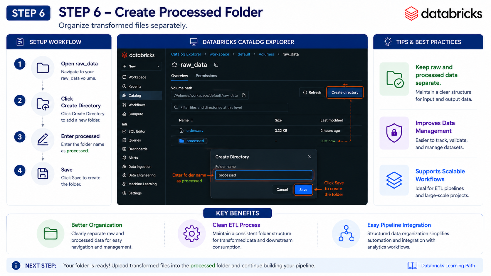
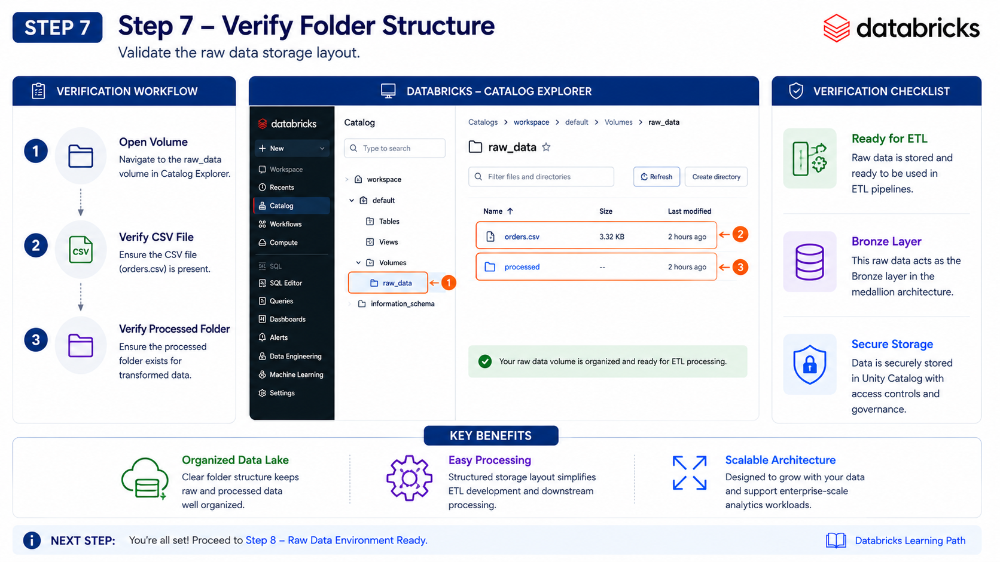
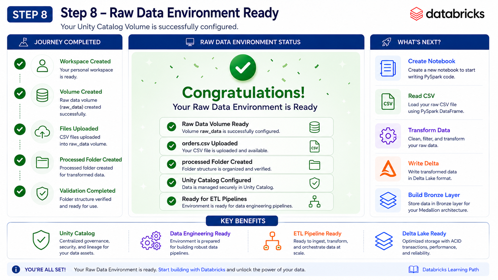
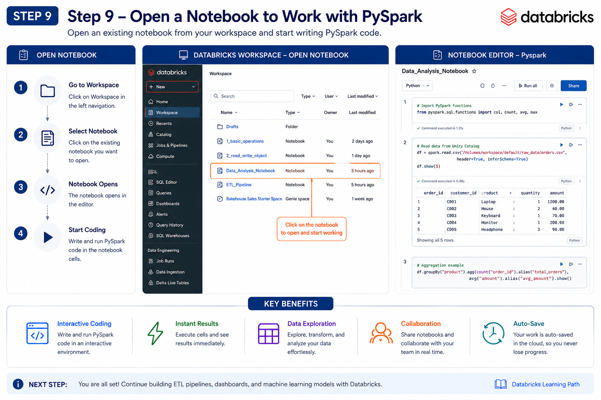

# 📖 Reading CSV Files in PySpark (Databricks)


⬅️ [Back to PySpark DataFrame Basic Operations](01_Basic_Operations.md)

# 📚 Table of Contents

* Overview
* Environment
* Learning Objectives
* Prerequisites
* Workflow
* Databricks Setup Guide
* What is a CSV File?
* Advantages of CSV
* Limitations of CSV
* Dataset Location
* Method 1 – Read CSV with Header Only
* Method 2 – Read CSV with Automatic Schema Detection
* Method 3 – Read CSV with Custom Schema
* Method 4 – Read CSV using `format()` and `load()`
* Convert CSV to Parquet
* Read the Parquet File
* CSV vs Parquet Comparison
* Best Practices
* Project Folder Structure
* Interview Questions
* Key Takeaways

---

# 📘 Overview

CSV (**Comma-Separated Values**) is one of the most widely used file formats for storing and exchanging tabular data. It is simple, lightweight, and supported by almost every programming language and data processing tool.

In this section, you'll learn how to:

* Read CSV files from Unity Catalog Volumes
* Understand schema inference
* Define custom schemas
* Compare different methods of loading CSV files
* Convert CSV files into Parquet format for better performance

---

# 🛠 Environment

This tutorial was developed and tested using the following environment.

| Component   | Details                 |
| ----------- | ----------------------- |
| Platform    | Databricks Free Edition |
| Framework   | Apache Spark (PySpark)  |
| Language    | Python                  |
| Storage     | Unity Catalog Volumes   |
| Input File  | CSV                     |
| Output File | Parquet                 |

---

# 🎯 Learning Objectives

By the end of this tutorial, you'll be able to:

- Read CSV files using PySpark
- Understand how Spark infers schemas
- Define explicit schemas using StructType
- Compare different methods of loading CSV files
- Write DataFrames as Parquet files
- Read Parquet files
- Follow production-ready Data Engineering best practices

---

# 📋 Prerequisites

Before starting this tutorial, ensure you have:

- A Databricks Free Edition account
- A running Databricks Workspace
- Unity Catalog enabled
- A Unity Catalog Volume created
- Basic knowledge of Python
- Basic understanding of Apache Spark

---

# 🏗 Workflow

```text
CSV File
    │
    ▼
Unity Catalog Volume
    │
    ▼
Read using PySpark
    │
    ├── Header Only
    ├── inferSchema
    ├── Custom Schema
    └── format().load()
    │
    ▼
Spark DataFrame
    │
    ▼
Parquet
    │
    ▼
Analytics
```

---

# 📸 Databricks Setup Guide

## 1️⃣ Step 1 – Open Databricks Workspace



---

## 2️⃣ Step 2 – Open Data Ingestion



---

## 3️⃣ Step 3 – Create Raw Data Volume



---

## 4️⃣ Step 4 – Upload CSV File



---

## 5️⃣ Step 5 – Verify Uploaded Files



---

## 6️⃣ Step 6 – Create Processed Folder



---

## 7️⃣ Step 7 – Verify Folder Structure



---

## 8️⃣ Step 8 – Environment Ready



---

## 9️⃣ Step 9 – Open Notebook



---

# 📂 What is a CSV File?

CSV stands for **Comma-Separated Values**.

A CSV file stores tabular data where:

* Each row represents one record.
* Each column is separated by a comma.
* The first row usually contains column names (headers).

Example:

```text
order_date,country,order_id,product,qty,price
2024-01-01,India,1001,Laptop,2,65000
2024-01-02,USA,1002,Mouse,5,700
```

---

## ✅ Advantages of CSV

* Lightweight file format
* Human-readable
* Easy to create and edit
* Supported by almost every data platform
* Ideal for importing/exporting datasets

---

## ⚠️ Limitations of CSV

* No built-in data types
* Larger storage size compared to Parquet
* Slower to read for analytics
* No compression by default
* No metadata support

---

# 📁 Dataset Location

The CSV file is stored inside the Unity Catalog Volume.

```text
/Volumes/workspace/default/raw_data/orders.csv
```

---

# 📖 Method 1 – Read CSV with Header Only

The simplest way to read a CSV file is by specifying that the file contains a header row.

```python
df = spark.read \
    .option("header", True) \
    .csv("/Volumes/workspace/default/raw_data/orders.csv")

display(df)

df.printSchema()
```

### Explanation

* `spark.read` initializes the DataFrame reader.
* `option("header", True)` treats the first row as column names.
* `.csv()` loads the CSV file.
* `display()` displays the DataFrame.
* `printSchema()` shows the detected schema.

---

### Output Schema

Since Spark doesn't know the data types, every column becomes:

```text
string
```

Example:

```text
root
 |-- order_date: string
 |-- country: string
 |-- order_id: string
 |-- product: string
 |-- qty: string
 |-- price: string
```

---

# 📖 Method 2 — Read CSV with Automatic Schema Detection

Spark can automatically detect column data types.

```python
df_1 = spark.read \
    .option("header", True) \
    .option("inferSchema", True) \
    .csv("/Volumes/workspace/default/raw_data/orders.csv")

display(df_1)

df_1.printSchema()
```

---

### Explanation

`inferSchema=True`

Spark scans the data and determines appropriate data types automatically.

Example:

```text
order_id → Integer

price → Double

qty → Integer
```

---

### Advantages

* Better than treating everything as strings.
* No need to manually define data types.

---

### Disadvantages

* Reads the file twice.
* Slower on very large datasets.

---

# 📖 Method 3 — Read CSV with Custom Schema

The recommended approach for production environments is defining the schema manually.

```python
from pyspark.sql import types as T

csv_schema = T.StructType([
    T.StructField("order_date", T.DateType(), True),
    T.StructField("country", T.StringType(), True),
    T.StructField("order_id", T.IntegerType(), True),
    T.StructField("product", T.StringType(), True),
    T.StructField("qty", T.IntegerType(), True),
    T.StructField("price", T.DoubleType(), True)
])
```

---

## Read CSV Using Custom Schema

```python
df_2 = spark.read \
    .option("header", True) \
    .option("dateFormat", "yyyy-MM-dd") \
    .schema(csv_schema) \
    .csv("/Volumes/workspace/default/raw_data/orders.csv")

display(df_2)

df_2.printSchema()
```

---

### Why Use a Custom Schema?

* Faster reading
* No schema inference overhead
* Consistent data types
* Better ETL performance
* Recommended for production pipelines

---

### Output Schema

```text
root

 |-- order_date: date

 |-- country: string

 |-- order_id: integer

 |-- product: string

 |-- qty: integer

 |-- price: double
```

---

# 📖 Method 4 — Read CSV Using `format()` and `load()`

Spark also supports a generic data source API.

```python
df_3 = (
    spark.read
        .format("csv")
        .option("header", True)
        .option("dateFormat", "yyyy-MM-dd")
        .schema(csv_schema)
        .load("/Volumes/workspace/default/raw_data/orders.csv")
)

display(df_3)
```

---

### Advantages

* Generic API
* Supports multiple file formats
* Easier to switch between CSV, JSON, Delta, or Parquet

---

# 🚀 Convert CSV to Parquet

Parquet is a columnar storage format optimized for analytics workloads.

```python
df.write \
    .mode("overwrite") \
    .option("header", True) \
    .parquet("/Volumes/workspace/default/raw_data/processed/orders")
```

---

### Explanation

* `mode("overwrite")` replaces existing files.
* `.parquet()` writes the DataFrame in Parquet format.
* Output is stored in the `processed` folder.

Output Location:

```text
/Volumes/workspace/default/raw_data/processed/orders
```

---

# 📖 Read the Parquet File

```python
df_4 = spark.read.parquet(
    "/Volumes/workspace/default/raw_data/processed/orders"
)

display(df_4)
```

---

# 📊 CSV vs Parquet Comparison

Compared to CSV, Parquet offers significant performance improvements.

| Feature           | CSV       | Parquet   |
| ----------------- | --------- | --------- |
| Storage Format    | Row-based | Columnar  |
| Compression       | ❌        | ✅        |
| Schema Support    | ❌        | ✅        |
| Performance       | Slower    | Faster    |
| Storage Size      | Larger    | Smaller   |
| Analytics         | Basic     | Optimized |
| Spark Performance | Moderate  | Excellent |

---

# 🛠️ Best Practices

* Always store raw files in the `raw_data` volume.
* Use `inferSchema` only for exploration or small datasets.
* Define an explicit schema in production ETL jobs.
* Convert CSV files to Parquet for improved performance.
* Keep transformed data in the `processed` folder.
* Use Unity Catalog Volumes for centralized storage and governance.

---

# 📁 Project Folder Structure

```text
Volumes/
└── workspace/
    └── default/
        └── raw_data/
            ├── orders.csv
            └── processed/
                └── orders/
                    ├── part-00000.parquet
                    ├── part-00001.parquet
                    └── _SUCCESS
```

---

# 🎤 Interview Questions

### 1. What is a DataFrame in PySpark?

A DataFrame is a distributed collection of structured data organized into rows and columns. It is the primary abstraction used for data processing in Apache Spark.

---

### 2. How is a PySpark DataFrame different from a Pandas DataFrame?

| Pandas                      | PySpark                                |
| --------------------------- | -------------------------------------- |
| Runs on a single machine    | Runs on a distributed cluster          |
| Suitable for small datasets | Designed for Big Data                  |
| Memory-based                | Distributed memory and disk processing |
| Limited scalability         | Highly scalable                        |

---

### 3. What is SparkSession?

SparkSession is the entry point to Apache Spark. It is required to create DataFrames, execute Spark SQL queries, and interact with Spark APIs.

---

### 4. Why should you define a schema explicitly?

Defining a schema:

- Improves performance
- Avoids schema inference overhead
- Ensures consistent data types
- Makes ETL pipelines more reliable

---

### 5. What is the difference between `show()` and `display()`?

| show()             | display()           |
| ------------------ | ------------------- |
| Spark Function     | Databricks Function |
| Console Output     | Interactive Table   |
| Limited Formatting | Rich Visualization  |

---

### 6. How do you select specific columns?

```python
df.select("title", "industry")
```

---

### 7. How do you filter rows?

```python
df.filter(df.release_year >= 2020)
```

---

### 8. How do you add a new column?

```python
from pyspark.sql.functions import col

df.withColumn(
    "profit",
    col("revenue") - col("budget")
)
```

---

### 9. How do you rename a column?

```python
df.withColumnRenamed(
    "revenue",
    "total_revenue"
)
```

---

### 10. Why are DataFrames preferred over RDDs?

* Easier to use
* Better performance
* Schema support
* Catalyst Query Optimizer
* Tungsten Execution Engine

---

# 🛠 Best Practices

Follow these best practices while working with PySpark DataFrames.

✅ Create a single SparkSession and reuse it throughout your application.

✅ Read only the required columns using `select()` to reduce memory usage.

✅ Apply filters as early as possible to minimize data processing.

✅ Define an explicit schema instead of relying on `inferSchema` in production.

✅ Use built-in Spark SQL functions instead of Python loops for better performance.

✅ Prefer DataFrame APIs over RDDs for structured data.

✅ Cache DataFrames only when they are reused multiple times.

✅ Store processed data in Parquet or Delta format instead of CSV.

✅ Validate the schema before applying transformations.

✅ Keep raw and processed datasets in separate storage locations.

---

# 🏁 Key Takeaways

- A DataFrame is the primary data structure for working with structured data in PySpark.
- SparkSession is the entry point for creating and manipulating DataFrames.
- DataFrames support distributed processing across a Spark cluster.
- Common operations include selecting columns, filtering rows, adding new columns, renaming columns, and generating summary statistics.
- Using explicit schemas improves performance and ensures consistent data types.
- Built-in Spark SQL functions are optimized for large-scale data processing.
- Storing processed data in Parquet format provides better performance and storage efficiency than CSV.
- Following PySpark best practices helps build scalable and production-ready ETL pipelines.

---

# 🚀 Next Module

➡️ [Hamdle Missing Values](./03_Handle_Missing_Values.md)
