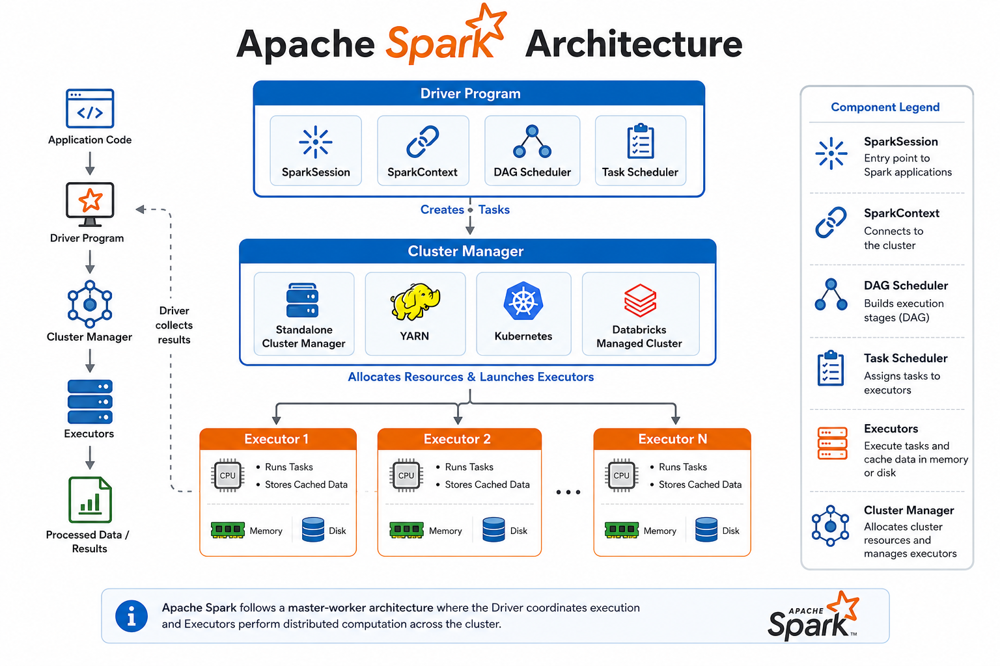

# ⚡ Spark Architecture

⬅️ [Back to Spark Plan](01_Reading_Spark_Plans.md)

---

# 📚 Table of Contents

- Overview
- Learning Objectives
- Spark Architecture
- Components of Spark Architecture
  - Driver Program
  - SparkContext / SparkSession
  - Cluster Manager
  - Executors
- Spark Execution Flow
- Spark Job Execution
- Features of Spark Architecture
  - In-Memory Processing
  - Parallel Processing
  - Fault Tolerance
  - Scalability
  - Lazy Evaluation
- Spark Components Summary
- Advantages
- Real-World Use Cases
- Interview Questions
- Best Practices
- Key Takeaways
- Next Topic

---

## 📖 Overview

**Apache Spark** follows a **Master–Worker (Master–Slave)** architecture designed for distributed and parallel data processing. A Spark application consists of a **Driver Program**, multiple **Executors**, and a **Cluster Manager** that work together to process large datasets efficiently.

Spark provides:

- ⚡ In-memory computation
- 🚀 Parallel processing
- 📈 Horizontal scalability
- 🔄 Fault tolerance
- 💾 Distributed data processing

---

# 🎯 Learning Objectives

After completing this guide, you will understand:

- Spark Master–Worker Architecture
- Driver Program
- SparkContext & SparkSession
- Cluster Managers
- Executors
- Spark Job Execution Flow
- Benefits of Spark Architecture

---

# 🏗️ Spark Architecture



---

# 🧩 Components of Spark Architecture

## 🚗 Driver Program

The **Driver Program** is the entry point of every Spark application.

### Responsibilities

- 🚀 Starts the Spark application
- 📋 Creates SparkSession and SparkContext
- 🔄 Converts user code into executable tasks
- 📊 Creates execution plans
- 📦 Sends tasks to executors
- 📥 Collects results from executors

> The Driver Program coordinates the complete execution of a Spark application.

---

## 🔗 SparkContext / SparkSession

SparkContext acts as the communication bridge between the Driver and the cluster.

### Responsibilities

- Connects to the Cluster Manager
- Requests computing resources
- Schedules Spark jobs
- Monitors execution
- Manages application lifecycle

> **SparkSession** is the modern entry point for all Spark applications and internally contains the SparkContext.

---

## ☁️ Cluster Manager

The **Cluster Manager** is responsible for allocating resources required by Spark applications.

### Supported Cluster Managers

- 🏢 Standalone Cluster
- 🐘 Hadoop YARN
- ☸️ Kubernetes
- 🟥 Databricks Managed Cluster

### Responsibilities

- Allocate CPU cores
- Allocate Memory
- Launch Executors
- Manage Worker Nodes
- Monitor Cluster Resources

---

## ⚙️ Executors

Executors are worker processes that run on cluster nodes.

Each executor executes the tasks assigned by the Driver.

### Responsibilities

- Execute Tasks
- Store Cached Data
- Read and Write Data
- Return Results to Driver
- Store Intermediate Results

---

# 🔄 Spark Execution Flow

```text
User Code
      │
      ▼
Driver Program
      │
SparkSession / SparkContext
      │
      ▼
Cluster Manager
      │
Allocates Executors
      │
      ▼
Executors Execute Tasks
      │
      ▼
Results Returned
```

---

# 🚀 Spark Job Execution

### Step 1️⃣

User submits a Spark application.

⬇️

### Step 2️⃣

Driver Program creates a SparkSession.

⬇️

### Step 3️⃣

Spark converts user code into executable tasks.

⬇️

### Step 4️⃣

Cluster Manager allocates executors.

⬇️

### Step 5️⃣

Executors execute tasks in parallel.

⬇️

### Step 6️⃣

Results are sent back to the Driver.

---

# ✨ Features of Spark Architecture

## ⚡ In-Memory Processing

Spark stores intermediate data in memory instead of repeatedly reading from disk, making computations much faster.

---

## 🚀 Parallel Processing

Large datasets are divided into partitions and processed simultaneously across multiple executors.

---

## 🔄 Fault Tolerance

Spark automatically recomputes lost data using lineage if an executor fails.

---

## 📈 Scalability

Spark can scale from a single machine to thousands of cluster nodes.

---

## ⏳ Lazy Evaluation

Spark delays execution until an **Action** is triggered, allowing it to optimize execution plans.

---

# 📊 Spark Components Summary

| Component            | Responsibility                       |
| -------------------- | ------------------------------------ |
| 🚗 Driver Program    | Controls Spark application execution |
| 🔗 SparkContext      | Connects Driver with Cluster Manager |
| ☁️ Cluster Manager | Allocates resources                  |
| ⚙️ Executors       | Execute tasks                        |
| 💾 Memory            | Cache intermediate data              |
| 🖥️ Worker Nodes    | Host executors                       |

---

# ✅ Advantages

- ⚡ High-speed in-memory processing
- 🚀 Distributed parallel computing
- 📈 Horizontally scalable
- 🔄 Automatic fault recovery
- 💾 Efficient resource utilization
- ☁️ Supports multiple cluster managers
- 📊 Optimized execution engine

---

# 💼 Real-World Use Cases

- 📊 Big Data Analytics
- 🛒 Recommendation Systems
- 💳 Fraud Detection
- 📈 ETL Pipelines
- 🤖 Machine Learning
- 🌐 Log Processing
- 📡 Streaming Analytics

---

# 🎤 Interview Questions

## Basic Level

### 1. What is Apache Spark Architecture?

Apache Spark follows a **Master–Worker architecture** consisting of a **Driver Program**, **Cluster Manager**, and multiple **Executors**. The Driver coordinates execution, the Cluster Manager allocates resources, and Executors perform distributed computations.

---

### 2. What are the main components of Spark Architecture?

- Driver Program
- SparkSession / SparkContext
- Cluster Manager
- Executors
- Worker Nodes

---

### 3. What is the Driver Program?

The Driver Program is the main process that:

- Starts the Spark application
- Creates SparkSession
- Converts user code into tasks
- Schedules jobs
- Sends tasks to executors
- Collects execution results

---

### 4. What is SparkSession?

SparkSession is the unified entry point for Spark applications. It allows users to create DataFrames, execute SQL queries, and interact with Spark functionality.

Example:

```python
spark = SparkSession.builder.appName("Demo").getOrCreate()
```

---

### 5. What is SparkContext?

SparkContext is the communication bridge between the Driver Program and the Cluster Manager. It manages cluster resources and job execution.

---

### 6. What is an Executor?

An Executor is a worker process running on a cluster node that executes tasks, caches data, and returns results to the Driver.

---

### 7. What is a Worker Node?

A Worker Node is a machine in the cluster that hosts one or more Executors.

---

### 8. What is a Cluster Manager?

A Cluster Manager allocates resources such as CPU and memory for Spark applications.

Examples:

- Standalone
- Hadoop YARN
- Kubernetes
- Databricks Managed Cluster

---

### 9. Who creates the Executors?

The **Cluster Manager** launches Executors after receiving resource requests from the Driver Program.

---

### 10. Where is SparkSession created?

SparkSession is created inside the Driver Program.

---

## Intermediate Level

### 11. Explain the execution flow of a Spark application.

1. User submits Spark code.
2. Driver creates SparkSession.
3. Driver creates execution tasks.
4. Cluster Manager allocates Executors.
5. Executors execute tasks.
6. Results are returned to the Driver.

---

### 12. Why is Spark faster than Hadoop MapReduce?

Because Spark performs **in-memory computation**, reducing disk I/O and enabling much faster processing than Hadoop MapReduce.

---

### 13. What is in-memory processing?

Spark stores intermediate data in RAM instead of writing it to disk after every stage, significantly improving performance.

---

### 14. What is fault tolerance in Spark?

Spark automatically recomputes lost data using lineage information if an Executor or Worker Node fails.

---

### 15. Can a Spark application have multiple Executors?

Yes. A Spark application typically uses multiple Executors running across different Worker Nodes for parallel processing.

---

### 16. Can multiple Executors run on the same Worker Node?

Yes. Depending on available CPU and memory resources, a Worker Node can host multiple Executors.

---

### 17. What is the role of the Cluster Manager?

The Cluster Manager:

- Allocates CPU and memory
- Starts Executors
- Manages cluster resources
- Monitors application execution

---

### 18. Does the Driver execute tasks?

No.

The Driver only schedules and coordinates tasks. Executors perform the actual computations.

---

### 19. What happens if an Executor fails?

Spark detects the failure and re-executes the failed tasks on another available Executor using lineage information.

---

### 20. Can Spark run without a Cluster Manager?

Yes.

Spark can run in **Local Mode** for development and testing without an external Cluster Manager.

---

## Advanced Level

### 21. Explain Master–Worker Architecture in Spark.

Spark follows a Master–Worker architecture where:

- Driver acts as the Master.
- Executors act as Workers.
- Cluster Manager manages resource allocation.

---

### 22. Difference between Driver and Executor?

| Driver                | Executor           |
| --------------------- | ------------------ |
| Coordinates execution | Executes tasks     |
| Creates SparkSession  | Runs computations  |
| Schedules jobs        | Stores cached data |
| Collects results      | Returns results    |

---

### 23. Difference between Worker Node and Executor?

| Worker Node              | Executor                           |
| ------------------------ | ---------------------------------- |
| Physical/Virtual machine | JVM process running on Worker Node |
| Hosts Executors          | Executes Spark tasks               |
| Provides resources       | Uses allocated resources           |

---

### 24. Name the Cluster Managers supported by Spark.

- Spark Standalone
- Hadoop YARN
- Kubernetes
- Apache Mesos
- Databricks Managed Cluster

---

### 25. What happens after submitting Spark code?

Spark:

1. Creates SparkSession.
2. Generates execution tasks.
3. Requests resources.
4. Starts Executors.
5. Executes tasks in parallel.
6. Returns results.

---

### 26. Which component communicates with the Cluster Manager?

The **SparkContext** communicates with the Cluster Manager.

---

### 27. Which component performs actual computations?

Executors perform the actual computations.

---

### 28. Which component returns results to the user?

The Driver Program collects results from Executors and returns them to the user.

---

### 29. Why is Spark highly scalable?

Because it distributes data and computation across multiple Worker Nodes and Executors, allowing it to process very large datasets efficiently.

---

### 30. Why do companies prefer Databricks over self-managed Spark clusters?

Because Databricks:

- Manages cluster provisioning automatically
- Handles scaling and resource allocation
- Provides built-in security and governance
- Integrates with cloud services
- Reduces operational overhead

---

# ⭐ Frequently Asked Interview Question

### Explain Spark Architecture in one minute.

> Apache Spark follows a Master–Worker architecture consisting of a Driver Program, Cluster Manager, and multiple Executors. The Driver creates the SparkSession, converts user code into tasks, and coordinates execution. The Cluster Manager allocates resources and launches Executors on Worker Nodes. Executors execute tasks in parallel, cache intermediate data in memory, and return results to the Driver. This architecture enables distributed processing, fault tolerance, scalability, and high-performance analytics.

---

# 💡 Best Practices

- ✅ Create only one **SparkSession** per application.
- ✅ Cache frequently used DataFrames.
- ✅ Partition data appropriately for parallel processing.
- ✅ Use broadcast joins for small lookup tables.
- ✅ Minimize data shuffling whenever possible.
- ✅ Monitor executor memory usage.
- ✅ Use managed cluster services like **Databricks** for easier resource management.
- ✅ Choose the appropriate cluster manager based on your deployment environment.

---

# 🎯 Key Takeaways

- Apache Spark follows a **Master–Worker architecture**.
- 🚗 The **Driver Program** coordinates the entire application.
- 🔗 **SparkContext/SparkSession** communicates with the cluster.
- ☁️ **Cluster Managers** allocate computing resources.
- ⚙️ **Executors** perform distributed computations.
- ⚡ Spark provides **parallel processing**, **fault tolerance**, **in-memory computation**, and **horizontal scalability**.
- 🚀 This architecture enables Spark to process **terabytes to petabytes of data efficiently**.

---

# 📚 Next Topic

➡️ [Spark Architecture](02_Spark_Architecture.md)