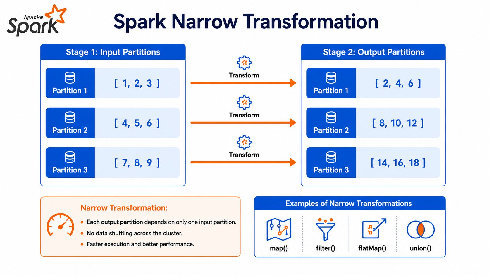
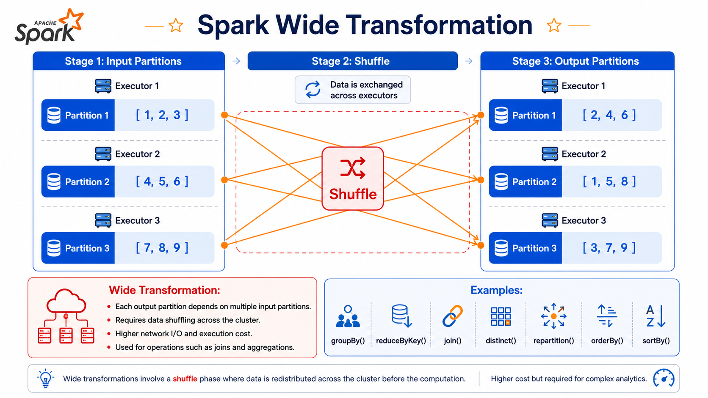
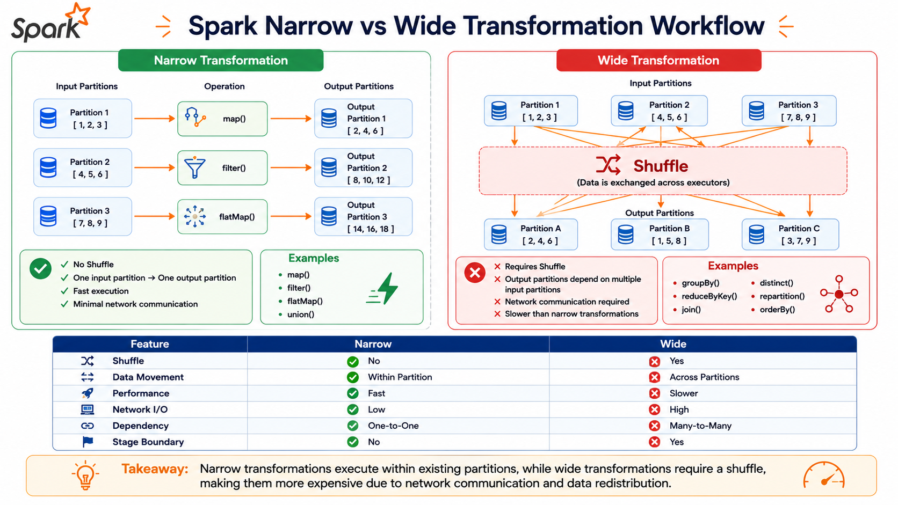

# ⚡ Narrow vs Wide Transformations in PySpark

⬅️ [Back to Transformations Actions and Lazy Evaluation](03_Transformations_Actions_and_Lazy_Evaluation.md)

---

# 📚 Table of Contents

- Overview
- Learning Objectives
- What are Transformations?
- Narrow Transformations
- Wide Transformations
- Narrow vs Wide Transformations
- Spark Execution Flow
- Examples of Narrow Transformations
- Examples of Wide Transformations
- Performance Comparison
- Best Practices
- Interview Questions
- Key Takeaways
- Next Topic

---

# 📖 Overview

In Apache Spark, **Transformations** are classified into two categories based on how data is processed across partitions:

- **Narrow Transformations**
- **Wide Transformations**

The key difference between them is whether Spark needs to **shuffle data** between partitions.

Understanding this distinction is essential for writing efficient Spark applications and optimizing ETL pipelines.

---

# 🎯 Learning Objectives

After completing this guide, you will understand:

- What Narrow Transformations are
- What Wide Transformations are
- How Spark executes each transformation
- What Shuffle is
- Performance differences
- Best practices for optimizing Spark jobs

---

# 🔄 What are Transformations?

A **Transformation** is an operation that creates a new DataFrame or RDD from an existing one without immediately executing the computation.

Spark records these transformations and executes them only when an **Action** is called.

Transformations are categorized into:

- Narrow Transformations
- Wide Transformations

---

# 🟢 Narrow Transformations

A **Narrow Transformation** is one where **each output partition depends on only one input partition**.

Since data remains within the same partition, **no shuffle operation is required**.

### Characteristics

- No data movement across partitions
- No network communication
- Faster execution
- Lower memory usage
- Better performance

---

## 🏗 Narrow Transformation Flow

```text
Partition 1 ─────────► Partition 1

Partition 2 ─────────► Partition 2

Partition 3 ─────────► Partition 3
```



---

## 🔧 Examples of Narrow Transformations

### Filter

```python
from pyspark.sql import functions as F

df.filter(F.col("age") > 18)
```

---

### Select

```python
df.select("name", "age")
```

---

### withColumn

```python
df.withColumn(
    "doubled_salary",
    F.col("salary") * 2
)
```

---

## ✅ Common Narrow Transformations

| Transformation   | Description                  |
| ---------------- | ---------------------------- |
| `select()`     | Select specific columns      |
| `filter()`     | Filter rows                  |
| `where()`      | Filter rows using conditions |
| `withColumn()` | Add or modify a column       |
| `drop()`       | Remove columns               |
| `map()`        | Apply a function to each row |
| `flatMap()`    | Flatten nested structures    |

---

# 🔴 Wide Transformations

A **Wide Transformation** is one where **an output partition depends on multiple input partitions**.

Spark must redistribute data across executors using a **Shuffle** operation.

### Characteristics

- Requires data movement
- Network communication
- Disk I/O
- Higher execution time
- More resource intensive

---

## 🏗 Wide Transformation Flow

```text
Partition 1 ─┐
             ├────────► Shuffle ─────────► New Partitions
Partition 2 ─┤
             │
Partition 3 ─┘
```



---

## 🔧 Examples of Wide Transformations

### Group By

```python
df.groupBy("department").sum("salary")
```

---

### Order By

```python
df.orderBy("name")
```

---

### Join

```python
df1.join(df2, "customer_id")
```

---

### Distinct

```python
df.distinct()
```

---

## ✅ Common Wide Transformations

| Transformation       | Description             |
| -------------------- | ----------------------- |
| `groupBy()`        | Group records           |
| `join()`           | Join DataFrames         |
| `orderBy()`        | Sort records            |
| `distinct()`       | Remove duplicates       |
| `dropDuplicates()` | Remove duplicate rows   |
| `repartition()`    | Redistribute partitions |

---

# 📊 Narrow vs Wide Transformations

| Feature          | Narrow Transformation | Wide Transformation       |
| ---------------- | --------------------- | ------------------------- |
| Dependency       | One input partition   | Multiple input partitions |
| Shuffle Required | ❌ No                 | ✅ Yes                    |
| Network I/O      | ❌ No                 | ✅ Yes                    |
| Disk I/O         | ❌ No                 | ✅ Yes                    |
| Execution Speed  | Fast                  | Slower                    |
| Memory Usage     | Lower                 | Higher                    |
| Performance      | Better                | Costlier                  |
| Stage Boundary   | No                    | Yes                       |

---

# ⚙️ Spark Execution Flow

```text
Read Data
     │
     ▼
Filter
     │
     ▼
Select
     │
     ▼
withColumn
     │
(No Shuffle)
     │
──────────────
     ▼
GroupBy
     │
Shuffle
     ▼
OrderBy
     │
Shuffle
     ▼
Write Output
```



---

# 🚀 Performance Comparison

## Narrow Transformations

### Advantages

- ⚡ Faster execution
- 🚀 No shuffle
- 💾 Lower memory usage
- 🌐 No network communication
- 📈 Better scalability

---

## Wide Transformations

### Challenges

- 🔄 Requires shuffle
- 🌐 Network communication
- 💽 Disk I/O
- ⏳ Increased execution time
- 📉 Higher resource consumption

---

# 🎤 Interview Questions

### 1. What is a Narrow Transformation?

A Narrow Transformation is one where each output partition depends on a single input partition, so no shuffle operation is required.

---

### 2. What is a Wide Transformation?

A Wide Transformation is one where output partitions depend on multiple input partitions, requiring data to be shuffled across the cluster.

---

### 3. What is Shuffle in Spark?

Shuffle is the process of redistributing data across partitions and executors during wide transformations.

---

### 4. Why are Narrow Transformations faster?

Because they avoid network communication, disk I/O, and shuffle operations.

---

### 5. Why are Wide Transformations expensive?

Because they involve:

- Data movement
- Network communication
- Disk writes
- Additional execution stages

---

### 6. Give examples of Narrow Transformations.

- `select()`
- `filter()`
- `withColumn()`
- `drop()`
- `map()`

---

### 7. Give examples of Wide Transformations.

- `groupBy()`
- `join()`
- `orderBy()`
- `distinct()`
- `dropDuplicates()`

---

### 8. Does `groupBy()` trigger a shuffle?

✅ Yes.

---

### 9. Does `filter()` trigger a shuffle?

❌ No.

---

### 10. How can you reduce shuffle operations?

- Filter data early.
- Use Broadcast Joins.
- Select only required columns.
- Avoid unnecessary sorting and repartitioning.

---

# 💡 Best Practices

- ✅ Prefer Narrow Transformations whenever possible.
- ✅ Minimize the number of Wide Transformations in a pipeline.
- ✅ Filter data before applying `groupBy()` or `join()`.
- ✅ Select only the required columns before shuffle operations.
- ✅ Use **Broadcast Join** when joining a large table with a small lookup table.
- ✅ Repartition data only when necessary.
- ✅ Cache DataFrames that are reused multiple times.
- ✅ Monitor shuffle operations using the Spark UI.
- ✅ Avoid unnecessary `orderBy()` operations on large datasets.
- ✅ Use Parquet or Delta formats to reduce I/O and improve performance.

---

# 🎯 Key Takeaways

- Transformations in Spark are classified as **Narrow** or **Wide**.
- Narrow Transformations operate within a single partition and **do not require shuffle**.
- Wide Transformations require **data redistribution (shuffle)** across partitions.
- Shuffle operations involve network communication and disk I/O, making them more expensive.
- Narrow Transformations are generally **faster and more efficient**.
- Understanding the difference helps optimize Spark jobs and improve application performance.

---

# 📚 Next Topic

➡️ [Partitions and Parallelism: Repartition](05_Repartition.md)