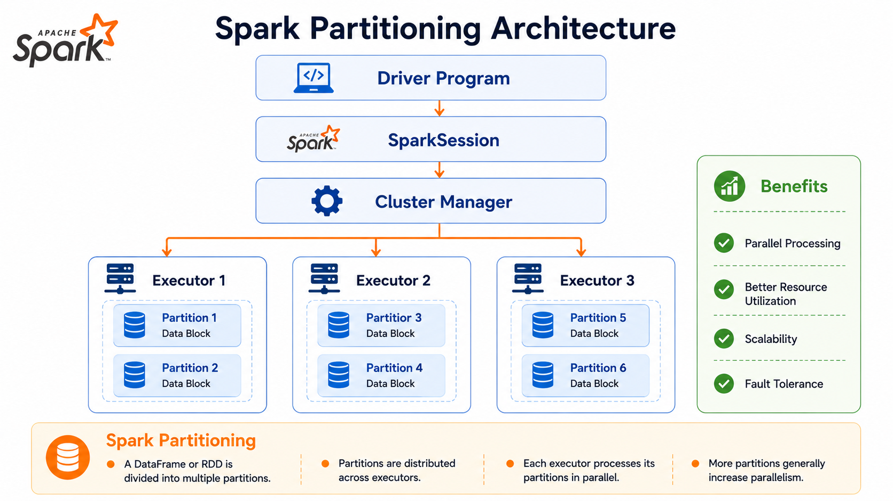
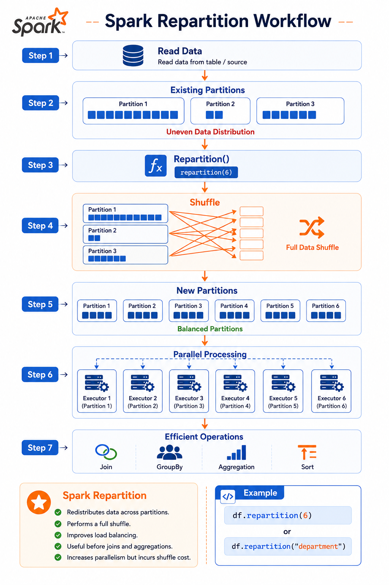
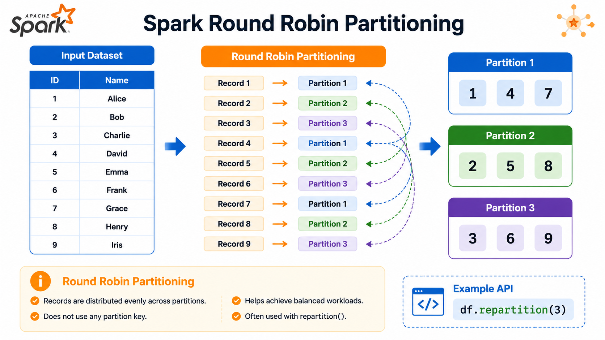
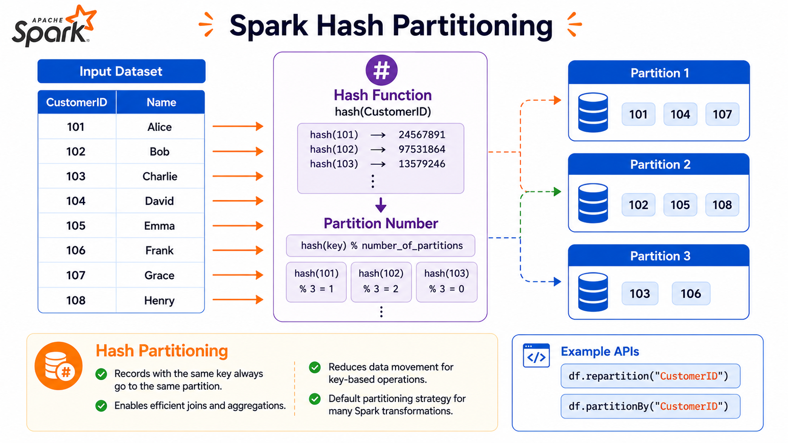
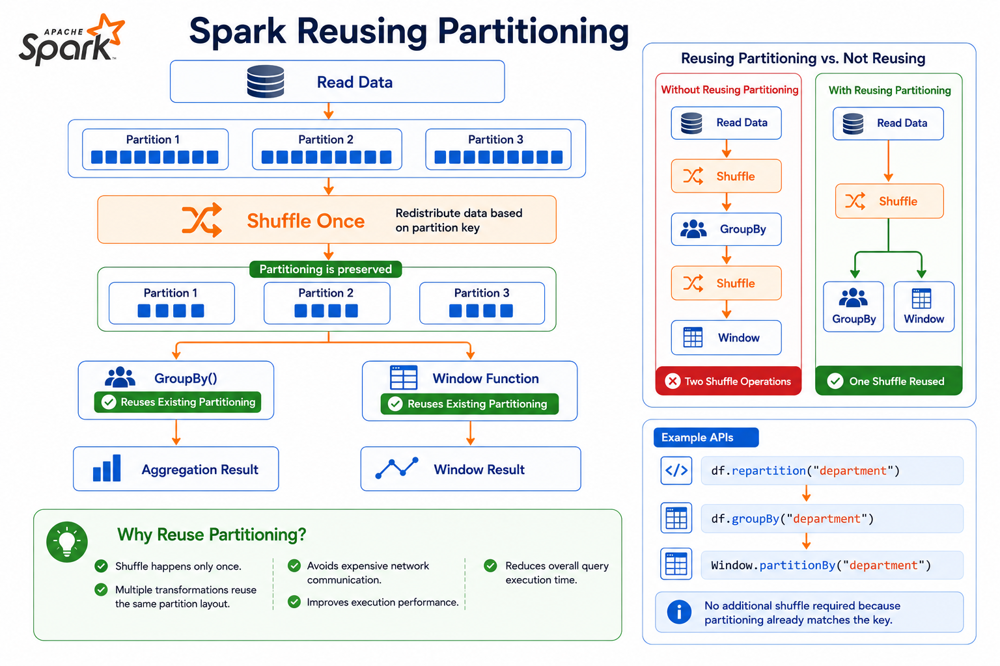

# ⚡ Spark Partitions & Parallelism using Repartition

⬅️ [Back to Narrow vs Wide Transformations](04_Narrow_vs_Wide_Transformations.md)

---

# 📚 Table of Contents

- Overview
- Learning Objectives
- What are Partitions?
- What is Parallelism?
- Why Partitions Matter?
- Types of Partitioning
- What is `repartition()`?
- Sample Dataset
- Repartition by Number
- Repartition by Key
- Reusing Partitioning
- Writing Repartitioned Data
- Reading the Execution Plan
- Round Robin vs Hash Partitioning
- Performance Considerations
- When Should You Use Repartition?
- When Should You Avoid Repartition?
- Best Practices
- Interview Questions
- Key Takeaways

---

# 📖 Overview

Apache Spark achieves high performance by dividing data into **Partitions** and processing those partitions **in parallel** across multiple executors.

The `repartition()` transformation redistributes data across partitions using a **shuffle operation**. Proper partitioning improves parallelism and helps optimize operations such as **groupBy**, **joins**, and **window functions**.

---

# 🏗️ Spark Partitioning Architecture



---

# 🎯 Learning Objectives

After completing this guide, you will understand:

- What partitions are
- What parallelism is
- Why partitioning is important
- How `repartition()` works
- Difference between Round Robin and Hash Partitioning
- How to read Spark execution plans for repartitioning

---

# 📦 What are Partitions?

A **Partition** is the smallest unit of data that Spark processes.

Instead of processing an entire dataset on one machine, Spark divides the dataset into multiple partitions and distributes them across executors.

Example

```text
Movies DataFrame

Movie 1
Movie 2
Movie 3
Movie 4
Movie 5
Movie 6
Movie 7
Movie 8

↓

Partition 1
Movie 1
Movie 2

Partition 2
Movie 3
Movie 4

Partition 3
Movie 5
Movie 6

Partition 4
Movie 7
Movie 8
```

Each partition can be processed independently.

---

# 🚀 What is Parallelism?

**Parallelism** means Spark processes multiple partitions simultaneously using different executors.

Instead of processing data sequentially,

```text
Partition 1
↓

Partition 2
↓

Partition 3
↓

Partition 4
```

Spark processes

```text
Executor 1 → Partition 1

Executor 2 → Partition 2

Executor 3 → Partition 3

Executor 4 → Partition 4
```

This significantly reduces execution time.

---

# 💡 Why Partitions Matter

Proper partitioning helps Spark:

- ⚡ Process data in parallel
- 🚀 Improve job performance
- 💾 Balance workload across executors
- 📈 Scale efficiently
- 🔄 Reduce bottlenecks


| Too Few Partitions        | Too Many Partitions       |
| ------------------------- | ------------------------- |
| Low parallelism           | Too many small tasks      |
| Idle executors            | Scheduling overhead       |
| Poor resource utilization | Increased task management |
| Longer execution time     | Higher coordination cost  |

---

# 🗂 Types of Partitioning

Spark commonly uses two partitioning strategies when calling `repartition()`.

## 🔹 Round Robin Partitioning

Rows are distributed evenly across all partitions.

Useful when:

- No partition key exists
- Even workload distribution is desired

---

## 🔹 Hash Partitioning

Rows having the same key are placed into the same partition.

Useful for:

- Group By
- Joins
- Window Functions

---

# 🔄 What is `repartition()`?

The `repartition()` transformation redistributes data across partitions by performing a **shuffle**.

Syntax

```python
df.repartition(numPartitions)
```

or

```python
df.repartition(
    numPartitions,
    "column_name"
)
```

Characteristics

- Wide Transformation
- Triggers Shuffle
- Creates new partitions
- Improves future operations on partitioned columns


> **💡 Note**
>
> `repartition()` is a **wide transformation** that always performs a **shuffle** to redistribute data across partitions.

---

# 🔄 Spark Repartition Workflow



---

# 📂 Sample Dataset

```python
df = spark.table("workspace.default.movies")

display(df.limit(5))
```

### Sample Output

| Title                  | Studio                    | Revenue |
| ---------------------- | ------------------------- | ------- |
| Pather Panchali        | Government of West Bengal | 100000  |
| Doctor Strange         | Marvel Studios            | 954.8   |
| Thor: Ragnarok         | Marvel Studios            | 854     |
| Thor: Love and Thunder | Marvel Studios            | 670     |
| Avengers: Endgame      | Marvel Studios            | 2798    |

---

# 📋 Distinct Studios

```sql
%sql

SELECT DISTINCT studio
FROM workspace.default.movies;
```

Example Output

```text
Marvel Studios
Warner Bros. Pictures
Universal Pictures
Paramount Pictures
Columbia Pictures
20th Century Fox
...
```

---

# 🔹 Repartition by Number

Create six partitions using **Round Robin Partitioning**.

```python
rep_rr = df.repartition(6)

rep_rr.count()
```

Output

```text
37
```

Although the number of rows remains the same, Spark redistributes the rows evenly across six partitions.

---

# 🔍 Execution Plan

```python
rep_rr.explain("formatted")
```

Notice

```text
RoundRobinPartitioning(6)
```

This indicates Spark evenly distributes rows across six partitions.

---

# 🏗 Round Robin Execution Flow



---

# 🔹 Repartition by Key

Partition data based on a specific column.

```python
rep_by_key = df.repartition(
    6,
    "studio"
)
```

Spark groups rows having the same **studio** into the same partition.

This improves the performance of future operations like

- `groupBy()`
- `join()`
- Window Functions

---

# 🔍 Execution Plan

```python
rep_by_key.explain("formatted")
```

Notice

```text
hashpartitioning(studio, 6)
```

Spark hashes the value of **studio** and assigns rows to one of the six partitions.

---

# 🏗 Hash Partitioning Flow



---

# ⚖ Round Robin vs Hash Partitioning

| Round Robin                  | Hash Partitioning               |
| ---------------------------- | ------------------------------- |
| Even row distribution        | Groups rows by key              |
| No partition key             | Uses partition key              |
| Good for general parallelism | Good for joins and aggregations |
| Uses`repartition(n)`       | Uses`repartition(n, column)`  |

---

# ⚡ Reusing Partitioning

Once a DataFrame has been repartitioned, Spark can reuse the same partitioning for subsequent operations.

This avoids performing multiple shuffle operations, improving overall job performance.

Instead of repartitioning before every transformation, repartition the DataFrame once and reuse it.

---

## Example

```python
from pyspark.sql.window import Window
from pyspark.sql import functions as F

# One-time shuffle
base = df.repartition(6, "studio")

# Reuse the partitioned DataFrame
agg = (
    base.groupBy("studio")
        .agg(
            F.avg(
                F.col("revenue").cast("double")
            ).alias("avg_revenue")
        )
)

ranked = (
    base.withColumn(
        "rank",
        F.row_number().over(
            Window.partitionBy("studio")
                  .orderBy(F.desc("revenue"))
        )
    )
)
```

---

## Why Reuse Partitioning?



---

# 💾 Writing Repartitioned Data

After repartitioning, data can be written back to storage.

```python
out_path = "/Volumes/workspace/default/partition_demo/repartition_6"

rep_rr.write \
      .mode("overwrite") \
      .parquet(out_path)
```

---

## Benefits

- Even file sizes
- Better parallel reads
- Improved downstream performance

---

# 🔍 Reading Spark Execution Plans

Spark shows repartition operations in the physical plan.

Example

```python
rep_rr.explain("formatted")
```

Important operators

| Operator                    | Description                |
| --------------------------- | -------------------------- |
| PhotonScan                  | Reads the source data      |
| PhotonShuffleExchangeSink   | Redistributes data         |
| PhotonShuffleMapStage       | Creates shuffle partitions |
| PhotonShuffleExchangeSource | Reads shuffled data        |
| PhotonResultStage           | Returns the final result   |

---

## Round Robin Partitioning

```text
Arguments:

RoundRobinPartitioning(6)
```

Meaning

- Six partitions created
- Rows distributed evenly
- Used by

```python
df.repartition(6)
```

---

## Hash Partitioning

```text
Arguments:

hashpartitioning(studio, 6)
```

Meaning

- Rows having the same studio value are placed into the same partition.

Used by

```python
df.repartition(6, "studio")
```

---

# 📊 Round Robin vs Hash Partitioning

| Feature           | Round Robin         | Hash Partitioning          |
| ----------------- | ------------------- | -------------------------- |
| Data Distribution | Even                | Based on key               |
| Shuffle           | Yes                 | Yes                        |
| Uses Key          | No                  | Yes                        |
| Best For          | General parallelism | GroupBy, Join, Window      |
| Syntax            | `repartition(n)`  | `repartition(n, column)` |

---

# 🚀 Performance Comparison

| Round Robin             | Hash Partitioning      |
| ----------------------- | ---------------------- |
| Evenly distributes rows | Groups rows by key     |
| Better load balancing   | Better for joins       |
| General workloads       | Aggregations           |
| Does not colocate data  | Colocates related rows |

---

# ⚙️ When Should You Use Repartition?

Use `repartition()` when:

- Increasing the number of partitions
- Redistributing skewed data
- Preparing data for joins
- Preparing data for aggregations
- Improving parallelism
- Balancing workload across executors

---

# ❌ When Should You Avoid Repartition?

Avoid unnecessary repartitioning because it:

- Triggers shuffle
- Uses additional CPU
- Uses additional network bandwidth
- Increases execution time

Only repartition when it provides a measurable performance benefit.

---

# 🌍 Real-World Use Cases

### Round Robin Partitioning

- Data exploration
- Even workload distribution
- Generic ETL pipelines

---

### Hash Partitioning

- Customer-based analytics
- Sales aggregation
- Department-wise reports
- Window functions
- Large joins

---

# 💡 Best Practices

- ✅ Choose an appropriate number of partitions based on your data size and available cluster resources.
- ✅ Use **Round Robin Partitioning** (`repartition(n)`) when you need to evenly distribute data across partitions.
- ✅ Use **Hash Partitioning** (`repartition(n, column)`) before operations such as `groupBy()`, `join()`, and window functions to colocate related records.
- ✅ Repartition only when necessary, as it is a **wide transformation** that triggers a shuffle.
- ✅ Reuse the same repartitioned DataFrame across multiple transformations to avoid repeated shuffle operations.
- ✅ Minimize unnecessary repartitioning within the same ETL pipeline to reduce execution time and resource consumption.
- ✅ Balance partition sizes to maximize parallel execution and avoid idle executors.
- ✅ Monitor for **data skew**, especially when partitioning on low-cardinality or highly skewed columns.
- ✅ Use `explain("formatted")` to verify the partitioning strategy and understand the physical execution plan.
- ✅ Monitor shuffle operations and task distribution using the **Spark UI**.
- ✅ Write repartitioned data in **Parquet** or **Delta** format for better storage efficiency and query performance.
- ✅ Regularly review execution plans and partitioning strategies to optimize Spark job performance.

---

# 🎤 Interview Questions

### 1. What is a partition in Spark?

A partition is the smallest unit of data processed by Spark in parallel across executors.

---

### 2. Why are partitions important?

Partitions enable distributed and parallel processing, improving scalability and performance.

---

### 3. What is parallelism in Spark?

Parallelism is the ability to execute multiple tasks simultaneously on different partitions.

---

### 4. What does `repartition()` do?

It redistributes data across partitions by performing a shuffle.

---

### 5. Does `repartition()` trigger a shuffle?

✅ Yes.

It is a wide transformation.

---

### 6. What is the difference between `repartition(6)` and `repartition(6, "studio")`?

| `repartition(6)`            | `repartition(6, "studio")` |
| ----------------------------- | ---------------------------- |
| Uses Round Robin Partitioning | Uses Hash Partitioning       |
| Even distribution             | Groups rows by key           |

---

### 7. Why repartition by a key?

To colocate related records, improving the performance of joins, aggregations, and window functions.

---

### 8. Why should you reuse a repartitioned DataFrame?

Reusing it avoids repeated shuffle operations and improves overall job performance.

---

### 9. What is `RoundRobinPartitioning`?

A partitioning strategy that distributes rows evenly across all partitions.

---

### 10. What is `HashPartitioning`?

A partitioning strategy that groups rows with the same key into the same partition.

---

### 11. Which Spark operator indicates a shuffle?

`PhotonShuffleExchangeSink` (or `Exchange` in standard Spark plans).

---

### 12. How can you verify partitioning?

Use:

```python
df.explain("formatted")
```

---

### 13. Why can repartitioning improve performance?

Because it balances workload and colocates related data before expensive operations.

---

### 14. What is data skew?

Data skew occurs when one partition contains significantly more data than others, leading to uneven task execution.

---

### 15. What happens if you repartition too often?

Repeated repartitioning causes unnecessary shuffle operations, increasing execution time and resource usage.

---

# 📊 Summary

| Concept                  | Description                                          |
| ------------------------ | ---------------------------------------------------- |
| Partition                | Smallest unit of data processed by Spark             |
| Parallelism              | Processing multiple partitions simultaneously        |
| Repartition              | Redistributes data across partitions using a shuffle |
| Round Robin Partitioning | Evenly distributes rows across partitions            |
| Hash Partitioning        | Groups rows based on a partition key                 |
| Shuffle                  | Redistributes data between executors                 |

---

# 🎯 Key Takeaways

- Spark divides data into **partitions** for distributed processing.
- Multiple partitions enable **parallel execution** across executors.
- `repartition()` redistributes data by performing a shuffle.
- `repartition(n)` uses **Round Robin Partitioning**.
- `repartition(n, column)` uses **Hash Partitioning**.
- Proper partitioning improves the performance of joins, aggregations, and window functions.
- Understanding partitioning is essential for building scalable and efficient Spark applications.

---

> **Note**
>
> `repartition()` always triggers a **shuffle** because Spark redistributes data across partitions.
>
> Use it only when improved parallelism or better data distribution outweighs the shuffle cost.

---

# 📚 Next Topic

➡️ [Partitions and Parallelism: Coalesce](06_Coalesce.md)