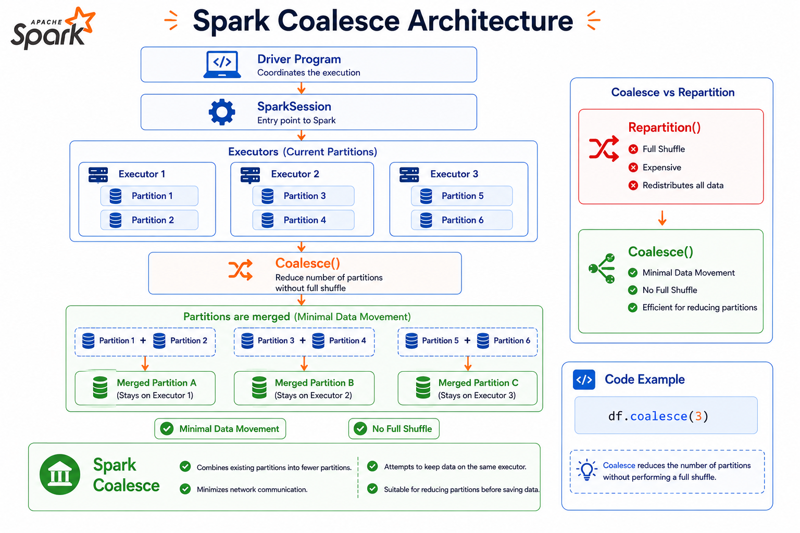
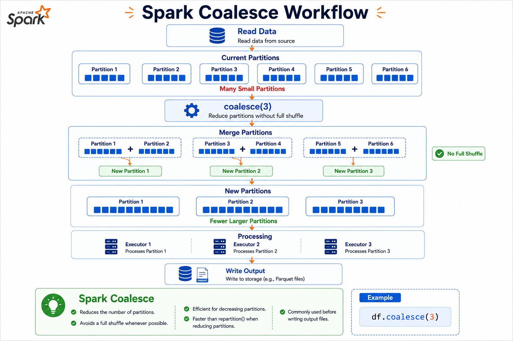

# ⚡ Spark Coalesce

⬅️ [Back to Repartition](05_Repartition.md)

---

# 📚 Table of Contents

- Overview
- Learning Objectives
- What is `coalesce()`?
- Why Use Coalesce?
- How `coalesce()` Works
- Coalesce vs Repartition
- Sample Example
- Reading the Execution Plan
- Performance Considerations
- Real-World Use Cases
- Best Practices
- Interview Questions
- Summary
- Key Takeaways
- Next Topic

---

# 📖 Overview

Apache Spark provides the **`coalesce()`** transformation to **reduce the number of partitions** in a DataFrame or RDD.

Unlike **`repartition()`**, which always performs a full shuffle, **`coalesce()`** minimizes data movement by merging existing partitions whenever possible.

It is commonly used to optimize write operations, reduce the number of output files, and improve performance when fewer partitions are sufficient.

---

# 🏗️ Spark Coalesce Architecture



---

# 🎯 Learning Objectives

After completing this guide, you will understand:

- What `coalesce()` is
- How `coalesce()` works
- Difference between `coalesce()` and `repartition()`
- When to use `coalesce()`
- Performance implications
- Best practices for partition reduction

---

# 🔄 What is `coalesce()`?

`coalesce()` reduces the number of partitions by merging existing partitions.

Unlike `repartition()`, Spark **tries to avoid a full shuffle**, making `coalesce()` much more efficient for decreasing partitions.

## Syntax

```python
df.coalesce(numPartitions)
```

Example

```python
df_small = df.coalesce(4)
```

This reduces the DataFrame to **4 partitions**.

---

# 💡 Why Use Coalesce?

Common reasons to use `coalesce()`:

- Reduce the number of partitions
- Minimize shuffle operations
- Reduce the number of output files
- Optimize write performance
- Improve resource utilization

---

# ⚙️ How Coalesce Works



---

# 🔀 Coalesce vs Repartition

| Feature       | Coalesce            | Repartition                     |
| ------------- | ------------------- | ------------------------------- |
| Purpose       | Reduce partitions   | Increase or decrease partitions |
| Shuffle       | Usually No          | Always Yes                      |
| Performance   | Faster              | Slower                          |
| Data Movement | Minimal             | Full Shuffle                    |
| Best Use Case | Reduce output files | Redistribute data evenly        |

---

# 📂 Sample Example

```python
df = spark.table("workspace.default.movies")
```

Current partitions

```python
df.rdd.getNumPartitions()
```

Output

```text
8
```

---

Reduce partitions

```python
df_small = df.coalesce(4)

df_small.rdd.getNumPartitions()
```

Output

```text
4
```

Spark merged existing partitions instead of redistributing the entire dataset.

---

# 🔍 Reading the Execution Plan

```python
df_small.explain("formatted")
```

Observe the Physical Plan.

Unlike `repartition()`, you will generally **not** see a full shuffle (`Exchange`) when Spark can simply merge partitions.

This is why `coalesce()` is more efficient when reducing partitions.

---

# 🚀 Performance Considerations

## Advantages

- ⚡ Less data movement
- 🚀 Faster execution
- 💾 Lower network I/O
- 📉 Lower shuffle cost
- 📂 Fewer output files

---

## Limitations

- Cannot evenly redistribute data
- May create uneven partition sizes
- Too few partitions reduce parallelism
- Can lead to data skew

---

# 🌍 Real-World Use Cases

### Writing Output Files

Reduce hundreds of small files into fewer larger files.

```python
df.coalesce(4).write.parquet("/output")
```

---

### Exporting CSV Files

Create a single CSV file.

```python
df.coalesce(1).write.csv("/output")
```

---

### Optimizing ETL Pipelines

Reduce partitions before writing processed data.

---

### Report Generation

Generate fewer output files for downstream applications.

---

# 💡 Best Practices

- ✅ Use `coalesce()` only when reducing the number of partitions.
- ✅ Prefer `coalesce()` over `repartition()` when no data redistribution is required.
- ✅ Use `coalesce()` before writing output files to reduce the number of generated files.
- ✅ Avoid reducing partitions too aggressively, as it can reduce parallelism.
- ✅ Monitor partition sizes to avoid data skew.
- ✅ Use `repartition()` instead when balanced partition distribution is required.
- ✅ Verify partition counts using `rdd.getNumPartitions()`.
- ✅ Inspect execution plans using `explain("formatted")`.

---

# 🎤 Interview Questions

### 1. What is `coalesce()` in Spark?

`coalesce()` reduces the number of partitions by merging existing partitions with minimal data movement.

---

### 2. Does `coalesce()` trigger a shuffle?

Usually **No**.

Spark tries to merge partitions without performing a full shuffle.

---

### 3. What is the difference between `coalesce()` and `repartition()`?

| Coalesce           | Repartition                       |
| ------------------ | --------------------------------- |
| Reduces partitions | Increases or decreases partitions |
| Minimal shuffle    | Full shuffle                      |
| Faster             | Slower                            |

---

### 4. When should you use `coalesce()`?

- Before writing output
- To reduce small files
- To decrease partitions after filtering
- To optimize ETL pipelines

---

### 5. Can `coalesce()` increase partitions?

No.

It is designed only to reduce the number of partitions.

Use `repartition()` to increase partitions.

---

### 6. Why is `coalesce()` faster?

Because it minimizes data movement and avoids a full shuffle whenever possible.

---

### 7. What happens if you coalesce to one partition?

Spark processes all data in a single partition.

While useful for generating one output file, it reduces parallelism and may slow down processing for large datasets.

---

### 8. Which operation is better for writing output files?

`coalesce()` is generally preferred because it minimizes shuffle and reduces the number of output files.

---

### 9. How can you check the number of partitions?

```python
df.rdd.getNumPartitions()
```

---

### 10. What is the main drawback of `coalesce()`?

Reducing partitions too much can create uneven workloads, reduce parallelism, and lead to performance bottlenecks.

---

# 📊 Summary

| Concept       | Description                                     |
| ------------- | ----------------------------------------------- |
| Coalesce      | Reduces the number of partitions                |
| Shuffle       | Usually avoided                                 |
| Performance   | Faster than repartition for reducing partitions |
| Best Use Case | Writing fewer output files                      |
| Limitation    | Cannot increase partitions                      |

---

# 🎯 Key Takeaways

- `coalesce()` is used to **reduce the number of partitions** in Spark.
- It minimizes data movement by merging existing partitions instead of performing a full shuffle.
- It is commonly used before writing data to storage to reduce the number of output files.
- `coalesce()` is generally more efficient than `repartition()` when decreasing partitions.
- Reducing partitions too aggressively can reduce parallelism and create data skew.
- Choose between `coalesce()` and `repartition()` based on whether you need to **merge partitions** or **redistribute data evenly**.

---

# 📚 Next Topic

➡️ [Catalyst Optimizer, Predicate Pushdown and Column Pruning (SQL Query Optimization)](07_Query_Optimization.md)