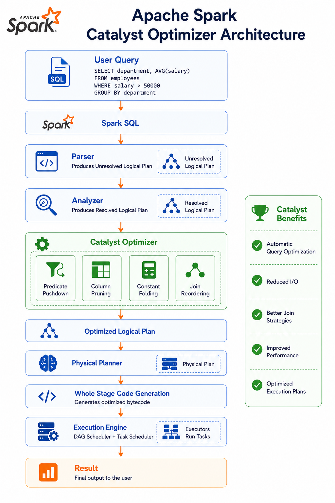
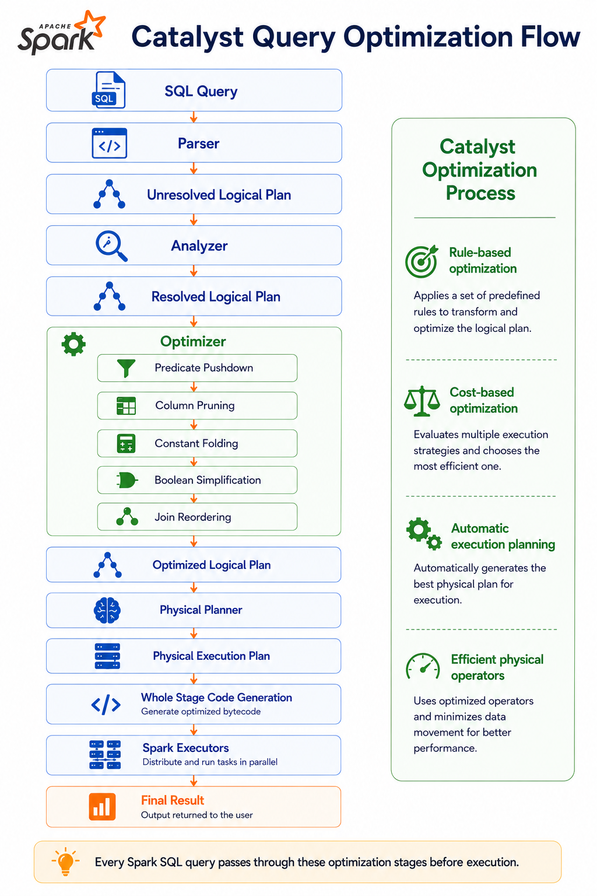
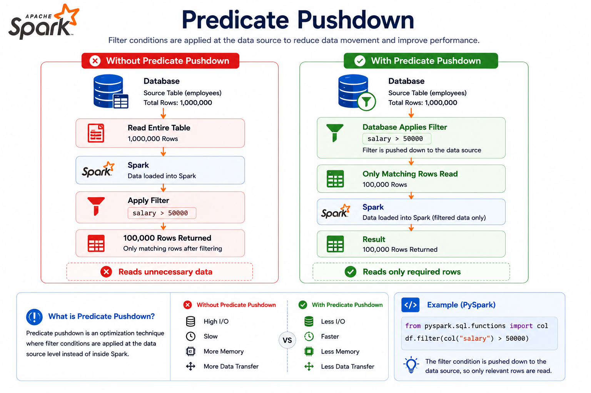
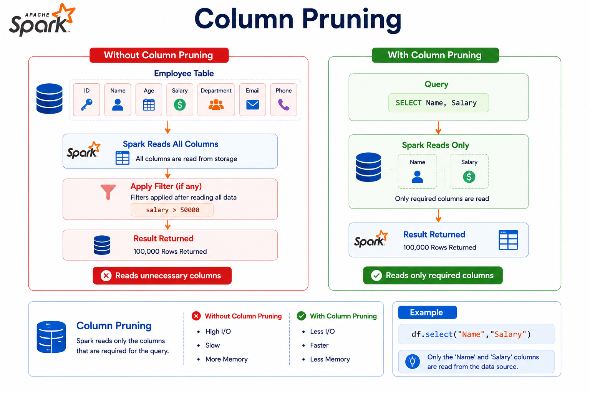
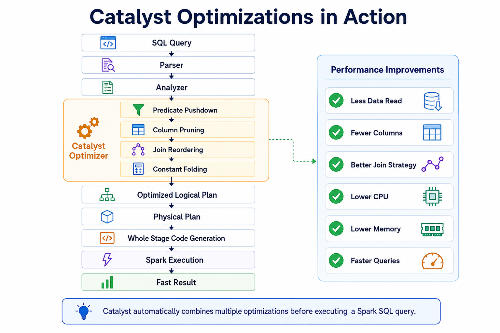
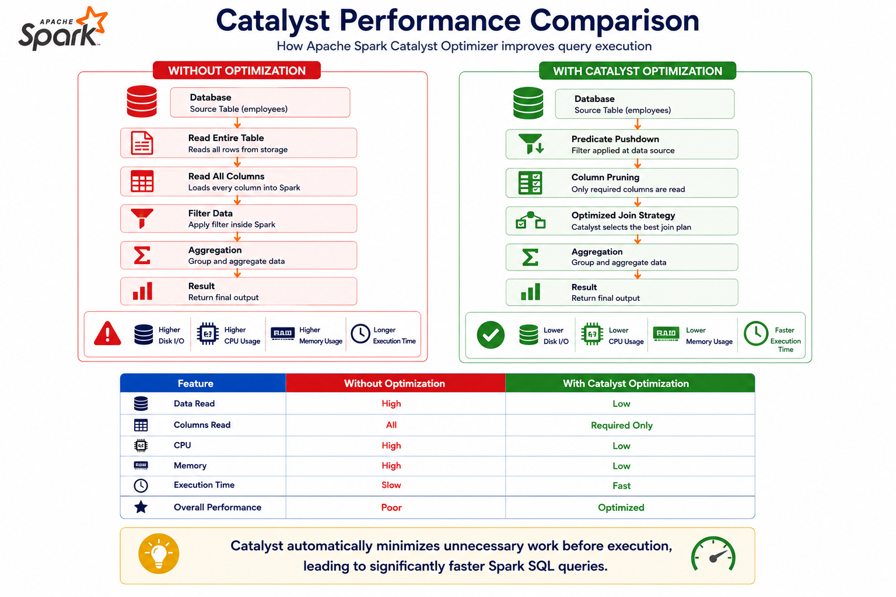

# ⚡ Catalyst Optimizer, Predicate Pushdown & Column Pruning

⬅️ [Back to Partitions and Parallelism: Coalesce](06_Coalesce.md)

---

# 📚 Table of Contents

- Overview
- Learning Objectives
- Catalyst Optimizer Architecture
- What is the Catalyst Optimizer?
- Catalyst Query Optimization Flow
- Catalyst Optimization Phases
  - Parsing
  - Analysis
  - Logical Optimization
  - Physical Planning
- Rule-Based Optimization
- Predicate Pushdown
  - What is Predicate Pushdown?
  - Benefits
  - Example
- Column Pruning
  - What is Column Pruning?
  - Benefits
  - Example
- Sample DataFrame
- Reading the Execution Plan
- Catalyst Optimizations in Action
- Performance Comparison
- Before vs After Optimization
- Supported Data Sources
- Real-World Use Cases
- Common Catalyst Optimizations
- Practical Example
- Best Practices
- Interview Questions
- Summary
- Key Takeaways

---

# 📖 Overview

Apache Spark includes a powerful built-in query optimization engine called the **Catalyst Optimizer**.

Catalyst automatically analyzes, optimizes, and rewrites Spark SQL and DataFrame queries into more efficient execution plans **without changing the query results**.

Some of the most important optimizations performed by Catalyst include:

- ⚡ Predicate Pushdown
- 📄 Column Pruning
- 🔄 Constant Folding
- 🚀 Filter Reordering
- 📊 Projection Pushdown
- 📦 Join Optimization

These optimizations significantly reduce data scanning, network communication, CPU usage, and memory consumption, making Spark highly efficient for large-scale data processing.

---

# 🏗 Catalyst Optimizer Architecture



---

# 🎯 Learning Objectives

After completing this guide, you will understand:

- What the Catalyst Optimizer is
- How Catalyst optimizes Spark queries
- Predicate Pushdown
- Column Pruning
- Reading execution plans
- Performance benefits of Catalyst optimizations

---

# 🧠 What is the Catalyst Optimizer?

The **Catalyst Optimizer** is Spark's built-in query optimization engine.

It automatically improves the performance of DataFrame and Spark SQL queries before execution.

Catalyst performs a series of optimization rules to generate the most efficient execution plan without requiring manual optimization from developers.

---

## Responsibilities

- Analyze SQL and DataFrame queries
- Resolve tables and columns
- Rewrite inefficient queries
- Optimize logical plans
- Generate optimized physical plans
- Improve execution performance

---

# 🔄 Catalyst Query Optimization Flow



---

# ⚙ Catalyst Optimization Phases

Catalyst processes queries in four major phases.

---

## 1️⃣ Parsing

Spark parses SQL or DataFrame operations into an **Unresolved Logical Plan**.

At this stage:

- Tables are not validated.
- Columns are unresolved.
- Data types are unknown.

---

## 2️⃣ Analysis

The Analyzer resolves:

- Tables
- Columns
- Data Types
- Catalog Metadata

The output becomes a **Resolved Logical Plan**.

---

## 3️⃣ Logical Optimization

Catalyst applies optimization rules such as:

- Predicate Pushdown
- Column Pruning
- Constant Folding
- Filter Simplification
- Projection Pushdown

The result is an **Optimized Logical Plan**.

---

## 4️⃣ Physical Planning

Spark generates multiple physical execution plans and selects the most efficient one using the Cost Model and Adaptive Query Execution (AQE).

---

# 🏆 Rule-Based Optimization

Catalyst is primarily a **rule-based optimizer**.

Instead of executing queries exactly as written, Spark applies optimization rules that improve performance while preserving correctness.

Examples of optimization rules include:

- Predicate Pushdown
- Column Pruning
- Constant Folding
- Boolean Expression Simplification
- Projection Pushdown
- Join Reordering

These rules are applied automatically—developers do not need to optimize queries manually.

---

# 🔍 Predicate Pushdown

## What is Predicate Pushdown?

**Predicate Pushdown** moves filter conditions as close to the data source as possible.

Instead of reading the entire dataset and filtering afterward, Spark pushes the filter to the storage layer.

---

## Without and With Predicate Pushdown



---

## Example

```python
from pyspark.sql import functions as F

movies = spark.table("workspace.default.movies")

filtered = movies.filter(
    F.col("release_year") > 2015
)
```

Catalyst attempts to push the filter

```python
release_year > 2015
```

directly to the Parquet reader.

Instead of reading every row, Spark reads only the matching records.

---

## Benefits

- ⚡ Reads fewer rows
- 🚀 Faster execution
- 💾 Lower memory usage
- 🌐 Reduced network traffic
- 📉 Reduced disk I/O

---

# 📄 Column Pruning

## What is Column Pruning?

Column Pruning is an optimization that reads **only the required columns** from the data source.

Unused columns are ignored, reducing unnecessary I/O and memory usage.

---

## Without Column Pruning

```text
Read

title
studio
budget
revenue
language
industry
currency
release_year
```

---

## With Column Pruning



---

## Example

```python
movies.select(
    "title",
    "studio"
)
```

Instead of reading every column, Spark reads only

- title
- studio

This significantly reduces data scanning for wide tables.

---

## Benefits

- 📄 Reads fewer columns
- ⚡ Faster queries
- 💾 Lower memory consumption
- 🚀 Reduced disk I/O
- 📈 Better overall performance

---

# 📂 Sample DataFrame

```python
movies = spark.table(
    "workspace.default.movies"
)
```

---

## Query

```python
from pyspark.sql import functions as F

optimized = (
    movies
    .filter(F.col("release_year") > 2015)
    .select(
        "title",
        "studio"
    )
)
```

Catalyst applies both

- Predicate Pushdown
- Column Pruning

before executing the query.

---

# 🔍 Reading the Execution Plan

```python
optimized.explain("formatted")
```

Look for

```text
PhotonScan parquet
```

and notice

```text
RequiredDataFilters
```

which indicates **Predicate Pushdown**.

Also observe

```text
ReadSchema
```

Only the required columns appear in the schema, confirming **Column Pruning**.

---

# 🚀 Catalyst Optimizations in Action



---

# 🚀 Performance Comparison

Catalyst Optimizer significantly improves Spark performance by reducing unnecessary data reads and computations.

The two most effective optimizations are:

- ⚡ Predicate Pushdown
- 📄 Column Pruning

Together, they reduce CPU usage, memory consumption, disk I/O, and network traffic.



---

# 📊 Before vs After Optimization

| Without Optimization | With Catalyst Optimization  |
| -------------------- | --------------------------- |
| Reads all rows       | Reads matching rows only    |
| Reads every column   | Reads required columns only |
| Higher disk I/O      | Lower disk I/O              |
| Higher memory usage  | Lower memory usage          |
| More CPU work        | Less CPU work               |
| Slower execution     | Faster execution            |

---

# 📂 Supported Data Sources

Predicate Pushdown and Column Pruning work best with storage systems that support metadata-based filtering.

| Data Source    | Predicate Pushdown | Column Pruning |
| -------------- | ------------------ | -------------- |
| ✅ Parquet     | Yes                | Yes            |
| ✅ ORC         | Yes                | Yes            |
| ✅ Delta Lake  | Yes                | Yes            |
| ✅ JDBC        | Yes                | Yes            |
| ✅ Hive Tables | Yes                | Yes            |
| CSV            | Limited            | Limited        |
| JSON           | Limited            | Limited        |

> **💡 Note**
>
> Columnar formats such as **Parquet**, **ORC**, and **Delta Lake** provide the best optimization because they store metadata and columns separately.

---

# 🌍 Real-World Use Cases

## 📊 Data Warehousing

Large fact tables often contain hundreds of columns.

Using Column Pruning ensures Spark reads only the columns required for analysis.

---

## 💰 Financial Analytics

Filtering transactions by date or account number allows Predicate Pushdown to read only relevant records.

---

## 🛒 E-Commerce

Customer purchase reports usually require only a few columns.

Catalyst automatically eliminates unnecessary columns.

---

## 📈 Business Intelligence

BI dashboards execute many filtered queries.

Predicate Pushdown reduces query latency by minimizing scanned data.

---

## ☁️ Data Lakes

When querying Parquet or Delta tables stored in Amazon S3, Azure Data Lake, or Google Cloud Storage, Catalyst minimizes both storage reads and network traffic.

---

# ⚡ Common Catalyst Optimizations

Besides Predicate Pushdown and Column Pruning, Catalyst performs several other optimizations.

| Optimization           | Purpose                                            |
| ---------------------- | -------------------------------------------------- |
| Predicate Pushdown     | Reads only matching rows                           |
| Column Pruning         | Reads only required columns                        |
| Constant Folding       | Evaluates constant expressions during optimization |
| Projection Pushdown    | Removes unnecessary projections                    |
| Boolean Simplification | Simplifies filter conditions                       |
| Filter Reordering      | Executes inexpensive filters first                 |
| Join Reordering        | Chooses a more efficient join order                |
| Null Propagation       | Simplifies expressions involving NULL values       |

---

# 💻 Practical Example

Without optimization

```python
movies.select("*") \
      .filter(F.col("release_year") > 2015)
```

Spark reads every column before filtering.

---

Better approach

```python
movies.filter(
    F.col("release_year") > 2015
).select(
    "title",
    "studio"
)
```

Catalyst applies:

- Predicate Pushdown
- Column Pruning

automatically.

---

# 💡 Best Practices

- ✅ Store data in **Parquet**, **ORC**, or **Delta Lake** formats to fully leverage Catalyst Optimizer features such as **Predicate Pushdown** and **Column Pruning**.
- ✅ Apply filters as early as possible in your DataFrame transformations to reduce the amount of data read and processed.
- ✅ Select only the columns required for your analysis instead of reading unnecessary columns.
- ✅ Avoid using `SELECT *` unless every column is required.
- ✅ Partition large datasets on frequently filtered columns to improve query performance.
- ✅ Push filtering and projection operations as close to the data source as possible.
- ✅ Prefer the **DataFrame API** or **Spark SQL** over low-level RDD transformations to take advantage of Catalyst's automatic optimizations.
- ✅ Use `explain("formatted")` to verify that optimizations such as **Predicate Pushdown** and **Column Pruning** are being applied.
- ✅ Keep table statistics up to date to help Spark generate more efficient execution plans.
- ✅ Minimize unnecessary transformations before filtering and projection to reduce computation.
- ✅ Regularly review execution plans when optimizing ETL pipelines and analytical workloads.

---

# 🎤 Interview Questions

### 1. What is the Catalyst Optimizer?

Catalyst Optimizer is Spark's built-in query optimization engine that automatically rewrites queries to improve performance without changing the results.

---

### 2. What are the main phases of Catalyst?

- Parsing
- Analysis
- Logical Optimization
- Physical Planning

---

### 3. What is Predicate Pushdown?

Predicate Pushdown pushes filter conditions to the data source so only matching rows are read.

---

### 4. What is Column Pruning?

Column Pruning reads only the columns required by the query, reducing disk I/O and memory usage.

---

### 5. Why is Predicate Pushdown important?

It reduces:

- Data scanned
- Disk I/O
- Network traffic
- Memory usage

---

### 6. Why is Column Pruning important?

It avoids reading unnecessary columns, making queries faster and more memory efficient.

---

### 7. Which file formats support Predicate Pushdown?

- Parquet
- ORC
- Delta Lake
- JDBC
- Hive Tables

---

### 8. Which file formats provide the best Column Pruning?

- Parquet
- ORC
- Delta Lake

---

### 9. How can you verify Predicate Pushdown?

Use:

```python
df.explain("formatted")
```

Look for

```text
RequiredDataFilters
```

---

### 10. How can you verify Column Pruning?

Inspect

```text
ReadSchema
```

Only required columns should appear.

---

### 11. Does Catalyst work with DataFrames?

Yes.

Catalyst automatically optimizes DataFrame and Spark SQL queries.

---

### 12. Does Catalyst optimize RDD operations?

No.

RDDs bypass Catalyst because they operate at a lower level.

---

### 13. Can developers disable Catalyst?

Normally, Catalyst works automatically and requires no manual intervention.

---

### 14. Why is Parquet recommended for Spark?

Because Parquet supports:

- Predicate Pushdown
- Column Pruning
- Columnar Storage
- Compression

---

### 15. Which optimization usually provides the biggest performance improvement?

For analytical workloads on Parquet or Delta tables:

- Predicate Pushdown
- Column Pruning

often provide the largest performance gains.

---

# 📊 Summary

| Concept                 | Description                                           |
| ----------------------- | ----------------------------------------------------- |
| Catalyst Optimizer      | Spark's built-in query optimization engine            |
| Predicate Pushdown      | Reads only matching rows from the data source         |
| Column Pruning          | Reads only required columns                           |
| Rule-Based Optimization | Automatically rewrites queries for better performance |
| `RequiredDataFilters` | Indicates Predicate Pushdown                          |
| `ReadSchema`          | Indicates Column Pruning                              |

---

# 🎯 Key Takeaways

- Catalyst Optimizer is Spark's built-in query optimization engine that automatically rewrites queries to improve performance without changing the results.
- It analyzes logical plans, applies optimization rules, and generates efficient physical execution plans.
- **Predicate Pushdown** reduces the amount of data read by pushing filter conditions to the data source whenever possible.
- **Column Pruning** reads only the required columns, reducing disk I/O, memory usage, and network traffic.
- Together, these optimizations significantly improve query performance and reduce computational overhead.
- Columnar storage formats such as **Parquet**, **ORC**, and **Delta Lake** provide the best support for Catalyst optimizations.
- Use `explain("formatted")` to inspect execution plans and verify that Catalyst optimizations are being applied.
- Understanding Catalyst Optimizer, Predicate Pushdown, and Column Pruning is essential for building efficient, scalable, and production-ready Spark ETL pipelines.

---

# 📚 Next Topic

➡️ [Broadcast Join, Shuffle Hash Join and Join Hints](08_Joins_Optimization.md)