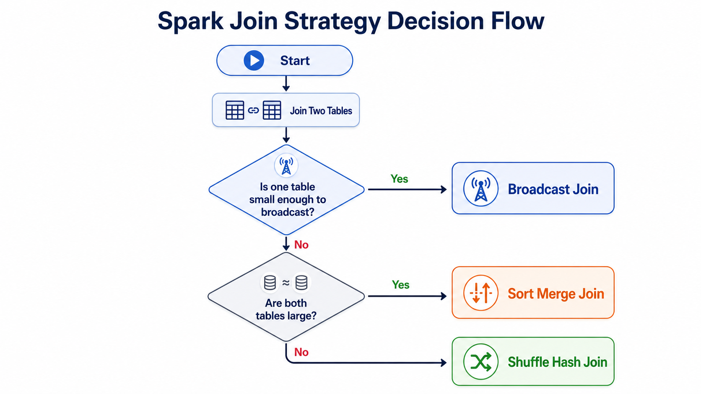
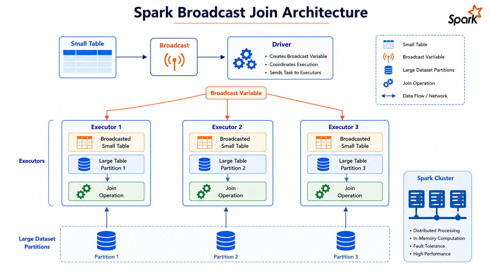
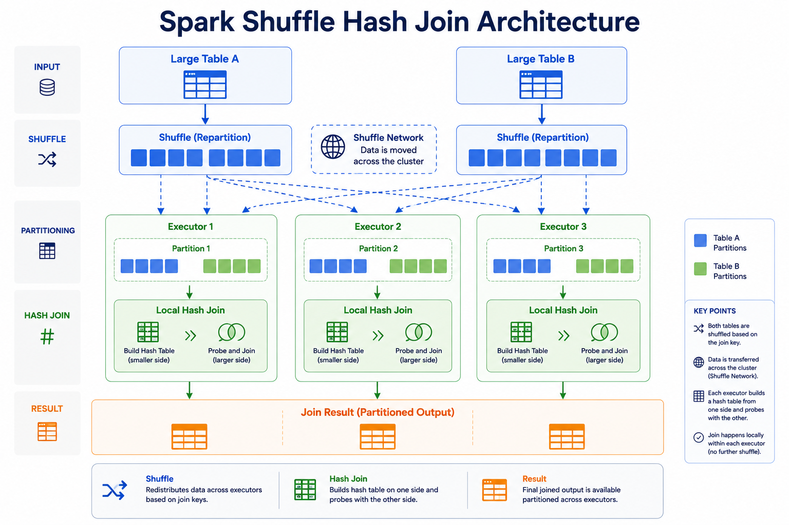
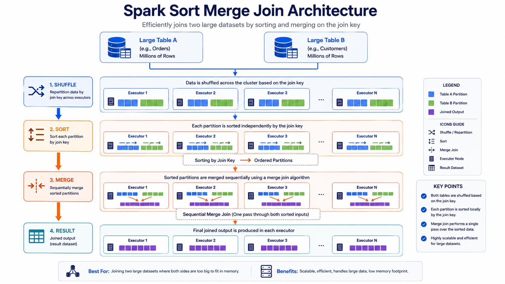
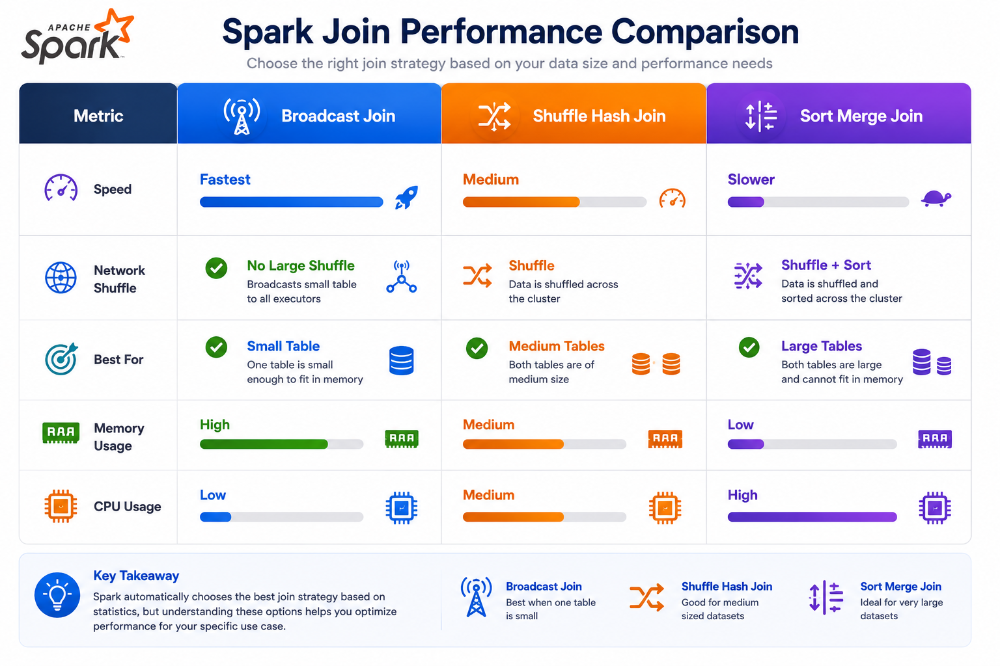
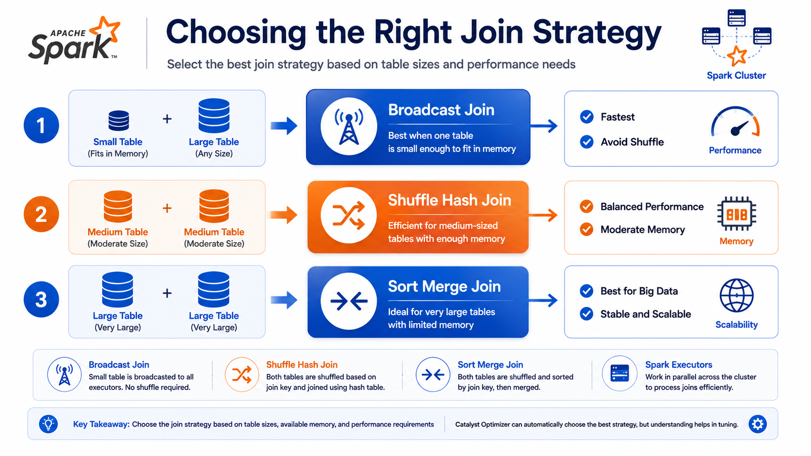

# ⚡ Spark Join Strategies: Broadcast Join, Shuffle Hash Join, Sort Merge Join & Join Hints

⬅️ [Back to Partitions and Parallelism: Coalesce](06_Coalesce.md)

---

# 📚 Table of Contents

- Overview
- Learning Objectives
- Spark Join Strategy Decision Flow
- Why Join Strategies Matter
- Broadcast Hash Join
  - What is a Broadcast Join?
  - Architecture
  - Advantages
  - Limitations
  - Example
  - When to Use
- Shuffle Hash Join
  - What is a Shuffle Hash Join?
  - Architecture
  - Advantages
  - Limitations
  - Example
  - When to Use
- Sort Merge Join
  - What is a Sort Merge Join?
  - Execution Flow
  - Advantages
  - Limitations
- Spark Join Strategy Selection
- Join Hints
  - Broadcast Hint
  - Shuffle Hash Hint
  - Merge Hint
- Reading the Execution Plan
- Performance Comparison
- Broadcast vs Shuffle Hash vs Sort Merge
- Real-World Use Cases
- Choosing the Right Join Strategy
- Best Practices
- Interview Questions
- Summary
- Key Takeaways

---

# 📖 Overview

Joining large datasets is one of the most expensive operations in Apache Spark. The performance of a join depends on the size of the datasets, the available cluster resources, and the join strategy selected by Spark.

Spark automatically chooses the most efficient join strategy using its **Catalyst Optimizer** and **Cost-Based Optimizer (CBO)**. Depending on the size of the input datasets, Spark may choose:

- 📦 Broadcast Hash Join
- 🔀 Shuffle Hash Join
- 🔄 Sort Merge Join

Choosing the appropriate join strategy is essential for building efficient and scalable ETL pipelines.

---

# 🎯 Learning Objectives

After completing this guide, you will understand:

- Why Spark uses different join strategies
- What a Broadcast Join is
- What a Shuffle Hash Join is
- What a Sort Merge Join is
- How Spark selects a join strategy
- When each join type should be used

---

# 🏗 Spark Join Strategy Decision Flow

Spark automatically selects a join strategy based on the size of the input datasets.



---

# ❓ Why Join Strategies Matter?

Different join strategies have different performance characteristics.

A poor join strategy can lead to:

- High shuffle cost
- Increased network traffic
- Long execution time
- Memory pressure
- Data skew

Selecting the right strategy helps Spark minimize resource usage and improve query performance.

---

# 📦 Broadcast Hash Join

## What is a Broadcast Join?

A **Broadcast Hash Join** is an optimization where Spark sends the **entire smaller dataset** to every executor in the cluster.

Since each executor already has a local copy of the small table, Spark avoids shuffling the large dataset.

This is the fastest join strategy when one dataset is significantly smaller than the other.

---

## Broadcast Join Architecture



---

## Advantages

- ⚡ No shuffle of the large table
- 🚀 Fastest join strategy
- 💾 Lower network overhead
- 📉 Reduced execution time

---

## Limitations

- Small table must fit in executor memory.
- Broadcasting a large table can cause OutOfMemory errors.
- Not suitable when both datasets are large.

---

## Example

```python
from pyspark.sql.functions import broadcast

result = orders.join(
    broadcast(customers),
    "customer_id"
)
```

Spark broadcasts the **customers** table to every executor.

---

## When to Use

Use Broadcast Join when:

- One table is very small
- Lookup tables
- Dimension tables
- Configuration tables
- Reference data

---

# 🔀 Shuffle Hash Join

## What is a Shuffle Hash Join?

A **Shuffle Hash Join** is used when a Broadcast Join is not possible.

Spark redistributes **both datasets** across the cluster using the join key. Each executor builds a hash table for one partition and joins the matching records.

Unlike Broadcast Join, **both datasets participate in the shuffle**.

---

## Shuffle Hash Join Architecture



---

## Advantages

- Works for medium and large datasets
- Better than broadcasting when the small table cannot fit in memory
- Efficient for hash-based joins

---

## Limitations

- Requires shuffle
- Higher network traffic
- Increased disk I/O
- Slower than Broadcast Join

---

## Example

```python
result = orders.join(
    customers,
    "customer_id"
)
```

If Spark determines broadcasting is not possible, it may choose a Shuffle Hash Join.

---

## When to Use

Use Shuffle Hash Join when:

- Both tables are moderately large
- Broadcast Join is not feasible
- Join keys are well distributed

---

# 🔄 Sort Merge Join

## What is a Sort Merge Join?

A **Sort Merge Join** is Spark's default strategy for joining two large datasets.

Spark first shuffles both datasets, sorts them by the join key, and then merges the matching records.

Although it is more expensive than Broadcast Join, it scales efficiently for very large datasets.

---

## Execution Flow



---

## Advantages

- Handles very large datasets
- Scalable
- Stable performance
- Default strategy for large joins

---

## Limitations

- Shuffle required
- Sorting required
- Higher CPU usage
- Slower than Broadcast Join

---

# ⚙ Spark Join Strategy Selection

Spark automatically chooses a join strategy using the Catalyst Optimizer and Cost-Based Optimizer.

Decision logic

```text
if small_table_size < broadcast_threshold:
    Broadcast Hash Join

elif both_tables_are_large:
    Sort Merge Join

else:
    Shuffle Hash Join
```

Spark considers:

- Dataset size
- Broadcast threshold
- Join type
- Table statistics
- Adaptive Query Execution (AQE)

---
# 💡 Join Hints

Spark automatically selects the best join strategy using the **Catalyst Optimizer** and **Cost-Based Optimizer (CBO)**.

However, developers can override Spark's decision using **Join Hints**.

Join hints instruct Spark to prefer a specific join strategy during query planning.

---

## Available Join Hints

| Hint | Description |
|------|-------------|
| `broadcast` | Forces a Broadcast Hash Join |
| `shuffle_hash` | Forces a Shuffle Hash Join |
| `merge` | Forces a Sort Merge Join |
| `shuffle_replicate_nl` | Forces a Shuffle Replicate Nested Loop Join (rarely used) |

---

# 📡 Broadcast Hint

Use the `broadcast` hint when one table is significantly smaller than the other.

```python
from pyspark.sql.functions import broadcast

result = orders.join(
    broadcast(customers),
    "customer_id"
)
```

or

```python
customers = customers.hint("broadcast")

result = orders.join(
    customers,
    "customer_id"
)
```

Spark broadcasts the smaller DataFrame to every executor.

---

# 🔀 Shuffle Hash Hint

Force Spark to use a Shuffle Hash Join.

```python
orders = orders.hint("shuffle_hash")

result = orders.join(
    customers,
    "customer_id"
)
```

Spark redistributes both datasets using the join key before performing the hash join.

---

# 🔄 Merge Hint

Force Spark to use a Sort Merge Join.

```python
orders = orders.hint("merge")

result = orders.join(
    customers,
    "customer_id"
)
```

Useful when joining two very large datasets.

---

# 🏗 Reading the Execution Plan

Spark's execution plan reveals which join strategy was selected.

```python
result.explain("formatted")
```

Look for operators such as:

```text
BroadcastHashJoin
```

or

```text
ShuffledHashJoin
```

or

```text
SortMergeJoin
```

These operators indicate the join strategy chosen by Spark.

---

# 📊 Performance Comparison



---

# ⚖ Broadcast vs Shuffle Hash vs Sort Merge

## 📦 Broadcast Hash Join

### Best For

- Lookup tables
- Dimension tables
- Configuration tables
- Small datasets

### Avoid When

- Small table exceeds executor memory
- Both tables are large

---

## 🔀 Shuffle Hash Join

### Best For

- Medium-sized datasets
- Hash joins

### Avoid When

- Heavy data skew exists
- Very large datasets require sorting

---

## 🔄 Sort Merge Join

### Best For

- Large fact tables
- Data warehouse workloads
- Analytical queries

### Avoid When

- One table is very small (Broadcast Join is more efficient)

---

# 🌍 Real-World Use Cases

## 📊 Data Warehouse

Join a large fact table with a small dimension table.

Recommended Join

✅ Broadcast Join

---

## 🛒 E-Commerce

Join orders with customer information.

Recommended Join

✅ Broadcast Join

---

## 💳 Banking

Join millions of transactions with account records.

Recommended Join

✅ Sort Merge Join

---

## 📈 Sales Analytics

Join large sales and product datasets.

Recommended Join

✅ Sort Merge Join

---

## 🔍 Lookup Tables

Country codes

Currency mappings

Department information

Recommended Join

✅ Broadcast Join

---

# 🚀 Choosing the Right Join Strategy



---

# 💡 Best Practices

- ✅ Let Spark automatically choose the most appropriate join strategy whenever possible.
- ✅ Use **Broadcast Hash Join** when one table is significantly smaller than the other, such as lookup or dimension tables.
- ✅ Ensure the broadcast table fits into executor memory to avoid memory-related failures.
- ✅ Use **Shuffle Hash Join** for medium-sized datasets when broadcasting is not feasible.
- ✅ Use **Sort Merge Join** for joining two large datasets, especially in analytical and data warehouse workloads.
- ✅ Apply **join hints** (`broadcast`, `shuffle_hash`, `merge`) only when you understand your data size, distribution, and workload.
- ✅ Keep table statistics up to date so Spark can make better join strategy decisions.
- ✅ Use `explain("formatted")` to verify the join strategy selected by Spark.
- ✅ Monitor shuffle operations and task execution using the **Spark UI** to identify performance bottlenecks.
- ✅ Minimize unnecessary shuffle operations to reduce network traffic, disk I/O, and execution time.
- ✅ Watch for **data skew** on join keys and repartition data if required to balance workloads.
- ✅ Cache or persist frequently reused lookup tables to improve the performance of repeated joins.

---

# 🎤 Interview Questions

### 1. What is a Broadcast Hash Join?

A Broadcast Hash Join sends the smaller dataset to every executor, avoiding a shuffle of the larger dataset.

---

### 2. When should you use a Broadcast Join?

When one table is small enough to fit into executor memory.

---

### 3. What is a Shuffle Hash Join?

A Shuffle Hash Join redistributes both datasets across the cluster using the join key before performing a hash join.

---

### 4. What is a Sort Merge Join?

A Sort Merge Join shuffles and sorts both datasets before merging matching records.

---

### 5. Which join is the fastest?

Broadcast Hash Join.

---

### 6. Which join is Spark's default for large datasets?

Sort Merge Join.

---

### 7. Which join requires sorting?

Sort Merge Join.

---

### 8. Which join avoids shuffling the large table?

Broadcast Hash Join.

---

### 9. What are Join Hints?

Join Hints allow developers to influence Spark's join strategy selection.

---

### 10. Name some Join Hints.

- `broadcast`
- `shuffle_hash`
- `merge`
- `shuffle_replicate_nl`

---

### 11. How do you force a Broadcast Join?

```python
from pyspark.sql.functions import broadcast

orders.join(
    broadcast(customers),
    "customer_id"
)
```

---

### 12. How can you verify the selected join strategy?

Use:

```python
result.explain("formatted")
```

---

### 13. Which execution plan operators indicate join strategies?

- `BroadcastHashJoin`
- `ShuffledHashJoin`
- `SortMergeJoin`

---

### 14. Why can Broadcast Join fail?

Because the broadcast table may exceed the available executor memory.

---

### 15. Why are proper join strategies important?

They reduce shuffle operations, improve scalability, lower memory usage, and significantly improve query performance.

---

# 📊 Summary

| Concept | Description |
|----------|-------------|
| Broadcast Hash Join | Broadcasts the small table to every executor |
| Shuffle Hash Join | Shuffles both datasets and performs a hash join |
| Sort Merge Join | Shuffles and sorts both datasets before joining |
| Join Hint | Guides Spark to use a preferred join strategy |
| `BroadcastHashJoin` | Execution plan operator for broadcast joins |
| `ShuffledHashJoin` | Execution plan operator for shuffle hash joins |
| `SortMergeJoin` | Execution plan operator for sort merge joins |

---

# 🎯 Key Takeaways

- Apache Spark supports multiple join strategies to efficiently process datasets of different sizes.
- **Broadcast Hash Join** is the fastest join strategy and is ideal when one table is small enough to fit into executor memory.
- **Shuffle Hash Join** redistributes both datasets using the join key and is suitable for medium-sized datasets.
- **Sort Merge Join** is Spark's default strategy for joining large datasets and is commonly used in big data analytics.
- Spark automatically selects the most efficient join strategy using the **Catalyst Optimizer** and **Cost-Based Optimizer (CBO)**.
- Developers can influence Spark's execution plan using **join hints** such as `broadcast`, `shuffle_hash`, and `merge` when necessary.
- Use `explain("formatted")` to inspect and verify the join strategy chosen by Spark.
- Choosing the correct join strategy reduces shuffle operations, minimizes memory and network overhead, and significantly improves the performance and scalability of Spark applications.

---

# 📚 Next Topic

➡️ [Data Skew and mitigation techniques](09_Data_Skew.md)