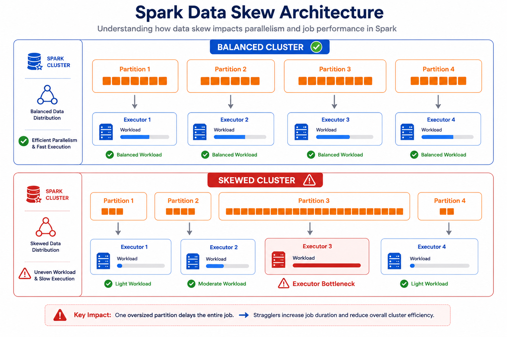
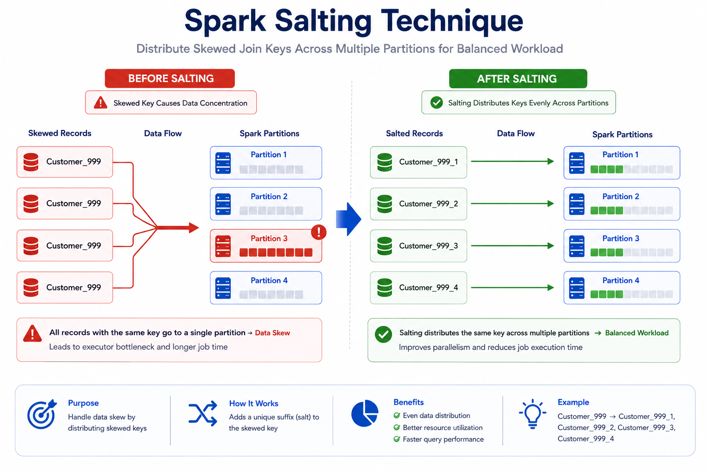
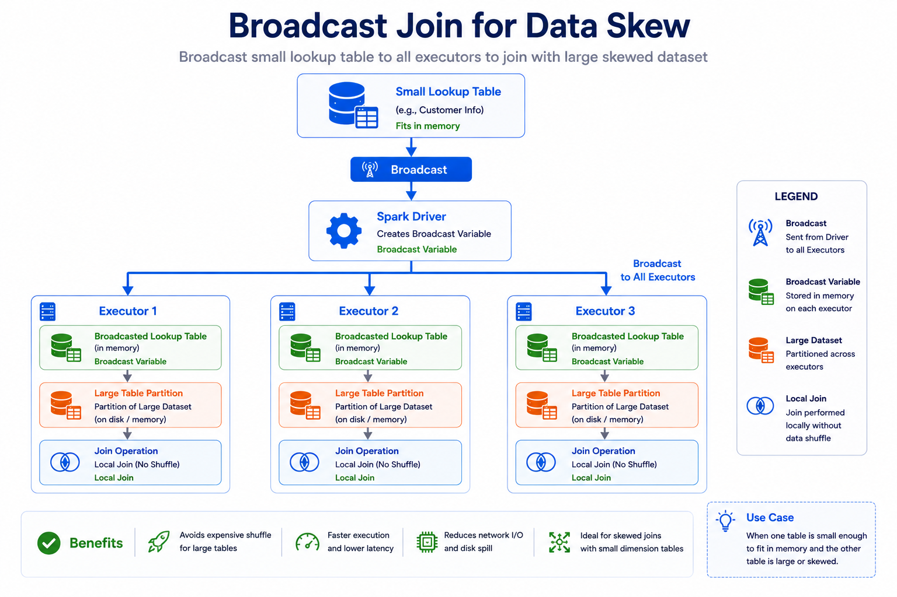
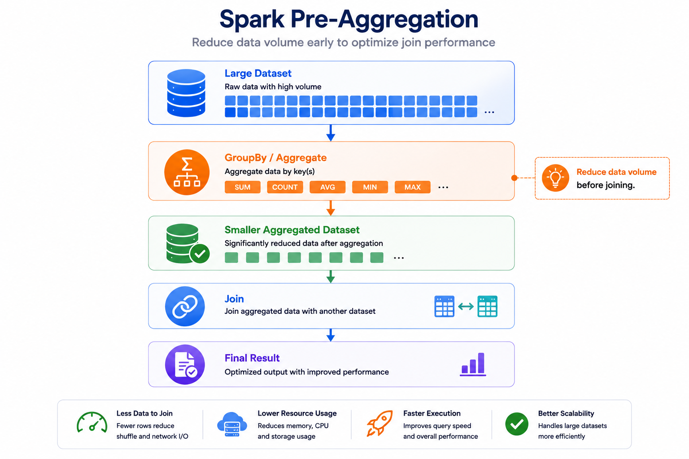
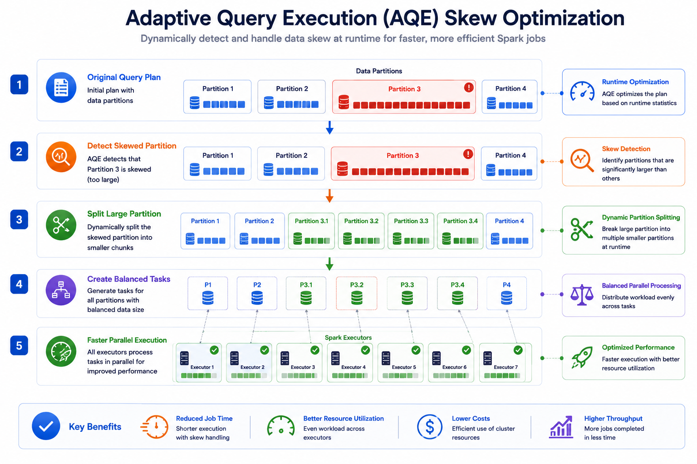
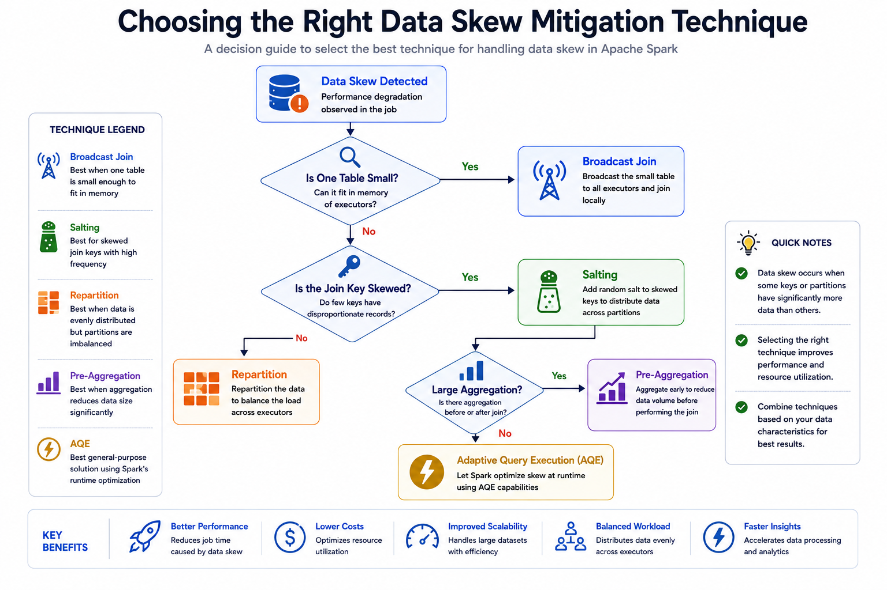

# ⚡ Spark Data Skew & Mitigation Techniques

⬅️ [Back to Broadcast Join, Shuffle Hash Join and Join Hints](08_Joins_Optimization.md)

---

# 📚 Table of Contents

- Overview
- Learning Objectives
- What is Data Skew?
- Why Data Skew Happens
- Why Data Skew is a Problem
- Data Skew Architecture
- Identifying Data Skew
- Mitigation Techniques
  - Salting
  - Broadcast Join
  - Pre-Aggregation
  - Repartitioning
  - Adaptive Query Execution (AQE)
- Performance Comparison
- Choosing the Right Mitigation Technique
- Real-World Use Cases
- Best Practices
- Interview Questions
- Summary
- Key Takeaways

---

# 📖 Overview

**Data Skew** is one of the most common performance issues in Apache Spark.

It occurs when data is **unevenly distributed across partitions**, causing some executors to process significantly more data than others.

Instead of all executors finishing their work at roughly the same time, a few executors become **stragglers**, increasing the overall execution time of the Spark job.

Apache Spark provides several techniques to mitigate data skew, including:

- 🧂 Salting
- 📦 Broadcast Join
- 📊 Pre-Aggregation
- 🔄 Repartitioning
- ⚡ Adaptive Query Execution (AQE)

Choosing the right mitigation technique improves workload balancing, reduces shuffle costs, and increases overall Spark performance.

---

# 🎯 Learning Objectives

After completing this guide, you will understand:

- What Data Skew is
- Why Data Skew occurs
- Why Data Skew affects Spark performance
- How to identify skewed data
- How Salting reduces skew
- How Broadcast Join helps avoid skew
- How Pre-Aggregation minimizes shuffle

---

# ⚠️ What is Data Skew?

**Data Skew** occurs when some partitions contain significantly more records than others.

Instead of distributing work evenly across the cluster, Spark assigns much more work to a few executors while others finish quickly and remain idle.

This imbalance results in poor resource utilization and longer execution times.

---

## Example

Suppose customer orders are distributed as follows:

| Customer ID | Number of Orders |
| ----------- | ---------------: |
| 101         |               12 |
| 102         |               18 |
| 103         |               25 |
| 999         |        5,000,000 |

Customer **999** contains millions of records while the others contain only a few.

When Spark partitions data using **customer_id**, one partition becomes extremely large.

---

# ❓ Why Data Skew Happens

Data skew usually occurs because some values appear much more frequently than others.

Common causes include:

- One customer has millions of transactions.
- One product is significantly more popular than others.
- One country contains most of the records.
- Poor partitioning strategy.
- Joining datasets with highly skewed keys.

---

# 🚨 Why Data Skew is a Problem

Data skew negatively impacts Spark performance.

Problems include:

- ⚠️ Long-running tasks
- ⚠️ Uneven workload distribution
- ⚠️ High shuffle cost
- ⚠️ Increased memory usage
- ⚠️ Poor cluster utilization
- ⚠️ Executor OutOfMemory errors

These long-running tasks are called **Straggler Tasks** because they finish much later than the rest of the executors.

---

# 🏗 Data Skew Architecture



---

# 🧂 Mitigation Technique 1: Salting

## What is Salting?

Salting is a technique used to distribute skewed keys more evenly across partitions.

Instead of keeping one heavily skewed key, Spark creates multiple versions of that key by adding a random suffix.

This spreads the workload across multiple executors.

---

## Architecture



---

## Example

Original key

```text
999
999
999
999
999
```

After salting

```text
999_1
999_2
999_3
999_1
999_2
```

Now Spark distributes these records across multiple partitions.

---

## Benefits

- Better load balancing
- Reduced shuffle bottlenecks
- Faster joins
- Improved parallelism

---

# 📦 Mitigation Technique 2: Broadcast Join

## What is Broadcast Join?

If one dataset is small enough to fit into executor memory, Spark can broadcast it to every executor.

Instead of shuffling the large skewed dataset, only the small dataset is copied.

This avoids expensive shuffle operations.

---

## Architecture



---

## Example

```python
from pyspark.sql.functions import broadcast

result = large_df.join(
    broadcast(small_df),
    "customer_id"
)
```

Spark broadcasts `small_df` to every executor.

---

## Benefits

- No shuffle of large table
- Faster joins
- Lower network traffic
- Reduced skew impact

---

# 📊 Mitigation Technique 3: Pre-Aggregation

## What is Pre-Aggregation?

Instead of joining large raw datasets, aggregate the data first.

This reduces the amount of data involved in the join.

---

## Architecture



---

## Example

```python
sales_summary = (
    sales
    .groupBy("customer_id")
    .sum("amount")
)

result = sales_summary.join(
    customers,
    "customer_id"
)
```

Instead of joining millions of sales records, Spark joins the aggregated dataset.

---

## Benefits

- Less shuffle
- Less memory usage
- Faster joins
- Better scalability

---

# 💻 Practical Example

Suppose the following join is skewed.

```python
orders.join(
    customers,
    "customer_id"
)
```

Possible optimizations:

✅ Use Broadcast Join if `customers` is small.

```python
orders.join(
    broadcast(customers),
    "customer_id"
)
```

Or aggregate first.

```python
orders.groupBy("customer_id") \
      .sum("amount")
```

Or apply salting to the skewed keys.

---

# 🔄 Mitigation Technique 4: Repartitioning

## What is Repartitioning?

**Repartitioning** redistributes data evenly across partitions by performing a full shuffle.

Unlike **Salting**, which modifies skewed keys, repartitioning balances the entire dataset across executors.

It is useful when partitions become uneven after filtering, joining, or aggregating large datasets.

---

## Without Repartitioning

```text
Partition 1   ███
Partition 2   ████████████████████
Partition 3   ██
Partition 4   ████
```

---

## After Repartitioning

```text
Partition 1   ███████
Partition 2   ███████
Partition 3   ███████
Partition 4   ███████
```

> 📌 **Add image here:** `images/Spark_Repartition_for_Skew.png`

---

## Example

```python
balanced_df = df.repartition(8, "customer_id")
```

Spark redistributes the data using **customer_id** as the partition key.

---

## Benefits

- Better workload balancing
- Improved parallelism
- Reduced skew during joins and aggregations
- More efficient resource utilization

---

## Limitations

- Requires a full shuffle
- Higher network I/O
- Additional CPU overhead

---

# ⚡ Mitigation Technique 5: Adaptive Query Execution (AQE)

## What is Adaptive Query Execution?

**Adaptive Query Execution (AQE)** is a Spark optimization feature that dynamically improves the execution plan while a job is running.

Instead of relying only on compile-time statistics, AQE uses runtime statistics to optimize query execution.

One of AQE's most important features is **automatic skew join optimization**.

---

## Architecture



---

## Enable AQE

```python
spark.conf.set(
    "spark.sql.adaptive.enabled",
    "true"
)
```

Enable skew join optimization

```python
spark.conf.set(
    "spark.sql.adaptive.skewJoin.enabled",
    "true"
)
```

---

## Benefits

- Automatically detects skewed partitions
- Splits oversized partitions
- Reduces long-running tasks
- Improves join performance
- No manual code changes required

---

# 📊 Performance Comparison

| Technique | Shuffle Required | Best Use Case | Performance |
|------------|-----------------|---------------|-------------|
| Salting | Partial | Highly skewed join keys | ⭐⭐⭐⭐⭐ |
| Broadcast Join | No | Small lookup tables | ⭐⭐⭐⭐⭐ |
| Pre-Aggregation | Partial | Large aggregations before joins | ⭐⭐⭐⭐ |
| Repartition | Yes | Balancing uneven partitions | ⭐⭐⭐⭐ |
| AQE | Automatic | Runtime skew optimization | ⭐⭐⭐⭐⭐ |

---

# 📈 Choosing the Right Mitigation Technique



---

# 🌍 Real-World Use Cases

## 🛒 E-Commerce

Millions of orders belong to a few popular customers.

Recommended Technique

✅ Salting

---

## 🏦 Banking

Large transaction table joined with a small customer table.

Recommended Technique

✅ Broadcast Join

---

## 📊 Data Warehousing

Aggregate billions of sales records before joining with dimension tables.

Recommended Technique

✅ Pre-Aggregation

---

## 📈 ETL Pipelines

Uneven partitions after multiple transformations.

Recommended Technique

✅ Repartition

---

## ☁️ Large Spark Clusters

Automatically optimize skew during execution.

Recommended Technique

✅ Adaptive Query Execution (AQE)

---


# 💡 Best Practices

- ✅ Identify skewed keys early by analyzing data distribution before performing joins or aggregations.
- ✅ Use **Salting** to distribute highly skewed keys across multiple partitions for better workload balancing.
- ✅ Use **Broadcast Join** when one dataset is small enough to fit into executor memory, avoiding expensive shuffle operations.
- ✅ Apply **Pre-Aggregation** before joining large datasets to reduce the amount of data shuffled across the cluster.
- ✅ Use **Repartition** only when necessary to rebalance uneven partitions, as it triggers a full shuffle.
- ✅ Enable **Adaptive Query Execution (AQE)** to automatically detect and optimize skewed partitions during runtime.
- ✅ Monitor task execution, shuffle size, and partition distribution using the **Spark UI** to identify performance bottlenecks.
- ✅ Inspect execution plans with `explain("formatted")` to understand shuffle operations and Spark's optimization decisions.
- ✅ Watch for data skew after joins, aggregations, and filtering operations, and optimize accordingly.
- ✅ Continuously monitor partition sizes to ensure balanced workloads and efficient resource utilization across executors.

---

# 🎤 Interview Questions

### 1. What is Data Skew?

Data Skew occurs when some partitions contain significantly more data than others, leading to uneven workload distribution.

---

### 2. Why is Data Skew a problem?

It causes long-running tasks, excessive shuffle, poor resource utilization, and slower Spark jobs.

---

### 3. What are Straggler Tasks?

Tasks that take much longer to finish because they process disproportionately large partitions.

---

### 4. What is Salting?

Salting adds random prefixes or suffixes to skewed keys, distributing records more evenly across partitions.

---

### 5. When should you use Broadcast Join?

When one dataset is small enough to fit into executor memory.

---

### 6. How does Pre-Aggregation reduce skew?

It aggregates data before joining, reducing the amount of shuffled data.

---

### 7. What does Repartition do?

It redistributes data evenly across partitions through a shuffle operation.

---

### 8. What is Adaptive Query Execution (AQE)?

AQE dynamically optimizes Spark execution plans during runtime using actual execution statistics.

---

### 9. How does AQE handle skew?

AQE automatically detects oversized partitions and splits them into smaller tasks for balanced execution.

---

### 10. How can you identify Data Skew?

By monitoring the **Spark UI**, task duration, shuffle read size, partition sizes, and execution plans.

---

### 11. Which technique avoids shuffle for small lookup tables?

Broadcast Join.

---

### 12. Which mitigation technique requires a full shuffle?

Repartition.

---

### 13. Which technique modifies skewed keys?

Salting.

---

### 14. Can AQE reduce manual optimization?

Yes. AQE automatically optimizes skewed joins and execution plans at runtime.

---

### 15. What is the best approach to mitigate Data Skew?

The best technique depends on the workload:

- Small lookup table → Broadcast Join
- Skewed join keys → Salting
- Large aggregations → Pre-Aggregation
- Uneven partitions → Repartition
- Runtime optimization → AQE

---

# 📊 Summary

| Concept | Description |
|----------|-------------|
| Data Skew | Uneven distribution of data across partitions |
| Salting | Distributes skewed keys across multiple partitions |
| Broadcast Join | Broadcasts a small table to avoid shuffling |
| Pre-Aggregation | Aggregates data before joining |
| Repartition | Redistributes data evenly across partitions |
| AQE | Automatically optimizes skew during execution |

---

# 🎯 Key Takeaways

- Data Skew occurs when data is unevenly distributed across partitions, causing some executors to process significantly more data than others.
- Skewed data leads to **straggler tasks**, excessive shuffle operations, higher memory usage, and poor cluster utilization.
- **Salting** distributes heavily skewed keys across multiple partitions to improve workload balancing.
- **Broadcast Join** eliminates unnecessary shuffling by broadcasting small lookup tables to all executors.
- **Pre-Aggregation** reduces the volume of data before joins, minimizing shuffle and improving performance.
- **Repartition** helps balance uneven partitions but should be used carefully because it introduces a shuffle.
- **Adaptive Query Execution (AQE)** automatically detects and mitigates data skew during runtime, reducing the need for manual optimization.
- Selecting the appropriate skew mitigation technique improves scalability, reduces execution time, and enhances the overall performance of Spark applications.

---

# 📚 Next Topic

➡️ [Adaptive Query Execution (AQE)](10_Adaptive_Query_Execution(AQE).md)

