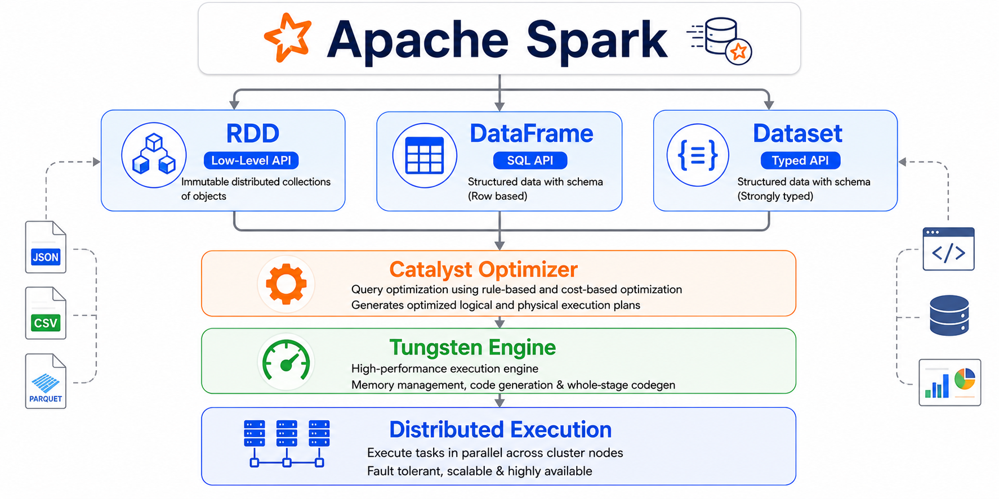
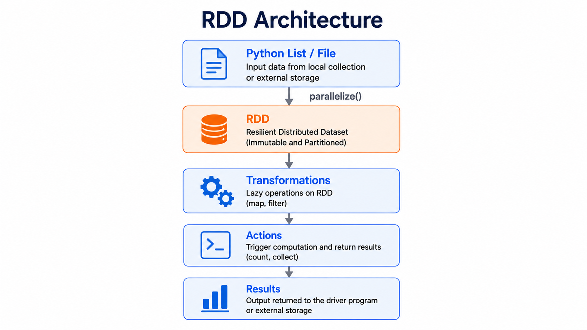
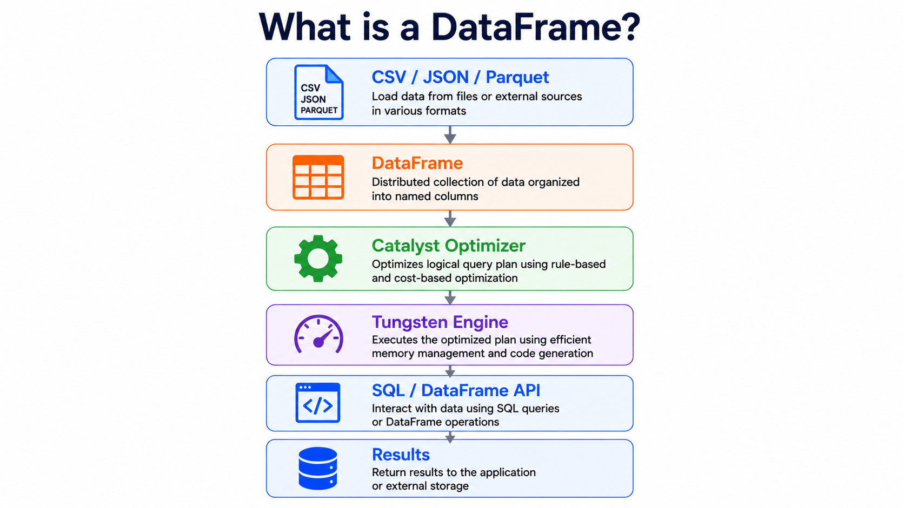
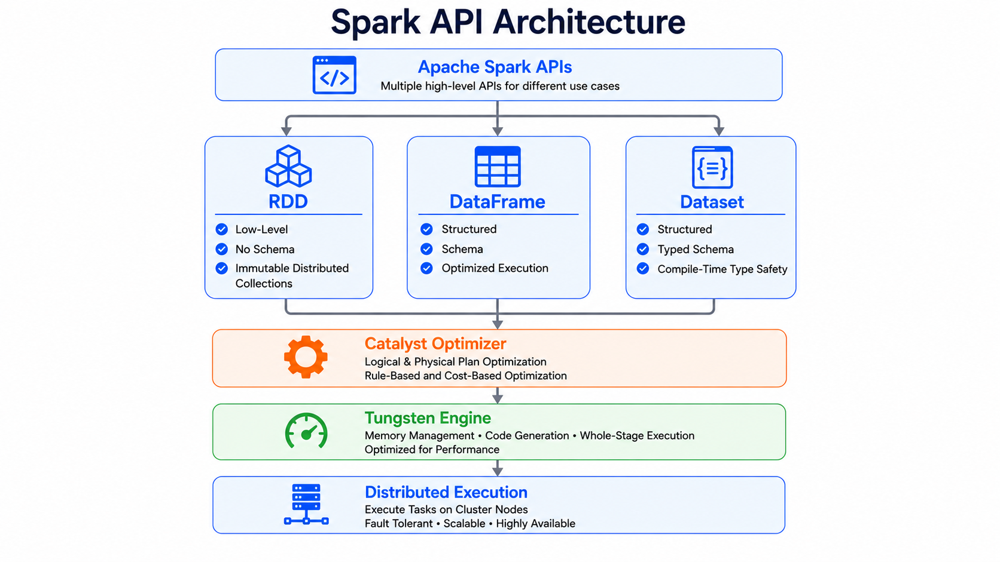
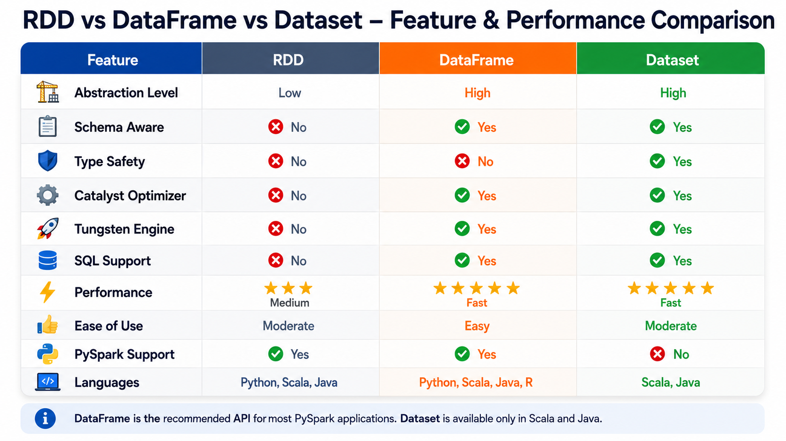
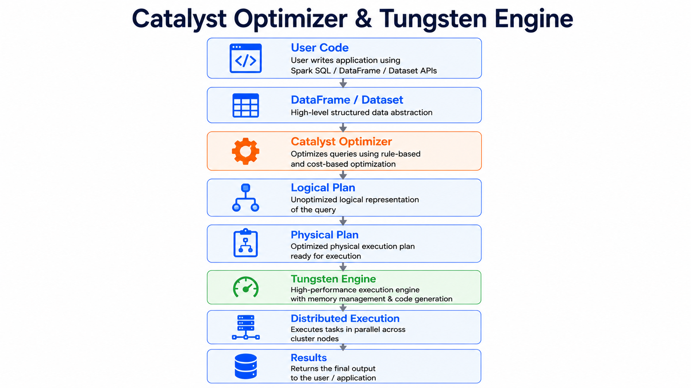
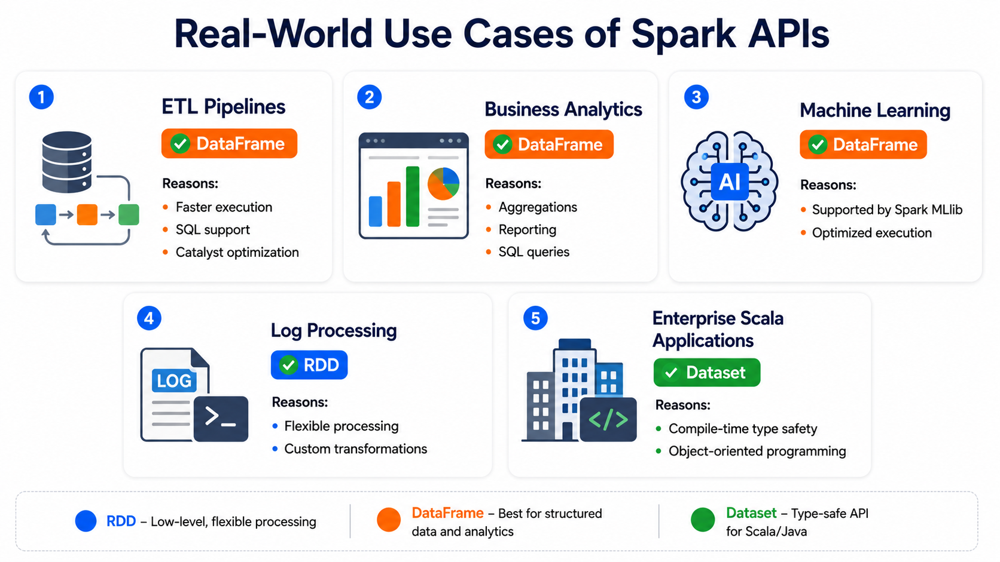
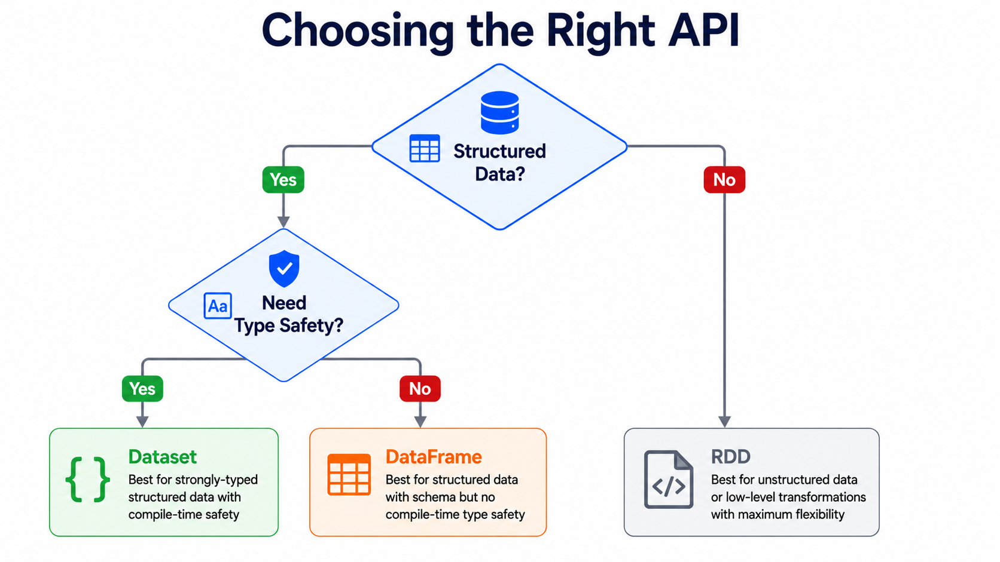

# ⚡ RDD, DataFrame & Dataset in Apache Spark

⬅️ [back to Adaptive Query Execution (AQE)](10_Adaptive_Query_Execution(AQE).md)



---

# 📚 Table of Contents

- Overview
- Learning Objectives
- Apache Spark APIs
- What is an RDD?
- RDD Architecture
- Key Characteristics of RDD
- Creating an RDD
- DataFrame to RDD Conversion
- What is a DataFrame?
- What is a Dataset?
- Spark API Architecture
- RDD vs DataFrame vs Dataset
- Performance Comparison
- Catalyst Optimizer & Tungsten Engine
- Spark Execution Flow
- When to Use Each API
- Real-World Use Cases
- Choosing the Right API
- Best Practices
- Interview Questions
- Summary
- Key Takeaways

---

# 📖 Overview

Apache Spark provides three primary APIs for distributed data processing:

- 🔹 **RDD (Resilient Distributed Dataset)**
- 🔹 **DataFrame**
- 🔹 **Dataset**

RDD is Spark's original low-level distributed data structure that offers maximum flexibility and control.

DataFrames provide a higher-level, SQL-like abstraction built on top of RDDs, offering schema awareness and automatic query optimization.

Datasets combine the benefits of RDDs and DataFrames by providing compile-time type safety along with Spark's optimization engine. However, **Datasets are available only in Scala and Java, not in PySpark**.

For most modern Spark applications, **DataFrames are the preferred choice** due to their simplicity, performance, and built-in optimizations.

---

# 🎯 Learning Objectives

After completing this guide, you will understand:

- What an RDD is
- Key characteristics of RDDs
- How to create an RDD
- How to convert a DataFrame into an RDD
- What a DataFrame is
- What a Dataset is
- Differences between DataFrame and Dataset
- When to use each API

---

# 📦 What is an RDD?

**RDD (Resilient Distributed Dataset)** is the fundamental low-level data structure in Apache Spark.

It represents an immutable, distributed collection of objects that can be processed in parallel across multiple nodes in a cluster.

RDDs provide fine-grained control over distributed computations and are the foundation upon which higher-level APIs such as DataFrames are built.

---

## 🏗 RDD Architecture



---

# ⭐ Key Characteristics of RDD

| Characteristic          | Description                                                               |
| ----------------------- | ------------------------------------------------------------------------- |
| 💾 Fault Tolerant       | Automatically recovers lost partitions using lineage information.         |
| 🌐 Distributed          | Data is partitioned and processed across multiple cluster nodes.          |
| 🔒 Immutable            | Once created, an RDD cannot be modified. Transformations create new RDDs. |
| ⚡ Lazy Evaluation      | Transformations are not executed until an action is triggered.            |
| 🚀 In-Memory Processing | Stores intermediate data in memory for faster execution.                  |

---

# 💻 Creating an RDD

RDDs can be created from local collections, external storage systems, or existing Spark datasets.

## Example

```python
from pyspark import SparkContext

# Initialize SparkContext
sc = SparkContext("local", "RDDExample")

# Create an RDD
data = [1, 2, 3, 4, 5]

rdd = sc.parallelize(data)

# Transformation
squared_rdd = rdd.map(lambda x: x * x)

# Action
result = squared_rdd.collect()

print(result)
```

### Expected Output

```text
[1, 4, 9, 16, 25]
```

---

# 🔄 DataFrame to RDD Conversion

Although DataFrames are recommended for most applications, Spark allows conversion to an RDD whenever low-level transformations are required.

## Example

```python
from pyspark.sql import SparkSession

# Create SparkSession
spark = SparkSession.builder \
    .appName("Example") \
    .getOrCreate()

# Create DataFrame
data = [
    ("Alice", 25),
    ("Bob", 30),
    ("Charlie", 32)
]

df = spark.createDataFrame(data, ["name", "age"])

# Convert DataFrame to RDD
df_rdd = df.rdd

print(df_rdd.collect())
```

### Expected Output

```text
[Row(name='Alice', age=25),
 Row(name='Bob', age=30),
 Row(name='Charlie', age=32)]
```

---

# 📊 What is a DataFrame?

A **DataFrame** is Spark's high-level structured API for processing data in rows and columns.

It is similar to a **Pandas DataFrame**, but designed to process massive datasets across distributed clusters.

Unlike RDDs, DataFrames are **schema-aware**, allowing Spark's **Catalyst Optimizer** to automatically optimize query execution.



---

## Key Features

- 📋 Structured rows and columns
- ⚡ Catalyst Optimizer support
- 📑 SQL support
- 🚀 Better performance than RDD
- 🧩 Built-in functions
- 📂 Reads data from CSV, Parquet, JSON, Delta Lake, Hive, JDBC, and more

---

# 📚 What is a Dataset?

A **Dataset** combines the advantages of RDDs and DataFrames.

It provides:

- Strong compile-time type safety
- Schema awareness
- Catalyst Optimizer
- Tungsten execution engine

Datasets are ideal for developers who want both object-oriented programming and Spark's optimization capabilities.

---

## Important Note

> ⚠️ **Datasets are not available in PySpark.**
>
> They are supported only in **Scala** and **Java**.

---

# 🏗 Spark API Architecture



---

# 📊 RDD vs DataFrame vs Dataset

Apache Spark provides three APIs for distributed data processing, each designed for different use cases.

- **RDD** provides low-level control and flexibility.
- **DataFrame** offers a structured, SQL-like API with automatic optimizations.
- **Dataset** combines the advantages of RDDs and DataFrames by providing compile-time type safety (available only in Scala and Java).

---

# 📈 Performance Comparison



---

# ⚙️ Catalyst Optimizer & Tungsten Engine

## 🧠 Catalyst Optimizer

The **Catalyst Optimizer** is Spark's built-in query optimizer that automatically improves DataFrame and Dataset queries.

It performs several optimizations such as:

- Predicate Pushdown
- Column Pruning
- Constant Folding
- Join Reordering
- Filter Pushdown
- Logical Plan Optimization

These optimizations reduce computation, disk I/O, and execution time.

---

## ⚡ Tungsten Execution Engine

The **Tungsten Execution Engine** improves Spark's execution performance by optimizing memory management and CPU utilization.

Key features include:

- Off-heap memory management
- Efficient binary data representation
- Cache-friendly execution
- Whole-stage code generation
- Reduced garbage collection

Together, **Catalyst** and **Tungsten** make DataFrames and Datasets significantly faster than RDDs.

---

# 🏗 Processing Architecture



---

# 🚀 When to Use Each API

## 📦 Use RDD When

- Working with unstructured data
- Performing complex low-level transformations
- Fine-grained control is required
- Learning Spark internals

---

## 📊 Use DataFrame When

- Processing structured or semi-structured data
- Writing SQL-like transformations
- Building ETL pipelines
- Developing data engineering applications
- Performance is important

---

## 📚 Use Dataset When

- Using Scala or Java
- Compile-time type safety is required
- Object-oriented programming is preferred
- Building large enterprise applications

---

# 🌍 Real-World Use Cases



---

# 🎯 Choosing the Right API



---

# 💡 Best Practices

- ✅ Prefer **DataFrames** for most Spark applications because they offer the best balance of performance, scalability, and ease of use.
- ✅ Use **RDDs** only when low-level transformations, custom partitioning, or fine-grained control over distributed processing is required.
- ✅ Use **Datasets** in **Scala** or **Java** when compile-time type safety and object-oriented programming are important.
- ✅ Take advantage of the **Catalyst Optimizer** and **Tungsten Execution Engine** by using DataFrames or Datasets whenever possible.
- ✅ Prefer built-in **DataFrame** and **Spark SQL** functions over custom RDD transformations for better optimization and readability.
- ✅ Avoid unnecessary conversions between **RDDs**, **DataFrames**, and **Datasets**, as they can introduce additional overhead.
- ✅ Cache or persist frequently reused DataFrames to improve the performance of iterative workloads.
- ✅ Choose the appropriate Spark API based on your data structure, programming language, performance requirements, and application complexity.

---

# 🎤 Interview Questions

### 1. What is an RDD?

RDD (Resilient Distributed Dataset) is Spark's low-level distributed data structure that provides fault tolerance and fine-grained control over distributed computations.

---

### 2. What is a DataFrame?

A DataFrame is Spark's structured API that organizes data into rows and columns with schema support and automatic query optimization.

---

### 3. What is a Dataset?

A Dataset combines the performance of DataFrames with compile-time type safety and is available only in Scala and Java.

---

### 4. Why are DataFrames faster than RDDs?

Because DataFrames use the **Catalyst Optimizer** and **Tungsten Execution Engine** to optimize query execution and memory usage.

---

### 5. Does PySpark support Datasets?

❌ No.

Datasets are available only in **Scala** and **Java**.

---

### 6. Which API supports SQL?

- DataFrame
- Dataset

---

### 7. Which API is schema-aware?

- DataFrame
- Dataset

---

### 8. Which API provides compile-time type safety?

Dataset.

---

### 9. Which API offers the most flexibility?

RDD.

---

### 10. Which API is recommended for modern Spark applications?

DataFrame.

---

### 11. What is the Catalyst Optimizer?

Catalyst is Spark's query optimizer that automatically improves DataFrame and Dataset execution plans.

---

### 12. What is the Tungsten Execution Engine?

Tungsten is Spark's execution engine that optimizes memory management and CPU utilization for faster execution.

---

### 13. Can you convert a DataFrame into an RDD?

Yes.

```python
df_rdd = df.rdd
```

---

### 14. What is Lazy Evaluation?

Spark delays the execution of transformations until an action is triggered.

---

### 15. Which API should be used for ETL pipelines?

DataFrame, because it provides high performance, schema awareness, and automatic query optimization.

---

# 📊 Summary

| API       | Schema | Optimized | Type Safe | Best Use Case                      |
| --------- | ------ | --------- | --------- | ---------------------------------- |
| RDD       | ❌      | ❌         | ❌         | Low-level distributed processing   |
| DataFrame | ✅      | ✅         | ❌         | ETL, Analytics, SQL                |
| Dataset   | ✅      | ✅         | ✅         | Enterprise Scala/Java applications |

---

# 🎯 Key Takeaways

- **RDD (Resilient Distributed Dataset)** is Spark's foundational API that provides fault tolerance, immutability, lazy evaluation, and fine-grained control over distributed data processing.
- **DataFrames** are built on top of RDDs and provide a structured, schema-aware, SQL-like API with automatic optimizations through the **Catalyst Optimizer**.
- **Datasets** combine the optimization benefits of DataFrames with compile-time type safety, making them ideal for strongly typed applications in **Scala** and **Java**.
- **DataFrames** and **Datasets** leverage the **Catalyst Optimizer** and **Tungsten Execution Engine**, delivering significantly better performance than RDDs for structured data processing.
- **Datasets are not supported in PySpark** and are available only in **Scala** and **Java**.
- For most modern Spark applications, especially ETL pipelines, analytics, and data engineering workloads, **DataFrames are the recommended API** due to their simplicity, performance, and rich ecosystem.
- Understanding the strengths and limitations of **RDDs**, **DataFrames**, and **Datasets** helps you choose the right API for building scalable, efficient, and production-ready Spark applications.

---

# 📚 Next Topic

➡️ [Managed vs External](12_Managed_vs_External_Tables.md)