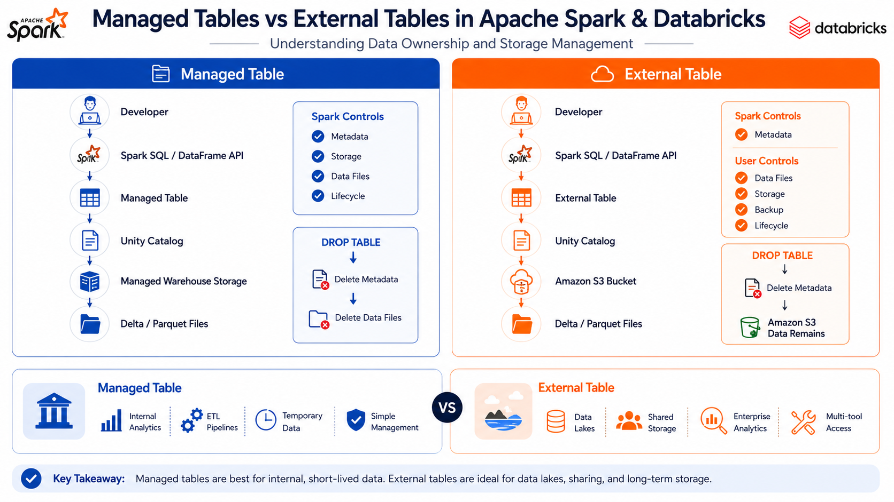
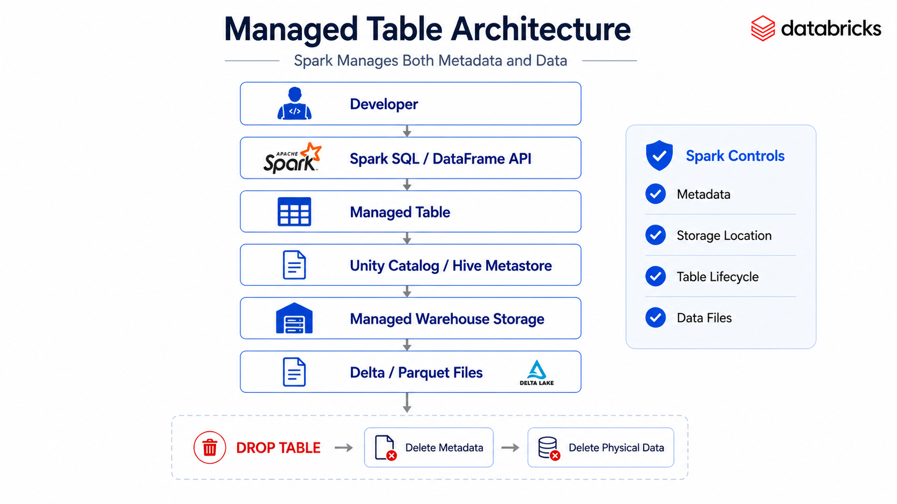
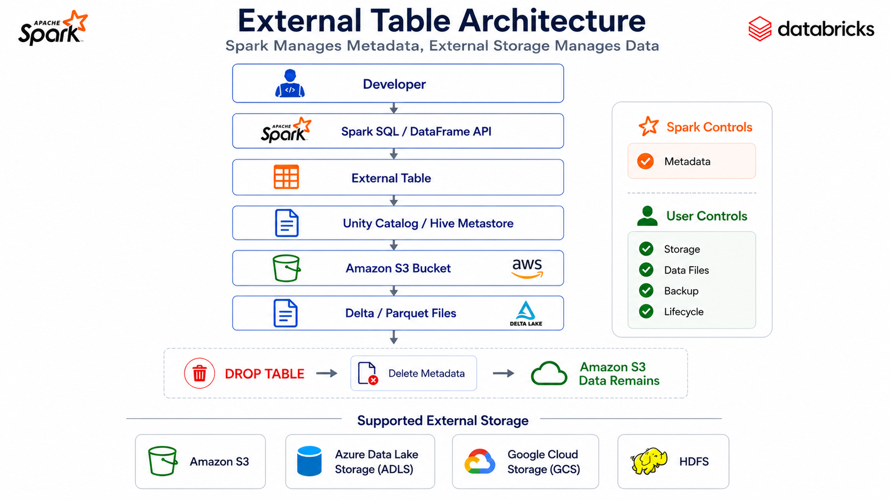
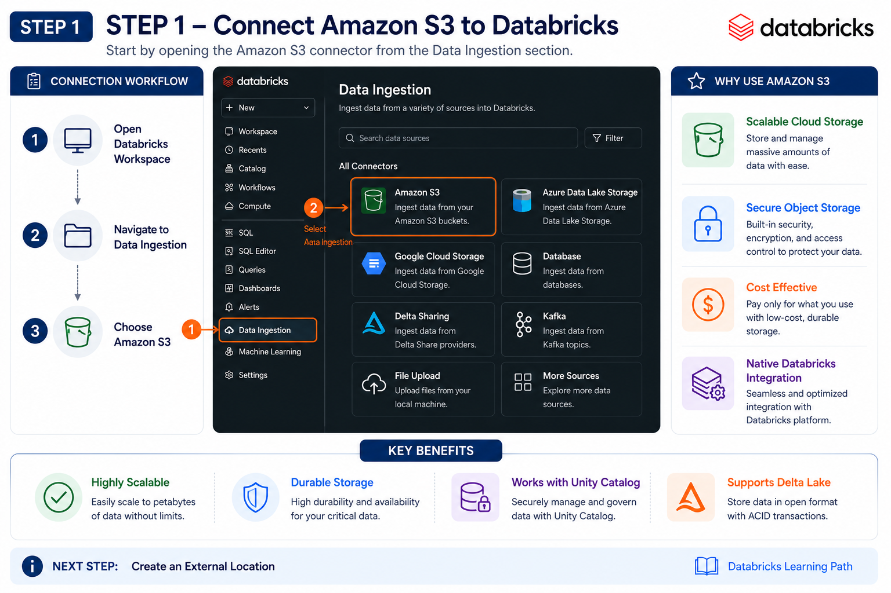
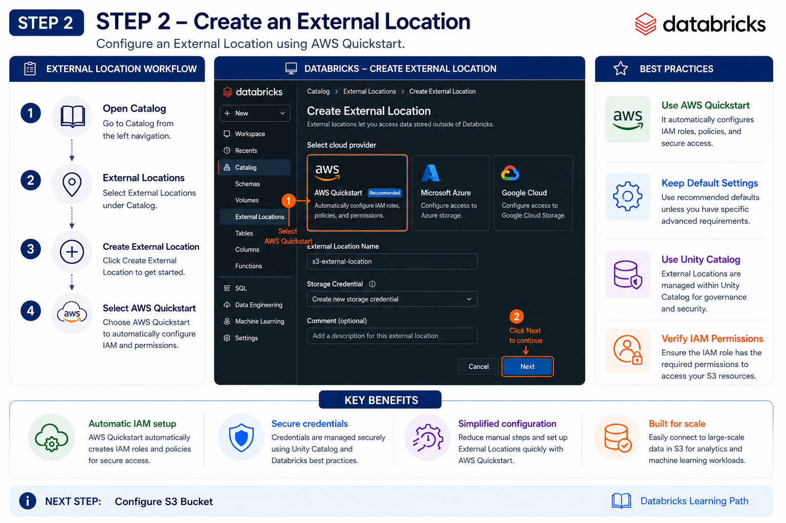
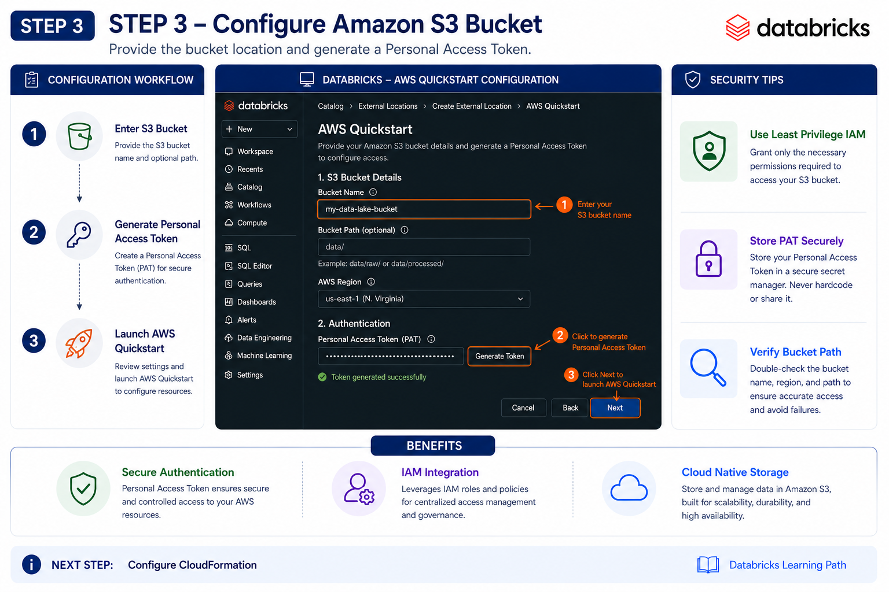
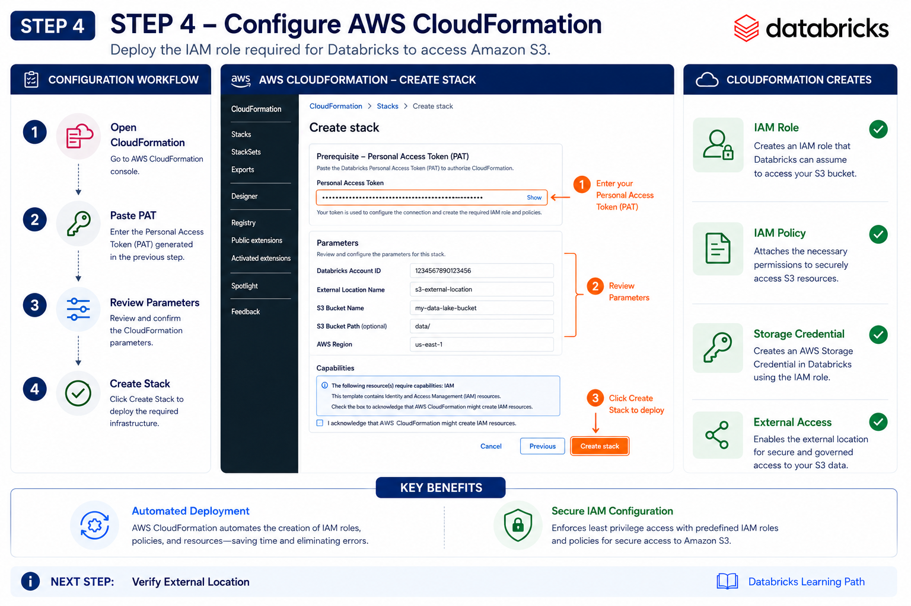
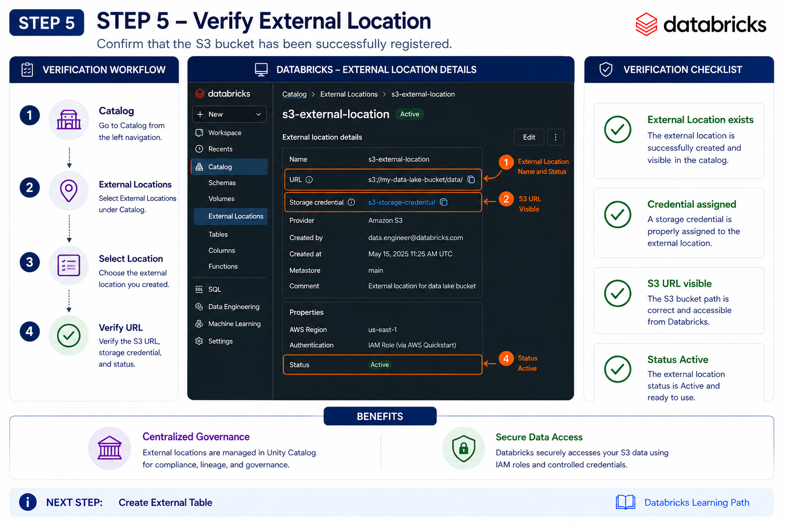
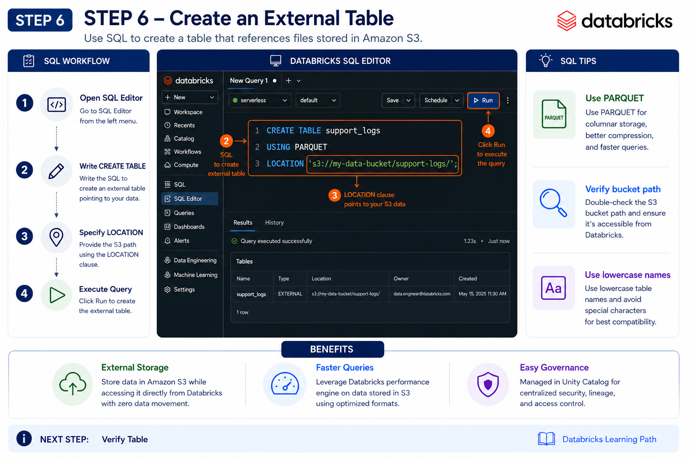
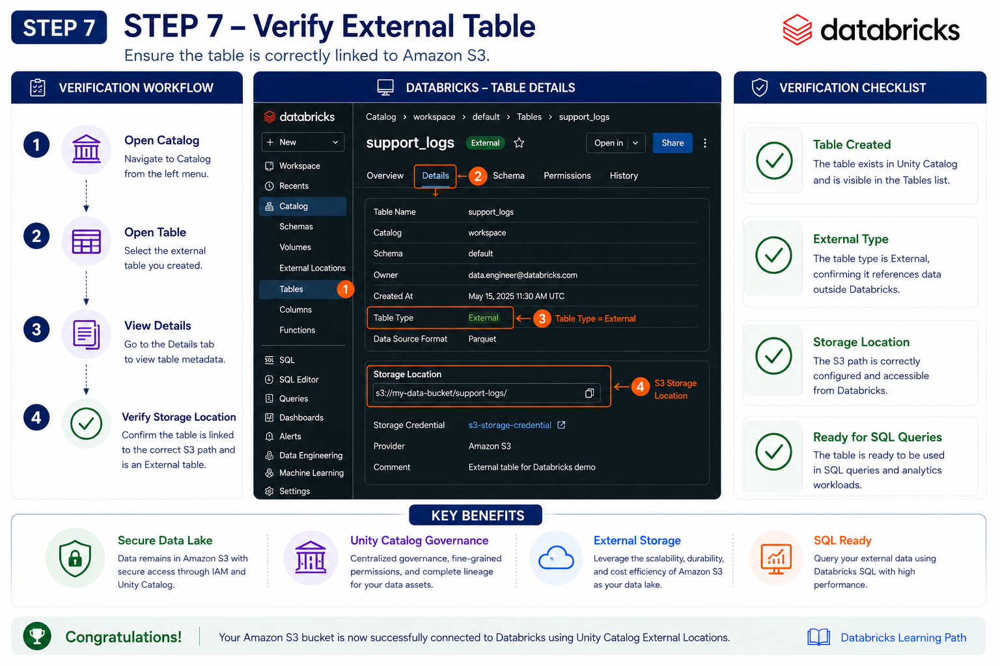

# 🗂️ Managed Tables vs External Tables in Apache Spark & Databricks

⬅️ [back to RDD, DataFrame &amp; Dataset](11_RDD_DataFrame_Dataset.md)



---

# 📚 Table of Contents

- Overview
- Learning Objectives
- What is a Managed Table?
- What is an External Table?
- Managed Table Architecture
- External Table Architecture
- Creating an External Table Using Amazon S3
    - Step 1 – Open Amazon S3 Connector
    - Step 2 – Create an External Location
    - Step 3 – Configure Amazon S3 Bucket
    - Step 4 – Configure AWS CloudFormation
    - Step 5 – Verify External Location
    - Step 6 – Create an External Table
    - Step 7 – Verify External Table
    - SQL Example
- Managed Table vs External Table
- When to Use Each Table
- Real-World Use Cases
- Best Practices
- Interview Questions
- Summary
- Key Takeaways
- Next Topic

---

# 📖 Overview

Apache Spark and Databricks support two types of tables for storing and managing data:

- 🗂️ **Managed Tables**
- ☁️ **External Tables**

The primary difference lies in **who manages the underlying data files**.

A **Managed Table** is fully controlled by Spark or Databricks, while an **External Table** stores only the table metadata and references data stored in an external location such as **Amazon S3**, **Azure Data Lake Storage (ADLS)**, or **Google Cloud Storage (GCS)**.

Understanding the differences between these table types is essential when designing scalable, secure, and production-ready data lake and data warehouse solutions.

---

# 🎯 Learning Objectives

After completing this guide, you will understand:

- What Managed Tables are
- What External Tables are
- Differences between Managed and External Tables
- Metadata vs Data Storage
- Table lifecycle management
- When to use each table type
- Best practices for production environments

---

# 🗂️ What is a Managed Table?

A **Managed Table** is fully managed by Spark, Hive, or Databricks.

Spark controls both:

- 📋 Table Metadata
- 💾 Physical Data Files

When a managed table is dropped, Spark automatically removes:

- Metadata
- Underlying data files

Managed tables are ideal for internal analytics where Spark owns the complete lifecycle of the data.

---

# 🏗️ Managed Table Architecture



---

# ☁️ What is an External Table?

An **External Table** stores only the metadata inside the metastore.

The actual data remains in an external storage location such as:

- Amazon S3
- Azure Data Lake Storage (ADLS)
- Google Cloud Storage (GCS)
- HDFS
- External file systems

Dropping an external table removes only the metadata while leaving the underlying data untouched.

This allows multiple tools to access the same data.

---

# 🏗️ External Table Architecture



---
---

# 🔗 Creating an External Table Using Amazon S3 (Databricks)

The following walkthrough demonstrates how to connect an **Amazon S3 bucket** to **Databricks Unity Catalog** and create an **External Table**.

This is the most common approach used in enterprise data lake architectures.

---

# 🚀 Step 1 – Open Amazon S3 Connector



### Navigate to

```text
Data Ingestion
      │
      ▼
Amazon S3
```

### Steps

1. Open **Data Ingestion** from the left navigation.
2. Select **Amazon S3**.
3. Begin creating a new External Location.

---

# 🚀 Step 2 – Create an External Location



Navigate to

```text
Catalog
      │
      ▼
External Locations
      │
      ▼
Create External Location
```

Select

✅ AWS Quickstart (Recommended)

Click **Next**.

---

# 🚀 Step 3 – Configure the Amazon S3 Bucket



Provide

- Amazon S3 Bucket URL

```text
s3://your-bucket-name
```

Generate a **Databricks Personal Access Token (PAT)**.

This token is required by AWS CloudFormation to configure the IAM role.

---

# 🚀 Step 4 – Configure AWS CloudFormation



AWS CloudFormation automatically creates the required resources.

Resources created

- IAM Role
- IAM Policy
- Storage Credential
- External Access Permissions

Paste the generated **Personal Access Token** into the CloudFormation template and deploy the stack.

---

# 🚀 Step 5 – Verify the External Location



Navigate to

```text
Catalog
      │
      ▼
External Locations
```

Verify

- External Location
- Storage Credential
- Amazon S3 URL
- Owner

Example

```text
s3://your-bucket-name/
```

---

# 🚀 Step 6 – Create an External Table



Open

```text
SQL Editor
```

Execute

```sql
CREATE TABLE workspace.default.support_logs
USING PARQUET
LOCATION 's3://your-bucket-name/support-logs/';
```

Click **Run**.

---

# 🚀 Step 7 – Verify the External Table



Navigate

```text
Catalog
      │
      ▼
workspace
      │
      ▼
default
      │
      ▼
Tables
      │
      ▼
support_logs
```

Open the **Details** tab and verify

- External Table
- Storage Location
- Table Type = External
- Metadata
- Owner

---

# 💻 SQL Example

Create an External Table

```sql
CREATE TABLE workspace.default.support_logs
USING PARQUET
LOCATION 's3://your-bucket-name/support-logs/';
```

Query the table

```sql
SELECT *
FROM workspace.default.support_logs
LIMIT 10;
```

Count records

```sql
SELECT COUNT(*)
FROM workspace.default.support_logs;
```

---

# 📊 External Table Creation Workflow

```text
Amazon S3 Bucket
        │
        ▼
External Location
        │
        ▼
Storage Credential
        │
        ▼
External Table
        │
        ▼
Databricks SQL
        │
        ▼
Analytics
```

---

# 💡 Why External Tables?

External Tables are the preferred choice for modern cloud data lake architectures because they:

- ✅ Keep data in cloud storage such as Amazon S3.
- ✅ Allow multiple analytics engines (Spark, Athena, Trino, Presto, Snowflake) to access the same data.
- ✅ Separate metadata from physical storage.
- ✅ Prevent accidental deletion of production data when a table is dropped.
- ✅ Integrate seamlessly with Unity Catalog for governance and security.

---

# ⚖️ Managed Table vs External Table

| Feature           | Managed Table               | External Table              |
| ----------------- | --------------------------- | --------------------------- |
| Metadata          | Managed by Spark/Databricks | Managed by Spark/Databricks |
| Data Storage      | Managed by Spark            | Stored externally           |
| Storage Location  | Default warehouse location  | User-defined location       |
| Data Ownership    | Spark owns data             | User owns data              |
| Drop Table        | Deletes metadata and data   | Deletes metadata only       |
| Multi-tool Access | Limited                     | Excellent                   |
| Data Governance   | Centralized                 | Flexible                    |
| Backup            | Managed by platform         | User responsibility         |
| Best For          | Internal analytics          | Shared data lakes           |

---

# 🔍 Managed vs External Table Lifecycle

## Managed Table

```text
Create Table
      │
      ▼
Metadata Created
      │
      ▼
Data Stored in Warehouse
      │
      ▼
DROP TABLE
      │
      ▼
Metadata Deleted
      │
      ▼
Data Deleted
```

---

## External Table

```text
Create Table
      │
      ▼
Metadata Created
      │
      ▼
Data Stored in Amazon S3
      │
      ▼
DROP TABLE
      │
      ▼
Metadata Deleted
      │
      ▼
Data Remains
```

---

# 🚀 When to Use Each Table

## 📦 Use Managed Tables When

- Internal ETL pipelines
- Temporary analytics
- Development environments
- Spark manages the full data lifecycle
- No external systems require access

---

## ☁️ Use External Tables When

- Data is stored in Amazon S3
- Data Lake architectures
- Multiple analytics tools access the same data
- Data must persist independently of Spark
- Enterprise data sharing

---

# 🌍 Real-World Use Cases

| Scenario                                    | Recommended Table |
| ------------------------------------------- | ----------------- |
| Internal reporting                          | Managed Table     |
| Databricks-only analytics                   | Managed Table     |
| AWS Data Lake                               | External Table    |
| Shared S3 datasets                          | External Table    |
| Azure Data Lake                             | External Table    |
| Multi-tool analytics (Athena, Spark, Trino) | External Table    |

---

# 💡 Best Practices

- ✅ Use **Managed Tables** for internal analytics and development workloads where Spark manages the complete data lifecycle.
- ✅ Use **External Tables** for enterprise data lakes where data is shared across multiple tools and platforms.
- ✅ Store external table data in scalable cloud storage such as **Amazon S3**, **Azure Data Lake Storage (ADLS)**, or **Google Cloud Storage (GCS)**.
- ✅ Apply **Unity Catalog** or a centralized metadata catalog for governance and access control.
- ✅ Avoid using Managed Tables for critical production data that must persist independently of Spark.
- ✅ Use External Tables when integrating with services such as **Athena**, **Presto**, **Trino**, or **Snowflake**.
- ✅ Clearly separate raw, processed, and curated data into different storage locations.
- ✅ Regularly back up metadata and monitor external storage permissions.

---

# 🎤 Interview Questions

### 1. What is a Managed Table?

A Managed Table is fully controlled by Spark or Databricks, including both metadata and physical data files.

---

### 2. What is an External Table?

An External Table stores only metadata in the metastore while the actual data remains in external storage.

---

### 3. What happens when a Managed Table is dropped?

Both the metadata and underlying data files are deleted.

---

### 4. What happens when an External Table is dropped?

Only the metadata is removed. The underlying data remains intact.

---

### 5. Why are External Tables preferred in Data Lakes?

Because multiple tools can access the same data without duplicating it.

---

### 6. Where is External Table data commonly stored?

Amazon S3, Azure Data Lake Storage (ADLS), Google Cloud Storage (GCS), or HDFS.

---

### 7. Which table type is better for internal analytics?

Managed Tables.

---

### 8. Which table type supports multi-tool access?

External Tables.

---

### 9. Does Spark own the data in an External Table?

No. Spark manages only the metadata.

---

### 10. Which table type is recommended for enterprise data lakes?

External Tables.

---

# 📊 Summary

| Table Type     | Best For                                         |
| -------------- | ------------------------------------------------ |
| Managed Table  | Internal Spark workloads, ETL, analytics         |
| External Table | Data lakes, shared storage, enterprise analytics |

---

# 🎯 Key Takeaways

- **Managed Tables** are fully controlled by Spark or Databricks, including both metadata and physical data storage.
- **External Tables** manage only metadata while keeping the actual data in external storage systems such as Amazon S3 or Azure Data Lake.
- Dropping a **Managed Table** deletes both the metadata and the underlying data, whereas dropping an **External Table** removes only the metadata.
- Managed Tables are ideal for internal analytics and ETL workflows, while External Tables are preferred for shared data lakes and enterprise environments.
- External Tables provide better interoperability, allowing multiple analytics tools to access the same data without duplication.
- Selecting the appropriate table type improves data governance, storage management, and long-term maintainability.

---

# 📚 Next Topic

➡️ [Unity catalog: Governance & Access Control](13_Unity_Catalog.md)