# 🔐 Unity Catalog in Databricks

⬅️ [Back to Managed Tables vs External Tables](12_Managed_vs_External_Tables.md)

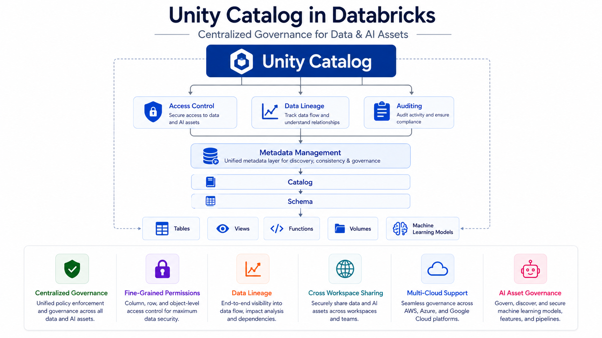

---

# 📚 Table of Contents

- Overview
- Learning Objectives
- What is Unity Catalog?
- Unity Catalog Setup Guide
  - Step 1 – Create a Unity Catalog
  - Step 2 – Create User Groups
  - Step 3 – Grant Catalog Permissions
  - Step 4 – Grant Schema Permissions
  - Step 5 – Grant Table Permissions
  - Step 6 – Unity Catalog Security Ready
- Unity Catalog Hierarchy
- Unity Catalog Architecture
- Core Features
  - Centralized Governance
  - Fine-Grained Access Control
  - Data Lineage
  - Auditing
  - Cross-Workspace Data Sharing
- Permissions Model
- Unity Catalog vs Hive Metastore
- Real-World Use Cases
- Best Practices
- Interview Questions
- Summary
- Key Takeaways

---

# 📖 Overview

**Unity Catalog** is Databricks' unified governance solution for managing **data, analytics, and AI assets** across an organization.

It provides centralized governance for:

- 📂 Tables
- 📊 Views
- 🧠 Machine Learning Models
- 📁 Volumes
- 📈 Functions

Unity Catalog simplifies data governance by providing **centralized access control, auditing, data lineage, metadata management, and secure data sharing** across multiple Databricks workspaces.

It enables organizations to manage data consistently across different teams, projects, and cloud environments.

---

# 🎯 Learning Objectives

After completing this guide, you will understand:

- What Unity Catalog is
- Unity Catalog hierarchy
- Centralized governance
- Fine-grained access control
- Data lineage
- Auditing
- Cross-workspace data sharing
- Permissions model
- Real-world use cases

---

---

# 🚀 Unity Catalog Setup Guide (Hands-on)

Before learning the Unity Catalog concepts, complete the following setup to create a catalog, configure user groups, and assign permissions.

This setup demonstrates how to:

- Create a Unity Catalog
- Create security groups
- Grant catalog-level permissions
- Configure schema-level permissions
- Configure table-level permissions
- Verify Unity Catalog security

---

# Step 1 – Create a Unity Catalog

Create a new Unity Catalog to organize your data assets.

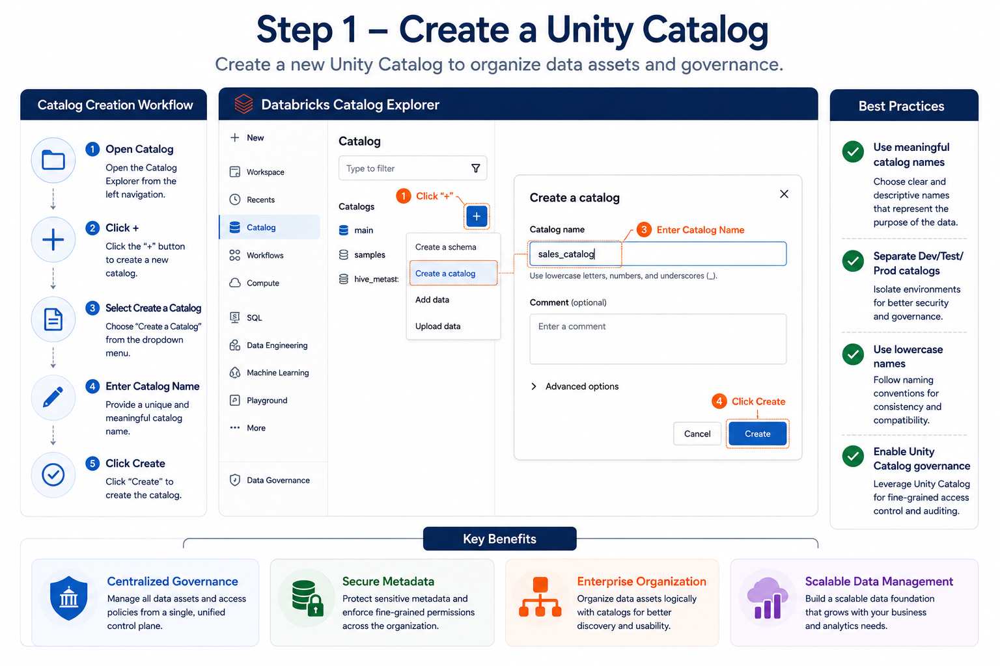

---

# Step 2 – Create User Groups

Create groups for different roles such as Data Engineers and Data Analysts.

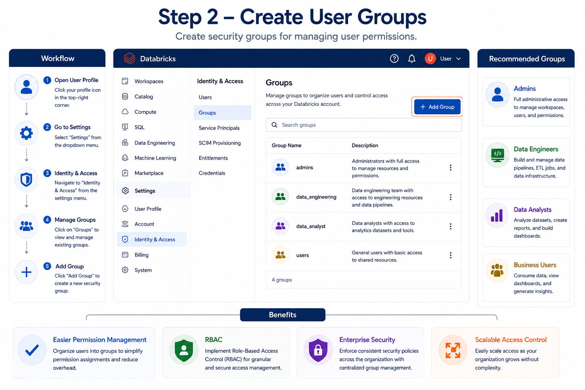

---

# Step 3 – Grant Catalog Permissions

Grant permissions to groups at the Catalog level.

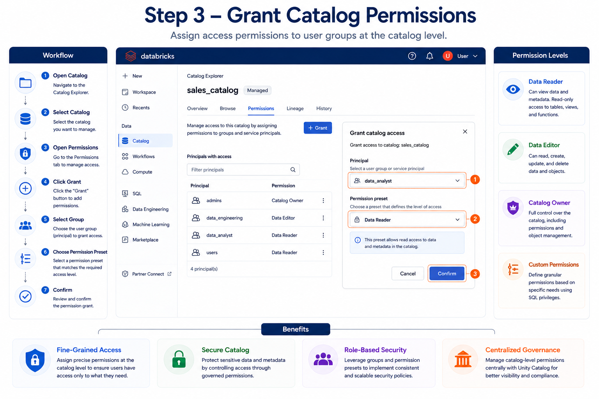

---

# Step 4 – Grant Schema Permissions

Assign permissions to schemas within the catalog.

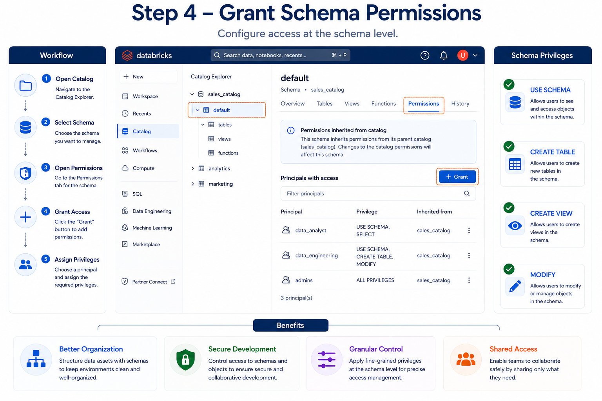

---

# Step 5 – Grant Table Permissions

Secure individual tables by granting appropriate permissions.

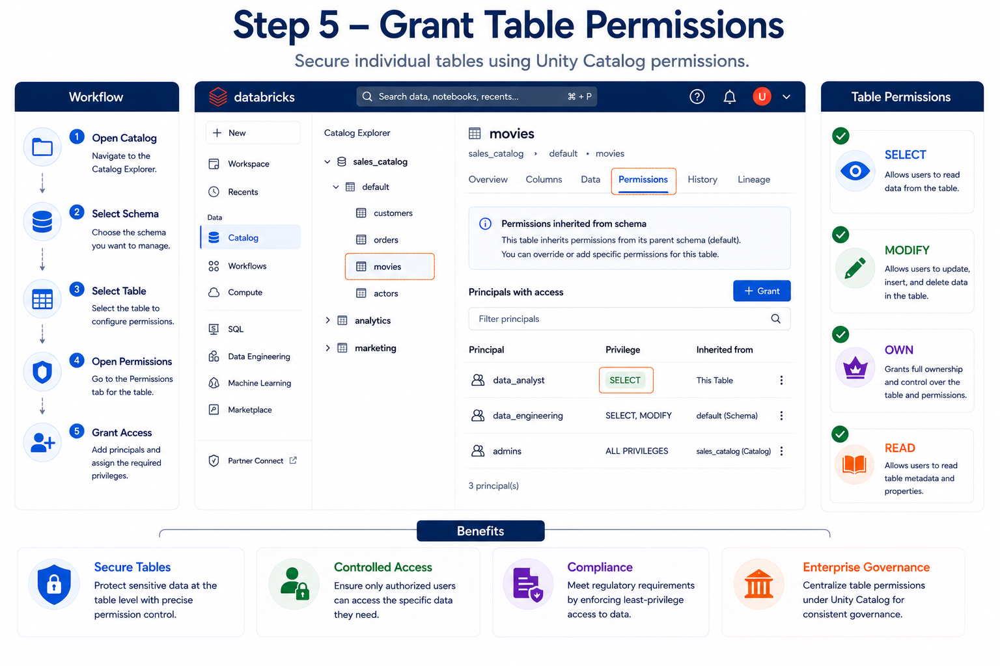

---

# Step 6 – Unity Catalog Security Ready

Your Unity Catalog environment is now configured with catalogs, groups, schemas, and table-level permissions.

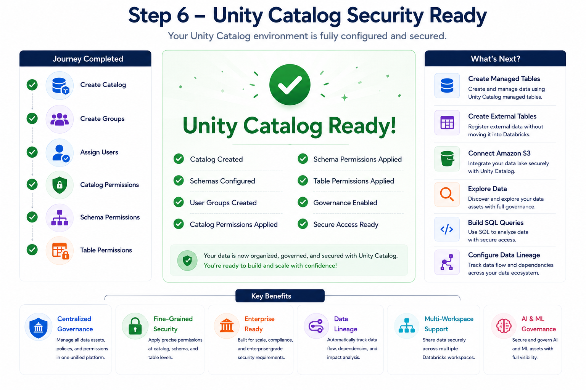

---

# 🔐 What is Unity Catalog?

**Unity Catalog** is a unified governance layer in Databricks that provides centralized management of metadata, permissions, auditing, and lineage for all data and AI assets.

It allows organizations to securely manage access to data across multiple workspaces using a single governance model.

Unity Catalog also supports ANSI SQL-based permissions, making access control simple and consistent.

---

# 🏗️ Unity Catalog Hierarchy

Unity Catalog organizes data into a three-level hierarchy.

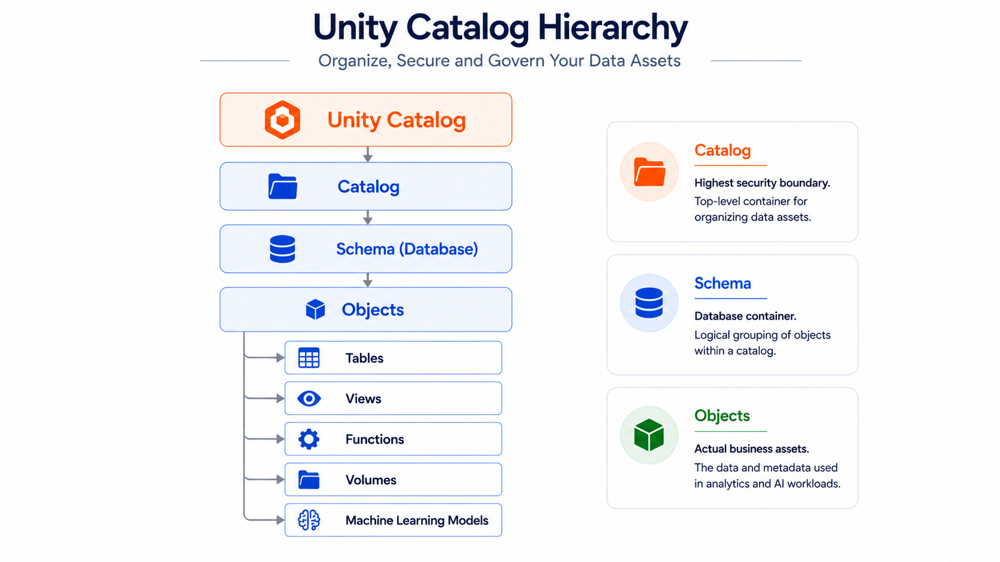

Each level provides its own security boundary.

---

# 🏛️ Unity Catalog Architecture

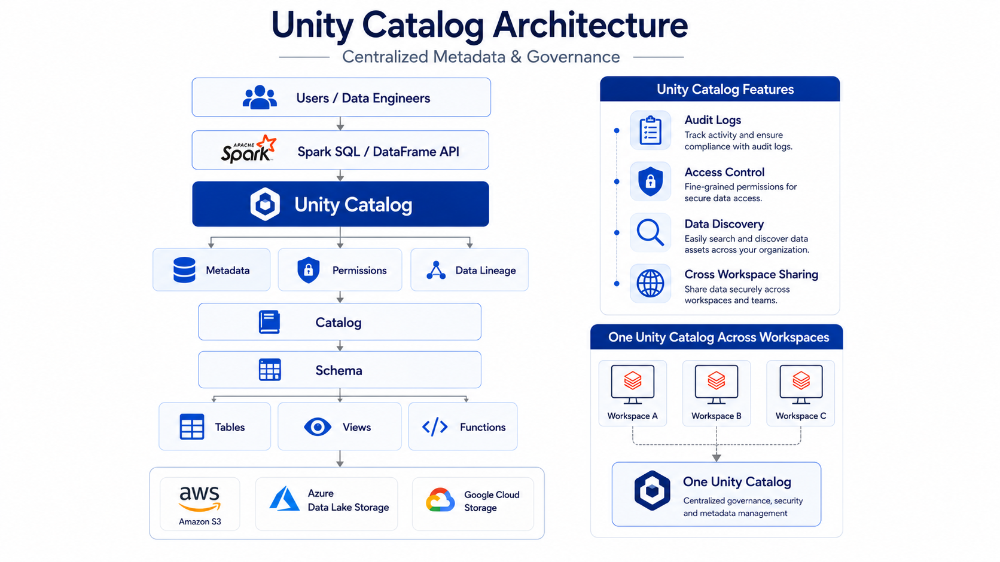

---

# ⭐ Core Features

## 📂 Centralized Governance

Unity Catalog centralizes metadata management across all Databricks workspaces.

Benefits:

- Single metadata store
- Consistent governance
- Simplified administration

---

## 🔒 Fine-Grained Access Control

Unity Catalog supports permissions at multiple levels.

Permissions can be applied to:

- Catalog
- Schema
- Table
- View
- Column
- Row (with row filters)

This enables secure access to sensitive business data.

---

## 📈 Data Lineage

Data Lineage automatically tracks how data moves through the platform.

It records:

- Source tables
- Transformations
- Destination tables
- Dashboards
- Notebooks

This helps users understand where data originates and how it is used.

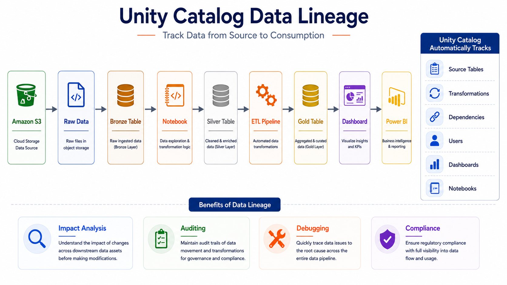

---

## 📝 Auditing

Unity Catalog automatically records user activities.

Examples include:

- Table creation
- Data access
- Permission changes
- Query history
- Object modifications

Auditing improves compliance and security.

---

## 🌐 Cross-Workspace Data Sharing

Unity Catalog allows multiple Databricks workspaces to share the same governed data.

Benefits include:

- No duplicate datasets
- Consistent permissions
- Shared metadata
- Simplified collaboration

---

# 🔑 Permissions Model

Unity Catalog uses **ANSI SQL-based access control**.

Examples:

```sql
GRANT SELECT
ON TABLE sales
TO analysts;
```

```sql
GRANT USE CATALOG
ON CATALOG finance
TO data_engineers;
```

Permissions can be assigned to:

- Users
- Groups
- Service Principals

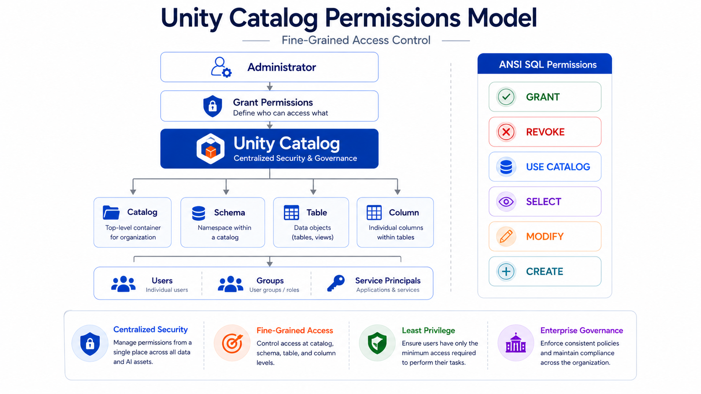

---

# ⚖️ Unity Catalog vs Hive Metastore

| Feature                  | Unity Catalog | Hive Metastore |
| ------------------------ | ------------- | -------------- |
| Centralized Governance   | ✅ Yes        | ❌ No          |
| Fine-Grained Permissions | ✅ Yes        | Limited        |
| Data Lineage             | ✅ Automatic  | ❌ No          |
| Auditing                 | ✅ Yes        | Limited        |
| Cross-Workspace Support  | ✅ Yes        | ❌ No          |
| Multi-Cloud Support      | ✅ Yes        | Limited        |
| ML Model Governance      | ✅ Yes        | ❌ No          |

---

# 🌍 Real-World Use Cases

| Scenario                 | Benefit                     |
| ------------------------ | --------------------------- |
| Enterprise Data Lake     | Centralized governance      |
| Data Warehousing         | Fine-grained access control |
| Regulatory Compliance    | Auditing and lineage        |
| Machine Learning         | Govern ML models            |
| Multi-Team Collaboration | Cross-workspace sharing     |
| Self-Service Analytics   | Secure data discovery       |

---

# 💡 Best Practices

- ✅ Organize data using **Catalog → Schema → Tables**.
- ✅ Follow the **principle of least privilege** when assigning permissions.
- ✅ Use groups instead of individual users whenever possible.
- ✅ Enable data lineage to understand end-to-end data flow.
- ✅ Regularly review audit logs for security and compliance.
- ✅ Use Unity Catalog for all production workloads instead of the legacy Hive Metastore.
- ✅ Apply column-level security and row-level filters for sensitive data.
- ✅ Keep naming conventions consistent across catalogs and schemas.
- ✅ Separate development, testing, and production environments using different catalogs.
- ✅ Periodically review and clean up unused permissions.

---

# 🎤 Interview Questions

### 1. What is Unity Catalog?

Unity Catalog is Databricks' centralized governance solution for managing data and AI assets.

---

### 2. What are the three levels of Unity Catalog?

- Catalog
- Schema
- Objects (Tables, Views, Functions, Models, Volumes)

---

### 3. What is Data Lineage?

Data Lineage tracks how data moves from its source through transformations to its final destination.

---

### 4. Why is Data Lineage important?

It improves debugging, auditing, compliance, and impact analysis.

---

### 5. What types of permissions does Unity Catalog support?

- Catalog
- Schema
- Table
- View
- Column

---

### 6. Can Unity Catalog work across multiple workspaces?

Yes.

---

### 7. What language is used for granting permissions?

ANSI SQL.

---

### 8. What is the advantage of Unity Catalog over Hive Metastore?

Centralized governance, auditing, lineage, and fine-grained security.

---

### 9. Can Unity Catalog govern ML models?

Yes.

---

### 10. Why is Unity Catalog recommended for enterprise environments?

Because it provides centralized governance, security, auditing, and metadata management across the entire organization.

---

# 📊 Summary

| Component | Purpose                   |
| --------- | ------------------------- |
| Catalog   | Top-level container       |
| Schema    | Database inside a catalog |
| Tables    | Structured data           |
| Views     | Virtual tables            |
| Functions | Reusable SQL logic        |
| Volumes   | File storage              |
| ML Models | Governed AI assets        |

---

# 🎯 Key Takeaways

- Unity Catalog is Databricks' centralized governance solution for managing data and AI assets.
- It organizes assets using a **Catalog → Schema → Object** hierarchy.
- Unity Catalog provides centralized metadata management, fine-grained access control, auditing, and automatic data lineage.
- It supports ANSI SQL-based permissions at the catalog, schema, table, and column levels.
- Cross-workspace data sharing enables secure collaboration without duplicating datasets.
- Unity Catalog simplifies governance across data lakes, data warehouses, and machine learning workloads.
- It is the recommended governance solution for modern Databricks and Lakehouse architectures.

---

# 📚 Next Topic

➡️ [Understanding ACID](14_ACID.md)