# 🏞️ Delta Lake (Delta Format)

⬅️ [Back to Time Travel in Delta Lake](15_Time_Travel.md)

---

# 📚 Table of Contents

- Overview
- Learning Objectives
- What is Delta Lake?
- Delta Lake Architecture
- Delta Lake Components
- Problems Solved by Delta Lake
- Key Features
- Delta Lake vs Parquet
- Real-World Use Cases
- AWS S3 + Databricks Delta Lake Setup Guide
- Best Practices
- Interview Questions
- Summary
- Key Takeaways

---

# 📖 Overview

**Delta Lake** is an open-source storage layer that enhances traditional data lakes by adding **ACID transactions**, **schema enforcement**, **schema evolution**, and **time travel** capabilities.

Built on top of **Apache Parquet**, Delta Lake introduces a **transaction log (`_delta_log`)** that tracks every change made to a table, ensuring reliable and consistent data management.

Delta Lake combines the scalability of a data lake with the reliability and performance of a data warehouse, making it the foundation of the **Lakehouse Architecture**.

---

# 🎯 Learning Objectives

After completing this guide, you will understand:

- What Delta Lake is
- Delta Lake architecture
- Delta Lake components
- Problems solved by Delta Lake
- Key features of Delta Lake
- Delta Lake vs Parquet
- Real-world use cases

---

# 🏞️ What is Delta Lake?

**Delta Lake** is an open-source storage layer that brings database-like reliability to data lakes.

It extends **Apache Parquet** by adding a **transaction log** and metadata layer that supports reliable, scalable, and versioned data processing.

### Delta Lake Formula

```text
Delta Lake
      =
Parquet Files
      +
Transaction Log (_delta_log)
      +
Metadata
```

---

# 🏗️ Delta Lake Architecture

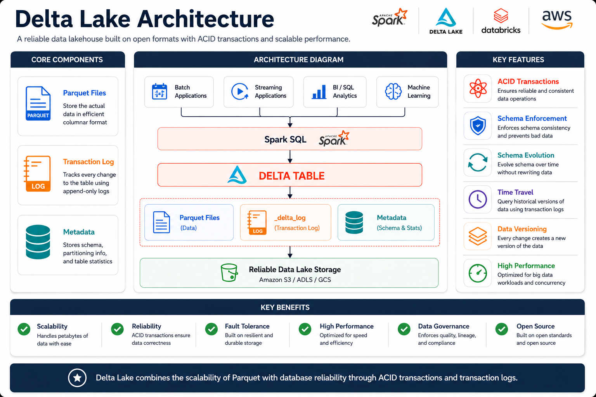

---

# ⚙️ Delta Lake Components

## 📄 Parquet Files

Store the actual data in a highly optimized columnar format.

---

## 📒 Transaction Log (`_delta_log`)

Tracks every operation performed on a Delta table.

Examples include:

- INSERT
- UPDATE
- DELETE
- MERGE
- OPTIMIZE
- VACUUM

---

## 🗂 Metadata

Stores table information such as:

- Schema
- Partitions
- Statistics
- Versions
- File locations

---

# ❗ Problems Solved by Delta Lake

Traditional data lakes face several challenges.

| Problem                    | Delta Lake Solution               |
| -------------------------- | --------------------------------- |
| ❌ Data Corruption         | ✅ ACID Transactions              |
| ❌ No Audit Trail          | ✅ Transaction Log                |
| ❌ Schema Drift            | ✅ Schema Enforcement             |
| ❌ Difficult Rollback      | ✅ Time Travel                    |
| ❌ Inconsistent Updates    | ✅ Atomic Operations              |
| ❌ Concurrent Write Issues | ✅ Optimistic Concurrency Control |

---

# ⭐ Key Features

## ⚛️ ACID Transactions

Ensures reliable and fault-tolerant transactions.

---

## 🛡️ Schema Enforcement

Prevents invalid or incompatible data from being written.

---

## 🔄 Schema Evolution

Allows schemas to evolve safely as new columns are introduced.

---

## ⏳ Time Travel

Query historical versions of a Delta table using:

- Version Number
- Timestamp

---

## 📜 Transaction Log

Maintains a complete history of all table modifications.

---

## 🚀 High Performance

Optimized for analytics using:

- Parquet
- Data Skipping
- File Compaction
- Z-Ordering

---

# ⚖️ Delta Lake vs Parquet

| Feature            | Parquet | Delta Lake |
| ------------------ | ------- | ---------- |
| Columnar Storage   | ✅      | ✅         |
| ACID Transactions  | ❌      | ✅         |
| Schema Enforcement | ❌      | ✅         |
| Schema Evolution   | ❌      | ✅         |
| Time Travel        | ❌      | ✅         |
| Transaction Log    | ❌      | ✅         |
| Rollback           | ❌      | ✅         |
| Data Versioning    | ❌      | ✅         |

---

# 🌍 Real-World Use Cases

| Use Case           | Benefit                    |
| ------------------ | -------------------------- |
| ETL Pipelines      | Reliable data processing   |
| Data Warehouses    | ACID-compliant analytics   |
| Machine Learning   | Reproducible datasets      |
| Data Lakes         | Structured data management |
| Financial Systems  | Transaction consistency    |
| Audit & Compliance | Historical data tracking   |

---
# 🚀 AWS S3 + Databricks Delta Lake Setup Guide

Build a simple **Delta Lake** on **Amazon S3** using **Databricks Free Edition**. This project demonstrates how to create a Delta table from CSV data, perform updates, and leverage Delta Lake features such as **ACID Transactions**, **Time Travel**, and **Transaction History**.

---

## 🏗️ Architecture

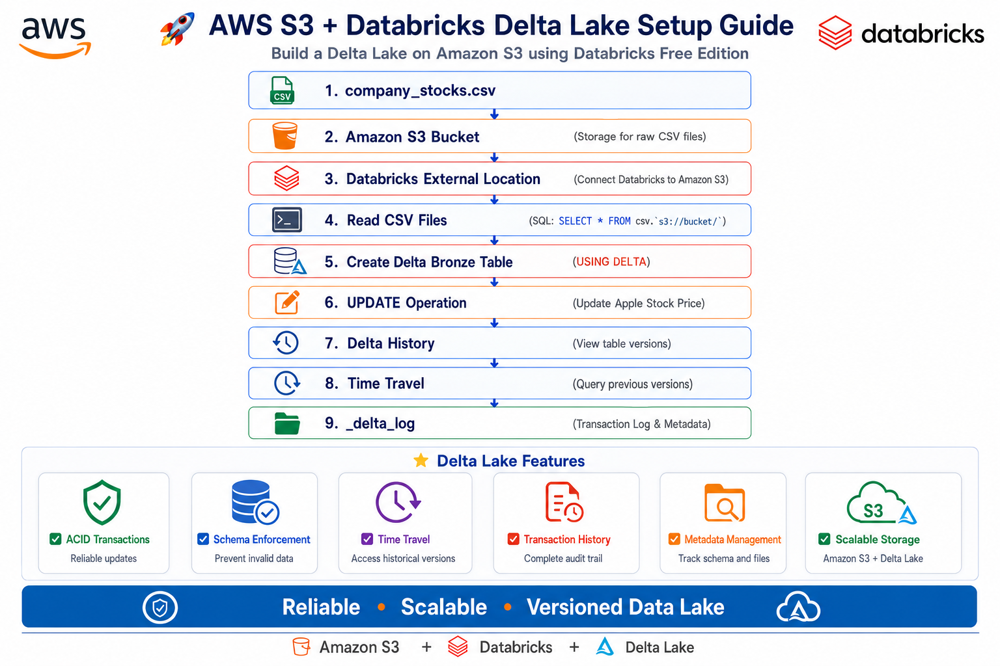

---

# 📌 Step 1 – Create an Amazon S3 Bucket

Create a new Amazon S3 bucket to store the source data and Delta Lake files.

### ✅ Tasks

- Create a new S3 bucket
- Choose the desired AWS Region
- Use a globally unique bucket name
- Enable default bucket configuration

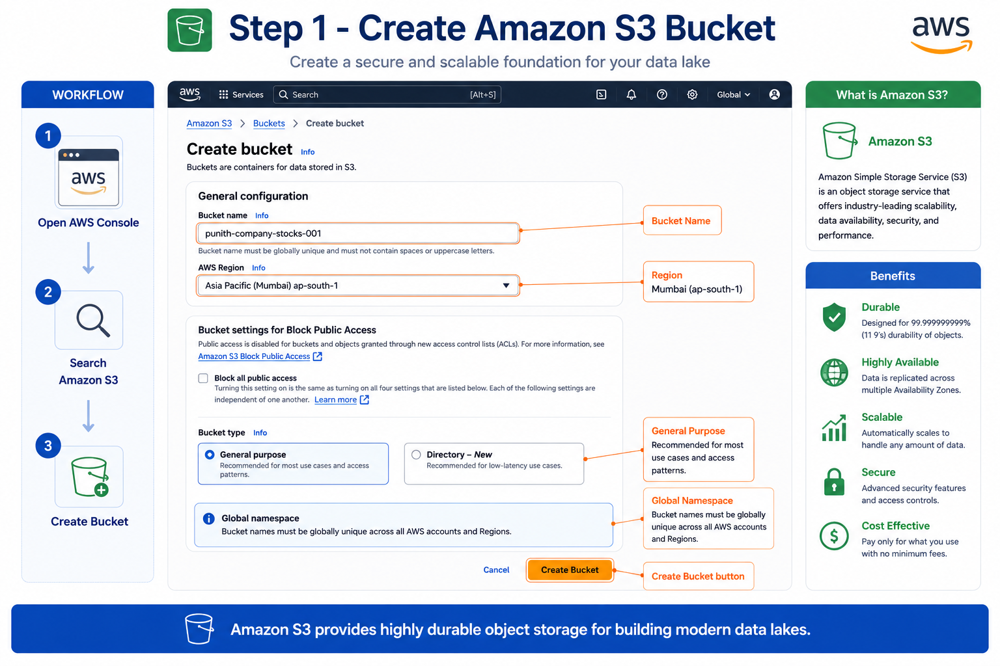

---

# 📌 Step 2 – Upload CSV File to Amazon S3

Upload the source CSV dataset into the S3 bucket.

### ✅ Tasks

- Open the bucket
- Click **Upload**
- Select `company_stocks.csv`
- Upload the dataset

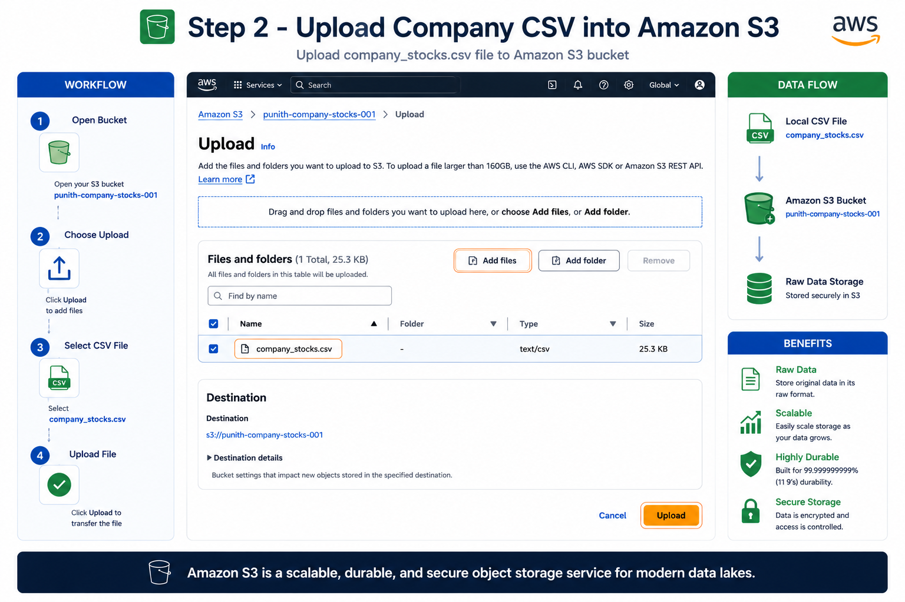

---

# 📌 Step 3 – Configure Databricks External Location

Connect Amazon S3 with Databricks using an External Location.

### ✅ Tasks

- Open **Catalog**
- Create an **External Location**
- Select **AWS Quickstart**
- Provide the S3 bucket path

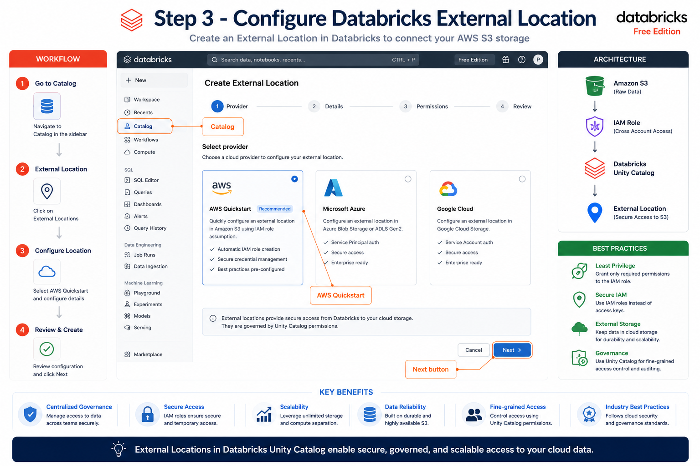

---

# 📌 Step 4 – Generate Databricks Personal Access Token

Generate a Personal Access Token (PAT) required to configure AWS CloudFormation.

### ✅ Tasks

- Generate PAT
- Copy the token
- Launch AWS Quickstart

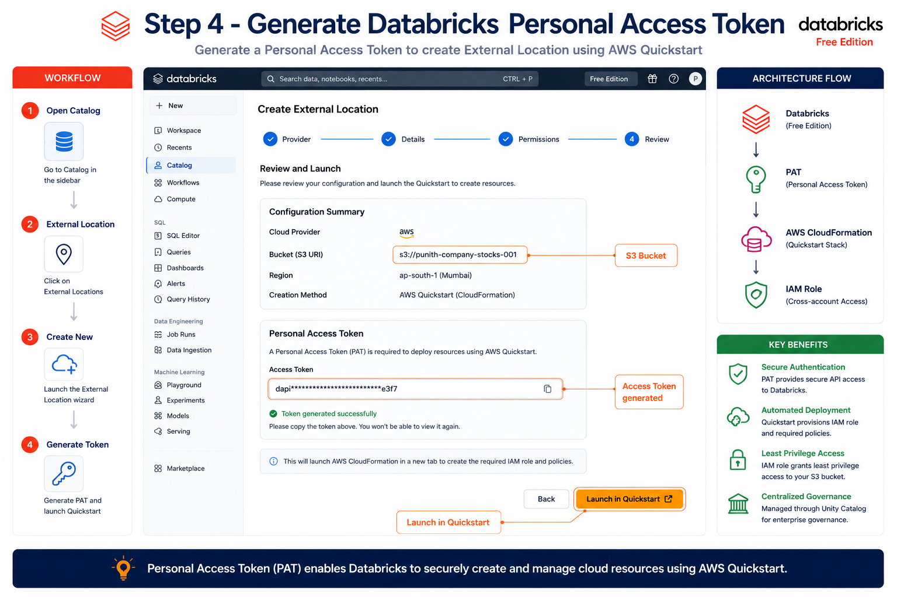

---

# 📌 Step 5 – Configure AWS CloudFormation

Create the required IAM Role and permissions for Databricks to access Amazon S3.

### ✅ Tasks

- Launch CloudFormation
- Paste the Personal Access Token
- Verify Bucket Name
- Create the CloudFormation Stack


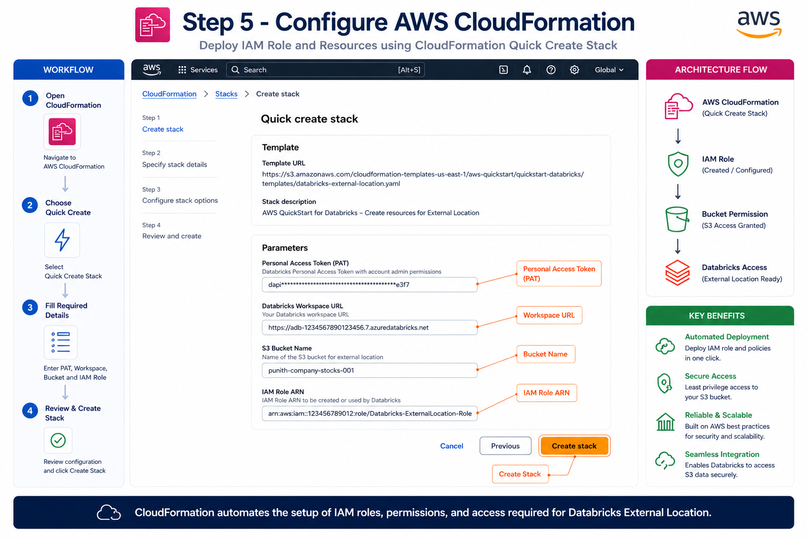

---

# 📌 Step 6 – Read CSV Files from Amazon S3

Read the uploaded CSV file directly from Amazon S3 without importing it first.

### 📝 SQL

```sql
SELECT *
FROM csv.`s3://punith-company-stocks-001/`
WITH (
    header = true
);
```

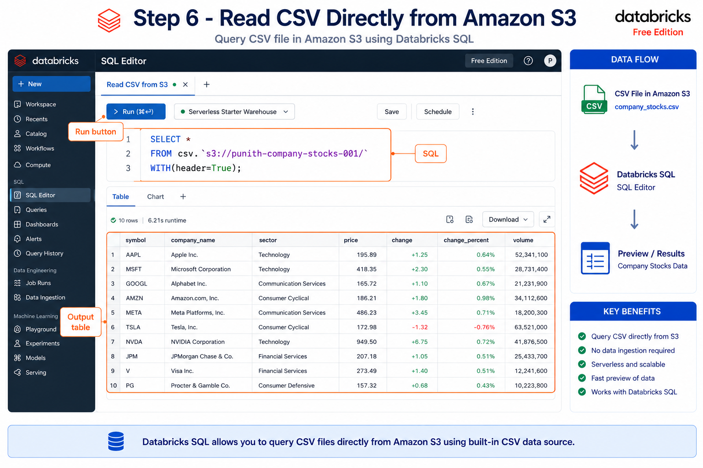

---

# 📌 Step 7 – Create a Delta Bronze Table

Convert the CSV data into a Delta table stored inside Amazon S3.

### 📝 SQL

```sql
CREATE TABLE workspace.default.company_stocks
USING DELTA
LOCATION 's3://punith-company-stocks-001/bronze/'
AS
SELECT
    *,
    current_timestamp() AS _ingested_at,
    input_file_name() AS _source_file,
    uuid() AS _bronze_id
FROM csv.`s3://punith-company-stocks-001`
WITH (
    header = true,
    inferSchema = true
);
```

### 📋 Metadata Added

| Column | Description |
|---------|-------------|
| `_ingested_at` | Record ingestion timestamp |
| `_source_file` | Source CSV filename |
| `_bronze_id` | Unique identifier |

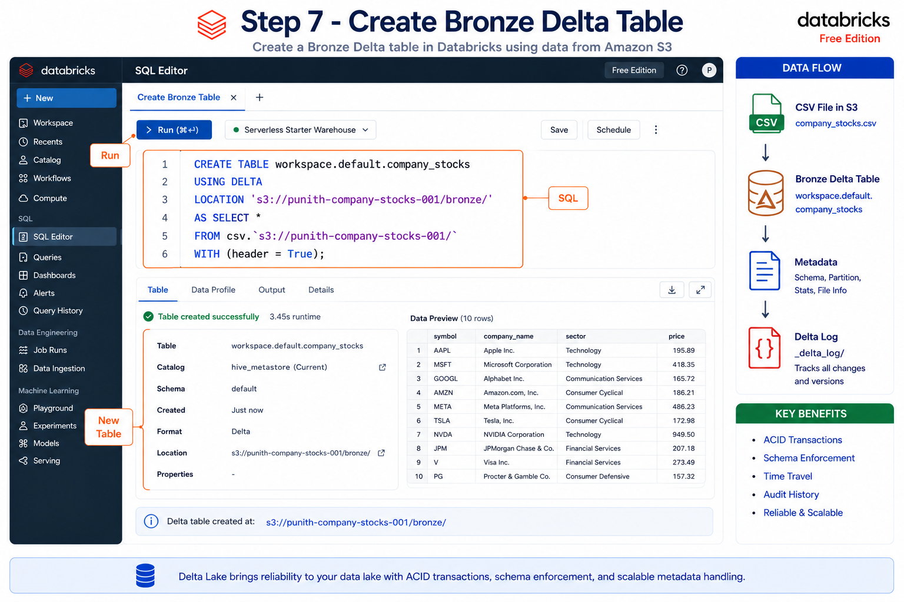

---

# 📌 Step 8 – Update and Verify Delta Table

Update records inside the Delta table and verify the changes.

### 📝 SQL

```sql
UPDATE workspace.default.company_stocks
SET Stock_Price = 89
WHERE Company = 'Apple';
```

```sql
SELECT *
FROM workspace.default.company_stocks
WHERE Company = 'Apple';
```

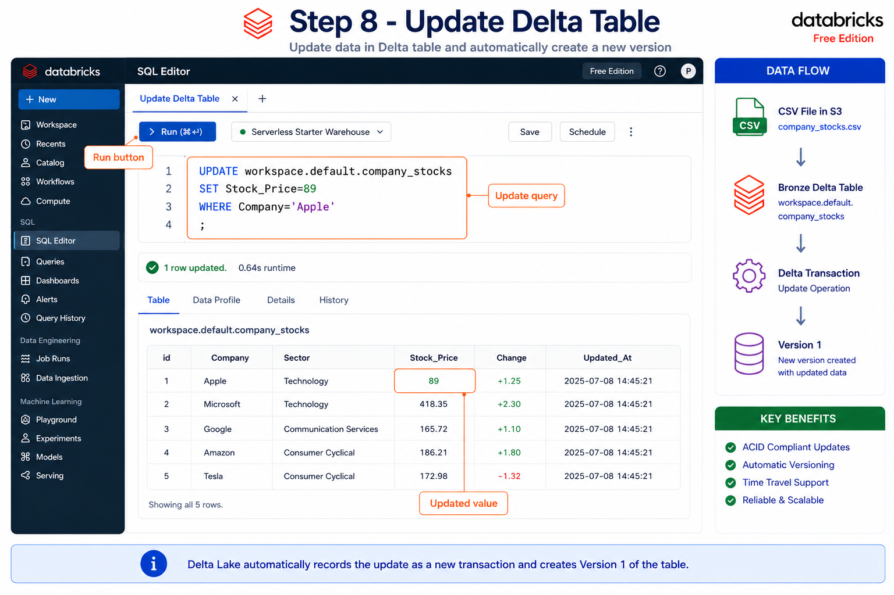

---

# 📌 Step 9 – View Delta History & Time Travel

View transaction history and query previous versions of the Delta table.

### 📝 SQL

```sql
SELECT *
FROM workspace.default.company_stocks
VERSION AS OF 0;
```

```sql
SELECT *
FROM workspace.default.company_stocks
VERSION AS OF 1;
```

### ✅ Delta Features

- Transaction History
- Version Control
- Time Travel
- ACID Transactions

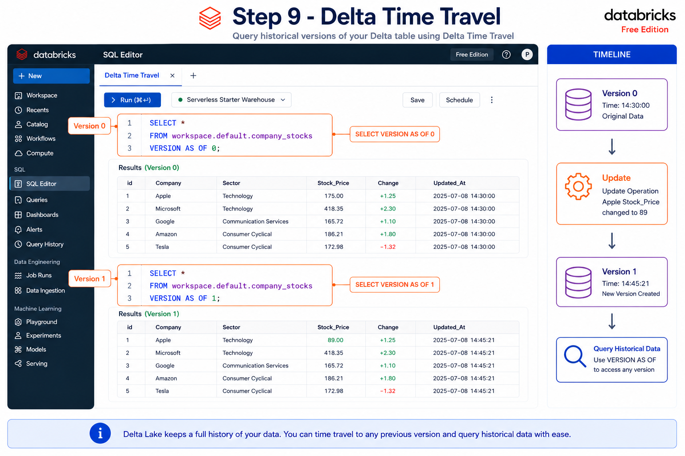

---

# 📌 Step 10 – Verify Delta Log Files in Amazon S3

Navigate to the **Bronze** folder inside Amazon S3 to verify that Delta Lake has created its transaction log and Parquet files.

### 📂 Folder Structure

```text
bronze/
│
├── _delta_log/
├── part-00000.snappy.parquet
├── part-00001.snappy.parquet
└── deletion_vector.bin
```

### ✅ Verify

- `_delta_log` folder exists
- Parquet data files are generated
- Transaction log is maintained
- Delta table files are stored in Amazon S3

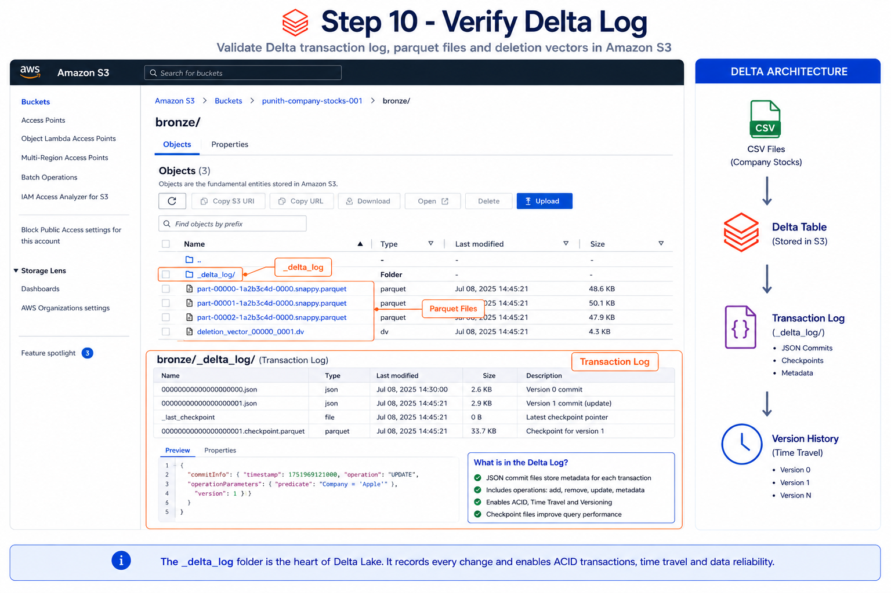

---

# ✨ Delta Lake Features Demonstrated

- 📦 Amazon S3 External Storage
- 📄 Read CSV Directly from S3
- 🪄 Automatic Schema Inference
- 🏗️ Delta Table Creation
- 📝 Metadata Tracking
- 🔄 ACID Transactions
- ✏️ UPDATE Operations
- 🕒 Delta History
- ⏪ Time Travel
- 📂 `_delta_log` Transaction Log

---

# 🛠️ Technologies Used

| Technology | Purpose |
|------------|---------|
| ☁️ Amazon S3 | Object Storage |
| 🧱 Delta Lake | Transactional Data Lake |
| 🔴 Databricks Free Edition | Data Processing |
| 🗄️ SQL | Data Query & Manipulation |
| ⚙️ AWS CloudFormation | IAM & Infrastructure |

---

# 🎯 Learning Outcomes

After completing this project, you will be able to:

- ✅ Configure Amazon S3 as external storage
- ✅ Connect Databricks with Amazon S3
- ✅ Read CSV files directly from S3
- ✅ Create Delta Lake tables
- ✅ Perform UPDATE operations
- ✅ Explore Delta History
- ✅ Query previous table versions using Time Travel
- ✅ Understand the purpose of the `_delta_log` folder
- ✅ Build the Bronze layer of a Medallion Architecture

---

# 💡 Best Practices

- ✅ Store analytical data in **Delta Lake** instead of plain Parquet whenever transactional reliability is required.
- ✅ Enable **Schema Enforcement** to prevent invalid data from entering production tables.
- ✅ Use **Schema Evolution** carefully when business requirements require adding new columns.
- ✅ Leverage **Time Travel** for auditing, debugging, and recovering previous versions of datasets.
- ✅ Run **OPTIMIZE** periodically to compact small files and improve query performance.
- ✅ Schedule **VACUUM** carefully to remove obsolete files while preserving required table history.
- ✅ Partition large Delta tables using frequently filtered columns to improve query efficiency.
- ✅ Monitor the **_delta_log** and storage usage as tables grow over time.

---

# 🎤 Interview Questions

### 1. What is Delta Lake?

Delta Lake is an open-source storage layer that adds ACID transactions, schema enforcement, and time travel capabilities to data lakes.

---

### 2. What is the formula for Delta Lake?

```text
Delta Lake = Parquet + Transaction Log + Metadata
```

---

### 3. What is `_delta_log`?

It is the transaction log that records every change made to a Delta table.

---

### 4. What problems does Delta Lake solve?

- Data corruption
- Schema drift
- No audit trail
- Difficult rollback
- Concurrent write conflicts

---

### 5. What is Schema Enforcement?

It ensures only data matching the defined schema can be written to a Delta table.

---

### 6. What is Schema Evolution?

It allows the schema to change safely over time without recreating the table.

---

### 7. What is Time Travel?

Time Travel allows querying previous versions of a Delta table using a version number or timestamp.

---

### 8. Why is Delta Lake better than Parquet?

Because it adds ACID transactions, transaction logs, schema management, versioning, and time travel while still using Parquet as the storage format.

---

### 9. Which file stores Delta Lake transaction history?

`_delta_log`

---

### 10. Is Delta Lake open source?

Yes.

---

# 📊 Summary

| Component          | Purpose                            |
| ------------------ | ---------------------------------- |
| Parquet Files      | Store actual data                  |
| `_delta_log`     | Track every table modification     |
| Metadata           | Store schema and table information |
| ACID Transactions  | Reliable data updates              |
| Time Travel        | Query historical versions          |
| Schema Enforcement | Prevent invalid writes             |

---

# 🎯 Key Takeaways

- **Delta Lake** extends Apache Parquet by adding a transaction log and metadata layer to provide reliable, versioned data storage.
- It supports **ACID transactions**, ensuring consistent and fault-tolerant updates even in concurrent environments.
- **Schema Enforcement** prevents invalid data writes, while **Schema Evolution** allows controlled schema changes over time.
- The **_delta_log** records every table modification, enabling **Time Travel**, auditing, and reproducible analytics.
- Delta Lake solves common data lake challenges such as **data corruption**, **schema drift**, and **lack of audit history**.
- Combining Delta Lake with Apache Spark provides a scalable, high-performance foundation for modern **Lakehouse architectures**.
- Delta Lake is the preferred storage format for building reliable, production-ready data engineering pipelines.