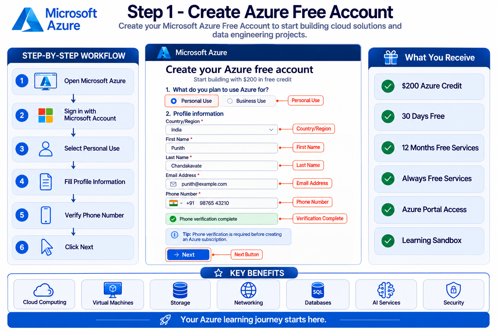
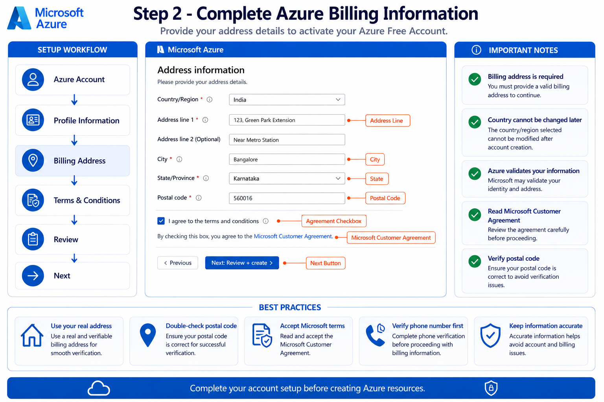
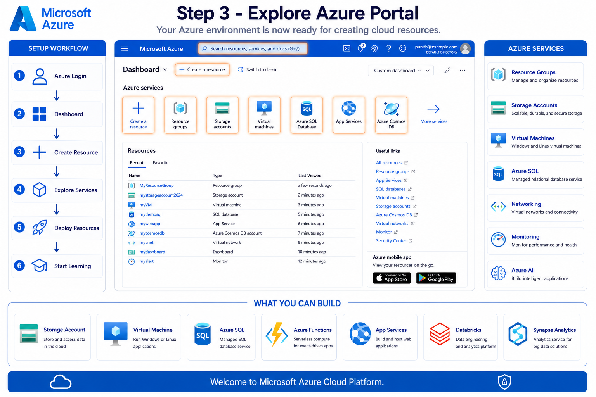

# ☁️ Microsoft Azure Account Setup Guide

⬅️ [Back to Azure Account Setup](../01_Azure_Account_Setup/01_Azure_Account_Setup.md)

> A beginner-friendly, step-by-step guide to creating a Microsoft Azure Free Account and accessing the Azure Portal.

---

## 📖 Overview

This guide walks you through creating a **Microsoft Azure Free Account**, completing account verification, and accessing the Azure Portal.

By the end of this tutorial, you'll have a fully functional Azure account ready to deploy cloud resources such as:

- Storage Accounts
- Virtual Machines
- Azure SQL Database
- Azure Data Lake Storage Gen2
- Azure Databricks
- Azure Functions
- Networking Resources

---

## 🎯 Learning Objectives

After completing this guide, you will be able to:

- Create an Azure Free Account
- Complete profile verification
- Add billing information
- Access the Azure Portal
- Understand the Azure Portal dashboard
- Start creating Azure resources

---

# 🛠️ Prerequisites

Before you begin, ensure you have:

- Microsoft Account (Outlook/Hotmail)
- Valid Phone Number
- Valid Address
- Internet Connection
- Modern Web Browser (Chrome, Edge, Firefox)

---

# 📌 Step 1 — Create Azure Free Account

Create your Microsoft Azure Free Account.

### Actions

- Visit Microsoft Azure
- Sign in using your Microsoft Account
- Select **Personal Use**
- Enter your profile details
- Verify your phone number
- Click **Next**

### Screenshot

---

# 📌 Step 2 — Complete Billing Information

Enter your address information.

### Fill

- Address Line
- City
- State
- Postal Code

Accept

- Microsoft Customer Agreement
- Privacy Policy

Click

**Next**

### Screenshot

---

# 📌 Step 3 — Azure Portal Dashboard

After successful verification, Azure opens the Portal.

You should now see

- Dashboard
- Create Resource
- Resource Groups
- Storage Accounts
- Virtual Machines
- Azure SQL
- Azure Cosmos DB
- App Services
- Virtual Networks

### Screenshot

---

# 🎁 Azure Free Account Benefits

New Azure accounts include:

| Benefit           | Description                         |
| ----------------- | ----------------------------------- |
| 💳 Azure Credit   | $200 credit for first 30 days       |
| 🆓 Free Services  | 12 months of popular Azure services |
| ♾️ Always Free  | Multiple services available forever |
| ☁️ Azure Portal | Full cloud management portal        |
| 🔐 Secure Access  | Enterprise-grade Microsoft security |

---

# 📂 Azure Services Available

Once your account is ready, you can create:

- Azure Resource Groups
- Storage Accounts
- Blob Storage
- Data Lake Storage Gen2
- Virtual Machines
- Azure SQL Database
- Azure Cosmos DB
- Azure Functions
- App Services
- Azure Databricks
- Synapse Analytics
- Azure AI Services

---

# 💡 Best Practices

- Use a personal Microsoft account for learning.
- Verify your phone number before proceeding.
- Store your Azure credentials securely.
- Enable Multi-Factor Authentication (MFA).
- Monitor your Azure credits regularly.
- Organize resources using Resource Groups.
- Use meaningful naming conventions.
- Avoid creating unnecessary paid resources.

---

# 🚀 Next Steps

➡️ [Azure Databricks Fundamentals](../02_Azure_Databricks/README.md)
