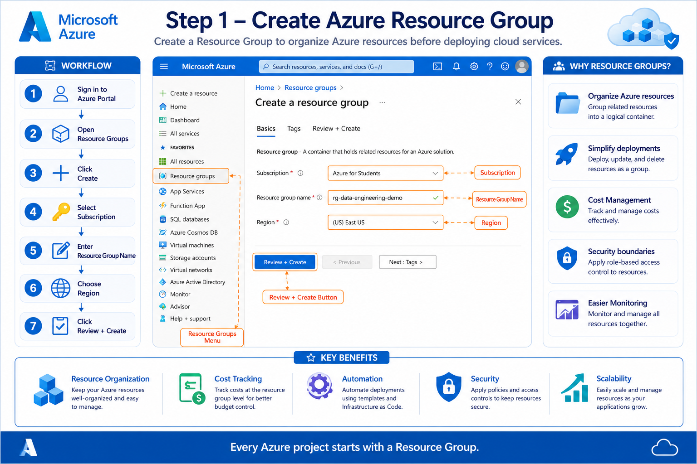
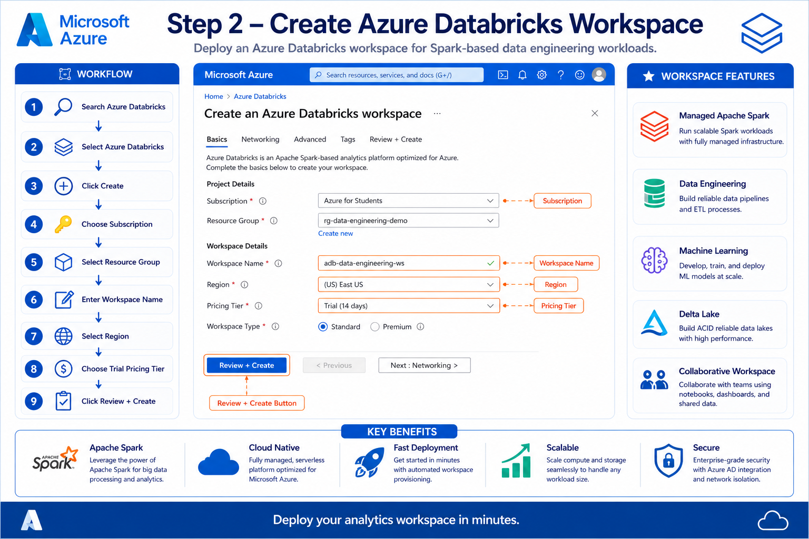
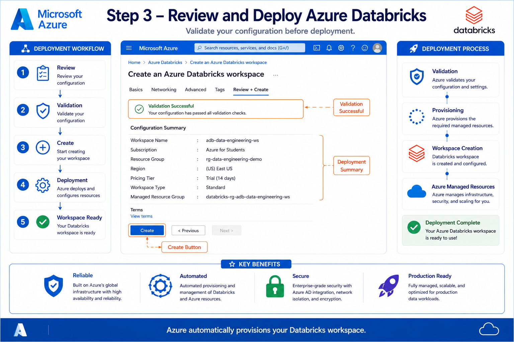
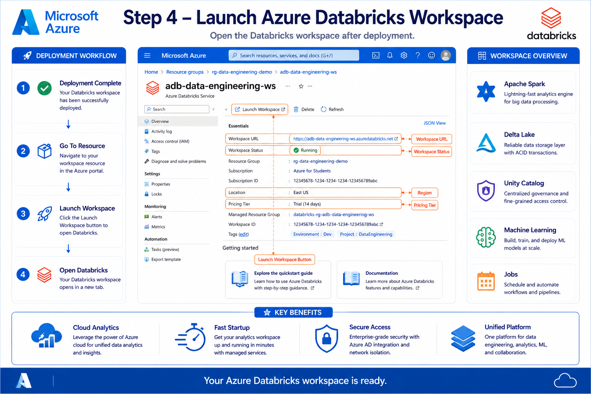
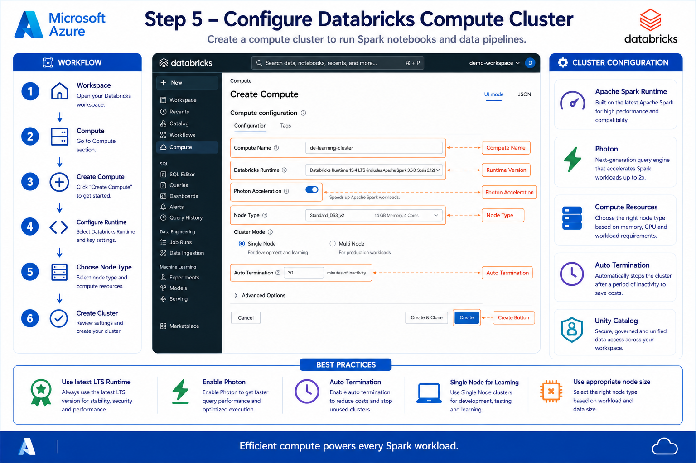

# 🚀 Azure Databricks Workspace Setup

⬅️ [Back to Azure Databricks Fundamentals](./README.md)

---

# 📌 Project Overview

This guide walks you through setting up an **Azure Databricks** environment for Data Engineering. By the end of this tutorial, you'll have a fully configured Databricks workspace with a compute cluster ready for developing and running Apache Spark applications.

In this guide, you will learn how to:

- Create an Azure Resource Group
- Deploy an Azure Databricks Workspace
- Configure the workspace settings
- Launch the Databricks Workspace
- Create and configure a Compute Cluster
- Prepare the environment for Data Engineering workloads

This setup provides the foundation for building scalable ETL pipelines, Lakehouse architectures, and big data processing solutions on Microsoft Azure.

---

# 📖 Step 1: Create an Azure Resource Group

A **Resource Group** is a logical container that organizes and manages related Azure resources.

### In this step, you will:

- Sign in to the Azure Portal
- Navigate to **Resource Groups**
- Click **Create**
- Enter a Resource Group name
- Select the desired Azure Region
- Review the configuration and create the Resource Group

### Infographic

---

# 📖 Step 2: Create an Azure Databricks Workspace

Deploy an Azure Databricks Workspace where you'll develop notebooks, manage clusters, and run Spark jobs.

### In this step, you will:

- Search for **Azure Databricks**
- Click **Create**
- Select your Subscription
- Choose the Resource Group
- Provide a Workspace Name
- Select the Azure Region
- Choose the Pricing Tier
- Review the configuration and deploy the workspace

### Infographic

---

# 📖 Step 3: Review and Deploy the Workspace

Azure validates the configuration before provisioning the Databricks workspace.

### In this step, you will:

- Review all configuration settings
- Verify successful validation
- Click **Create**
- Wait for deployment to complete
- Navigate to the deployed resource

### Infographic

---

# 📖 Step 4: Launch Azure Databricks

After deployment is complete, launch the Databricks Workspace from the Azure Portal.

### In this step, you will:

- Open the deployed Azure Databricks resource
- Click **Launch Workspace**
- Access the Databricks home page
- Explore the workspace interface

### Infographic

---

# 📖 Step 5: Configure the Compute Cluster

Create a compute cluster that will execute your notebooks, ETL pipelines, and Spark applications.

### In this step, you will configure:

- Compute Name
- Databricks Runtime (LTS)
- Access Mode
- Photon Acceleration
- Node Type
- Auto Termination
- Cluster Creation

### Infographic

---

# ⚡ Compute Best Practices

Follow these recommendations to optimize performance and minimize cloud costs:

- ✅ Use the latest **Databricks Runtime LTS**
- ✅ Enable **Photon Acceleration** for improved performance
- ✅ Configure **Auto Termination** to stop idle clusters
- ✅ Use **Single Node** clusters for learning and development
- ✅ Use **Multi-node** clusters for production workloads
- ✅ Delete unused clusters to avoid unnecessary charges

---

# 💰 Azure Cost Optimization

To manage your Azure spending effectively:

- Create a monthly budget using **Azure Cost Management**
- Enable Auto Termination on all compute clusters
- Stop idle clusters when not in use
- Delete unused workspaces and resources
- Regularly monitor usage and spending through Azure Cost Analysis

---

# 🛠️ Technologies Used

This setup includes the following Azure services and technologies:

- Microsoft Azure
- Azure Resource Groups
- Azure Databricks
- Apache Spark
- Databricks Runtime
- Photon Engine
- Azure Cost Management

---

# 🎯 Learning Outcomes

After completing this guide, you will be able to:

- Create and manage Azure Resource Groups
- Deploy an Azure Databricks Workspace
- Launch and navigate the Databricks environment
- Configure and manage Compute Clusters
- Select the appropriate Spark Runtime
- Optimize cluster performance and costs
- Prepare an Azure environment for Data Engineering projects

---

# 🔒 Security Best Practices

Follow these security recommendations when working with Azure Databricks:

- ✅ Use Azure RBAC for access control
- ✅ Follow the Principle of Least Privilege
- ✅ Store secrets securely using Azure Key Vault
- ✅ Authenticate users with Microsoft Entra ID
- ✅ Avoid sharing workspace credentials
- ✅ Monitor workspace activity and audit logs
- ✅ Remove unused compute clusters and resources

---