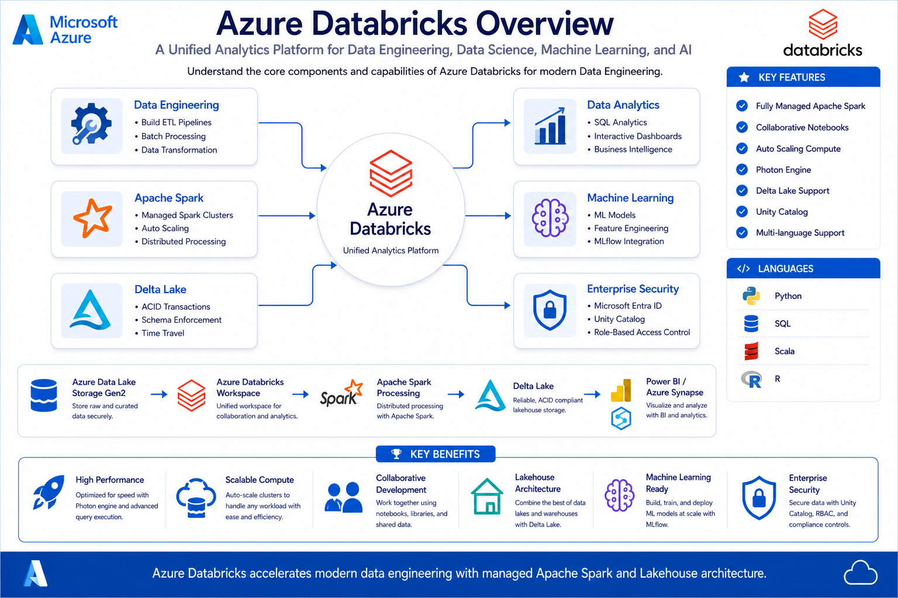
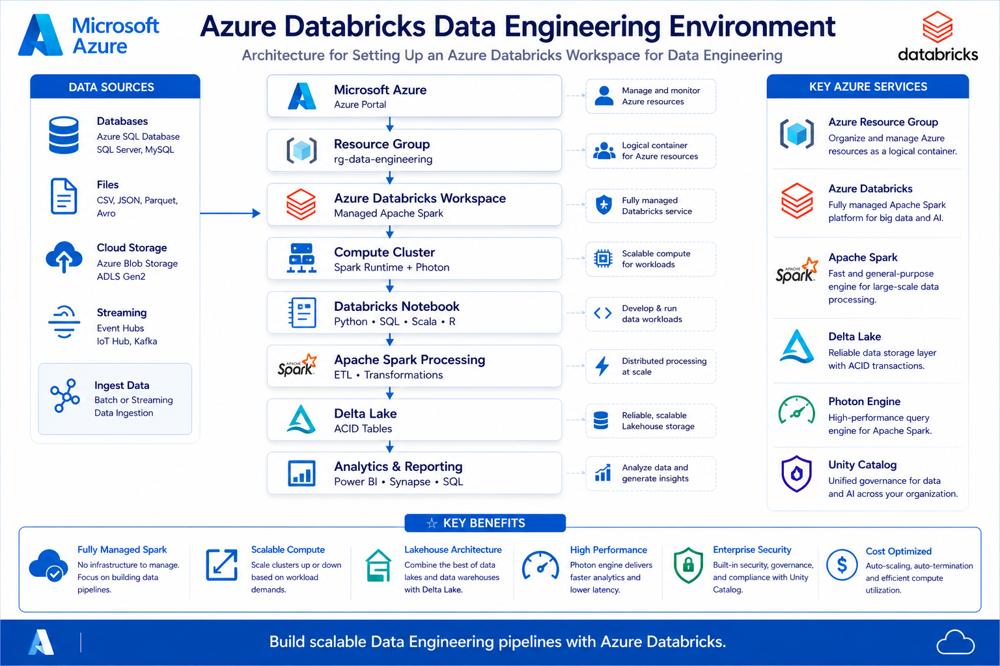

# 🚀 Azure Databricks Fundamentals

⬅️ [Back to Azure Account Setup](../01_Azure_Account_Setup/README.md)

---

# 📚 Table of Contents

- Introduction
- What is Azure Databricks?
- Why Azure Databricks?
- Azure Databricks Architecture
- Key Components
- Databricks Workspace
- Compute
- Clusters
- Notebooks
- Unity Catalog
- DBFS
- Databricks Runtime
- Photon Engine
- Typical Data Engineering Workflow
- Real-World Use Cases
- Advantages
- Best Practices
- Interview Questions
- Key Takeaways

---

# 📖 Introduction

Azure Databricks is Microsoft's fully managed Apache Spark platform built in collaboration with Databricks.

It enables Data Engineers, Data Scientists, and Machine Learning Engineers to build scalable data pipelines, process big data, and develop AI solutions without managing Spark infrastructure.

Azure Databricks integrates seamlessly with Azure services such as Azure Data Lake Storage Gen2, Azure Data Factory, Azure Synapse Analytics, Azure Key Vault, and Microsoft Entra ID.

---

# ☁️ What is Azure Databricks?

Azure Databricks is a cloud-based analytics platform powered by Apache Spark.

It provides:

- Managed Spark Clusters
- Collaborative Workspaces
- Interactive Notebooks
- Delta Lake Support
- Machine Learning Tools
- SQL Analytics
- Workflow Automation

Unlike traditional Spark installations, Azure Databricks automatically provisions, manages, scales, and optimizes Spark clusters.



---

# 🎯 Why Azure Databricks?

Azure Databricks offers:

✅ Fully Managed Apache Spark

✅ Auto Scaling Clusters

✅ Collaborative Notebooks

✅ High Performance with Photon Engine

✅ Native Delta Lake Support

✅ Tight Integration with Azure Services

✅ Enterprise-grade Security

---

# 🏗 Azure Databricks Architecture



Typical architecture:

```text
Azure Data Lake Storage
        │
        ▼
Azure Databricks Workspace
        │
        ▼
Spark Compute Cluster
        │
        ▼
Delta Lake
        │
        ▼
Power BI / Synapse / SQL
```

---

# 🧩 Key Components

## Workspace

A collaborative environment where users create notebooks, jobs, dashboards, and workflows.

---

## Compute

The processing engine used to execute Spark jobs.

Types:

- Single Node
- Multi Node
- Job Cluster
- All Purpose Cluster

---

## Cluster

A collection of virtual machines that run Apache Spark.

Cluster consists of:

- Driver Node
- Worker Nodes

---

## Notebook

Interactive environment supporting:

- Python
- SQL
- Scala
- R

---

## Unity Catalog

Centralized governance for:

- Tables
- Schemas
- Catalogs
- Permissions
- Lineage

---

## DBFS (Databricks File System)

A distributed file system for storing data and notebooks.

Example:

```text
dbfs:/FileStore/
```

---

## Databricks Runtime

A customized Spark distribution optimized by Databricks.

Includes:

- Apache Spark
- Delta Lake
- Optimized Libraries
- Machine Learning Libraries

---

## Photon Engine

Photon is Databricks' vectorized query engine.

Benefits:

- Faster SQL Queries
- Better Spark Performance
- Lower DBU Cost

---

# 🔄 Typical Data Engineering Workflow

```text
Azure Data Lake Storage

↓

Azure Databricks

↓

Spark Transformations

↓

Delta Lake

↓

Power BI / Synapse
```

---

# 🌍 Real-World Use Cases

Azure Databricks is commonly used for:

- ETL Pipelines
- Batch Processing
- Streaming Analytics
- Data Lakehouse
- Machine Learning
- Data Warehousing

---

# 🚀 Advantages

✅ Easy Cluster Management

✅ Auto Scaling

✅ Auto Termination

✅ Delta Lake

✅ Collaborative Development

✅ Enterprise Security

✅ Integration with Azure

---

# 🛠️ Best Practices

✅ Enable Photon

✅ Use Latest Databricks Runtime LTS

✅ Enable Auto Termination

✅ Use Unity Catalog

✅ Store Data in ADLS Gen2

✅ Monitor Cluster Usage

✅ Delete Idle Clusters

---

# 🎤 Interview Questions

### What is Azure Databricks?

Azure Databricks is Microsoft's managed Apache Spark platform used for big data analytics, ETL, and machine learning.

---

### What is the difference between Workspace and Cluster?

Workspace stores notebooks and jobs.

Cluster provides compute resources to execute workloads.

---

### What is Photon?

Photon is Databricks' high-performance query engine that accelerates Spark SQL and DataFrame operations.

---

### What is Unity Catalog?

A centralized governance solution for managing data access, metadata, and lineage.

---

### What is Databricks Runtime?

An optimized Apache Spark distribution maintained by Databricks.

---

### What programming languages are supported?

- Python
- SQL
- Scala
- R

---

### What is Auto Termination?

Automatically shuts down idle clusters to reduce cloud costs.

---

### What is the Driver Node?

The Driver Node coordinates Spark jobs and distributes tasks to Worker Nodes.

---

### What is Delta Lake?

An open storage layer that provides ACID transactions, schema enforcement, and time travel on top of cloud storage.

---

# 🏁 Key Takeaways

- Azure Databricks is a managed Apache Spark platform.
- Workspaces enable collaboration.
- Clusters provide compute.
- Photon improves performance.
- Unity Catalog manages governance.
- Delta Lake provides reliable storage.
- Azure Databricks integrates with ADLS Gen2, Synapse, and Power BI.

---

# 📚 Next Topic

➡️ [Azure Databricks Setup](01_Azure_Databricks_Setup.md)

➡️ [Azure Data Lake Storage (ADLS)](../03_ADLS/READM.md)
