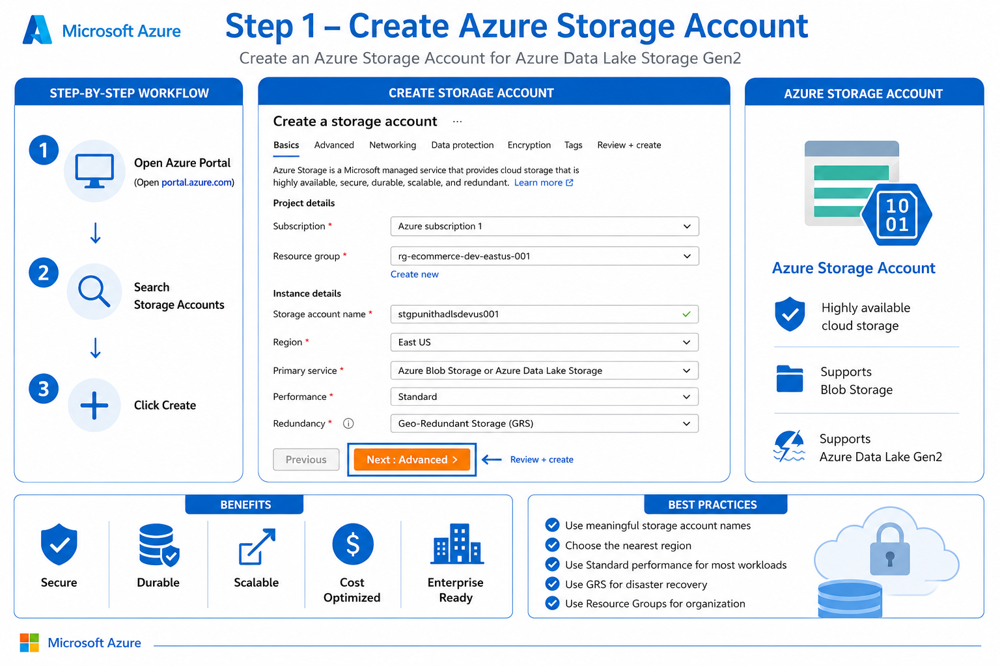
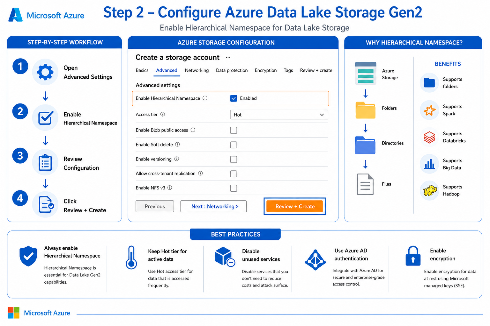
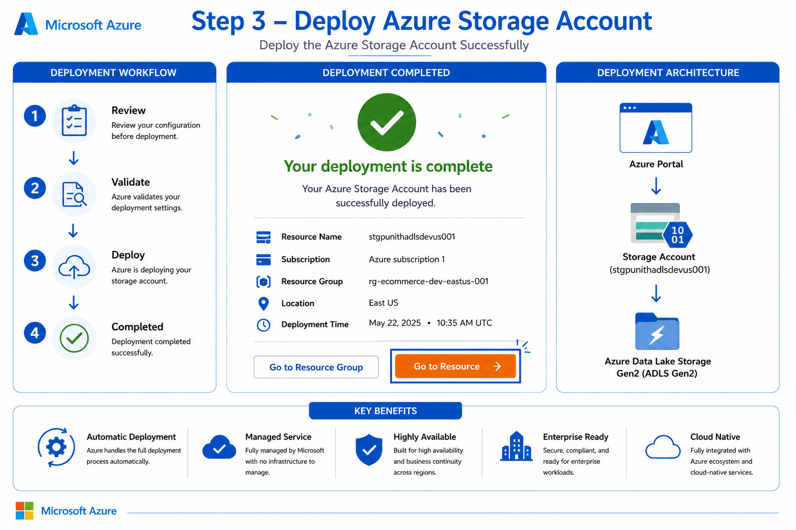
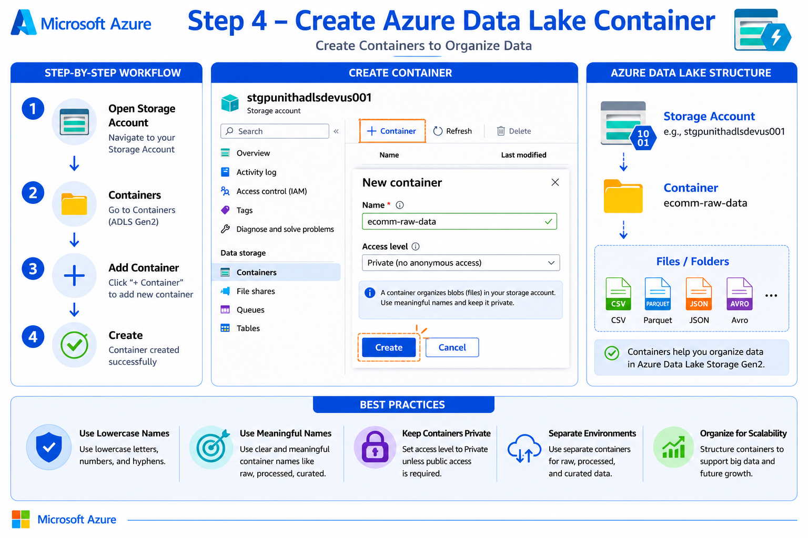
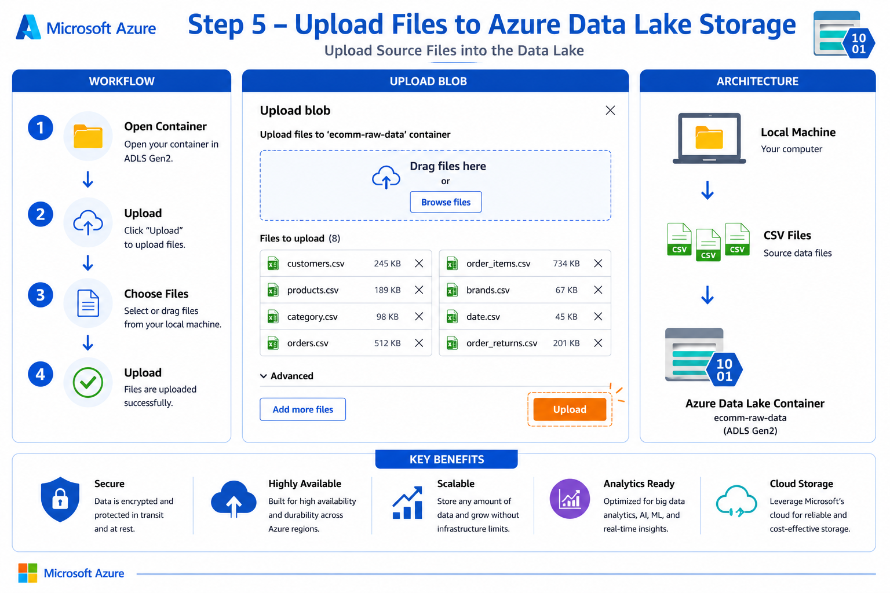
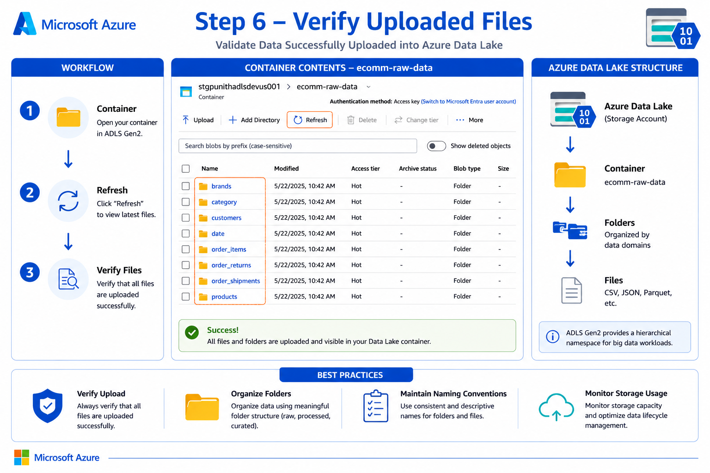
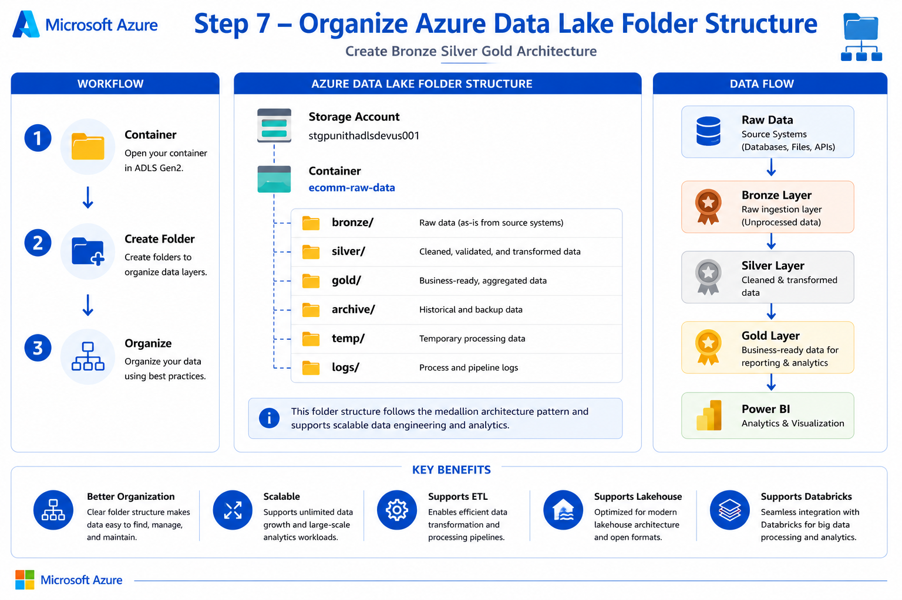
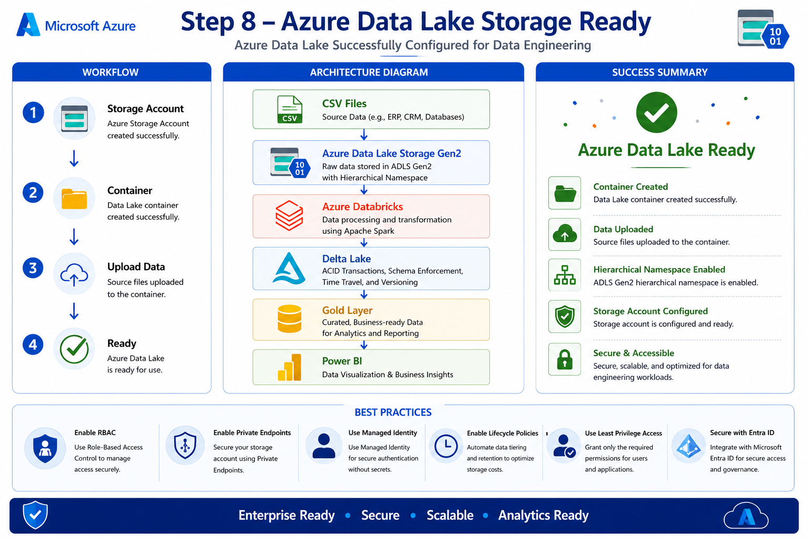

# 📦 Azure Data Lake Storage Gen2 (ADLS Gen2) Setup Guide


⬅️ [Back to Azure Data Lake Storage](READM.md)

---

# 📖 Overview

Azure Data Lake Storage Gen2 (ADLS Gen2) is Microsoft's enterprise-grade cloud storage solution designed for Big Data Analytics workloads.

This guide demonstrates how to:

- Create an Azure Storage Account
- Enable Data Lake Storage Gen2
- Deploy the Storage Account
- Create Containers
- Upload Data
- Organize Data Lake Structure
- Verify Uploaded Data
- Prepare ADLS for Azure Databricks

---

# 🏗 Architecture

```text
Azure Portal
      │
      ▼
Storage Account
      │
      ▼
Azure Data Lake Storage Gen2
      │
      ▼
Containers
      │
      ▼
CSV / JSON / Parquet Files
      │
      ▼
Azure Databricks
      │
      ▼
Delta Lake
```

---

# 🚀 Step 1 — Create Azure Storage Account

Create a Storage Account from the Azure Portal.

<div align="center">



</div>

---

# 🚀 Step 2 — Enable Azure Data Lake Storage Gen2

Enable the **Hierarchical Namespace** to convert Blob Storage into Azure Data Lake Storage Gen2.

<div align="center">



</div>

---

# 🚀 Step 3 — Deploy Storage Account

Review the configuration and deploy the Storage Account.

<div align="center">



</div>

---

# 🚀 Step 4 — Create Azure Data Lake Container

Inside the Storage Account,

<div align="center">



</div>

---

# 🚀 Step 5 — Upload Files

Open the container and upload the source files.

<div align="center">



</div>

---

# 🚀 Step 6 — Verify Uploaded Data

Verify that all files are successfully uploaded.

<div align="center">



</div>

---

# 🚀 Step 7 — Organize Data Lake Structure

A recommended enterprise folder structure

<div align="center">



</div>

---

# 🚀 Step 8 — Azure Data Lake Ready

Your Azure Data Lake is now ready for Data Engineering workloads.

<div align="center">



</div>

---

# 📋 Best Practices

- ✅ Enable Hierarchical Namespace
- ✅ Use meaningful Storage Account names
- ✅ Create separate Containers for environments
- ✅ Organize Bronze / Silver / Gold folders
- ✅ Enable RBAC
- ✅ Use Microsoft Entra ID authentication
- ✅ Enable Lifecycle Management
- ✅ Enable Soft Delete
- ✅ Monitor Storage usage
- ✅ Enable Diagnostic Logs

---

# 🎯 Benefits of ADLS Gen2

| Feature | Description |
|----------|-------------|
| 🚀 High Performance | Optimized for Big Data workloads |
| 📂 Hierarchical Namespace | Native folder support |
| 🔒 Secure | Microsoft Entra ID, RBAC, Private Endpoints |
| 📈 Scalable | Petabyte-scale storage |
| 💰 Cost Optimized | Hot, Cool, Cold tiers |
| ⚡ Analytics Ready | Works with Databricks, Synapse, Fabric |


