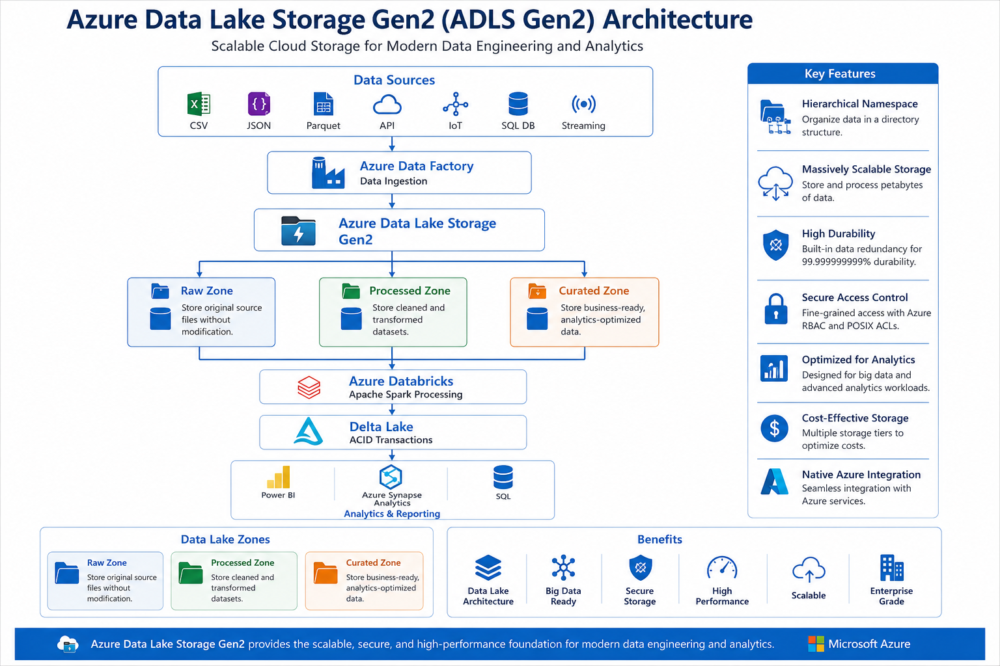

# 💾 Azure Data Lake Storage (ADLS)

⬅️ [Back to Azure Databricks](../02_Azure_Databricks/README.md)

---

# 📚 Table of Contents

- Overview
- Learning Objectives
- What is Azure Data Lake Storage (ADLS)?
- ADLS Architecture
- ADLS Gen1 vs ADLS Gen2
- ADLS Hierarchy
- Key Features
- ADLS Access Methods
- Security Model
- Storage Tiers
- Real-World Use Cases
- Best Practices
- Interview Questions
- Summary
- Key Takeaways
- Next Topic

---

# 📖 Overview

**Azure Data Lake Storage (ADLS)** is Microsoft's highly scalable and secure cloud storage service designed specifically for **Big Data Analytics** and **Data Engineering** workloads.

ADLS combines the scalability of **Azure Blob Storage** with a hierarchical file system, making it an ideal storage layer for **Apache Spark**, **Databricks**, **Azure Synapse Analytics**, **Microsoft Fabric**, and other analytics services.

It supports storing structured, semi-structured, and unstructured data while providing enterprise-grade security, fine-grained access control, and high-performance analytics.

---

# 🎯 Learning Objectives

After completing this guide, you will understand:

- What Azure Data Lake Storage is
- ADLS architecture
- ADLS Gen1 vs ADLS Gen2
- Hierarchical Namespace
- Security and Access Control
- Storage Tiers
- Integration with Databricks and Spark
- Real-world use cases

---

# 💾 What is Azure Data Lake Storage?

Azure Data Lake Storage (ADLS) is Microsoft's cloud-based storage service optimized for large-scale analytics workloads.

It provides:

- Unlimited scalability
- Hierarchical file system
- Enterprise security
- Fine-grained permissions
- High throughput
- Cost-effective storage

ADLS Gen2 is built on top of Azure Blob Storage and extends it with **Hierarchical Namespace (HNS)** capabilities.

---

# 🏗️ ADLS Architecture



---

# 🗂️ ADLS Hierarchy

Azure Data Lake Storage follows a hierarchical storage model.

```text
Storage Account
        │
        ▼
Container (Filesystem)
        │
        ▼
Directory
        │
        ▼
Sub Directory
        │
        ▼
Files
```

Example:

```text
storageaccount

│

├── bronze

│     ├── sales

│     ├── customer

│

├── silver

│     ├── sales

│

└── gold

      ├── dashboard

      ├── reports
```

---

# ⚖️ ADLS Gen1 vs ADLS Gen2

| Feature                | ADLS Gen1 | ADLS Gen2          |
| ---------------------- | --------- | ------------------ |
| Status                 | Legacy    | Recommended        |
| Storage Engine         | Dedicated | Azure Blob Storage |
| Hierarchical Namespace | Yes       | Yes                |
| Performance            | High      | Higher             |
| Cost                   | Higher    | Lower              |
| Blob Compatibility     | No        | Yes                |
| Databricks Support     | Limited   | Excellent          |
| Spark Integration      | Good      | Excellent          |

---

# ⭐ Key Features

## 📁 Hierarchical Namespace

Supports folders and directories for efficient file operations.

---

## 🔒 Enterprise Security

Supports:

- Azure Active Directory (AAD)
- Role-Based Access Control (RBAC)
- POSIX ACLs
- Private Endpoints
- Encryption

---

## 🚀 High Performance

Optimized for:

- Apache Spark
- Azure Databricks
- Azure Synapse
- Microsoft Fabric

---

## 📈 Massive Scalability

Supports petabytes of data with virtually unlimited scalability.

---

## 💰 Cost Optimization

Supports multiple storage tiers to reduce storage costs.

---

# 🔐 Security Model

ADLS supports multiple security mechanisms.

| Security Feature   | Purpose                |
| ------------------ | ---------------------- |
| Azure AD           | Authentication         |
| RBAC               | Authorization          |
| POSIX ACLs         | File-level permissions |
| Encryption at Rest | Data Protection        |
| TLS                | Encryption in Transit  |
| Private Endpoint   | Network Isolation      |

---

# 📦 Storage Tiers

Azure Storage supports different access tiers.

| Tier    | Use Case                   |
| ------- | -------------------------- |
| Hot     | Frequently accessed data   |
| Cool    | Infrequently accessed data |
| Archive | Long-term archival         |

---

# 🔌 ADLS Access Methods

You can access ADLS using:

- Azure Portal
- Azure Storage Explorer
- Databricks
- Apache Spark
- Azure Synapse Analytics
- Azure CLI
- Azure SDK
- REST API

---

# 🌍 Real-World Use Cases

| Use Case             | Benefit                     |
| -------------------- | --------------------------- |
| Data Lake            | Centralized storage         |
| ETL Pipelines        | High-performance processing |
| Data Warehousing     | Analytical workloads        |
| Machine Learning     | Store training datasets     |
| IoT Analytics        | Massive event storage       |
| Log Analytics        | Centralized logging         |
| Enterprise Reporting | Shared analytics storage    |

---

# 💡 Best Practices

- ✅ Use **ADLS Gen2** instead of Gen1 for new projects.
- ✅ Organize data using a **Bronze → Silver → Gold** architecture.
- ✅ Enable **Hierarchical Namespace (HNS)** for analytics workloads.
- ✅ Use **Azure Active Directory (AAD)** for authentication.
- ✅ Apply **Role-Based Access Control (RBAC)** and **POSIX ACLs** for fine-grained security.
- ✅ Store data in efficient formats such as **Parquet** or **Delta Lake**.
- ✅ Separate development, testing, and production data into different containers or storage accounts.
- ✅ Use lifecycle management policies to move infrequently accessed data to Cool or Archive tiers.
- ✅ Monitor storage usage and optimize costs regularly.
- ✅ Encrypt sensitive data both at rest and in transit.

---

# 🎤 Interview Questions

### 1. What is Azure Data Lake Storage?

Azure Data Lake Storage is Microsoft's scalable cloud storage service designed for analytics and big data workloads.

---

### 2. What is the difference between ADLS Gen1 and Gen2?

Gen2 is built on Azure Blob Storage, supports Hierarchical Namespace, offers better integration, and is the recommended version.

---

### 3. What is Hierarchical Namespace?

A feature that enables directory and file-level organization, improving analytics performance and file operations.

---

### 4. What authentication methods are supported?

- Azure Active Directory
- Shared Access Signature (SAS)
- Storage Account Keys

---

### 5. What authorization methods are available?

- RBAC
- POSIX ACLs

---

### 6. Which analytics services integrate with ADLS?

- Azure Databricks
- Apache Spark
- Azure Synapse Analytics
- Microsoft Fabric

---

### 7. What are the storage tiers?

- Hot
- Cool
- Archive

---

### 8. Why is ADLS preferred for Data Engineering?

Because it provides scalable storage, hierarchical namespace, enterprise security, and seamless integration with analytics services.

---

### 9. Can ADLS store unstructured data?

Yes.

It supports:

- Structured
- Semi-structured
- Unstructured data

---

### 10. Which file formats are commonly stored in ADLS?

- Parquet
- Delta Lake
- CSV
- JSON
- Avro

---

# 📊 Summary

| Component              | Purpose                    |
| ---------------------- | -------------------------- |
| Storage Account        | Top-level storage resource |
| Container (Filesystem) | Logical storage unit       |
| Directory              | Organize data              |
| Files                  | Store datasets             |
| Hierarchical Namespace | Efficient file management  |
| RBAC & ACL             | Secure access control      |

---

# 🎯 Key Takeaways

- **Azure Data Lake Storage (ADLS)** is Microsoft's cloud storage service designed for big data analytics and data engineering.
- **ADLS Gen2** builds on Azure Blob Storage and introduces a **Hierarchical Namespace**, enabling efficient file and directory operations.
- It provides enterprise-grade security through **Azure Active Directory**, **RBAC**, **POSIX ACLs**, and encryption.
- ADLS integrates seamlessly with services such as **Azure Databricks**, **Apache Spark**, **Azure Synapse Analytics**, and **Microsoft Fabric**.
- Organizing data using the **Bronze → Silver → Gold** architecture improves data quality and simplifies analytics pipelines.
- Storing data in **Parquet** or **Delta Lake** formats maximizes performance and reduces storage costs.
- ADLS is the preferred storage layer for scalable, secure, and production-ready Azure data engineering solutions.

---

# 📚 Next Topic

➡️ [Azure Databricks Workspace Setup](01_Azure_Databricks_Setup.md)

➡️ [Setup Azure Catalog and Connectors](../04_Setup_Azure_Catalog_and_Connectors/README.md)
