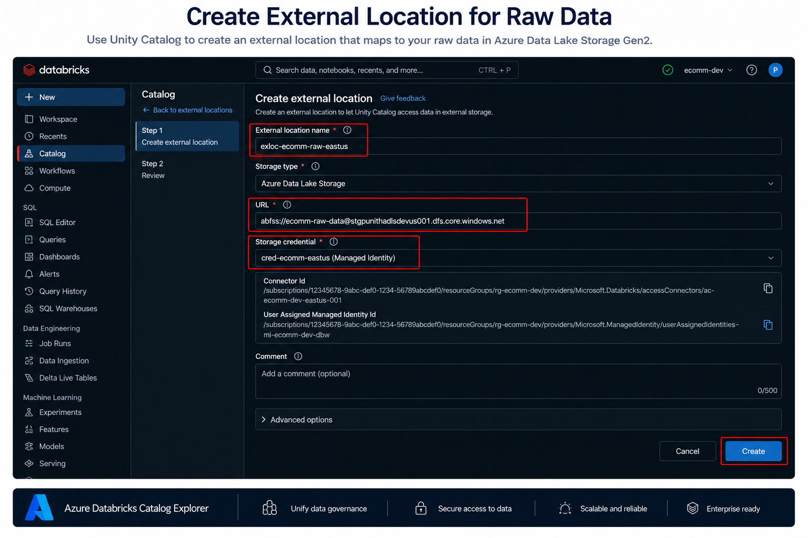
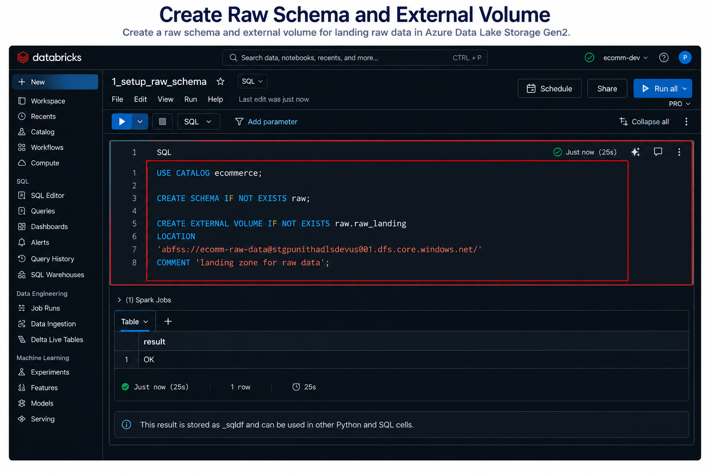

# 📂 Create Raw Schema and External Volume in Unity Catalog


⬅️ [Back to Setup Azure Catalog and Connectors](../04_Setup_Azure_Catalog_and_Connectors/README.md)

---

# 📖 Overview

After successfully configuring **Unity Catalog**, the next step is to prepare the **Raw (Bronze) Layer** of your Data Lakehouse.

In this guide, you will create:

- An **External Location** for the raw data container
- A **Raw Schema** inside Unity Catalog
- An **External Volume** for storing raw data files

The external volume provides a governed and secure landing zone for **structured**, **semi-structured**, and **unstructured** data stored in Azure Data Lake Storage Gen2.

This setup follows the **Medallion Architecture**, where all incoming source data is first stored in the **Bronze (Raw) Layer** before it is transformed into Silver and Gold layers.

---

# 🎯 Learning Objectives

After completing this guide, you will be able to:

- Create an External Location for raw datasets
- Connect Azure Data Lake Storage Gen2 with Unity Catalog
- Create a Raw Schema
- Create an External Volume
- Organize the Raw Landing Zone
- Store structured and unstructured data securely

---

# 🏗 Architecture

```text
                    Azure Data Lake Storage Gen2
                               │
                               │
                Container : ecomm-raw-data
                               │
                               ▼
                  External Location (Unity Catalog)
                               │
                               ▼
                       Catalog : ecommerce
                               │
                               ▼
                        Schema : raw
                               │
                               ▼
              External Volume : raw.raw_landing
                               │
                               ▼
         CSV • JSON • Parquet • XML • LOG • Images • Excel
```

---

# 📂 Raw Landing Zone

The **ecomm-raw-data** container acts as the centralized landing zone for all incoming source data.

It stores files exactly as they arrive from source systems without applying any transformations.

Example folder structure:

```text
ecomm-raw-data
│
├── customers/
│      ├── customers.csv
│
├── orders/
│      ├── orders.csv
│
├── transactions/
│      ├── transactions.json
│
├── inventory/
│      ├── inventory.parquet
│
├── application_logs/
│      ├── application.log
│
├── suppliers/
│      ├── suppliers.xlsx
│
└── product_images/
       ├── product_001.jpg
```

Supported file types include:

- CSV
- JSON
- Parquet
- XML
- TXT
- LOG
- Excel
- Images
- Other binary files

---

# 🚀 Step 1 — Create an External Location

Navigate to:

```text
Catalog
    ↓
External Locations
    ↓
Create External Location
```

Provide the following configuration.

| Property | Value |
|----------|-------|
| External Location Name | exloc-ecomm-raw-eastus |
| Storage Type | Azure Data Lake Storage |
| URL | abfss://ecomm-raw-data@<storage-account>.dfs.core.windows.net |
| Storage Credential | cred-ecomm-eastus |

After entering all the required details, click **Create**.

<div align="center">



</div>

### Why do we create an External Location?

An External Location provides a secure connection between **Unity Catalog** and **Azure Data Lake Storage Gen2**.

Instead of using Storage Account Keys, Unity Catalog authenticates using the configured **Managed Identity** through the Storage Credential.

This allows multiple users, notebooks, and jobs to securely access raw data while maintaining centralized governance.

---

# 🚀 Step 2 — Create the Raw Schema and External Volume

Open a SQL Notebook in Azure Databricks.

Execute the following SQL commands.

```sql
USE CATALOG ecommerce;

CREATE SCHEMA IF NOT EXISTS raw;

CREATE EXTERNAL VOLUME IF NOT EXISTS raw.raw_landing
LOCATION
'abfss://ecomm-raw-data@<storage-account>.dfs.core.windows.net/'
COMMENT 'Landing zone for raw structured and unstructured data';
```

<div align="center">



</div>

### SQL Explanation

#### USE CATALOG

```sql
USE CATALOG ecommerce;
```

Selects the active Unity Catalog.

---

#### CREATE SCHEMA

```sql
CREATE SCHEMA IF NOT EXISTS raw;
```

Creates the **raw** schema if it does not already exist.

This schema represents the **Bronze Layer** in the Medallion Architecture.

---

#### CREATE EXTERNAL VOLUME

```sql
CREATE EXTERNAL VOLUME IF NOT EXISTS raw.raw_landing
```

Creates an External Volume named **raw_landing** inside the **raw** schema.

---

#### LOCATION

```sql
LOCATION
'abfss://ecomm-raw-data@<storage-account>.dfs.core.windows.net/'
```

Specifies the Azure Data Lake Storage location where raw files are stored.

---

#### COMMENT

```sql
COMMENT 'Landing zone for raw structured and unstructured data';
```

Adds a description to the volume for better documentation.

---

After executing the SQL statements, Databricks should return:

```text
OK
```

This confirms that the schema and external volume have been created successfully.

---

# 📂 Final Resource Hierarchy

```text
Azure Subscription
│
└── Resource Group
      │
      ├── Azure Databricks Workspace
      │
      ├── Unity Catalog
      │      │
      │      └── ecommerce
      │             │
      │             └── raw
      │                    │
      │                    └── raw_landing
      │
      ├── Storage Credential
      │
      ├── External Location
      │
      └── Azure Storage Account
               │
               └── ecomm-raw-data
```

---

# 📂 Data Flow

```text
Source Systems
      │
      ▼
CSV / JSON / XML / LOG / Images
      │
      ▼
Azure Data Lake Storage Gen2
(Container : ecomm-raw-data)
      │
      ▼
External Location
      │
      ▼
Unity Catalog
      │
      ▼
Raw Schema
      │
      ▼
External Volume (raw_landing)
      │
      ▼
Bronze Layer
```

---

# ✅ Verification Checklist

| Component | Status |
|-----------|:------:|
| External Location Created | ✅ |
| Storage Credential Connected | ✅ |
| Raw Schema Created | ✅ |
| External Volume Created | ✅ |
| SQL Executed Successfully | ✅ |
| Raw Landing Zone Ready | ✅ |

---

# 💡 Best Practices

- Use a dedicated container for raw data.
- Store files in their original format.
- Never modify raw source files.
- Use meaningful schema and volume names.
- Separate Bronze, Silver, and Gold layers.
- Use Managed Identity instead of Storage Account Keys.
- Organize files by source system.
- Apply Unity Catalog permissions to control access.
- Maintain descriptive comments for schemas and volumes.

---

# 📚 Next Topic

➡️ [Medallion Processing (Bronze, Silver and Gold)](../06_Medallion_Processing/README.md)