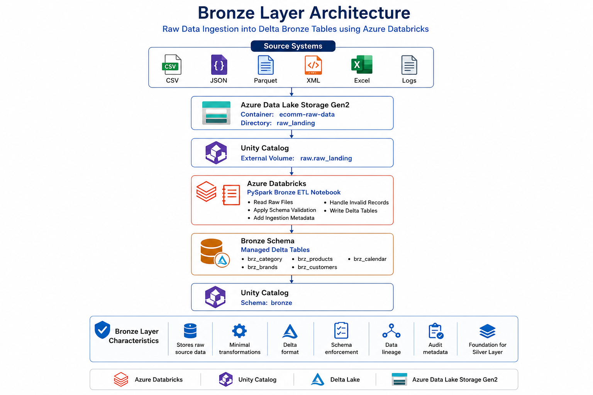
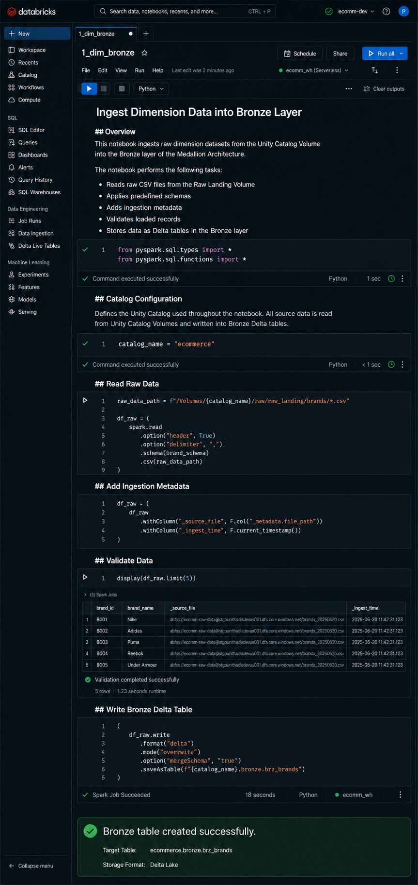
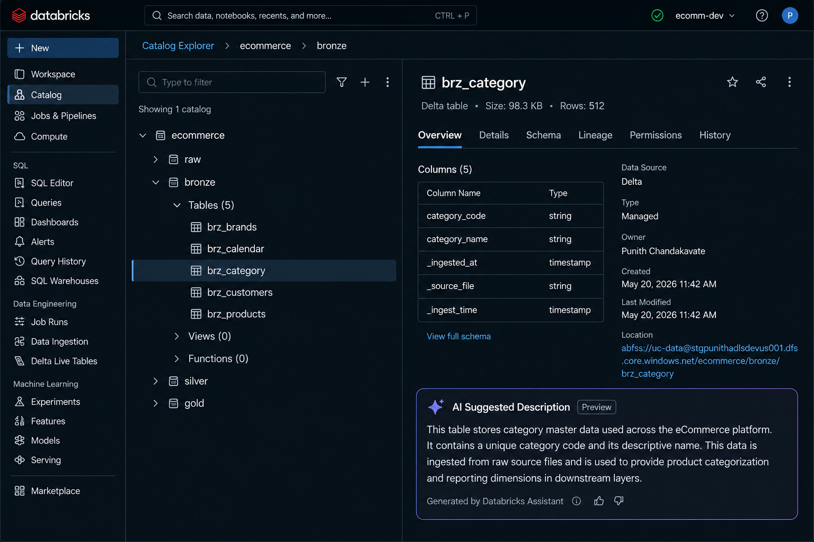

# 🥉 Ingest Raw Dimension Data into Bronze Layer


---

⬅️ [Back to Medallion Processing](../README.md)

---

# 📚 Table of Contents

- Overview
- Learning Objectives
- Prerequisites
- What is the Bronze Layer?
- Medallion Architecture
- Bronze Layer Architecture
- Bronze Layer Workflow
- Notebook Overview
- Step 1 – Open Bronze Ingestion Notebook
- Step 2 – Configure Unity Catalog
- Step 3 – Read Raw Files
- Step 4 – Load Bronze Delta Tables
- Step 5 – Verify Bronze Tables
- Bronze Tables
- Resource Hierarchy
- Data Flow
- Data Lineage
- Verification Checklist
- Best Practices
- Interview Questions
- Summary
- Key Takeaways

---

# 📖 Overview

The **Bronze Layer** is the first layer of the **Medallion Architecture**, responsible for ingesting raw source data into the Lakehouse with minimal transformation.

In this notebook, raw dimension datasets stored in **Unity Catalog Volumes** are read using **PySpark**, validated against predefined schemas, enriched with ingestion metadata, and written as **managed Delta tables** within the Bronze schema.

The primary objective of the Bronze layer is to preserve the original source data while ensuring reliable storage, traceability, and data lineage. It serves as the foundation for all downstream Silver and Gold transformations.

---

# 🎯 Learning Objectives

After completing this guide, you will be able to:

- Understand the purpose of the Bronze layer.
- Read raw datasets from Unity Catalog Volumes.
- Apply predefined schemas using PySpark.
- Create managed Delta tables in the Bronze schema.
- Preserve raw source data with minimal transformations.
- Add ingestion metadata for auditing and lineage.
- Verify Bronze tables using Unity Catalog.
- Prepare data for downstream Silver transformations.

---

# 📋 Prerequisites

Before starting this notebook, ensure you have completed the following modules:

- Azure Databricks Workspace Setup
- Azure Data Lake Storage Gen2 Setup
- Unity Catalog Configuration
- Raw Schema and External Volume Setup
- Raw CSV files uploaded into the Unity Catalog Volume

---

# 🥉 What is the Bronze Layer?

The **Bronze Layer** is the raw ingestion layer of the **Medallion Architecture**.

Its responsibility is to ingest source data exactly as received from upstream systems while preserving its original structure.

Only minimal processing is performed during ingestion, including:

- Schema enforcement
- Data validation
- Metadata enrichment
- Delta table creation

Business rules, aggregations, and cleansing are intentionally avoided at this stage.

The Bronze layer acts as the immutable source of truth for all downstream processing.

---

# 🏛 Medallion Architecture

The Medallion Architecture organizes data into multiple quality layers.

```text
                Source Systems
                       │
                       ▼
                🥉 Bronze Layer
             Raw Ingested Data
                       │
                       ▼
                🥈 Silver Layer
        Cleaned & Validated Data
                       │
                       ▼
                 🥇 Gold Layer
     Business Ready Analytics Data
```

Each layer progressively improves data quality while maintaining lineage and governance.

---

# 🏗 Bronze Layer Architecture



```text
               Source CSV Files
                       │
                       ▼
       Unity Catalog Volume (raw_landing)
                       │
                       ▼
          PySpark Bronze ETL Notebook
                       │
                       ▼
            Schema Validation
                       │
                       ▼
         Add Ingestion Metadata
                       │
                       ▼
       Managed Delta Bronze Tables
                       │
                       ▼
      Unity Catalog Bronze Schema
```

---

# 🔄 Bronze Layer Workflow

```text
Raw Landing Volume
        │
        ▼
Read CSV Files
        │
        ▼
Apply Schema
        │
        ▼
Validate Data
        │
        ▼
Add Metadata
        │
        ▼
Create Delta Tables
        │
        ▼
Verify in Unity Catalog
```

---

# 📓 Notebook Overview

The Bronze ingestion notebook automates the process of loading raw dimension datasets into managed Delta tables.

The notebook performs the following tasks:

1. Configure Unity Catalog
2. Define schemas
3. Read raw CSV files
4. Validate records
5. Add ingestion metadata
6. Create managed Delta tables
7. Verify successful execution

---

# 🚀 Step 1 — Open the Bronze Ingestion Notebook

Open the notebook responsible for loading dimension datasets into the Bronze layer.

The notebook contains:

- Unity Catalog configuration
- Schema definitions
- Data ingestion logic
- Delta table creation
- Validation steps



---

# 🚀 Step 2 — Configure Unity Catalog

The notebook first configures the Unity Catalog environment.

Example:

```python
catalog_name = "ecommerce"
bronze_schema = "bronze"
```

All Bronze tables are created inside:

```
ecommerce.bronze
```

This ensures consistent governance and centralized metadata management.

---

# 🚀 Step 3 — Read Raw Files

The notebook reads raw CSV files stored inside the Unity Catalog Volume.

Typical datasets include:

- Categories
- Brands
- Products
- Customers
- Calendar

Example:

```python
df = (
    spark.read
         .option("header", True)
         .schema(category_schema)
         .csv(raw_path)
)
```

Using predefined schemas ensures consistent data types and prevents schema inference issues.

---

# 🚀 Step 4 — Load Bronze Delta Tables

After validation, each dataset is written as a **Managed Delta Table**.

Example:

```python
df.write \
    .mode("overwrite") \
    .format("delta") \
    .saveAsTable("ecommerce.bronze.brz_category")
```

During ingestion, the notebook also appends operational metadata, such as:

- `_ingested_at`
- `_ingest_time`
- `_source_file`

This metadata supports auditing, troubleshooting, and data lineage.

---

# 🚀 Step 5 — Verify Bronze Tables

Open **Catalog Explorer** and verify that the managed Delta tables have been created successfully.

Expected tables include:

- `brz_brands`
- `brz_calendar`
- `brz_category`
- `brz_customers`
- `brz_products`



---

# 📂 Bronze Tables

| Table                   | Description                |
| ----------------------- | -------------------------- |
| **brz_category**  | Product Category Dimension |
| **brz_brands**    | Product Brand Dimension    |
| **brz_products**  | Product Master Data        |
| **brz_customers** | Customer Dimension         |
| **brz_calendar**  | Calendar Dimension         |

---

# 📂 Resource Hierarchy

```text
ecommerce
│
├── raw
│
│   └── raw_landing
│
└── bronze
    │
    ├── brz_brands
    ├── brz_calendar
    ├── brz_category
    ├── brz_customers
    └── brz_products
```

---

# 🔄 Data Flow

```text
Source CSV Files
        │
        ▼
Unity Catalog Volume
(raw_landing)
        │
        ▼
PySpark Bronze Notebook
        │
        ▼
Managed Delta Tables
        │
        ▼
Unity Catalog Bronze Schema
```

---

# 📈 Data Lineage

```text
Raw CSV Files
       │
       ▼
Unity Catalog Volume
       │
       ▼
Bronze PySpark Notebook
       │
       ▼
Bronze Delta Tables
       │
       ▼
Silver Layer
       │
       ▼
Gold Layer
```

---

# ✅ Verification Checklist

After executing the notebook, verify that each component has been successfully created and configured.

| Component                          | Status |
| ---------------------------------- | :----: |
| Unity Catalog Configured           |   ✅   |
| Raw Files Successfully Read        |   ✅   |
| Schemas Applied                    |   ✅   |
| Data Validation Completed          |   ✅   |
| Ingestion Metadata Added           |   ✅   |
| Bronze Delta Tables Created        |   ✅   |
| Delta Format Verified              |   ✅   |
| Tables Registered in Unity Catalog |   ✅   |
| Data Available for Silver Layer    |   ✅   |

---

# 📊 Expected Bronze Tables

The following managed Delta tables should be available after successful execution.

| Table Name              | Description                |
| ----------------------- | -------------------------- |
| **brz_category**  | Product Category Dimension |
| **brz_brands**    | Product Brand Dimension    |
| **brz_products**  | Product Master Data        |
| **brz_customers** | Customer Master Data       |
| **brz_calendar**  | Calendar Dimension         |

These tables become the source for downstream Silver layer transformations.

---

# 🔍 Verify Using SQL

Open a SQL notebook or SQL Editor and execute the following commands.

### Show Catalog

```sql
SHOW CATALOGS;
```

---

### Use Catalog

```sql
USE CATALOG ecommerce;
```

---

### Show Bronze Schema

```sql
SHOW SCHEMAS;
```

---

### Show Bronze Tables

```sql
SHOW TABLES IN bronze;
```

---

### Preview Data

```sql
SELECT *
FROM bronze.brz_products
LIMIT 10;
```

---

### Describe Table

```sql
DESCRIBE EXTENDED bronze.brz_products;
```

---

### Verify Record Count

```sql
SELECT COUNT(*)
FROM bronze.brz_products;
```

---

# 📈 Benefits of the Bronze Layer

Implementing a Bronze layer provides several advantages for modern data engineering pipelines.

| Benefit           | Description                                             |
| ----------------- | ------------------------------------------------------- |
| Data Preservation | Maintains the original source data without modification |
| Traceability      | Supports complete data lineage                          |
| Reprocessing      | Enables data reloads without relying on source systems  |
| Auditability      | Tracks ingestion metadata and source files              |
| Reliability       | Stores data using Delta Lake with ACID guarantees       |
| Scalability       | Supports large-scale batch and streaming ingestion      |
| Governance        | Integrates seamlessly with Unity Catalog                |

---

# 🏆 Why Use Delta Lake in Bronze?

Delta Lake provides enterprise-grade reliability for raw data ingestion.

### Advantages

- ACID Transactions
- Schema Enforcement
- Schema Evolution
- Time Travel
- Scalable Storage
- High Performance
- Data Versioning
- Reliable Batch Processing

---

# 💡 Best Practices

- ✅ Preserve raw data without applying business transformations.
- ✅ Apply predefined schemas instead of relying on schema inference.
- ✅ Store Bronze datasets in **Delta Lake** format.
- ✅ Add ingestion metadata such as timestamps and source file names.
- ✅ Keep Bronze tables append-only whenever possible.
- ✅ Use meaningful naming conventions for schemas and tables.
- ✅ Organize notebooks according to the Medallion Architecture.
- ✅ Validate input data before writing Delta tables.
- ✅ Monitor ingestion jobs for failures and schema changes.
- ✅ Maintain separate environments for Development, Testing, and Production.

---

# ⚠️ Common Mistakes

Avoid the following practices in the Bronze layer:

- ❌ Applying business rules during ingestion.
- ❌ Removing source columns.
- ❌ Updating or deleting raw records unnecessarily.
- ❌ Using inferred schemas in production.
- ❌ Ignoring ingestion metadata.
- ❌ Mixing Bronze and Silver transformations in the same notebook.
- ❌ Writing directly to Gold tables from raw data.

---

# 🎤 Interview Questions

### 1. What is the purpose of the Bronze layer?

The Bronze layer stores raw source data with minimal transformations while preserving the original data for downstream processing.

---

### 2. Why is Delta Lake used in the Bronze layer?

Delta Lake provides ACID transactions, schema enforcement, scalability, and reliable storage for raw datasets.

---

### 3. Why should business transformations be avoided in Bronze?

The Bronze layer should remain a faithful copy of the source data so it can be reprocessed whenever necessary.

---

### 4. What metadata is commonly added during ingestion?

Examples include:

- Ingestion Timestamp
- Source File Name
- Batch ID
- Processing Date

---

### 5. Why should predefined schemas be used?

Predefined schemas improve data quality, ensure consistent data types, and prevent schema drift.

---

### 6. What is the difference between Bronze and Silver?

| Bronze                  | Silver               |
| ----------------------- | -------------------- |
| Raw Data                | Cleaned Data         |
| Minimal Transformations | Business Validation  |
| Source Copy             | Quality Data         |
| Append-Oriented         | Transformation Layer |

---

### 7. Why is Unity Catalog used?

Unity Catalog provides centralized governance, metadata management, permissions, auditing, and lineage.

---

### 8. What type of Delta tables are created in this notebook?

Managed Delta Tables.

---

### 9. Where are the raw files stored?

Inside Unity Catalog External Volumes.

---

### 10. Why is ingestion metadata important?

It supports auditing, troubleshooting, data lineage, monitoring, and reproducibility.

---

### 11. Why is schema validation important?

It prevents invalid records and ensures data consistency across the pipeline.

---

### 12. What happens after the Bronze layer?

The cleaned and validated data is processed in the Silver layer before being transformed into business-ready Gold datasets.

---

# 📊 Summary

| Component            | Purpose                       |
| -------------------- | ----------------------------- |
| Unity Catalog Volume | Stores raw source files       |
| Bronze Notebook      | Performs raw data ingestion   |
| Schema Validation    | Ensures consistent data types |
| Delta Lake           | Reliable ACID storage         |
| Bronze Schema        | Stores managed Delta tables   |
| Metadata Columns     | Supports auditing and lineage |
| Unity Catalog        | Centralized governance        |

---

# 🎯 Key Takeaways

- The Bronze layer is the foundation of the Medallion Architecture, designed to ingest and preserve raw source data.
- Unity Catalog Volumes provide secure and governed access to raw datasets stored in Azure Data Lake Storage.
- PySpark applies predefined schemas to ensure consistent and reliable data ingestion.
- Managed Delta tables provide ACID transactions, schema enforcement, and scalable storage for raw data.
- Ingestion metadata such as timestamps and source file names improves auditing, monitoring, and data lineage.
- Business transformations should be deferred to the Silver layer, keeping the Bronze layer as an immutable source of truth.
- A well-designed Bronze layer enables reliable downstream processing, simplifies troubleshooting, and supports enterprise-scale analytics.

---

# 📚 Next Module

➡️ **🥈 Silver Layer – Data Cleansing & Transformations**

In the next module, you'll clean, standardize, validate, and enrich the Bronze datasets to create high-quality Silver tables that serve as the foundation for analytical workloads.
