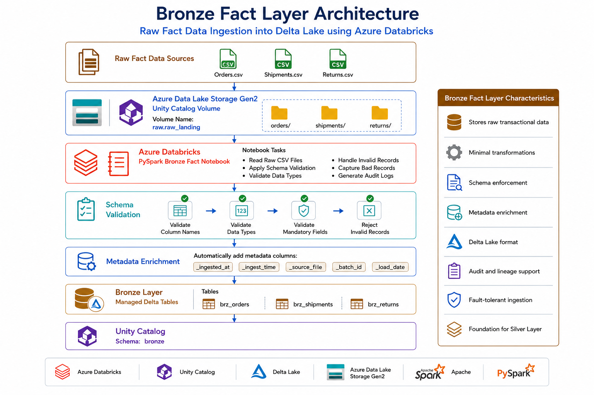

# 📦 Ingest Raw Fact Data into Bronze Layer


---

⬅️ [Back to Bronze Layer](README.md)

---

# 📚 Table of Contents

- Overview
- Learning Objectives
- Prerequisites
- What are Fact Tables?
- Difference Between Dimension and Fact Tables
- Bronze Layer for Fact Tables
- Bronze Layer Architecture
- Bronze Layer Workflow
- Notebook Overview
- Step 1 – Open Fact Ingestion Notebook
- Step 2 – Configure Unity Catalog
- Step 3 – Read Raw Fact Files
- Step 4 – Apply Schemas
- Step 5 – Load Bronze Delta Tables
- Step 6 – Verify Bronze Tables
- Bronze Fact Tables
- Resource Hierarchy
- Data Flow
- Data Lineage
- Verification Checklist
- Verify Using SQL
- Benefits of Bronze Fact Tables
- Why Use Delta Lake?
- Best Practices
- Common Mistakes
- Interview Questions
- Summary
- Key Takeaways

---

# 📖 Overview

The Bronze Layer is responsible for ingesting raw transactional data into the Lakehouse while preserving its original structure.

In this notebook, raw **Fact datasets** stored in **Unity Catalog Volumes** are read using **PySpark**, validated using predefined schemas, enriched with ingestion metadata, and written as **Managed Delta Tables** inside the Bronze schema.

Unlike Dimension tables, Fact tables store measurable business events such as customer orders, shipments, and product returns.

These datasets become the foundation for downstream Silver transformations and Gold analytical models.

---

# 🎯 Learning Objectives

After completing this guide, you will be able to:

- Understand Fact Tables.
- Read transactional datasets from Unity Catalog Volumes.
- Apply predefined schemas.
- Create Bronze Delta Fact Tables.
- Preserve raw transactional data.
- Add ingestion metadata.
- Verify Delta tables using Unity Catalog.
- Prepare data for Silver transformations.

---

# 📋 Prerequisites

Before starting this notebook, ensure you have completed:

- Azure Databricks Workspace Setup
- Azure Data Lake Storage Gen2 Setup
- Unity Catalog Configuration
- Raw Schema and External Volume Setup
- Bronze Dimension Data Ingestion
- Raw Fact CSV files uploaded into Unity Catalog Volume

---

# 📦 What are Fact Tables?

Fact Tables store measurable business events or transactions generated by operational systems.

Each record typically references one or more Dimension tables and contains quantitative metrics used for reporting and analytics.

Examples include:

- Customer Orders
- Product Shipments
- Product Returns
- Sales Transactions
- Payments

Fact tables continuously grow as new business events occur.

---

# 🔄 Difference Between Dimension and Fact Tables

| Dimension Tables         | Fact Tables                |
| ------------------------ | -------------------------- |
| Descriptive Information  | Transactional Information  |
| Smaller Dataset          | Larger Dataset             |
| Customer, Product, Brand | Orders, Shipments, Returns |
| Mostly Static            | Continuously Growing       |
| Used for Filtering       | Used for Calculations      |

---

# 🥉 Bronze Layer for Fact Tables

The Bronze layer ingests transactional datasets exactly as received from source systems.

Only minimal transformations are applied, including:

- Schema validation
- Metadata enrichment
- Delta table creation

Business rules and aggregations are intentionally deferred to the Silver layer.

---

# 🏗 Bronze Layer Architecture



---

# 🔄 Bronze Layer Workflow

```text
Read Fact Files
        │
        ▼
Apply Schema
        │
        ▼
Validate Data
        │
        ▼
Add Metadata
        │
        ▼
Write Delta Tables
        │
        ▼
Verify in Unity Catalog
```

---

# 📓 Notebook Overview

This notebook automates the ingestion of raw transactional datasets into the Bronze layer.

The notebook performs the following tasks:

1. Configure Unity Catalog
2. Define schemas
3. Read Orders dataset
4. Read Shipments dataset
5. Read Returns dataset
6. Validate records
7. Add ingestion metadata
8. Create Managed Delta Tables
9. Verify successful execution

---

# 🚀 Step 1 — Open the Fact Ingestion Notebook

Open the notebook responsible for loading transactional datasets into the Bronze layer.

The notebook contains:

- Unity Catalog configuration
- Schema definitions
- Data ingestion logic
- Delta table creation
- Validation steps

---

# 🚀 Step 2 — Configure Unity Catalog

Configure the catalog and Bronze schema.

```python
catalog_name = "ecommerce"
bronze_schema = "bronze"
```

All Fact tables are created inside:

```
ecommerce.bronze
```

---

# 🚀 Step 3 — Read Raw Fact Files

The notebook reads transactional datasets from Unity Catalog Volumes.

Datasets include:

- Orders
- Shipments
- Returns

---

# 🚀 Step 4 — Apply Schemas

Each dataset is loaded using predefined schemas.

Benefits include:

- Consistent data types
- Improved data quality
- Prevention of schema drift

---

# 🚀 Step 5 — Load Bronze Delta Tables

Each dataset is written as a Managed Delta Table.

Operational metadata is also added.

Examples:

- `_ingested_at`
- `_ingest_time`
- `_source_file`

---

# 🚀 Step 6 — Verify Bronze Tables

Verify that all Fact tables have been created successfully inside Unity Catalog.

Expected tables include:

- brz_orders
- brz_shipments
- brz_returns

---

# 📂 Bronze Fact Tables

| Table                   | Description                 |
| ----------------------- | --------------------------- |
| **brz_orders**    | Customer Order Transactions |
| **brz_shipments** | Shipment Information        |
| **brz_returns**   | Product Return Information  |

---

# 📂 Resource Hierarchy

```text
ecommerce
│
├── raw
│
│   └── raw_landing
│
└── bronze
    │
    ├── brz_orders
    ├── brz_shipments
    └── brz_returns
```

---

# 🔄 Data Flow

```text
Raw CSV Files
        │
        ▼
Unity Catalog Volume
        │
        ▼
PySpark Bronze Notebook
        │
        ▼
Managed Delta Tables
        │
        ▼
Unity Catalog Bronze Schema
```

---

# 📈 Data Lineage

```text
Orders CSV
Shipments CSV
Returns CSV
        │
        ▼
Unity Catalog Volume
        │
        ▼
Bronze Notebook
        │
        ▼
Bronze Fact Tables
        │
        ▼
Silver Layer
        │
        ▼
Gold Layer
```

---

# ✅ Verification Checklist

| Component                  | Status |
| -------------------------- | :----: |
| Unity Catalog Configured   |   ✅   |
| Fact Files Read            |   ✅   |
| Schemas Applied            |   ✅   |
| Metadata Added             |   ✅   |
| Delta Tables Created       |   ✅   |
| Unity Catalog Updated      |   ✅   |
| SQL Verification Completed |   ✅   |
| Ready for Silver Layer     |   ✅   |

---

# 📊 Expected Bronze Fact Tables

| Table Name              | Description           |
| ----------------------- | --------------------- |
| **brz_orders**    | Order Transactions    |
| **brz_shipments** | Shipment Transactions |
| **brz_returns**   | Return Transactions   |

---

# 🔍 Verify Using SQL

```sql
SHOW TABLES IN bronze;
```

```sql
SELECT *
FROM bronze.brz_orders
LIMIT 10;
```

```sql
SELECT *
FROM bronze.brz_shipments
LIMIT 10;
```

```sql
SELECT *
FROM bronze.brz_returns
LIMIT 10;
```

---

# 📈 Benefits of Bronze Fact Tables

- Preserve raw transactional data
- Support complete audit trails
- Enable downstream transformations
- Improve data lineage
- Store data using Delta Lake
- Scale to large datasets
- Support reliable reprocessing

---

# 🏆 Why Use Delta Lake?

- ACID Transactions
- Schema Enforcement
- Schema Evolution
- Time Travel
- Data Versioning
- High Performance
- Reliable Batch Processing
- Seamless Unity Catalog Integration

---

# 💡 Best Practices

- Preserve raw transactional records.
- Apply predefined schemas.
- Store Fact data as Delta tables.
- Add ingestion metadata.
- Keep Bronze tables append-only.
- Validate incoming records.
- Monitor ingestion jobs.
- Separate Bronze, Silver, and Gold logic.

---

# ⚠️ Common Mistakes

- Applying business rules in Bronze.
- Updating transactional records.
- Ignoring metadata columns.
- Using schema inference in production.
- Mixing Bronze and Silver transformations.
- Writing directly to Gold tables.

---

# 🎤 Interview Questions

### 1. What is a Fact Table?

A **Fact Table** stores measurable business events or transactions generated by operational systems. It contains numerical metrics (facts) and foreign keys that reference Dimension tables.

**Examples:**
- Orders
- Shipments
- Returns
- Sales
- Payments

---

### 2. How does a Fact Table differ from a Dimension Table?

| Fact Table | Dimension Table |
|------------|-----------------|
| Stores business transactions | Stores descriptive information |
| Contains numerical measures | Contains attributes and descriptions |
| Large and continuously growing | Smaller and relatively static |
| References Dimension tables using foreign keys | Provides context for Fact tables |
| Used for calculations and analytics | Used for filtering and grouping |

---

### 3. Why are Fact Tables larger than Dimension Tables?

Fact Tables store every business transaction that occurs within an organization. Since new transactions are continuously generated, the data grows rapidly over time.

For example:

- One customer record exists in the Customer Dimension.
- The same customer may place hundreds of orders.

As a result, the **Orders Fact Table** becomes much larger than the **Customer Dimension Table**.

---

### 4. Why should Fact Tables remain raw in the Bronze layer?

The Bronze layer is designed to preserve source data exactly as received.

Keeping Fact Tables raw ensures:

- Original transactional data is preserved.
- Data can be reprocessed if needed.
- Complete audit trails are maintained.
- Downstream transformations remain reliable.
- Data lineage is preserved.

Business rules and data cleansing should be applied in the **Silver Layer**, not in the Bronze Layer.

---

### 5. What metadata should be added during ingestion?

Common ingestion metadata includes:

- **_ingested_at** – Timestamp when the record was ingested.
- **_ingest_time** – Processing time.
- **_source_file** – Name or path of the source file.
- **_batch_id** *(optional)* – Batch execution identifier.
- **_load_date** *(optional)* – Date the data was loaded.

This metadata helps with auditing, troubleshooting, monitoring, and data lineage.

---

### 6. Why use Delta Lake for Fact Tables?

Delta Lake provides enterprise-grade reliability for transactional datasets.

Key benefits include:

- ACID Transactions
- Schema Enforcement
- Schema Evolution
- Time Travel
- Data Versioning
- High Performance
- Fault Tolerance
- Reliable Batch and Streaming Support

These features ensure that Fact Tables remain accurate, consistent, and scalable.

---

### 7. Why is schema validation important?

Schema validation ensures that incoming data matches the expected structure before it is written to the Bronze layer.

Benefits include:

- Prevents invalid records.
- Ensures consistent data types.
- Reduces data quality issues.
- Prevents schema drift.
- Improves downstream processing reliability.

---

### 8. What are the Bronze Fact Tables in this project?

The Bronze layer contains the following Fact Tables:

| Table | Description |
|--------|-------------|
| **brz_orders** | Stores customer order transactions |
| **brz_shipments** | Stores shipment and delivery information |
| **brz_returns** | Stores returned product transactions |

These tables preserve raw transactional data for downstream Silver transformations.

---

### 9. Why is Unity Catalog used?

Unity Catalog provides centralized governance and metadata management for data assets.

It offers:

- Centralized metadata management
- Fine-grained access control
- Data lineage
- Auditing
- Data discovery
- Secure access to Delta tables

It ensures that data is governed consistently across the Lakehouse.

---

### 10. What happens to Fact Tables in the Silver layer?

In the Silver layer, Fact Tables undergo data quality improvements and business transformations.

Typical operations include:

- Data cleansing
- Duplicate removal
- Null value handling
- Standardization
- Data validation
- Business rule implementation
- Enrichment using Dimension tables

The resulting data is clean, validated, and ready for analytical processing.

---

### 11. Why are Fact Tables append-only?

Fact Tables are generally designed as append-only because they capture historical business events.

Appending new records instead of modifying existing ones:

- Preserves transaction history.
- Simplifies auditing.
- Improves scalability.
- Supports historical reporting.
- Reduces the risk of data loss.

This approach aligns well with modern data lake and Delta Lake architectures.

---

### 12. How do Fact Tables support business analytics?

Fact Tables contain measurable metrics used to calculate Key Performance Indicators (KPIs) and generate business insights.

Examples include:

- Total Sales
- Total Orders
- Revenue
- Return Rate
- Shipment Performance
- Customer Purchase Trends
- Monthly Sales Analysis
- Product Performance

By joining Fact Tables with Dimension Tables, organizations can create dashboards, reports, and advanced analytical models for decision-making.
---

# 📊 Summary

| Component       | Purpose               |
| --------------- | --------------------- |
| Orders          | Customer Transactions |
| Shipments       | Delivery Information  |
| Returns         | Product Returns       |
| Delta Lake      | Reliable Storage      |
| Unity Catalog   | Governance            |
| Bronze Notebook | Raw Data Ingestion    |

---

# 🎯 Key Takeaways

- Fact Tables capture transactional business events such as orders, shipments, and returns.
- The Bronze layer preserves raw transactional data with minimal transformations.
- Predefined schemas improve data quality and consistency during ingestion.
- Managed Delta Tables provide reliable, scalable storage with ACID guarantees.
- Ingestion metadata supports auditing, monitoring, and end-to-end data lineage.
- Keeping Fact Tables raw in the Bronze layer enables reliable downstream processing in the Silver and Gold layers.
