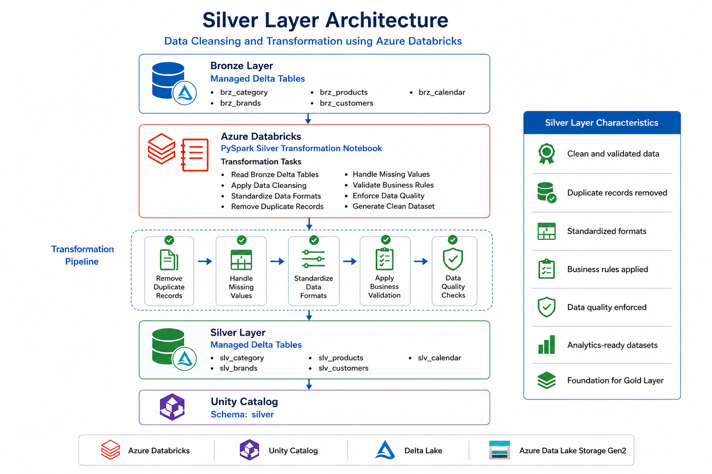
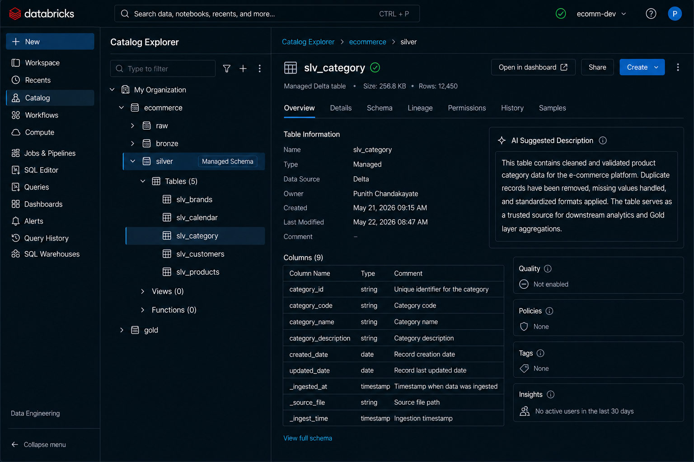

# 🥈 Transform Bronze Data into Silver Layer


⬅️ [Back to Bronze Layer – Ingest Raw Dimension Data](../01_Bronze_Layer/README.md)

---

# 📚 Table of Contents

- Overview
- Learning Objectives
- Prerequisites
- What is the Silver Layer?
- Medallion Architecture
- Silver Layer Architecture
- Silver Layer Workflow
- Notebook Overview
- Step 1 – Read Bronze Delta Tables
- Step 2 – Clean Data
- Step 3 – Validate Records
- Step 4 – Standardize Data
- Step 5 – Apply Business Rules
- Step 6 – Create Silver Delta Tables
- Step 7 – Verify Silver Tables
- Silver Tables
- Resource Hierarchy
- Data Flow
- Data Lineage
- Verification Checklist
- Expected Silver Tables
- Verify Using SQL
- Benefits of the Silver Layer
- Why Use Delta Lake in the Silver Layer?
- Best Practices
- Common Mistakes
- Interview Questions
- Summary
- Key Takeaways
- Technologies Used
- Next Module

---

# 📖 Overview

The **Silver Layer** is the second stage of the **Medallion Architecture**, responsible for transforming raw Bronze data into clean, validated, and standardized datasets.

In this notebook, data stored in the **Bronze Delta tables** is read using **PySpark**, cleaned by removing duplicate and invalid records, standardized into consistent formats, validated against business rules, and written as **managed Delta tables** in the Silver schema.

The Silver layer improves overall data quality and prepares trusted datasets that can be consumed by downstream Gold layer analytics, dashboards, and reporting solutions.

---

# 🎯 Learning Objectives

After completing this guide, you will be able to:

- Understand the purpose of the Silver layer.
- Read data from Bronze Delta tables.
- Remove duplicate and invalid records.
- Handle null and missing values.
- Apply business validation rules.
- Standardize column names and data formats.
- Create managed Delta tables in the Silver schema.
- Verify transformed datasets using Unity Catalog.
- Prepare trusted datasets for Gold layer processing.

---

# 📋 Prerequisites

Before starting this notebook, ensure you have completed the following modules:

- Azure Databricks Workspace Setup
- Azure Data Lake Storage Gen2 Setup
- Unity Catalog Configuration
- Bronze Layer Data Ingestion
- Bronze Delta Tables Successfully Created

---

# 🥈 What is the Silver Layer?

The **Silver Layer** is the data refinement layer within the Medallion Architecture.

Unlike the Bronze layer, which preserves raw source data, the Silver layer focuses on improving data quality through cleansing, validation, and standardization.

Typical transformations include:

- Removing duplicate records
- Handling missing values
- Standardizing column formats
- Correcting inconsistent data
- Enforcing business validation rules
- Converting data types
- Filtering invalid records

The Silver layer produces trusted datasets that are optimized for downstream analytics and reporting.

---

# 🏛 Medallion Architecture

The Medallion Architecture organizes data into multiple quality layers.

```text
                Source Systems
                       │
                       ▼
                🥉 Bronze Layer
             Raw Ingested Data
                       │
                       ▼
                🥈 Silver Layer
      Cleaned & Validated Data
                       │
                       ▼
                 🥇 Gold Layer
      Business Ready Analytics
```

Each layer progressively enhances data quality while maintaining governance, traceability, and reliability.

---

# 🏗 Silver Layer Architecture



```text
           Bronze Delta Tables
                    │
                    ▼
      PySpark Silver Transformation
                    │
                    ▼
        Remove Duplicate Records
                    │
                    ▼
        Handle Missing Values
                    │
                    ▼
      Standardize Data Formats
                    │
                    ▼
     Apply Business Validation
                    │
                    ▼
      Managed Silver Delta Tables
                    │
                    ▼
      Unity Catalog Silver Schema
```

---

# 🔄 Silver Layer Workflow

```text
Read Bronze Tables
        │
        ▼
Remove Duplicates
        │
        ▼
Handle Null Values
        │
        ▼
Standardize Columns
        │
        ▼
Business Validation
        │
        ▼
Write Silver Tables
        │
        ▼
Verify in Unity Catalog
```

---

# 📓 Notebook Overview

The Silver transformation notebook performs data quality improvements before storing trusted datasets in the Silver schema.

The notebook performs the following tasks:

1. Read Bronze Delta tables
2. Remove duplicate records
3. Handle null values
4. Validate business rules
5. Standardize column formats
6. Create managed Silver Delta tables
7. Verify successful execution

---

# 🚀 Step 1 — Read Bronze Delta Tables

The notebook reads managed Delta tables from the Bronze schema.

Example:

```python
df_products = spark.table("ecommerce.bronze.brz_products")
```

Typical Bronze tables include:

- brz_category
- brz_brands
- brz_products
- brz_customers
- brz_calendar

Reading from Delta tables ensures transactional consistency and reliable downstream processing.

---

# 🚀 Step 2 — Clean Data

The notebook cleans the Bronze datasets before applying business transformations.

Typical cleaning operations include:

- Remove duplicate records
- Remove invalid rows
- Handle null values
- Trim leading and trailing spaces
- Remove unwanted characters

Example:

```python
df = df.dropDuplicates()

df = df.na.drop()
```

These operations improve the overall quality of the datasets.

---

# 🚀 Step 3 — Validate Records

Business validation rules are applied to ensure that only valid records move to the Silver layer.

Example validations include:

- Product ID cannot be NULL
- Customer ID must exist
- Price must be greater than zero
- Category ID must be valid
- Date values must follow the expected format

Invalid records can either be filtered or redirected to a quarantine table depending on business requirements.

---

# 🚀 Step 4 — Standardize Data

The notebook standardizes data formats to maintain consistency across all datasets.

Typical standardization tasks include:

- Convert text to uppercase or lowercase
- Trim whitespace
- Rename columns
- Convert data types
- Format dates
- Normalize categorical values

Example:

```python
from pyspark.sql.functions import trim, upper, to_date

df = df.withColumn("brand_name", upper(trim("brand_name")))

df = df.withColumn(
    "order_date",
    to_date("order_date", "yyyy-MM-dd")
)
```

Standardization ensures consistent reporting and simplifies downstream joins.

---

# 🚀 Step 5 — Create Silver Delta Tables

After cleansing and validation, the processed data is written into managed Silver Delta tables.

Example:

```python
df.write \
    .mode("overwrite") \
    .format("delta") \
    .saveAsTable("ecommerce.silver.slv_products")
```

The Silver layer stores clean, trusted datasets that are ready for analytical processing.

---

# 🚀 Step 6 — Verify Silver Tables

Open **Catalog Explorer** and verify that the managed Silver Delta tables have been created successfully.

Expected tables include:

- slv_brands
- slv_calendar
- slv_category
- slv_customers
- slv_products



---

# 📂 Silver Tables

| Table                   | Description                          |
| ----------------------- | ------------------------------------ |
| **slv_category**  | Cleaned Product Category Dimension   |
| **slv_brands**    | Standardized Product Brand Dimension |
| **slv_products**  | Validated Product Master Data        |
| **slv_customers** | Cleansed Customer Dimension          |
| **slv_calendar**  | Standardized Calendar Dimension      |

---

# 📂 Resource Hierarchy

```text
ecommerce
│
├── bronze
│
│   ├── brz_brands
│   ├── brz_calendar
│   ├── brz_category
│   ├── brz_customers
│   └── brz_products
│
└── silver
    │
    ├── slv_brands
    ├── slv_calendar
    ├── slv_category
    ├── slv_customers
    └── slv_products
```

---

# 🔄 Data Flow

```text
Bronze Delta Tables
        │
        ▼
PySpark Silver Notebook
        │
        ▼
Data Cleaning
        │
        ▼
Validation
        │
        ▼
Standardization
        │
        ▼
Managed Silver Delta Tables
        │
        ▼
Unity Catalog Silver Schema
```

---

# 📈 Data Lineage

```text
Raw CSV Files
       │
       ▼
Bronze Delta Tables
       │
       ▼
Silver Transformation Notebook
       │
       ▼
Silver Delta Tables
       │
       ▼
Gold Layer
```

---
# ✅ Verification Checklist

After executing the notebook, verify that each transformation has been successfully completed.

| Component | Status |
|-----------|:------:|
| Bronze Tables Read Successfully | ✅ |
| Duplicate Records Removed | ✅ |
| Null Values Handled | ✅ |
| Business Rules Applied | ✅ |
| Data Standardized | ✅ |
| Data Types Converted | ✅ |
| Silver Delta Tables Created | ✅ |
| Tables Registered in Unity Catalog | ✅ |
| Data Ready for Gold Layer | ✅ |

---

# 📊 Expected Silver Tables

The following managed Delta tables should be available after the notebook execution.

| Table Name | Description |
|------------|-------------|
| **slv_category** | Cleaned Product Category Dimension |
| **slv_brands** | Standardized Product Brand Dimension |
| **slv_products** | Validated Product Master Data |
| **slv_customers** | Cleansed Customer Dimension |
| **slv_calendar** | Standardized Calendar Dimension |

These Silver tables serve as the trusted source for the Gold layer.

---

# 🔍 Verify Using SQL

Open a SQL Notebook or SQL Editor and execute the following commands.

## Show Catalog

```sql
SHOW CATALOGS;
```

---

## Use Catalog

```sql
USE CATALOG ecommerce;
```

---

## Show Silver Schema

```sql
SHOW SCHEMAS;
```

---

## Show Silver Tables

```sql
SHOW TABLES IN silver;
```

---

## Preview Data

```sql
SELECT *
FROM silver.slv_products
LIMIT 10;
```

---

## Describe Table

```sql
DESCRIBE EXTENDED silver.slv_products;
```

---

## Verify Record Count

```sql
SELECT COUNT(*)
FROM silver.slv_products;
```

---

# 📈 Benefits of the Silver Layer

The Silver layer improves data quality and creates trusted datasets for downstream analytics.

| Benefit | Description |
|----------|-------------|
| Improved Data Quality | Cleans invalid and inconsistent records |
| Standardization | Maintains consistent formats across datasets |
| Reliable Analytics | Provides trusted datasets for reporting |
| Better Performance | Optimized Delta tables for downstream processing |
| Data Validation | Enforces business rules before analytics |
| Consistency | Standardized column names and data types |
| Governance | Managed through Unity Catalog |

---

# 🏆 Why Use Delta Lake in the Silver Layer?

Delta Lake provides enterprise-grade capabilities for storing clean and validated datasets.

### Key Advantages

- ACID Transactions
- Schema Enforcement
- Schema Evolution
- Time Travel
- Efficient Updates using MERGE
- Data Versioning
- High Query Performance
- Reliable Incremental Processing

---

# 💡 Best Practices

- ✅ Remove duplicate records before writing to Silver tables.
- ✅ Handle null values using appropriate business rules.
- ✅ Validate primary keys and mandatory columns.
- ✅ Standardize text, dates, and numeric formats.
- ✅ Use Delta Lake as the storage format.
- ✅ Keep transformations deterministic and repeatable.
- ✅ Use MERGE for incremental data loads whenever applicable.
- ✅ Validate record counts before and after transformation.
- ✅ Separate cleansing logic from business aggregations.
- ✅ Maintain clear documentation for all transformation rules.

---

# ⚠️ Common Mistakes

Avoid the following practices in the Silver layer:

- ❌ Ignoring duplicate records.
- ❌ Leaving null values in mandatory fields.
- ❌ Mixing aggregation logic with data cleansing.
- ❌ Using inconsistent date or timestamp formats.
- ❌ Allowing invalid business records into Silver tables.
- ❌ Changing source keys unnecessarily.
- ❌ Writing directly from Bronze to Gold without validation.

---

# 🎤 Interview Questions

### 1. What is the purpose of the Silver layer?

The Silver layer transforms raw Bronze data into clean, validated, and standardized datasets suitable for downstream analytics.

---

### 2. What transformations are typically performed in the Silver layer?

Typical transformations include:

- Removing duplicate records
- Handling null values
- Data validation
- Standardizing formats
- Converting data types
- Applying business rules

---

### 3. Why are duplicate records removed?

Duplicate records can affect reporting accuracy, aggregations, and downstream analytics.

---

### 4. Why is data validation important?

Data validation ensures only accurate, complete, and trustworthy records are promoted to the Silver layer.

---

### 5. What is the difference between Bronze and Silver?

| Bronze | Silver |
|---------|---------|
| Raw source data | Cleaned and validated data |
| Minimal transformations | Business validations and standardization |
| Source of truth | Trusted analytical data |
| Raw ingestion | Data quality layer |

---

### 6. Why is Delta Lake used in the Silver layer?

Delta Lake provides ACID transactions, schema enforcement, efficient updates, and reliable data versioning.

---

### 7. What happens if invalid records are found?

Invalid records are either corrected, filtered, or stored in quarantine tables based on business requirements.

---

### 8. Why are data types standardized?

Standardized data types ensure consistency across datasets and simplify joins, reporting, and analytics.

---

### 9. What is the output of the Silver layer?

Managed Delta tables containing clean, validated, and standardized datasets.

---

### 10. Why is Unity Catalog important in the Silver layer?

Unity Catalog provides centralized governance, metadata management, access control, and auditing for Silver datasets.

---

### 11. Why should aggregations not be performed in the Silver layer?

The Silver layer focuses on data quality and preparation. Business aggregations belong in the Gold layer.

---

### 12. What is the next stage after the Silver layer?

The Gold layer, where business-ready fact tables, dimension tables, KPIs, and reporting datasets are created.

---

# 📊 Summary

| Component | Purpose |
|------------|---------|
| Bronze Tables | Input datasets |
| Data Cleaning | Remove invalid records |
| Validation | Apply business rules |
| Standardization | Ensure consistent formats |
| Silver Tables | Trusted analytical datasets |
| Unity Catalog | Centralized governance |
| Delta Lake | Reliable ACID storage |

---

# 🎯 Key Takeaways

- The Silver layer improves the quality of Bronze datasets through cleansing, validation, and standardization.
- Duplicate records, missing values, and invalid data are addressed before creating trusted datasets.
- Business validation rules ensure only accurate records are promoted for downstream analytics.
- Delta Lake provides reliable storage with ACID transactions, schema enforcement, and versioning.
- Unity Catalog centrally manages governance, permissions, and metadata for Silver tables.
- Clean and standardized Silver datasets serve as the foundation for business-ready Gold layer transformations.
- A well-designed Silver layer improves reporting accuracy, simplifies analytics, and enhances overall data reliability.

---

# 🛠 Technologies Used

| Technology | Purpose |
|------------|---------|
| Azure Databricks | Data Engineering Platform |
| PySpark | Data Cleaning & Transformation |
| Unity Catalog | Data Governance |
| Delta Lake | Reliable Storage Format |
| Azure Data Lake Storage Gen2 | Cloud Storage |
| SQL | Data Verification |

---

# 📚 Next Module

➡️ [Gold Layer – Business Aggregations](../08_Gold_Layer/README.md)