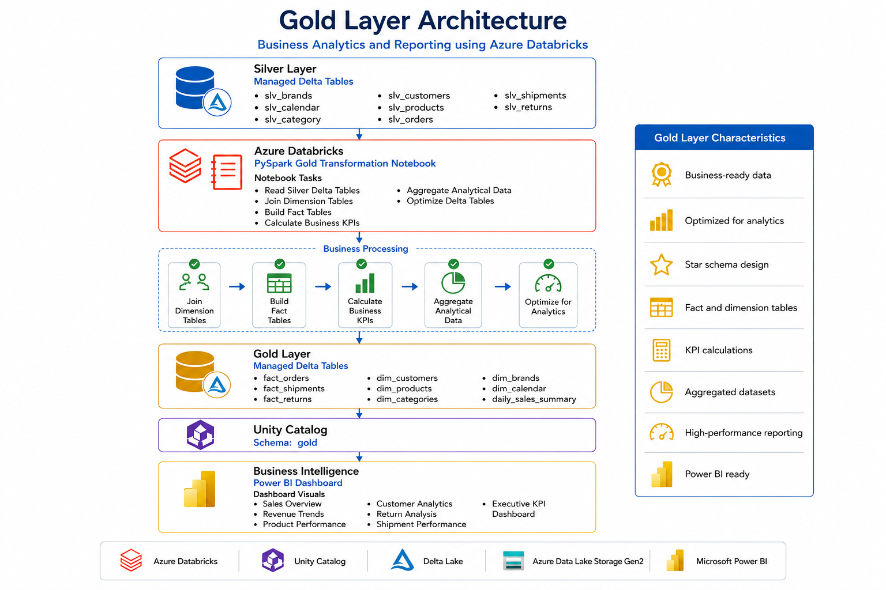

# 🥇 Build Business-Ready Gold Layer


---

⬅️ [Back to Silver Layer – Data Cleansing &amp; Transformations](../02_Silver_Layer/README.md)

---

# 📚 Table of Contents

- Overview
- Learning Objectives
- Prerequisites
- What is the Gold Layer?
- Medallion Architecture
- Gold Layer Architecture
- Gold Layer Workflow
- Notebook Overview
- Step 1 – Read Silver Delta Tables
- Step 2 – Join Dimension Tables
- Step 3 – Build Fact Tables
- Step 4 – Build Dimension Tables
- Step 5 – Calculate Business KPIs
- Step 6 – Create Analytical Summary Tables
- Step 7 – Create Gold Delta Tables
- Step 8 – Verify Gold Tables
- Gold Layer Tables
- Fact Tables
- Dimension Tables
- Star Schema
- Resource Hierarchy
- Data Flow
- Data Lineage
- Verification Checklist
- Expected Gold Tables
- Verify Using SQL
- Business KPIs Generated
- Power BI Reporting
- Benefits of the Gold Layer
- Why Use Delta Lake in the Gold Layer?
- Performance Optimization
- Best Practices
- Common Mistakes
- Interview Questions
- Summary
- Key Takeaways
- Technologies Used
- Related Resources
- Next Module

---

# 📖 Overview

The **Gold Layer** is the final stage of the **Medallion Architecture**, responsible for transforming trusted Silver datasets into business-ready analytical data models.

In this notebook, validated datasets from the **Silver schema** are joined, aggregated, and modeled into **Fact** and **Dimension** tables using **PySpark**. These datasets are optimized for business intelligence, reporting, dashboarding, and advanced analytics.

Unlike the Bronze layer, which focuses on raw data ingestion, and the Silver layer, which focuses on data quality, the Gold layer is designed to answer business questions through curated analytical datasets.

The Gold layer serves as the single source of truth for business users, analysts, data scientists, and reporting platforms such as **Power BI**.

---

# 🎯 Learning Objectives

After completing this guide, you will be able to:

- Understand the purpose of the Gold layer.
- Read trusted datasets from the Silver schema.
- Join multiple dimension tables.
- Build analytical fact tables.
- Calculate business KPIs.
- Create reporting-ready datasets.
- Write managed Gold Delta tables.
- Verify Gold tables using Unity Catalog.
- Prepare datasets for Power BI dashboards.

---

# 📋 Prerequisites

Before starting this notebook, ensure you have completed the following modules:

- Azure Databricks Workspace Setup
- Azure Data Lake Storage Gen2 Setup
- Unity Catalog Configuration
- Bronze Layer Data Ingestion
- Silver Layer Transformations
- Silver Delta Tables Successfully Created

---

# 🥇 What is the Gold Layer?

The **Gold Layer** is the business presentation layer of the Medallion Architecture.

It contains highly curated, business-ready datasets that are optimized for reporting, dashboards, KPI calculations, and analytics.

Unlike previous layers, the Gold layer focuses on business logic rather than data cleansing.

Typical operations performed include:

- Joining multiple datasets
- Building fact tables
- Creating dimension tables
- Aggregating measures
- Calculating KPIs
- Preparing reporting datasets
- Optimizing analytical queries

The Gold layer provides a trusted semantic layer that powers business intelligence platforms and executive dashboards.

---

# 🏛 Medallion Architecture

The Medallion Architecture organizes data into multiple quality layers.

```text
                Source Systems
                       │
                       ▼
                🥉 Bronze Layer
               Raw Ingested Data
                       │
                       ▼
                🥈 Silver Layer
          Cleaned & Validated Data
                       │
                       ▼
                 🥇 Gold Layer
         Business Ready Analytics
```

Each layer improves data quality while maintaining governance, lineage, and scalability.

---

# 🏗 Gold Layer Architecture



```text
           Silver Delta Tables
                    │
                    ▼
          PySpark Gold Notebook
                    │
                    ▼
        Join Dimension Tables
                    │
                    ▼
         Build Fact Tables
                    │
                    ▼
      Calculate Business KPIs
                    │
                    ▼
      Aggregate Analytical Data
                    │
                    ▼
      Managed Gold Delta Tables
                    │
                    ▼
      Unity Catalog Gold Schema
                    │
                    ▼
      Power BI Dashboards
```

---

# 🔄 Gold Layer Workflow

```text
Read Silver Tables
        │
        ▼
Join Dimensions
        │
        ▼
Create Fact Tables
        │
        ▼
Calculate KPIs
        │
        ▼
Aggregate Data
        │
        ▼
Create Gold Tables
        │
        ▼
Verify in Unity Catalog
        │
        ▼
Power BI Dashboards
```

---

# 📓 Notebook Overview

The Gold notebook creates analytical datasets from trusted Silver tables.

The notebook performs the following tasks:

1. Read Silver Delta tables
2. Join related dimension tables
3. Build analytical fact tables
4. Calculate business KPIs
5. Create summary tables
6. Write Gold Delta tables
7. Verify successful execution

---

# 🚀 Step 1 — Read Silver Delta Tables

The notebook begins by reading trusted datasets from the Silver schema.

Example:

```python
products_df = spark.table("ecommerce.silver.slv_products")

customers_df = spark.table("ecommerce.silver.slv_customers")

orders_df = spark.table("ecommerce.silver.slv_orders")
```

Typical Silver tables include:

- slv_products
- slv_customers
- slv_orders
- slv_shipments
- slv_returns
- slv_category
- slv_brands
- slv_calendar

Reading trusted Silver tables ensures that downstream business analytics are built on validated and standardized data.

---

# 🚀 Step 2 — Join Dimension Tables

The notebook combines related datasets to build analytical models.

Example joins include:

- Orders + Customers
- Orders + Products
- Products + Category
- Products + Brand
- Orders + Calendar
- Shipments + Orders
- Returns + Orders

Example:

```python
gold_df = (
    orders_df
        .join(customers_df, "customer_id")
        .join(products_df, "product_id")
        .join(calendar_df, "date_key")
)
```

Joining multiple datasets creates a unified analytical view that supports reporting and KPI calculations.

---

# 🚀 Step 3 — Build Fact Tables

The Gold layer organizes transactional data into fact tables.

Typical fact tables include:

- fact_orders
- fact_shipments
- fact_returns

Fact tables contain:

- Foreign Keys
- Business Measures
- Transaction Metrics
- Quantities
- Sales Amounts
- Profit
- Discounts

Example:

```python
fact_orders = gold_df.select(
    "order_id",
    "customer_id",
    "product_id",
    "date_key",
    "quantity",
    "sales_amount",
    "discount_amount",
    "profit"
)
```

Fact tables become the foundation for analytical reporting.

---

# 🚀 Step 4 — Create Business Metrics

The notebook calculates business KPIs required by dashboards and reports.

Examples include:

- Total Revenue
- Total Orders
- Average Order Value
- Total Profit
- Total Returns
- Return Rate
- Customer Count
- Product Count
- Shipment Count

Example:

```python
from pyspark.sql.functions import sum, count

sales_summary = (
    fact_orders
        .groupBy("order_date")
        .agg(
            sum("sales_amount").alias("total_sales"),
            count("order_id").alias("total_orders")
        )
)
```

These metrics provide meaningful insights into business performance.

---

# 🚀 Step 5 — Build Analytical Tables

The Gold notebook creates reporting-ready summary tables.

Examples include:

- Daily Sales Summary
- Monthly Sales Summary
- Customer Sales Summary
- Product Performance Summary
- Category Performance
- Brand Performance
- Shipment Summary
- Returns Summary

These datasets are optimized for dashboards and business intelligence tools.

---

# 🚀 Step 6 — Create Gold Delta Tables

After aggregations are complete, the notebook writes managed Gold Delta tables.

Example:

```python
sales_summary.write \
    .mode("overwrite") \
    .format("delta") \
    .saveAsTable("ecommerce.gold.daily_sales_summary")
```

All Gold tables are stored as managed Delta tables inside the Gold schema.

---

# 🚀 Step 7 — Verify Gold Tables

Open **Catalog Explorer** and verify that the managed Gold Delta tables have been created successfully.

Expected tables include:

- fact_orders
- fact_shipments
- fact_returns
- daily_sales_summary
- monthly_sales_summary

---

# 📂 Gold Tables

| Table                           | Description              |
| ------------------------------- | ------------------------ |
| **fact_orders**           | Sales fact table         |
| **fact_shipments**        | Shipment fact table      |
| **fact_returns**          | Return fact table        |
| **daily_sales_summary**   | Daily sales KPIs         |
| **monthly_sales_summary** | Monthly business summary |

---

# ⭐ Star Schema

The Gold layer follows a **Star Schema** to optimize analytical queries.

```text
                     dim_customer
                           │
                           │
dim_product ─────── fact_orders ─────── dim_calendar
                           │
                           │
                     dim_category
                           │
                           │
                       dim_brand
```

The **Fact Table** stores transactional measures, while **Dimension Tables** provide descriptive business context.

---

# 📂 Resource Hierarchy

```text
ecommerce
│
├── silver
│
│   ├── slv_products
│   ├── slv_customers
│   ├── slv_orders
│   ├── slv_shipments
│   ├── slv_returns
│   ├── slv_category
│   ├── slv_brands
│   └── slv_calendar
│
└── gold
    │
    ├── fact_orders
    ├── fact_shipments
    ├── fact_returns
    ├── daily_sales_summary
    └── monthly_sales_summary
```

---

# 🔄 Data Flow

```text
Silver Delta Tables
        │
        ▼
PySpark Gold Notebook
        │
        ▼
Join Dimensions
        │
        ▼
Create Fact Tables
        │
        ▼
Calculate KPIs
        │
        ▼
Aggregate Business Metrics
        │
        ▼
Managed Gold Delta Tables
        │
        ▼
Power BI Dashboards
```

---

# 📈 Data Lineage

```text
Raw CSV Files
       │
       ▼
Bronze Delta Tables
       │
       ▼
Silver Delta Tables
       │
       ▼
Gold Transformation Notebook
       │
       ▼
Gold Delta Tables
       │
       ▼
Power BI Dashboards
```

---
# ✅ Verification Checklist

After executing the notebook, verify that each transformation and aggregation has been successfully completed.

| Component | Status |
|--------------------------------------|:------:|
| Silver Tables Read Successfully | ✅ |
| Dimension Tables Joined | ✅ |
| Fact Tables Created | ✅ |
| Business KPIs Calculated | ✅ |
| Summary Tables Generated | ✅ |
| Gold Delta Tables Created | ✅ |
| Tables Registered in Unity Catalog | ✅ |
| Data Available for Power BI | ✅ |
| Gold Layer Successfully Completed | ✅ |

---

# 📊 Expected Gold Tables

The following managed Delta tables should be available after successful execution.

| Table Name | Description |
|------------|-------------|
| **fact_orders** | Order transactions |
| **fact_shipments** | Shipment transactions |
| **fact_returns** | Return transactions |
| **daily_sales_summary** | Daily business KPIs |
| **monthly_sales_summary** | Monthly business KPIs |

These Gold tables become the primary source for dashboards, reports, and business analytics.

---

# 🔍 Verify Using SQL

Open a SQL Notebook or SQL Editor and execute the following commands.

## Show Catalog

```sql
SHOW CATALOGS;
```

---

## Use Catalog

```sql
USE CATALOG ecommerce;
```

---

## Show Gold Schema

```sql
SHOW SCHEMAS;
```

---

## Show Gold Tables

```sql
SHOW TABLES IN gold;
```

---

## Preview Fact Table

```sql
SELECT *
FROM gold.fact_orders
LIMIT 10;
```

---

## Preview Daily Sales Summary

```sql
SELECT *
FROM gold.daily_sales_summary
LIMIT 10;
```

---

## Describe Table

```sql
DESCRIBE EXTENDED gold.fact_orders;
```

---

## Verify Record Count

```sql
SELECT COUNT(*)
FROM gold.fact_orders;
```

---

# 📈 Benefits of the Gold Layer

The Gold layer provides business-ready datasets that support decision-making and enterprise analytics.

| Benefit | Description |
|----------|-------------|
| Business Ready | Optimized for reporting and dashboards |
| Faster Queries | Pre-aggregated analytical datasets |
| Better Performance | Reduced query complexity |
| Trusted KPIs | Consistent business metrics |
| Star Schema | Simplifies analytical queries |
| BI Integration | Ready for Power BI and SQL reporting |
| Executive Reporting | Supports strategic decision-making |
| Scalability | Supports enterprise-scale analytics |

---

# 🏆 Why Use Delta Lake in the Gold Layer?

Delta Lake provides reliable storage for business-critical analytical datasets.

### Advantages

- ACID Transactions
- Schema Enforcement
- Schema Evolution
- Time Travel
- High Performance Reads
- Efficient Updates
- Data Versioning
- Optimized Query Execution

---

# 📊 Business KPIs Generated

Typical KPIs produced in the Gold layer include:

| KPI | Description |
|------|-------------|
| Total Revenue | Overall sales revenue |
| Total Orders | Number of completed orders |
| Average Order Value | Revenue per order |
| Total Customers | Active customer count |
| Total Products Sold | Quantity sold |
| Total Profit | Overall business profit |
| Total Returns | Number of returned orders |
| Return Rate | Percentage of returns |
| Shipment Success Rate | Successfully delivered orders |
| Monthly Revenue | Revenue by month |

These KPIs become the foundation of executive dashboards.

---

# 📊 Power BI Reporting

The Gold layer is designed specifically for reporting tools such as Power BI.

Example dashboards include:

- Executive Sales Dashboard
- Customer Analytics Dashboard
- Product Performance Dashboard
- Shipment Analytics Dashboard
- Returns Analysis Dashboard
- Monthly Revenue Dashboard
- Category Performance Dashboard
- Brand Performance Dashboard

Business users consume only Gold datasets without directly accessing Bronze or Silver tables.

---

# 💡 Best Practices

- ✅ Read only validated Silver tables.
- ✅ Build separate Fact and Dimension tables.
- ✅ Use Star Schema for analytical models.
- ✅ Pre-compute frequently used KPIs.
- ✅ Store Gold datasets in Delta format.
- ✅ Optimize Delta tables using `OPTIMIZE` and `ZORDER`.
- ✅ Use meaningful business-friendly table names.
- ✅ Partition large fact tables where appropriate.
- ✅ Validate business metrics before publishing.
- ✅ Expose only Gold datasets to BI tools.

---

# ⚠️ Common Mistakes

Avoid the following practices in the Gold layer:

- ❌ Reading directly from Bronze tables.
- ❌ Performing data cleansing in Gold.
- ❌ Storing raw transactional data without modeling.
- ❌ Mixing operational and analytical workloads.
- ❌ Ignoring business validation.
- ❌ Creating overly complex reporting tables.
- ❌ Allowing BI tools to query Bronze or Silver tables directly.

---

# 🎤 Interview Questions

### 1. What is the purpose of the Gold layer?

The Gold layer provides business-ready datasets optimized for analytics, dashboards, and reporting.

---

### 2. What type of tables are created in the Gold layer?

- Fact Tables
- Dimension Tables
- Summary Tables
- KPI Tables

---

### 3. What is a Fact Table?

A Fact Table stores measurable business events such as orders, sales, shipments, and returns.

---

### 4. What is a Dimension Table?

A Dimension Table stores descriptive information such as customer, product, category, calendar, and brand details.

---

### 5. Why is Star Schema used?

Star Schema improves analytical query performance and simplifies joins between fact and dimension tables.

---

### 6. Why are KPIs calculated in the Gold layer?

KPIs provide business insights and eliminate repetitive calculations during dashboard execution.

---

### 7. Why is the Gold layer used for Power BI?

Gold datasets are clean, aggregated, and optimized for fast reporting and visualization.

---

### 8. Why should BI tools avoid querying Bronze tables?

Bronze tables contain raw data that has not been cleaned or optimized for analytics.

---

### 9. What is the difference between Silver and Gold?

| Silver | Gold |
|---------|------|
| Cleaned data | Business-ready data |
| Validation | Aggregation |
| Standardization | KPIs |
| Trusted datasets | Reporting datasets |

---

### 10. Why is Delta Lake used in the Gold layer?

Delta Lake provides reliable storage, ACID transactions, schema enforcement, and high-performance analytical queries.

---

### 11. What is the output of the Gold layer?

Business-ready Delta tables that support dashboards, analytics, machine learning, and executive reporting.

---

### 12. What is the final consumer of the Gold layer?

Business analysts, executives, data scientists, Power BI dashboards, SQL reporting tools, and downstream analytical applications.

---

# 📊 Summary

| Component | Purpose |
|------------|---------|
| Silver Tables | Trusted source data |
| Dimension Tables | Business context |
| Fact Tables | Transactional measures |
| KPIs | Business metrics |
| Gold Tables | Analytics-ready datasets |
| Power BI | Dashboard visualization |
| Unity Catalog | Governance |
| Delta Lake | Reliable analytical storage |

---

# 🎯 Key Takeaways

- The Gold layer is the final stage of the Medallion Architecture, delivering business-ready analytical datasets.
- Trusted Silver datasets are transformed into Fact Tables, Dimension Tables, and summary tables for reporting.
- Business KPIs such as revenue, profit, order count, and return rate are precomputed for faster analytics.
- The Gold layer commonly follows a Star Schema model to optimize query performance and simplify reporting.
- Managed Delta tables provide ACID transactions, versioning, and high-performance analytical queries.
- Unity Catalog ensures centralized governance, security, and metadata management for Gold datasets.
- Gold datasets serve as the single source of truth for Power BI dashboards, SQL reporting, and executive decision-making.

---

# 🛠 Technologies Used

| Technology | Purpose |
|------------|---------|
| Azure Databricks | Data Engineering Platform |
| PySpark | Data Modeling & Aggregation |
| Delta Lake | Analytical Storage |
| Unity Catalog | Data Governance |
| Azure Data Lake Storage Gen2 | Cloud Storage |
| SQL | Data Validation |
| Power BI | Business Intelligence & Visualization |

---

# 📚 Related Resources

| Guide | Description |
|--------|-------------|
| Bronze Layer | Raw Data Ingestion |
| Silver Layer | Data Cleansing & Validation |
| Delta Lake | Reliable Lakehouse Storage |
| Unity Catalog | Governance & Security |
| Medallion Architecture | Multi-layer Data Architecture |
| Power BI | Business Intelligence & Reporting |

---

# 🚀 Next Module

➡️ [Batch vs Stream Processing](../04_Stream_Processing/01_batch_vs_stream_processing.md)