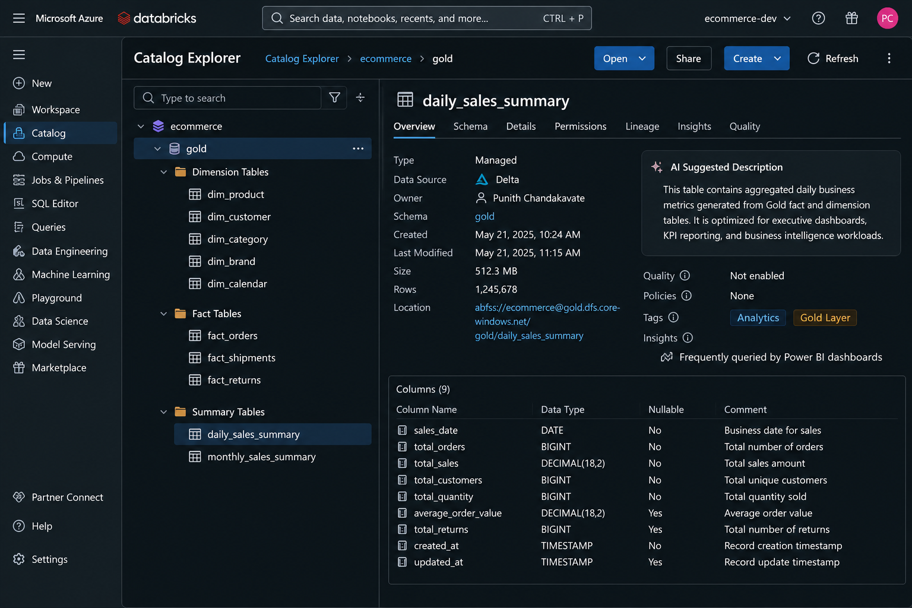

# 🥇 Gold Layer


---

⬅️ [Back to Silver Layer – Data Cleansing & Transformations](../02_Silver_Layer/README.md)

---

# 📚 Table of Contents

- Overview
- Learning Objectives
- Prerequisites
- What is the Gold Layer?
- Why Do We Need the Gold Layer?
- Gold Layer Responsibilities
- Medallion Architecture
- Gold Layer Architecture
- Gold Layer Characteristics
- Data Sources
- Typical Operations
- Star Schema
- Delta Lake in the Gold Layer
- Unity Catalog in the Gold Layer
- Gold Layer Workflow
- Silver vs Gold
- Benefits
- Verify Gold Tables
- Best Practices
- Common Mistakes
- Interview Questions
- Summary
- Key Takeaways
- Next Module

---

# 📖 Overview

The **Gold Layer** is the final layer of the **Medallion Architecture** and serves as the **business presentation layer** within the Lakehouse.

It receives trusted datasets from the **Silver Layer** and transforms them into business-ready analytical models.

Unlike the Bronze layer, which focuses on raw data ingestion, and the Silver layer, which focuses on cleansing and validation, the Gold layer applies business logic to create reporting-ready **Dimension Tables**, **Fact Tables**, **KPIs**, and **analytical summary datasets**.

These datasets are optimized for business intelligence platforms such as **Power BI**, executive dashboards, SQL reporting, and advanced analytics.

---

# 🎯 Learning Objectives

After completing this module, you will be able to:

- Understand the purpose of the Gold Layer.
- Explain the responsibilities of the Gold Layer.
- Build analytical Dimension tables.
- Build business Fact tables.
- Create reporting-ready summary tables.
- Calculate business KPIs.
- Understand Star Schema modeling.
- Learn the role of Delta Lake and Unity Catalog.
- Prepare analytical datasets for Power BI dashboards.

---

# 📋 Prerequisites

Before starting this module, you should have completed:

- Azure Databricks Workspace Setup
- Azure Data Lake Storage Gen2 Setup
- Unity Catalog Configuration
- Bronze Layer Data Ingestion
- Silver Layer Transformations
- PySpark Fundamentals
- Delta Lake Basics

---

# 🥇 What is the Gold Layer?

The **Gold Layer** is responsible for transforming trusted Silver datasets into business-ready analytical models.

Its primary objective is to organize validated data into structures that support business reporting, dashboards, executive decision-making, and advanced analytics.

Typical processing includes:

- Joining Dimension tables
- Building Fact tables
- Creating analytical Dimension tables
- Calculating business KPIs
- Creating summary tables
- Aggregating business metrics
- Optimizing analytical queries

The Gold layer produces **business-ready datasets** that become the single source of truth for reporting and analytics.

---

# ⭐ Why Do We Need the Gold Layer?

Business users rarely work with detailed transactional data directly.

The Gold Layer simplifies analytics by:

- Building analytical Fact tables
- Creating reporting Dimension tables
- Calculating business KPIs
- Aggregating business metrics
- Optimizing data for Power BI
- Improving query performance
- Delivering trusted reporting datasets

---

# 📌 Gold Layer Responsibilities

The Gold Layer is responsible for:

- Reading trusted Silver tables
- Joining related datasets
- Creating Dimension tables
- Building Fact tables
- Calculating KPIs
- Creating summary tables
- Optimizing analytical datasets
- Creating reporting-ready Delta tables
- Publishing data for business intelligence

---

# 🏛 Medallion Architecture

```text
             Source Systems
                    │
                    ▼
            🥉 Bronze Layer
          Raw Source Data
                    │
                    ▼
            🥈 Silver Layer
     Cleaned & Trusted Data
                    │
                    ▼
             🥇 Gold Layer
      Business Ready Analytics
```

---

# 🏗 Gold Layer Architecture


```text
                 Silver Delta Tables
                          │
          ┌───────────────┴───────────────┐
          ▼                               ▼
   Dimension Processing           Fact Processing
          │                               │
          ▼                               ▼
  Build Dimension Tables       Build Fact Tables
          │                               │
          └───────────────┬───────────────┘
                          ▼
                Calculate Business KPIs
                          │
                          ▼
             Create Summary Tables
                          │
                          ▼
                Gold Delta Tables
                          │
                          ▼
                 Power BI Dashboards
```

---

# 📌 Gold Layer Characteristics

- Business Ready
- Analytics Optimized
- Star Schema
- Fact & Dimension Modeling
- KPI Driven
- Aggregated Data
- Delta Lake Storage
- Reporting Ready
- High Query Performance

---

# 📂 Data Sources

The Gold Layer receives trusted datasets from the Silver Layer.

### Dimension Tables

- Products
- Customers
- Categories
- Brands
- Calendar

### Fact Tables

- Orders
- Shipments
- Returns

These validated datasets become the foundation for analytical modeling.

---

# 🔄 Typical Operations

Typical processing performed in the Gold Layer includes:

- Join Dimension tables
- Build Fact tables
- Create analytical Dimension tables
- Calculate KPIs
- Aggregate business metrics
- Generate reporting datasets
- Optimize analytical queries
- Publish Gold Delta tables

---

# ⭐ Star Schema

The Gold Layer commonly follows a **Star Schema** to improve analytical query performance.

```text
                    dim_customer
                           │
                           │
dim_product ─────── fact_orders ─────── dim_calendar
                           │
                           │
                     dim_category
                           │
                           │
                       dim_brand
```

The Fact table stores measurable business events, while the Dimension tables provide descriptive business context.

---

# 🏆 Delta Lake in the Gold Layer

Delta Lake provides enterprise-grade reliability for analytical datasets.

Key capabilities include:

- ACID Transactions
- Schema Enforcement
- Schema Evolution
- Time Travel
- High Performance Reads
- Efficient Updates
- Data Versioning
- Optimized Query Execution

---

# 🔐 Unity Catalog in the Gold Layer

Unity Catalog provides centralized governance for analytical datasets.

Its capabilities include:

- Centralized Metadata Management
- Fine-Grained Access Control
- Data Lineage
- Auditing
- Secure Data Sharing
- Catalog and Schema Management

---

# 🔄 Gold Layer Workflow

```text
Read Silver Tables
        │
        ▼
Join Dimension Tables
        │
        ▼
Build Fact Tables
        │
        ▼
Calculate Business KPIs
        │
        ▼
Create Summary Tables
        │
        ▼
Write Gold Delta Tables
        │
        ▼
Power BI Dashboards
```

---
# ⚖️ Silver vs Gold

| Silver Layer | Gold Layer |
|--------------|------------|
| Clean & Trusted Data | Business-Ready Data |
| Standardized Records | Aggregated Data |
| Detailed Transactions | KPIs & Metrics |
| Data Validation | Business Analytics |
| Trusted Dataset | Reporting Dataset |

The Silver Layer focuses on improving data quality, while the Gold Layer focuses on delivering business insights through analytical models and reporting datasets.

---

# 📈 Benefits

The Gold Layer provides numerous benefits for business intelligence and analytics.

- Business-ready datasets
- Faster analytical queries
- Pre-computed business KPIs
- Optimized Star Schema
- Consistent business metrics
- Simplified reporting
- Better dashboard performance
- Centralized governance
- Trusted source for decision-making

---

# ✅ Verify Gold Tables

After executing the Gold notebooks, verify that all Gold Delta tables are successfully created in Unity Catalog.



You should see tables similar to:

### Dimension Tables

- dim_product
- dim_customer
- dim_category
- dim_brand
- dim_calendar

### Fact Tables

- fact_orders
- fact_shipments
- fact_returns

### Summary Tables

- daily_sales_summary
- monthly_sales_summary

---

# 💡 Best Practices

- Read data only from validated Silver Delta tables.
- Separate Dimension and Fact processing.
- Follow Star Schema modeling principles.
- Pre-compute frequently used KPIs.
- Store analytical datasets in Delta format.
- Optimize Delta tables using `OPTIMIZE` and `ZORDER`.
- Partition large Fact tables where appropriate.
- Validate business metrics before publishing.
- Use business-friendly table names.
- Expose only Gold datasets to reporting tools.
- Govern analytical datasets using Unity Catalog.

---

# ⚠️ Common Mistakes

Avoid the following practices in the Gold Layer.

- Reading directly from Bronze tables.
- Performing data cleansing in the Gold Layer.
- Mixing operational and analytical workloads.
- Storing raw transactional data without modeling.
- Ignoring business validation.
- Creating overly complex reporting tables.
- Allowing BI tools to query Bronze or Silver tables directly.
- Recalculating KPIs in dashboard tools instead of the Gold layer.
- Ignoring table optimization.
- Using inconsistent business definitions.

---

# 🎤 Interview Questions

### 1. What is the Gold Layer?

The **Gold Layer** is the final layer of the Medallion Architecture that transforms trusted Silver datasets into business-ready analytical datasets.

It contains Fact tables, Dimension tables, KPIs, and reporting-ready datasets optimized for dashboards, business intelligence, and advanced analytics.

---

### 2. Why is the Gold Layer important?

The Gold Layer simplifies business reporting by organizing validated data into analytical models.

Its importance includes:

- Creates reporting-ready datasets.
- Calculates business KPIs.
- Improves analytical query performance.
- Supports executive dashboards.
- Provides a trusted source of business metrics.
- Simplifies reporting and self-service analytics.

---

### 3. What transformations occur in the Gold Layer?

Typical transformations include:

- Joining Dimension tables.
- Building Fact tables.
- Creating analytical Dimension tables.
- Calculating KPIs.
- Aggregating business metrics.
- Creating summary tables.
- Optimizing analytical datasets.
- Publishing reporting-ready Delta tables.

---

### 4. Why are Fact Tables created?

Fact tables store measurable business events that can be aggregated for reporting.

Typical measures include:

- Sales Amount
- Profit
- Quantity Sold
- Discount Amount
- Shipping Cost
- Return Amount

These tables become the foundation for dashboards and business analytics.

---

### 5. Why are Dimension Tables important?

Dimension tables provide descriptive business information used to analyze facts.

Examples include:

- Customer
- Product
- Brand
- Category
- Calendar

Dimension tables provide business context that makes reporting easier and more meaningful.

---

### 6. What is a Star Schema?

A **Star Schema** is a dimensional data model where one central Fact table connects to multiple Dimension tables.

Benefits include:

- Faster analytical queries.
- Simpler joins.
- Better dashboard performance.
- Easier reporting.
- Improved scalability for business intelligence workloads.

---
### 7. What is the difference between the Silver and Gold Layers?

| Silver Layer | Gold Layer |
|--------------|------------|
| Clean and validated data | Business-ready analytical data |
| Detailed transactional records | Aggregated business metrics |
| Data refinement | Business modeling |
| Trusted datasets | Reporting datasets |
| Supports downstream transformations | Supports dashboards and analytics |

The Silver Layer prepares trusted datasets, while the Gold Layer transforms them into analytical models optimized for business reporting.

---

### 8. Why use Delta Lake in the Gold Layer?

Delta Lake provides enterprise-grade reliability and performance for analytical datasets.

Key benefits include:

- ACID Transactions
- Schema Enforcement
- Schema Evolution
- Time Travel
- High Performance Reads
- Data Versioning
- Optimized Storage
- Reliable Incremental Updates

These features ensure that Gold datasets remain accurate, consistent, and performant for business reporting.

---

### 9. Why use Unity Catalog?

Unity Catalog provides centralized governance for analytical assets.

Its advantages include:

- Centralized metadata management
- Fine-grained access control
- Data lineage
- Auditing
- Secure data sharing
- Consistent governance across catalogs and schemas

Unity Catalog enables organizations to securely manage and monitor their Gold analytical datasets.

---

### 10. Why are KPIs calculated in the Gold Layer?

Business Key Performance Indicators (KPIs) are calculated in the Gold Layer because it contains trusted, business-ready datasets.

Examples include:

- Total Sales
- Revenue
- Total Orders
- Average Order Value
- Return Rate
- Shipment Success Rate
- Monthly Revenue
- Daily Sales

Pre-computing KPIs improves dashboard performance and ensures consistent business reporting.

---

### 11. What is the output of the Gold Layer?

The Gold Layer produces reporting-ready Delta tables.

Typical outputs include:

### Dimension Tables

- dim_product
- dim_customer
- dim_category
- dim_brand
- dim_calendar

### Fact Tables

- fact_orders
- fact_shipments
- fact_returns

### Summary Tables

- daily_sales_summary
- monthly_sales_summary

These datasets are optimized for Power BI dashboards, SQL analytics, and executive reporting.

---

### 12. Why is the Gold Layer optimized for analytics?

The Gold Layer is specifically designed for analytical workloads rather than transactional processing.

Its optimization includes:

- Star Schema modeling
- Pre-computed KPIs
- Aggregated business metrics
- Optimized Delta tables
- Reduced query complexity
- Faster dashboard performance

This allows BI tools to retrieve business insights with minimal processing.

---

# 📊 Summary

| Component | Purpose |
|-----------|---------|
| Silver Tables | Trusted Source Data |
| Dimension Tables | Business Context |
| Fact Tables | Business Transactions |
| KPI Calculations | Business Metrics |
| Summary Tables | Executive Reporting |
| Delta Lake | Reliable Storage |
| Unity Catalog | Data Governance |
| Power BI | Business Visualization |

---

# 🎯 Key Takeaways

- The Gold Layer is the final stage of the Medallion Architecture.
- It transforms trusted Silver datasets into business-ready analytical models.
- Fact and Dimension tables follow Star Schema design principles.
- Business KPIs are calculated within the Gold Layer.
- Delta Lake provides reliable, scalable analytical storage.
- Unity Catalog ensures governance, lineage, and security.
- Gold datasets power dashboards, reporting, and business intelligence platforms.

---

# 🚀 Next Module

➡️ [Build Dimension Tables in the Gold Layer](01_Build_Dimension_Tables.md)

➡️ [Build Fact Tables in the Gold Layer](02_Build_Fact_Tables.md)
