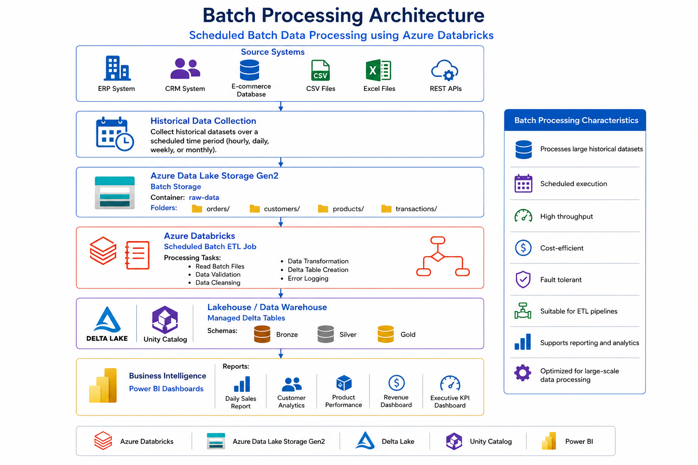
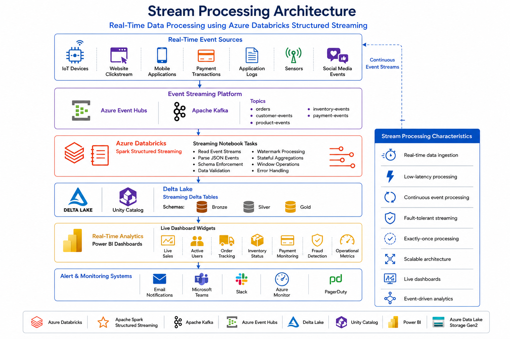

# ⚡ Batch vs Stream Processing

 
 


⬅️ [Back to Gold Layer](../03_Gold_Layer/README.md)

---

# 📚 Table of Contents

- Overview
- Learning Objectives
- Prerequisites
- What is Data Processing?
- What is Batch Processing?
- Batch Processing Architecture
- Batch Processing Workflow
- Characteristics of Batch Processing
- Batch Processing Use Cases
- Advantages & Disadvantages of Batch Processing
- What is Stream Processing?
- Stream Processing Architecture
- Stream Processing Workflow
- Characteristics of Stream Processing
- Stream Processing Use Cases
- Advantages & Disadvantages of Stream Processing
- Batch vs Stream Processing
- Processing Timeline
- Enterprise Architecture Comparison
- Decision Matrix
- Real-World Examples
- Popular Technologies
- Data Flow
- When to Choose Batch Processing
- When to Choose Stream Processing
- Best Practices
- Common Mistakes
- Interview Questions
- Summary
- Key Takeaways
- Next Module

---

# 📖 Overview

Modern data engineering systems process massive amounts of data using different processing techniques depending on business requirements.

The two most common processing models are:

- **Batch Processing**
- **Stream Processing**

Batch processing collects data over a period of time and processes it together at scheduled intervals, making it ideal for historical analysis and large-scale ETL jobs.

Stream processing continuously processes data as it arrives, enabling real-time analytics, monitoring, and immediate business decisions.

Understanding when to use batch or stream processing is an essential skill for every data engineer.

---

# 🎯 Learning Objectives

After completing this guide, you will be able to:

- Understand Batch Processing.
- Understand Stream Processing.
- Compare Batch and Stream Processing.
- Identify suitable use cases.
- Understand their architectures.
- Learn common technologies used.
- Decide which processing model fits different business scenarios.

---

# 📋 Prerequisites

Before starting this guide, you should have basic knowledge of:

- Data Engineering Fundamentals
- ETL Pipelines
- Apache Spark Basics
- Azure Databricks
- Delta Lake
- Cloud Storage (ADLS, Amazon S3, GCS)

---

# 📊 What is Data Processing?

Data processing is the process of collecting, transforming, validating, and storing data so that it can be analyzed and used for business decision-making.

Modern data platforms generally use two processing models:

- Batch Processing
- Stream Processing

The choice depends on how quickly the business needs to process incoming data.

---

# 📦 What is Batch Processing?

**Batch Processing** is a data processing technique where data is collected over a period of time and processed together as a single batch.

Instead of processing records one by one, the system waits until a scheduled interval before executing the processing job.

For example, an ETL pipeline may run every night at **2:00 AM** to load all sales transactions from the previous day into a data warehouse.

Batch processing is widely used for historical reporting, data warehousing, and large-scale ETL pipelines.

---

# 🏗 Batch Processing Architecture



```text
        Source Systems
               │
               ▼
      Collect Historical Data
               │
               ▼
      Batch Storage (ADLS/S3)
               │
               ▼
       Scheduled ETL Job
               │
               ▼
     Data Warehouse / Lakehouse
               │
               ▼
      Reports & Dashboards
```

---

# 🔄 Batch Processing Workflow

```text
Generate Data
       │
       ▼
Store Data
       │
       ▼
Wait for Schedule
       │
       ▼
Execute Batch Job
       │
       ▼
Transform Data
       │
       ▼
Store Results
       │
       ▼
Reporting
```

---

# ⭐ Characteristics of Batch Processing

Batch Processing has the following characteristics:

- Processes large volumes of historical data.
- Executes at scheduled intervals.
- Suitable for data that does not require immediate processing.
- Optimized for high throughput.
- Easier to implement and maintain.
- More cost-effective for periodic workloads.
- Well suited for ETL and ELT pipelines.

---

# 💼 Batch Processing Use Cases

Batch processing is commonly used in the following scenarios:

- Daily ETL Jobs
- Monthly Financial Reports
- Payroll Processing
- Data Warehouse Loading
- Data Migration
- Historical Data Analysis
- Backfilling Missing Data
- Customer Billing
- Sales Reporting

---

# 🌊 What is Stream Processing?

**Stream Processing** is a data processing technique where data is processed immediately as it arrives.

Instead of waiting for a scheduled execution, each incoming event is processed continuously, enabling near real-time insights.

Examples of streaming data sources include:

- Apache Kafka
- IoT Devices
- Application Logs
- Sensors
- Website Clickstreams
- Payment Transactions

Stream processing is ideal for applications that require immediate responses and continuous monitoring.

---

# 🏗 Stream Processing Architecture



---

# ⭐ Characteristics of Stream Processing

Stream Processing provides several advantages for real-time systems.

Key characteristics include:

- Data arrives continuously.
- Records are processed immediately.
- Supports near real-time analytics.
- Uses checkpointing for fault tolerance.
- Low latency processing.
- Suitable for continuously changing data.
- Enables immediate business decisions.

---

# 📊 Batch vs Stream Processing

| Feature          | Batch Processing          | Stream Processing        |
| ---------------- | ------------------------- | ------------------------ |
| Processing Style | Scheduled                 | Continuous               |
| Data Size        | Large historical datasets | Continuous event streams |
| Latency          | High                      | Very Low                 |
| Processing Time  | Minutes or Hours          | Seconds or Milliseconds  |
| Trigger          | Schedule                  | New Event                |
| Data Arrival     | Periodic                  | Continuous               |
| Infrastructure   | Simpler                   | More Complex             |
| Cost             | Lower                     | Higher                   |
| Typical Output   | Reports                   | Live Dashboards          |
| Best For         | ETL & Reporting           | Real-Time Analytics      |

---

# ⏱ Processing Timeline

```text
Batch Processing

Data ─────► Data ─────► Data ─────►
                     │
                     ▼
           Scheduled Batch Job
                     │
                     ▼
               Process All Data


Stream Processing

Event ─► Process
Event ─► Process
Event ─► Process
Event ─► Process
Event ─► Process
```

---

# 🛠 Popular Technologies

## Batch Processing

- Apache Spark
- Hadoop MapReduce
- Azure Databricks
- Azure Data Factory
- AWS Glue
- Apache Airflow
- SQL Server Integration Services (SSIS)

---

## Stream Processing

- Apache Spark Structured Streaming
- Apache Kafka
- Azure Event Hubs
- Apache Flink
- Amazon Kinesis
- Google Pub/Sub
- Apache Storm

---

# 🔄 Data Flow

```text
                    Source Systems
                           │
          ┌────────────────┴────────────────┐
          │                                 │
          ▼                                 ▼
   Batch Processing                 Stream Processing
          │                                 │
          ▼                                 ▼
 Scheduled ETL Jobs              Continuous Event Processing
          │                                 │
          ▼                                 ▼
   Data Warehouse                  Real-Time Analytics
          │                                 │
          └──────────────┬──────────────────┘
                         ▼
                 Business Intelligence
```

---
# ✅ Advantages & Disadvantages

Understanding the strengths and limitations of each processing model helps data engineers select the right solution based on business requirements.

---

## 📦 Batch Processing

### ✅ Advantages

- Efficient for processing large historical datasets.
- Simple architecture and easier to maintain.
- Lower infrastructure and operational costs.
- Optimized for high-throughput ETL jobs.
- Ideal for scheduled reporting and analytics.
- Easier to debug and recover failed jobs.
- Supports large-scale data warehouse loading.

### ❌ Disadvantages

- High processing latency.
- Not suitable for real-time applications.
- Delayed availability of insights.
- Requires waiting for scheduled execution.
- Cannot react immediately to incoming events.

---

## 🌊 Stream Processing

### ✅ Advantages

- Near real-time data processing.
- Low latency and immediate results.
- Continuous monitoring of incoming events.
- Supports real-time dashboards and alerts.
- Enables faster business decisions.
- Handles continuously changing datasets.
- Suitable for event-driven architectures.

### ❌ Disadvantages

- More complex architecture.
- Higher infrastructure costs.
- More difficult to monitor and debug.
- Requires checkpointing and fault tolerance.
- Complex state management.

---

# 📌 When to Choose Batch Processing

Choose **Batch Processing** when:

- Historical data analysis is required.
- Reports are generated daily, weekly, or monthly.
- Immediate processing is not necessary.
- Large datasets need to be processed efficiently.
- Cost optimization is a priority.
- Data warehouse ETL pipelines are being built.

---

# 📌 When to Choose Stream Processing

Choose **Stream Processing** when:

- Data must be processed immediately.
- Business requires real-time dashboards.
- Instant alerts are required.
- Continuous event monitoring is needed.
- Fraud detection systems are implemented.
- IoT sensor data is processed continuously.

---

# 🌍 Real-World Examples

## 📦 Batch Processing Examples

| Industry | Example |
|----------|----------|
| Banking | Monthly account statements |
| Retail | Nightly sales reporting |
| Healthcare | Daily patient data consolidation |
| E-commerce | Daily inventory updates |
| HR | Payroll processing |
| Insurance | Monthly claims reports |
| Education | Student attendance reports |
| Finance | End-of-day reconciliation |

---

## 🌊 Stream Processing Examples

| Industry | Example |
|----------|----------|
| Banking | Credit card fraud detection |
| Stock Market | Live stock price analysis |
| IoT | Sensor monitoring |
| E-commerce | Live order tracking |
| Social Media | Live feeds |
| Logistics | Vehicle GPS tracking |
| Healthcare | Patient monitoring systems |
| Manufacturing | Equipment monitoring |

---

# 🏢 Enterprise Examples

### Batch Processing

```text
Retail Store

Customers purchase products all day
            │
            ▼
Transactions stored in database
            │
            ▼
2:00 AM ETL Job
            │
            ▼
Load Data Warehouse
            │
            ▼
Generate Sales Reports
```

---

### Stream Processing

```text
Customer Places Order
           │
           ▼
Kafka Event
           │
           ▼
Spark Structured Streaming
           │
           ▼
Update Dashboard
           │
           ▼
Send Notification
```

---

# 📊 Batch vs Stream Decision Matrix

| Requirement | Recommended Processing |
|-------------|------------------------|
| Historical Reporting | Batch |
| Real-Time Dashboard | Stream |
| ETL Pipeline | Batch |
| Fraud Detection | Stream |
| IoT Analytics | Stream |
| Daily Reports | Batch |
| Monthly Reports | Batch |
| Live Monitoring | Stream |
| Customer Notifications | Stream |
| Data Warehouse Loading | Batch |

---

# 💡 Best Practices

## Batch Processing

- ✅ Schedule jobs during off-peak hours.
- ✅ Partition large datasets.
- ✅ Optimize ETL pipelines.
- ✅ Monitor failed batch jobs.
- ✅ Validate data before loading.
- ✅ Archive historical datasets.
- ✅ Automate scheduling using orchestration tools.
- ✅ Log batch execution details.

---

## Stream Processing

- ✅ Enable checkpointing for recovery.
- ✅ Handle duplicate events.
- ✅ Monitor stream latency.
- ✅ Design idempotent processing logic.
- ✅ Scale streaming jobs based on workload.
- ✅ Optimize micro-batch intervals.
- ✅ Monitor event processing failures.
- ✅ Use durable messaging systems such as Kafka.

---

# ⚠️ Common Mistakes

## Batch Processing

- ❌ Running unnecessary frequent batch jobs.
- ❌ Processing small datasets in large batches.
- ❌ Ignoring job failures.
- ❌ Poor partitioning strategy.
- ❌ Not monitoring ETL pipelines.

---

## Stream Processing

- ❌ Ignoring checkpoint configuration.
- ❌ High processing latency.
- ❌ Poor event ordering.
- ❌ Missing fault tolerance.
- ❌ No monitoring of streaming jobs.
- ❌ Processing duplicate events incorrectly.

---

# 🎤 Interview Questions

### 1. What is Batch Processing?

Batch Processing processes accumulated data together at scheduled intervals.

---

### 2. What is Stream Processing?

Stream Processing processes data continuously as it arrives.

---

### 3. What is the main difference between Batch and Stream Processing?

Batch processes historical data periodically, whereas Stream processes data continuously in near real time.

---

### 4. Why is Batch Processing cost-effective?

It executes only at scheduled intervals and typically requires simpler infrastructure.

---

### 5. Why is Stream Processing considered low latency?

Because data is processed immediately after it arrives instead of waiting for a scheduled batch.

---

### 6. Name some Batch Processing use cases.

- Daily ETL jobs
- Financial reports
- Payroll processing
- Data warehouse loading

---

### 7. Name some Stream Processing use cases.

- Fraud detection
- IoT monitoring
- Live dashboards
- Stock market analysis

---

### 8. Which processing model is used for ETL pipelines?

Batch Processing is commonly used for scheduled ETL pipelines.

---

### 9. Which processing model is used for fraud detection?

Stream Processing.

---

### 10. What is latency?

Latency is the time between data arrival and processing.

---

### 11. Why is checkpointing important in Stream Processing?

Checkpointing enables recovery from failures by storing processing progress.

---

### 12. Which processing model is easier to maintain?

Batch Processing generally has a simpler architecture and is easier to maintain.

---

### 13. Can Apache Spark support both Batch and Stream Processing?

Yes. Apache Spark provides APIs for both batch processing and Structured Streaming.

---

### 14. Which processing model is better for monthly reporting?

Batch Processing.

---

### 15. Which processing model is used for live dashboards?

Stream Processing.

---

# 📊 Summary

| Component | Batch Processing | Stream Processing |
|------------|-----------------|-------------------|
| Processing | Scheduled | Continuous |
| Latency | High | Low |
| Data | Historical | Real-Time |
| Infrastructure | Simpler | More Complex |
| Cost | Lower | Higher |
| Best Use | ETL & Reporting | Real-Time Analytics |

---

# 🎯 Key Takeaways

- Batch Processing collects and processes data at scheduled intervals, making it ideal for ETL pipelines, historical reporting, and large-scale data warehouse workloads.
- Stream Processing processes data continuously as it arrives, enabling near real-time analytics, monitoring, and event-driven applications.
- Batch systems are generally simpler, more cost-effective, and easier to maintain, while stream processing requires more sophisticated infrastructure to achieve low latency.
- Selecting the appropriate processing model depends on business requirements, data velocity, latency expectations, and operational complexity.
- Apache Spark supports both processing models, allowing organizations to build unified data pipelines for batch and streaming workloads.

---

# 🚀 Next Module

➡️ [Auto Loader & Structured Streaming](02_autoloader_and_structured_streaming.md)
