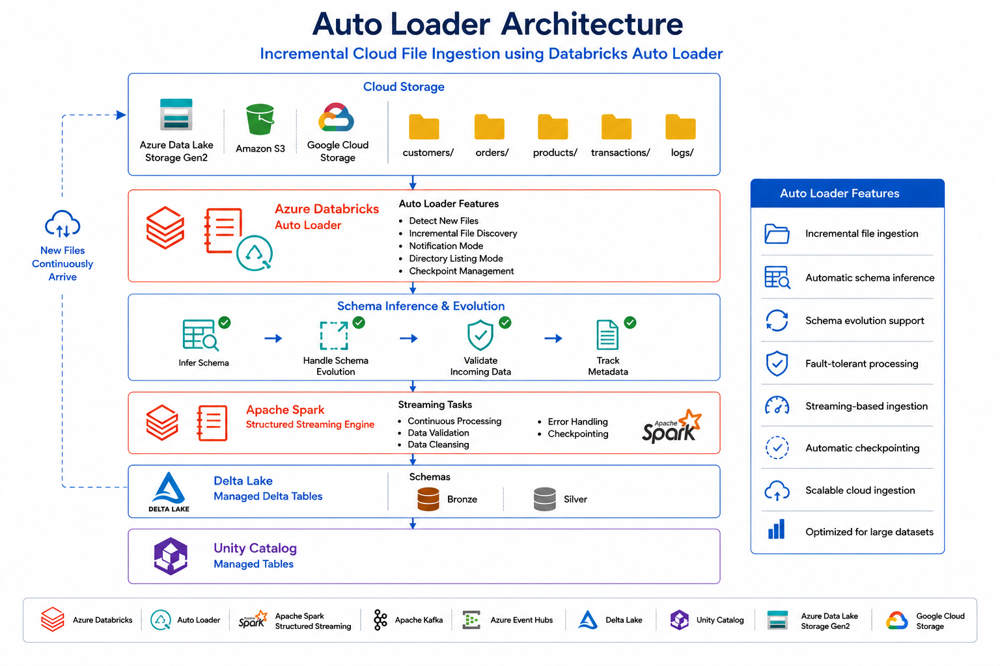
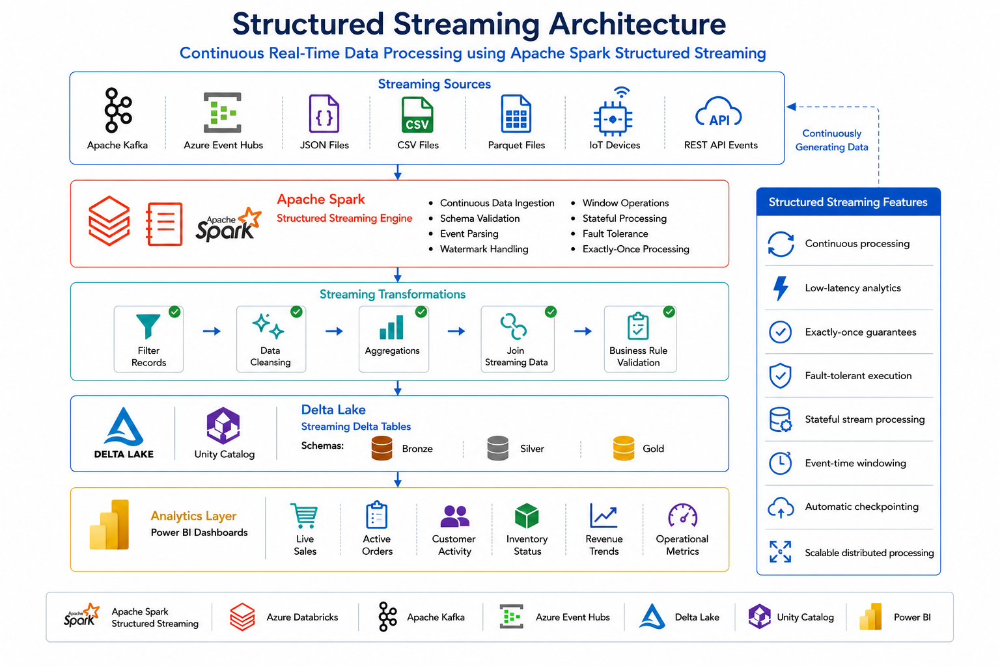

# 🌊 Auto Loader & Structured Streaming

 
 


⬅️ [Back to Batch vs Stream Processing](01_batch_vs_stream_processing.md)

---

# 📚 Table of Contents

- Overview
- Learning Objectives
- Prerequisites
- What is Structured Streaming?
- What is Auto Loader?
- Auto Loader vs Structured Streaming
- Why Use Auto Loader?
- How Structured Streaming Works
- How Auto Loader Works
- Auto Loader Architecture
- Structured Streaming Architecture
- Auto Loader Workflow
- Structured Streaming Workflow
- Cloud File Detection Modes
- Schema Inference
- Schema Evolution
- Checkpointing
- Trigger Modes
- Incremental Processing
- Fault Tolerance
- Popular Use Cases
- Best Practices
- Common Mistakes
- Interview Questions
- Summary
- Key Takeaways
- Next Module

---

# 📖 Overview

Modern data engineering pipelines continuously receive new files from cloud storage systems such as **Azure Data Lake Storage (ADLS)**, **Amazon S3**, and **Google Cloud Storage (GCS)**.

Traditional batch ingestion repeatedly scans directories, which becomes inefficient as the number of files grows.

**Databricks Auto Loader** solves this problem by automatically detecting and ingesting only newly arrived files, while **Apache Spark Structured Streaming** processes incoming data using the same DataFrame API used for batch processing.

Together, Auto Loader and Structured Streaming simplify the development of scalable, incremental, fault-tolerant data ingestion pipelines.

---

# 🎯 Learning Objectives

After completing this guide, you will be able to:

- Understand Structured Streaming.
- Understand Databricks Auto Loader.
- Differentiate Auto Loader and Structured Streaming.
- Build incremental ingestion pipelines.
- Understand schema inference and schema evolution.
- Configure checkpointing.
- Understand trigger modes.
- Learn fault tolerance and recovery.
- Design scalable streaming pipelines.

---

# 📋 Prerequisites

Before starting this guide, ensure you have knowledge of:

- Apache Spark Basics
- DataFrames
- Delta Lake
- Batch vs Stream Processing
- Azure Databricks
- Azure Data Lake Storage (ADLS)

---

# 🌊 What is Structured Streaming?

**Structured Streaming** is Apache Spark's stream processing engine that enables processing of continuously arriving data using the same DataFrame and SQL APIs used for batch processing.

It treats streaming data as an **unbounded table**, allowing developers to write streaming applications without learning a new programming model.

Structured Streaming supports:

- Micro-batch processing
- Continuous processing
- Fault tolerance
- Checkpointing
- Exactly-once processing semantics
- Integration with Delta Lake

Unlike traditional streaming frameworks, Structured Streaming unifies both **batch** and **stream** processing under a single API.

---

# 📦 What is Auto Loader?

**Auto Loader** is a Databricks feature built on top of **Structured Streaming**.

Its primary purpose is to efficiently ingest newly arriving files from cloud object storage.

Supported storage includes:

- Azure Data Lake Storage (ADLS)
- Amazon S3
- Google Cloud Storage (GCS)

Instead of repeatedly scanning entire directories, Auto Loader incrementally discovers only new files.

This makes ingestion highly scalable and significantly reduces cloud storage operations.

---

# ⚖ Auto Loader vs Structured Streaming

| Auto Loader                    | Structured Streaming                           |
| ------------------------------ | ---------------------------------------------- |
| Databricks feature             | Apache Spark feature                           |
| Incremental file ingestion     | Stream processing engine                       |
| Detects newly arrived files    | Processes streaming data                       |
| Reads files from cloud storage | Processes data from multiple streaming sources |
| Built on Structured Streaming  | Core Spark API                                 |

---

# ❓ Why Use Auto Loader?

Traditional file ingestion repeatedly scans storage folders.

As the number of files increases, directory scanning becomes expensive and slow.

Auto Loader solves these problems by:

- Detecting only new files
- Automatically tracking processed files
- Supporting schema evolution
- Scaling to billions of files
- Reducing cloud storage API calls

---

# ⚙ How Structured Streaming Works

Structured Streaming continuously processes incoming data.

Instead of reading static datasets, Spark repeatedly processes newly arriving records.

```text
Incoming Data
       │
       ▼
Structured Streaming
       │
       ▼
Micro Batches
       │
       ▼
Transformation
       │
       ▼
Delta Lake
```

---

# ⚙ How Auto Loader Works

Auto Loader continuously monitors cloud storage.

Whenever new files arrive:

- Detect new files
- Read only new files
- Infer schema
- Apply transformations
- Write to Delta Lake
- Update checkpoint

No previously processed files are reloaded.

---

# 🏗 Auto Loader Architecture



---

# 🏗 Structured Streaming Architecture



---

# 🔄 Auto Loader Workflow

```text
New Files Arrive
        │
        ▼
Detect New Files
        │
        ▼
Infer Schema
        │
        ▼
Read Files
        │
        ▼
Apply Transformations
        │
        ▼
Write Delta Tables
        │
        ▼
Update Checkpoint
```

---

# 🔄 Structured Streaming Workflow

```text
Incoming Events
        │
        ▼
Read Stream
        │
        ▼
Process Micro Batch
        │
        ▼
Apply Business Logic
        │
        ▼
Write Stream
        │
        ▼
Checkpoint
```

---

# ☁ Cloud File Detection Modes

Auto Loader supports two methods for detecting newly arriving files.

## Directory Listing Mode

Auto Loader periodically scans the storage directory to identify new files.

Advantages:

- Simple configuration
- Works with all cloud storage providers

Suitable for:

- Small and medium workloads

---

## File Notification Mode

Uses cloud-native notification services.

Examples:

- Azure Event Grid
- AWS SQS
- Google Pub/Sub

Advantages:

- Lower latency
- Reduced storage API calls
- Better scalability

Recommended for production workloads.

---

# 🧠 Schema Inference

Auto Loader can automatically determine the schema of incoming datasets.

Benefits:

- No manual schema definition
- Faster pipeline development
- Easier onboarding of new datasets

---

# 🔄 Schema Evolution

As source systems evolve, new columns may appear.

Auto Loader automatically detects schema changes and updates metadata.

Benefits:

- Supports changing source systems
- Prevents pipeline failures
- Enables incremental evolution

---

# 💾 Checkpointing

Checkpointing stores the progress of a streaming job.

Benefits:

- Fault tolerance
- Recovery after failures
- Prevents duplicate processing
- Maintains processing state

Example checkpoint location:

```text
abfss://checkpoints/bronze/orders/
```

---

# ⏱ Trigger Modes

Structured Streaming supports different execution modes.

| Trigger         | Description                         |
| --------------- | ----------------------------------- |
| Continuous      | Process immediately                 |
| Processing Time | Execute every specified interval    |
| Available Now   | Process all available data and stop |
| Once            | Execute a single batch              |

---

# 🔄 Incremental Processing

Unlike batch ingestion, Auto Loader processes **only newly arrived files**.

Benefits include:

- Faster execution
- Lower costs
- Better scalability
- Reduced duplicate processing

---

# 🛡 Fault Tolerance

Auto Loader and Structured Streaming are fault tolerant through:

- Checkpointing
- Exactly-once processing
- Delta Lake transactions
- Automatic recovery after failures

---

# 💼 Popular Use Cases

- Bronze Layer File Ingestion
- IoT Sensor Data
- Application Logs
- Customer Clickstream Analysis
- Fraud Detection
- Machine Learning Data Pipelines
- Real-Time Dashboards
- Event-Driven Architectures

---
# 💡 Best Practices

Follow these best practices when building production-grade streaming pipelines with Auto Loader and Structured Streaming.

### Auto Loader

- ✅ Use Auto Loader for incremental file ingestion.
- ✅ Enable schema inference for rapidly changing datasets.
- ✅ Store schemas in a dedicated schema location.
- ✅ Use cloud file notification mode for production workloads.
- ✅ Keep source files immutable after ingestion.
- ✅ Organize cloud storage using a consistent folder hierarchy.
- ✅ Archive processed files when required.
- ✅ Monitor ingestion latency and throughput.
- ✅ Use Delta Lake as the destination format.

---

### Structured Streaming

- ✅ Always configure checkpoint locations.
- ✅ Design idempotent transformations.
- ✅ Handle late-arriving data appropriately.
- ✅ Monitor streaming query progress.
- ✅ Use watermarking for event-time processing.
- ✅ Optimize micro-batch intervals.
- ✅ Validate streaming outputs regularly.
- ✅ Stop unused streaming jobs gracefully.
- ✅ Use Auto Loader for cloud file ingestion instead of manual polling.

---

# ⚠️ Common Mistakes

Avoid these common mistakes when working with Auto Loader and Structured Streaming.

### Auto Loader

- ❌ Scanning entire directories manually.
- ❌ Not configuring a schema location.
- ❌ Modifying source files after ingestion.
- ❌ Ignoring schema evolution.
- ❌ Using directory listing for very large production workloads.
- ❌ Not monitoring ingestion failures.

---

### Structured Streaming

- ❌ Forgetting checkpoint configuration.
- ❌ Ignoring duplicate event handling.
- ❌ Processing data without fault tolerance.
- ❌ Setting extremely small micro-batches.
- ❌ Not monitoring streaming latency.
- ❌ Mixing batch and streaming logic incorrectly.

---

# ⚖️ Auto Loader vs Traditional File Ingestion

| Feature | Traditional File Ingestion | Auto Loader |
|----------|---------------------------|-------------|
| File Discovery | Scan entire directory | Detect only new files |
| Scalability | Limited | Very High |
| Performance | Slower | Faster |
| Schema Inference | Manual | Automatic |
| Schema Evolution | Manual | Automatic |
| Fault Tolerance | Limited | High |
| Duplicate Prevention | Manual | Automatic Tracking |
| Cloud Optimized | No | Yes |

---

# ⚖️ Auto Loader vs COPY INTO

| Feature | COPY INTO | Auto Loader |
|----------|-----------|-------------|
| Processing Type | Batch | Streaming |
| Incremental Loading | Limited | Yes |
| Continuous Processing | No | Yes |
| Schema Evolution | Limited | Automatic |
| File Detection | Manual | Automatic |
| Large Scale Files | Moderate | Excellent |
| Production Streaming | No | Yes |
| Fault Tolerance | Moderate | High |

---

# 📊 End-to-End Pipeline

```text
Cloud Storage
(ADLS / S3 / GCS)
        │
        ▼
Auto Loader
        │
        ▼
Structured Streaming
        │
        ▼
Bronze Layer
        │
        ▼
Silver Layer
        │
        ▼
Gold Layer
        │
        ▼
Power BI Dashboard
```

---

# 📈 Benefits of Auto Loader

| Benefit | Description |
|----------|-------------|
| Incremental Loading | Reads only newly arrived files |
| High Scalability | Supports billions of files |
| Automatic Schema Detection | Reduces manual effort |
| Schema Evolution | Handles changing source schemas |
| Cost Optimization | Fewer cloud storage API calls |
| Cloud Native | Integrates with ADLS, S3, and GCS |
| Fault Tolerance | Recovers automatically after failures |
| Easy Integration | Works seamlessly with Structured Streaming |

---

# 📈 Benefits of Structured Streaming

| Benefit | Description |
|----------|-------------|
| Unified API | Same API for batch and streaming |
| Near Real-Time Processing | Low-latency analytics |
| Fault Tolerance | Automatic recovery |
| Exactly-Once Processing | Prevents duplicate results |
| Scalable | Distributed processing with Spark |
| Delta Lake Integration | Reliable storage |
| Checkpointing | Maintains processing progress |
| Event Processing | Handles continuous data streams |

---

# 🎤 Interview Questions

### 1. What is Structured Streaming?

Structured Streaming is Apache Spark's stream processing engine that processes continuously arriving data using the same DataFrame and SQL APIs used for batch processing.

---

### 2. What is Auto Loader?

Auto Loader is a Databricks feature built on Structured Streaming that incrementally ingests newly arriving files from cloud storage.

---

### 3. What problem does Auto Loader solve?

It eliminates the need to repeatedly scan entire cloud storage directories by automatically detecting only new files.

---

### 4. Is Auto Loader part of Apache Spark?

No.

Auto Loader is a **Databricks-specific feature** built on top of Apache Spark Structured Streaming.

---

### 5. Which cloud storage systems are supported?

- Azure Data Lake Storage (ADLS)
- Amazon S3
- Google Cloud Storage (GCS)

---

### 6. What is an Unbounded Table?

An unbounded table is a continuously growing dataset where new records are constantly appended.

---

### 7. What is Schema Inference?

Schema inference automatically determines the structure of incoming data without manually defining the schema.

---

### 8. What is Schema Evolution?

Schema evolution allows Auto Loader to automatically detect and adapt to new columns in incoming data.

---

### 9. What is Checkpointing?

Checkpointing stores the progress and state of a streaming query, enabling recovery after failures.

---

### 10. Why is Checkpointing important?

It provides:

- Fault tolerance
- Exactly-once processing
- Recovery after failures
- Duplicate prevention

---

### 11. What are the two file detection modes in Auto Loader?

- Directory Listing Mode
- File Notification Mode

---

### 12. Which file detection mode is recommended for production?

Cloud File Notification Mode because it offers better scalability, lower latency, and fewer storage API calls.

---

### 13. What is Incremental Processing?

Incremental processing reads and processes only newly arrived data instead of reprocessing the entire dataset.

---

### 14. Why is Auto Loader preferred over traditional file ingestion?

Because it provides scalable, incremental ingestion with automatic schema management and lower operational costs.

---

### 15. Can Structured Streaming process both batch and streaming data?

Yes.

Structured Streaming provides a unified API that supports both batch and streaming workloads.

---

# 📊 Summary

| Component | Purpose |
|------------|---------|
| Auto Loader | Incremental file ingestion |
| Structured Streaming | Stream processing engine |
| Schema Inference | Detect data structure |
| Schema Evolution | Handle changing schemas |
| Checkpointing | Fault recovery |
| Trigger Modes | Control execution |
| Delta Lake | Reliable storage |
| Cloud Storage | Source for incoming files |

---

# 🎯 Key Takeaways

- Structured Streaming is Apache Spark's unified stream processing engine that uses the same DataFrame and SQL APIs for both batch and streaming workloads.
- Auto Loader is a Databricks feature built on Structured Streaming that automatically discovers and ingests new files from cloud storage.
- Auto Loader supports schema inference and schema evolution, reducing manual effort when source data changes.
- Checkpointing provides fault tolerance by storing the progress of streaming queries, enabling reliable recovery after failures.
- Cloud File Notification Mode offers better scalability and lower latency than directory listing for production environments.
- Together, Auto Loader and Structured Streaming simplify the development of scalable, incremental, and fault-tolerant data ingestion pipelines.

---

# 🛠 Technologies Used

| Technology | Purpose |
|------------|---------|
| Apache Spark | Distributed Data Processing |
| Structured Streaming | Real-Time Stream Processing |
| Databricks Auto Loader | Incremental File Ingestion |
| Delta Lake | Reliable Lakehouse Storage |
| Azure Data Lake Storage Gen2 | Cloud Storage |
| Amazon S3 | Cloud Storage |
| Google Cloud Storage | Cloud Storage |
| Unity Catalog | Data Governance |
